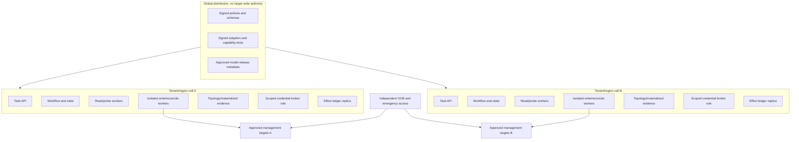

# Deployment, Scaling, Cost, HA/DR, and Roadmap

## Start with operational gaps, not an agent framework

The first production investment is usually better source-of-truth ownership, modeled reads, stable target identity, versioned runbooks, verification probes, and effect logging. If a deterministic controller can solve the operation, deploy that controller. Add model reasoning only after the evidence and control substrate can constrain it.

A practical technology-neutral stack contains:

- authenticated API/UI and immutable task envelopes;
- durable workflow engine and transactional state database;
- append-only effect/audit ledger;
- event/telemetry ingestion with versioned normalization;
- materialized topology and field-authority service;
- object storage for hashed evidence, plan, lab, and diff artifacts;
- deterministic policy/approval/window service;
- typed tool gateway and adapter capability registry;
- separate read/probe and write/reconciliation worker pools;
- short-lived credential/key broker;
- configuration-analysis and representative lab pipeline;
- model gateway with version pinning, data policy, budgets, and kill switch;
- independent monitoring, OOB administration, and disaster-recovery plane.

The programming language and workflow product are secondary to durable semantics. A simple service can be built in the organization's supported language and database. Do not introduce a graph database, vector database, event bus, or agent framework unless scale or query requirements demonstrate the need.

## Deployment topology



Cells reduce cross-tenant and correlated failure. Global distribution can sign policies, schemas, adapters, and model releases; it should not hold a universal device credential or act as a serial writer for every network. Assign each target to one active writer cell and use fencing tokens during failover.

## Capacity model

Telemetry, topology materialization, probes, and vendor APIs commonly dominate tokens and model latency.

### Telemetry volume

Estimate raw daily volume before designing storage:

```text
daily_bytes = devices
            × paths_per_device
            × updates_per_path_per_second
            × average_record_bytes
            × 86,400
            × replication_factor
```

For 5,000 devices × 200 paths × 0.05 updates/s × 180 bytes × 86,400 × replication factor 2, the result is about **1.56 TB/day** before indexes, compression, and protocol overhead. Measure real cardinality, update rates, burstiness, compression, retention, and query workload. Do not feed this stream to a model.

Use on-change subscriptions where semantically reliable, dampening where appropriate, aggregation at collectors, current-state materialization, tiered retention, and artifact references. Preserve gap and loss metadata. If the system sheds lower-priority telemetry under pressure, it must mark evidence incomplete and automatically block writes that require it.

### Probe capacity

Capacity is constrained by target safety and representativeness, not merely worker CPU. Budget by tenant, vantage, destination, protocol, port, site, and incident/change class. Separate queues for routine read validation and incident-priority probes. Cancellation and deduplication prevent repeated hypotheses from multiplying traffic.

### Target API capacity

Maintain adaptive per-target and per-controller rate/concurrency limits based on published limits and measured behavior. A single device may serialize candidate/commit or degrade under broad operational reads. Avoid synchronized fleet polling; jitter schedules and prefer subscriptions with periodic reconciliation.

### Model capacity and cost

Estimate model cost independently:

```text
monthly_tokens = tasks_per_month
               × reasoning_turns_per_task
               × average_input_plus_output_tokens
```

Track by task class and outcome. Reduce cost by resolving deterministic requests without a model, building compact evidence bundles, caching only versioned non-sensitive derivations, limiting hypotheses/turns, selecting smaller validated models for classification/normalization, and using a stronger model only for bounded complex synthesis. Never weaken safety checks to reduce latency or cost.

## Scaling patterns

- Partition topology and workflow data by tenant/cell and region, while supporting explicitly authorized cross-region dependency views.
- Keep one fenced writer owner per target/resource; scale reads separately.
- Materialize hot operational state and store raw streams in lower-cost retention tiers.
- Use priority queues with reserved capacity for reconciliation and rollback; new proposals must not starve recovery.
- Backpressure at ingestion and tool gateways rather than accepting unbounded work.
- Cap graph depth, result cardinality, query time, probe fan-out, artifact size, and model context.
- Cache only with source version, freshness, coverage, tenant, and invalidation rules.
- Batch compatible reads, but do not imply same-time atomicity across targets.
- Scale adapters independently because controller and device limits differ.

The first signal of overload should be explicit degraded evidence and proposal-only mode, not delayed writes running after their window or with stale preconditions.

## High availability

### Component expectations

| Component | HA design | Write-safety condition |
|---|---|---|
| Task API/orchestrator workers | Multi-zone stateless workers over durable state | CAS transition and fenced leases |
| Workflow database | Synchronous or policy-suitable multi-zone replication, tested failover | No stale-writer resurrection |
| Queue | Durable replicated delivery | Duplicate-safe consumers; reserved reconciliation capacity |
| Effect ledger | Independent durable append path and integrity protection | Intent recorded before dispatch |
| Topology/evidence view | Rebuildable from authoritative reads/events/artifacts | Freshness and gaps survive failover |
| Credential broker | Multi-zone with target-scoped roles and audit | No broad cached credentials in workers |
| Executor | Multi-zone but one fenced owner per target/effect | Failover reconciles before dispatch |
| Policy/approval | Multi-zone signed/versioned decisions | Unavailable means no write |
| Model gateway | Multiple provider/model options if policy allows | Unavailable never affects deterministic rollback/reconcile |
| OOB/emergency access | Independent network and human custody | Must not share the production failure path |

An active-active executor without target fencing can create more harm than an outage. Prefer temporarily unavailable writes to duplicate or conflicting mutation.

## Disaster recovery

Define RPO and RTO separately for workflow state, effect ledger, topology/materialized evidence, source-of-truth intent, policy/approval, artifacts, credentials, and model metadata. Example priorities:

- effect intent, native IDs, and terminal results need the strongest durability;
- topology materializations can be rebuilt, but gaps and source versions must be preserved;
- credentials should be reissued, not restored from backup;
- approvals, leases, and windows must not silently revive after failover;
- model conversation cache is disposable if durable task/evidence records exist.

| Asset or capability | RPO decision | RTO and recovery proof |
|---|---|---|
| effect ledger/native IDs | no acknowledged dispatch may be lost | restore independently, enumerate/reconcile every non-terminal operation before writes |
| workflow/event/outbox state | no accepted transition beyond documented transaction boundary | point-in-time restore plus queue/outbox deduplication and schema compatibility |
| source-of-truth intent and sealed plans | preserve exact approved revisions/digests | integrity check and owner revalidation; never reconstruct from device state or chat |
| topology/evidence projections | rebuildable, but raw source versions/gaps must survive | bounded authoritative refresh at recovery scale with incomplete-evidence gates |
| policies, schemas and behavior bundles | retain every version needed by resumable work | signed manifest restore and compatibility/migration test |
| approvals, windows, leases and credentials | do not restore as live authority | expire/revalidate approvals; issue new epochs, leases and short-lived credentials |
| OOB, audit and emergency runbooks | independent of failed cell and production path | periodic human access drill with retained integrity/audit evidence |

### Regional recovery sequence

1. Declare the affected cell unavailable and fence its executor identities.
2. Restore workflow and ledger state to the documented recovery point.
3. rotate/reissue workload and broker credentials; invalidate old leases and fencing tokens;
4. rebuild topology/evidence views from sources and artifacts; expose remaining gaps;
5. enumerate every non-terminal effect and reconcile it against target/native state;
6. expire old approvals and windows unless a policy explicitly revalidates them against fresh state;
7. resume read-only service first, then proposal mode;
8. re-enable one tested write capability after OOB, audit, policy, credential, and reconciliation checks;
9. run a recovery canary and after-action review.

Test backups, restore time, integrity, target fencing, and ambiguous-effect recovery in game days. A green database restore is not a successful network control-plane DR exercise.

Model **recovery load**, not only steady-state capacity. A regional event can create simultaneous topology refresh, subscription backfill, native-operation polling, device/config reads, active probes, audit queries, credential issuance, and operator demand while target controllers are degraded. Reserve capacity for reconciliation and OOB recovery; throttle rebuild/read work by target and fault domain; resume service in read-only and proposal modes before writes. New investigations and backfills cannot starve `UNCERTAIN` effects or rollback deadlines.

Measure achieved RTO/RPO, target/API throttling, topology rebuild lag and coverage, reconciliation backlog age, stale/expired native-operation lookup, probe queue age, credential/lease fencing, and time to the first independently verified recovery canary. Include corruption, wrong backup, unavailable key, split-brain writer, clock loss, controller failover, and OOB failure—not only total region loss.

## Operational incident response

Maintain runbooks for unauthorized or cross-tenant action, duplicate/ambiguous effects, mass adapter/parser failure, policy/approval outage, credential misuse, lost OOB/AAA, telemetry poisoning/gaps, control-plane overload, failed rollback, regional loss, and model/tool supply-chain compromise.

Common first actions are: stop new writes; preserve deterministic recovery/reconciliation; fence affected workers; revoke credentials; retain ledger/evidence; identify actual target effects; protect OOB and service paths; notify SRE for service risk and security for suspected malicious activity; and recover only through verified current state.

## Versioned upgrade pipeline

Every change to model, prompt, context builder, tool schema, adapter, parser, YANG/OpenConfig model, topology compiler, policy, workflow, provider API, device OS, controller, or lab image can change behavior.

Promote their exact tested combination as a signed **behavior bundle**:

```yaml
behavior_bundle:
  behavior_bundle_id: net-behavior/8.4
  workflow_and_event_schema: net-workflow/6
  model_and_prompt: model-profile/4
  context_builder_and_compactor: [net-context/3.1.0, net-compactor/2.2]
  memory_policy: net-memory/3
  tools_and_adapters:
    tool_schema: net-tools/9
    qualifications: [aq-router-gnmi-exampleos-12_4_3-v7, aq-route53-zone-v4]
  topology_intent_and_policy: [topology-compiler/5, network-policy/18]
  verification_and_graders: [network-verify/12, network-eval/14]
  lab_and_failure_corpus: [net-lab-images/9, failure-suite/22]
  runbooks: network-operations/17
  baseline_bundle: net-behavior/8.3
  rollback_target: net-behavior/8.3
  manifest_sha256: "..."
```

Component deployment may remain technically independent, but production eligibility belongs to a bundle combination that was evaluated together. A new parser can alter topology, a context builder can hide a contradiction, an adapter can change atomic scope, and a grader can hide a regression. Do not call a mixed untested combination “the same release.”

```mermaid
flowchart LR
    A[Versioned candidate] --> B[Contract and migration checks]
    B --> C[Recorded replay and security suite]
    C --> D[Analysis/lab conformance]
    D --> E[Shadow production reads]
    E --> F[Read-only canary cell]
    F --> G[Proposal-only comparison]
    G --> H[One supervised write capability]
    H --> I[Bounded rollout]
    I --> J[Promote or roll back version]
```



Required controls:

- additive/backward-compatible schemas where possible, explicit migration otherwise;
- dual-read/dual-parse during safe transitions and preserved raw observations;
- pinned versions and digests in each plan/effect record;
- adapter conformance repeated after target OS/API/model revision changes;
- frozen safety scenarios and domain regression thresholds;
- shadow model output denied write credentials;
- one-variable-at-a-time canaries when practical;
- independent rollback of model, tool, policy, adapter, and parser;
- model never embedded in commit, reconciliation, or rollback state logic;
- removal of an old schema/version only after no resumable workflow depends on it.

Behavior improvement does not expand authority. Adding a tool, target version/vendor, tenant, write type, broader prefix/fault domain, lower approval tier, new memory class, or weaker verification returns to the corresponding onboarding and risk gate.

Reviewed incidents, operator corrections, rollbacks, reconciliation discrepancies, adapter drift, SLO breaches, and target upgrades may propose new cases or runbooks. They enter the controlled failure-mining process in guide 09; they never directly change a prompt, threshold, policy, adapter capability, long-term memory, or training set. Track drift in inputs, schemas/capabilities, topology coverage, plan/effect distribution, verification, reconciliation, rollback, outcomes, and operator overrides. A drift alert opens investigation or demotes capability—it does not self-edit production behavior.

## Zero-to-production roadmap

### Stage 0 — Deterministic foundation

Build stable identity, source-of-truth authority, modeled reads, versioned runbooks, topology/freshness, independent probes, typed tools, and effect/audit records. Automate exact operations without a model.

**Exit gate:** operators can answer and execute the selected use cases deterministically with reproducible evidence, or can name the ambiguity that actually warrants a model.

### Stage 1 — First bounded read loop

Choose one narrow question, such as “why is this service unreachable from these registered vantages?” Allow only N0 and approved N1 tools. Enforce hypothesis count, query depth, probe rate, time, token, and stop budgets. Return citations to evidence artifacts, gaps, and alternate explanations.

**Exit gate:** replay/lab accuracy and calibration meet the target; injection and tenant tests have zero unsafe failures; operators find the result useful; no production writes exist.

### Stage 2 — Safe change-proposal MVP

Produce normalized effects, semantic diff, dependency DAG, risk, blast radius, preconditions, validation, canary, independent verification, rollback/forward recovery, and sealed plan digest. Render against one well-supported domain/adapter in a lab, but do not commit production.

**Exit gate:** domain reviewers accept plans; unsupported capabilities are refused; differential/lab checks and rollback plans pass; approval is bound to exact artifacts.

### Stage 3 — Reliable supervised v1

Enable one reversible N3 catalog, such as a small traffic weight change on one redundant load-balancer cell or a pre-tested low-risk DNS record update with overlap. Add durable workflow, leases/fencing, intent-before-dispatch ledger, short-lived credentials, staging/conditional write, unknown-outcome reconciliation, independent verification, and automatic canary stop.

**Exit gate:** every dispatched effect reaches a supported terminal state; recovery/game-day tests pass; OOB and on-call are ready; a kill switch and proposal-only downgrade work.

### Stage 4 — Production readiness

Add multi-zone HA, tenant isolation, retention/privacy, security monitoring, SLOs/error budgets, capacity/backpressure, change freeze/windows, separation of duties, incident runbooks, DR restoration, supply-chain signing, and audited break-glass. Complete routing/DNS/PKI/traffic specialist reviews.

**Exit gate:** launch review passes; no critical safety or isolation gap; failure injection and DR prove the operating model; support ownership and budgets are funded.

### Stage 5 — Scale and resilience

Introduce cell sharding, materialized topology, streaming telemetry with gap semantics, multivendor capability manifests, broader labs/hardware staging, reserved reconciliation capacity, and measured cost optimization. Expand one capability and fault domain at a time.

**Exit gate:** SLOs hold at forecast peak and target failure modes; new vendor/version onboarding is conformance-driven; no global credential or writer bottleneck.

### Stage 6 — Continuous evolution

Continuously replay governed production-derived cases, inject failures, refresh the evidence packet, reattest adapters after upgrades, compare complete behavior bundles, monitor source/capability/outcome drift, prune unused autonomy, and convert stable agent behaviors into deterministic automation. Corrections and incidents become minimized evaluation cases only after causality, privacy/security, leakage, and retention review.

**Exit gate:** autonomy expands only from measured evidence. Capabilities are demoted automatically when freshness, coverage, conformance, recovery readiness, or error budgets fall below policy.

## Build-or-buy and framework alternatives

| Choice | Strength | Limitation | Recommended use |
|---|---|---|---|
| Existing controller/runbook only | Most predictable and auditable | Limited ambiguous evidence synthesis | Default whenever requirements are fully specified |
| Vendor network automation platform | Deep product support and transaction semantics | Coverage, lock-in, and cross-domain limits | Keep as authoritative adapter/controller where it is strong |
| General agent framework | Fast reasoning/tool prototype | Does not supply network semantics, durable effects, policy, OOB, or conformance | Replaceable implementation detail in read/proposal plane |
| Custom deterministic control plane plus model gateway | Exact safety and integration fit | Higher engineering/operations ownership | Recommended production architecture when use cases justify it |
| Fully autonomous multi-agent system | Potential task decomposition | More authority paths, nondeterminism, cost, and recovery complexity | Not recommended for production network mutation |

Multiple specialist model roles are not required initially. One bounded planner plus deterministic services is simpler to evaluate. Add concurrency only for independent evidence collection under a central scheduler, not independent agents competing to write the network.

## Production launch checklist

- [ ] Category authority and adjacent-team handoffs are enforced.
- [ ] Target identity, field authority, topology layers, provenance, freshness, and gap semantics are documented.
- [ ] Every tool and adapter has exact schema, limits, capability/atomicity statement, conformance evidence, and owner.
- [ ] Read/probe/write/verify/break-glass identities and paths are separated.
- [ ] Plan digest binds versions, scope, effects, validation, verification, rollback, approval, and expiry.
- [ ] Durable state, fenced leases, intent-before-dispatch ledger, reconciliation, and terminal classifications are tested.
- [ ] Fault-domain canary, make-before-break, independent verification, and safe recovery work in a representative lab.
- [ ] Prompt injection, secrets, packet privacy, tenant isolation, management isolation, and supply-chain controls pass hard gates.
- [ ] SLOs, error-budget actions, dashboards, on-call, capacity limits, and cost attribution exist.
- [ ] HA, backups, DR, OOB recovery, credential revocation, and failed-rollback game days pass.
- [ ] Model/tool/schema/adapter/device upgrades use replay, lab, shadow, canary, pinning, and rollback.
- [ ] Every task and effect identifies one tested behavior bundle; mixed-version resume and migration rules are proven.
- [ ] Recovery-load tests preserve reconciliation and rollback capacity while topology/evidence rebuilds are throttled.
- [ ] The capability can be demoted to proposal/read-only or deterministic runbook without losing reconciliation.

## Primary evidence

- [RFC 9232: Network Telemetry Framework](https://www.rfc-editor.org/rfc/rfc9232.html)
- [RFC 8641: YANG-Push](https://www.rfc-editor.org/rfc/rfc8641.html)
- [Google SRE: Launch Coordination Engineering](https://sre.google/sre-book/launch-checklist/)
- [Google SRE: Automation at Google](https://sre.google/sre-book/automation-at-google/)
- [Google SRE Workbook: Canarying Releases](https://sre.google/workbook/canarying-releases/)
- [CISA: Enhanced Visibility and Hardening Guidance](https://www.cisa.gov/resources-tools/resources/enhanced-visibility-and-hardening-guidance-communications-infrastructure)
