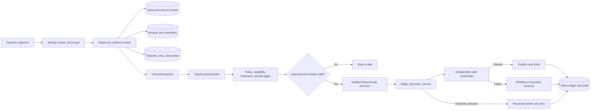

# Network Operations Agent

> **Status:** Research-backed production blueprint  
> **Last researched:** 2026-08-31  
> **Scope:** topology and dependency truth, routing, DNS, certificates, load balancers and traffic policy, packet/flow/reachability evidence, staged network configuration, validation, rollback, and connectivity recovery  
> **Evidence packet:** [Network Operations Agent research packet](../../research/packets/network-operations-agent-blueprint.md)

A production network operations agent is not a chatbot with privileged CLI access. It is an untrusted planner and evidence synthesizer inside a deterministic network control plane. The control plane owns identity, authorization, typed tools, change windows, staging, approval, execution, reconciliation, verification, rollback, and audit.

The most important design constraint is that **configuration success is not connectivity success**. A controller can accept a change while the wrong route is selected, a FIB fails to program, caches continue serving old DNS data, a load balancer has no usable backends, or a TLS endpoint still serves the previous certificate. The agent must therefore connect four layers of truth:

1. declared intent and approved policy;
2. accepted or applied configuration;
3. control-plane and forwarding state;
4. independent service-path evidence from relevant vantage points.

No single device API, source of truth, telemetry stream, packet capture, or model context is authoritative for all four.

## Production position

Use an LLM only where it adds value: translating an operator's ambiguous objective into a bounded investigation, correlating heterogeneous evidence, comparing safe options, and explaining a proposed plan. Prefer a deterministic controller or runbook when the trigger, inputs, effects, and verification rules are stable and fully specified.

The recommended system has these properties:

- read and write identities, queues, workers, and network paths are separated;
- every fact carries provenance, observation time, freshness, coverage, and tenant scope;
- all tools are typed, capability-aware, bounded, and data-returning;
- a write executes only from a sealed, approved plan artifact;
- native atomicity is described precisely—usually one request or one target, not the network;
- multi-target rollout is an explicit dependency graph using make-before-break and fault-domain budgets;
- ambiguous outcomes enter reconciliation; they are never reported as success or retried blindly;
- verification is independent of the mechanism that applied the change;
- out-of-band recovery remains available when the production path is damaged;
- live credentials, raw packet payloads, and durable state never live in the prompt.

## Ownership boundary

The category is defined by operational authority, ground truth, and recovery—not by which team happens to run the software.

| Category | Owns | Ground truth | Typical recovery | Network agent handoff rule |
|---|---|---|---|---|
| Network operations | Topology, network dependencies, routing, DNS, certificates at network termination points, traffic policy, reachability evidence, staged network changes | Network intent plus device/controller state and independent path evidence | Restore connectivity with staged network rollback, route/DNS/traffic correction, or safe isolation | This blueprint's authority |
| Infrastructure operations | Compute, cluster, host, storage, cloud/platform desired state | Platform APIs, declarative infrastructure state, inventory | Reconcile compute/platform resources to desired state | Network agent states the required dependency or endpoint; infrastructure owns resource creation and platform mutation |
| SRE / incident response | Service health, incident command, hypotheses, time-bounded mitigation, postmortem | Service-level telemetry and incident evidence | Coordinate mitigation and restore the service objective | SRE sets incident priority and accepts service risk; network agent diagnoses and executes approved network playbooks |
| Security investigation | Malicious-activity investigation, evidence handling, containment strategy, eradication | Correlated security telemetry and evidence with chain of custody | Contain and remediate adversarial activity | Network agent supplies network facts or applies specifically authorized controls; security owns attacker conclusions and containment scope |

Examples clarify the line:

- Creating a VM or Kubernetes cluster is infrastructure work; proving its route, DNS, TLS termination, and load-balancer path is network work.
- Deciding whether an outage needs incident command is SRE work; determining that an asymmetric path or stale DNS delegation caused it is network work.
- Investigating exfiltration is security work; producing scoped flow records or implementing an approved temporary route/ACL action is network work.

The agent must stop and hand off when an objective changes category. A ticket labelled “network issue” does not expand its authority.

## Guide map

| Guide | Main question |
|---|---|
| [01 — Purpose, operating model, and boundaries](01-purpose-operating-model-and-category-boundaries.md) | When is an agent warranted, what does it own, and where must it stop? |
| [02 — Reference architecture and trust](02-reference-architecture-and-trust-boundaries.md) | Which deterministic components keep an untrusted planner safe? |
| [03 — Topology, intent, discovery, and freshness](03-topology-intent-discovery-and-freshness.md) | How are desired, discovered, inferred, and observed network facts reconciled? |
| [04 — Routing, DNS, certificates, and traffic policy](04-routing-dns-certificates-and-traffic-policy.md) | What domain-specific invariants make changes safe? |
| [05 — Evidence, probes, tools, and integrations](05-evidence-probes-tools-adapters-and-integrations.md) | Which evidence proves reachability, and how are multivendor tools bounded? |
| [06 — Plans, approvals, staged change, and verification](06-plans-approvals-staged-change-and-verification.md) | How does a proposal become a reversible, verified change? |
| [07 — State, memory, reliability, and recovery](07-state-memory-context-reliability-and-recovery.md) | How are long-running work and ambiguous effects resumed safely? |
| [08 — Security, identity, tenancy, and isolation](08-security-identity-tenancy-and-control-plane-isolation.md) | How are credentials, prompt injection, tenants, and break-glass controlled? |
| [09 — Observability, evaluation, labs, and failure injection](09-observability-evaluation-labs-and-failure-injection.md) | How is safety measured before and after deployment? |
| [10 — Deployment, scaling, HA/DR, and roadmap](10-deployment-scaling-cost-ha-dr-and-roadmap.md) | What is the smallest path from deterministic operations to a reliable production service? |
| [11 — Adapter qualification and vendor onboarding](11-adapter-qualification-and-vendor-onboarding.md) | How is a routing, DNS/IPAM, firewall, load-balancer, certificate, cloud-network, telemetry, or configuration integration proven safe for an exact version? |

## Reference control flow

The planner never invokes a general shell, opens arbitrary device sessions, chooses credentials, widens scope, changes its approval, or marks its own work verified. Policy and execution consume the sealed plan, not a later free-form model message.

## Non-negotiable network invariants

1. **Authority is field-specific.** IPAM may own an address allocation, the controller may own intended policy, and the device may own operational counters. “NetBox is the source of truth” is too broad unless every field is mapped.
2. **Freshness is operation-specific.** A month-old chassis serial may be acceptable; a route, endpoint, health, or lock observation taken before a change may not be.
3. **Absence is not proof.** “No route,” “no flow,” or “no packet” is valid only when collection coverage and freshness are known.
4. **Per-target atomicity is not network atomicity.** NETCONF candidate/confirmed commit, gNMI Set, and cloud DNS transactions have real but bounded scopes.
5. **Make-before-break is the default.** Establish and verify the replacement dependency before withdrawing the old one when the protocol and service permit it.
6. **Redundancy must survive the rollout.** Never mutate all members of the same failure domain in one stage merely because they are logically identical.
7. **Unknown is a durable state.** A timeout after dispatch requires reconciliation against native operation IDs and current state, not a repeated write.
8. **Rollback is a new change against the current world.** It must be validated and may be unsafe if another actor or convergence event changed the prerequisites.
9. **Management recovery is independent.** Protect out-of-band management, AAA, credential brokers, audit, and executor egress from production traffic changes.
10. **Packet content is exceptional evidence.** Default to metadata, counters, flow records, and bounded probes; capture payload only with explicit purpose, privilege, minimization, and retention controls.

## Risk and operating modes

| Tier | Typical work | Default mode |
|---|---|---|
| N0 | Inventory, topology, config/state reads, evidence synthesis | Autonomous read-only within tenant and query budgets |
| N1 | Rate-limited active DNS/TLS/path probes; metadata-only flow analysis | Autonomous only under approved probe and privacy policy |
| N2 | Diff, simulation, plan, rollback design, change-ticket draft | Proposal only; no production mutation |
| N3 | Reversible change to one bounded target or redundant member with tested rollback | Explicit approval, window, canary, and independent verification |
| N4 | BGP export policy, DNS delegation/DNSSEC, trust anchors, core routing, global load balancing, broad ACL or multi-region changes | Specialist multi-party approval; no general autonomous execution |
| N5 | Root CA/private-key authority, loss of OOB/AAA, mass zone/catalog deletion, globally existential route or management-plane action | Outside the general agent; dedicated emergency procedure |

Risk can move upward based on target criticality, dependency fan-out, missing coverage, weak rollback, time pressure, tenant sensitivity, or adapter uncertainty. It never moves downward because the model is confident.

## Reading paths

For a first bounded build, read guides 01, 02, 03, 05, 06, and the staged roadmap in guide 10. For operators designing a safe change service, add guides 04 and 07. Security, platform, and audit reviewers should start with guides 02, 08, and 09.

This blueprint builds on the repository's general [production agent control plane](../../architectures/production-agent-control-plane.md), [tool contracts](../../tools/tool-contracts.md), [durable execution](../../runtime/durable-execution.md), [execution boundaries](../../runtime/execution-boundaries.md), [idempotency and side effects](../../reliability/idempotency-and-side-effects.md), [permissions and secrets](../../security/permissions-sandboxing-and-secrets.md), and [observability and tracing](../../evaluation/observability-and-tracing.md). The guides below specialize those controls for network semantics rather than duplicating them.

## Version and evidence policy

Protocols are stable only within their exact specification and negotiated capability. Vendor APIs, controller behavior, cloud resources, device operating systems, data models, and implementation status change more quickly. Pin adapter and schema versions; record negotiated capabilities per target; rerun conformance, replay, and lab tests after an upgrade; and revalidate time-sensitive sources in the [dated evidence packet](../../research/packets/network-operations-agent-blueprint.md).
