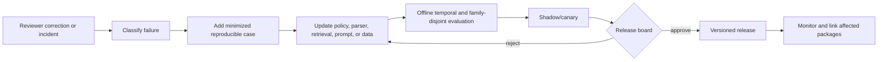

# Zero-to-Production Roadmap and Authority Model

## Purpose

This roadmap turns patent research from a convenient search assistant into a reviewable production system without granting it legal authority. Each stage adds one operational capability and a corresponding control. Advancement is evidence-based: a passing demo, a plausible answer, or a high retrieval score alone is insufficient.

The stages reuse the repository-wide maturity model:

0. qualify the use case;
1. prove one bounded loop;
2. deliver an evidence-preserving MVP;
3. make failure and recovery routine;
4. meet production security and operational controls;
5. scale tenants, corpora, and workloads;
6. evolve safely from real corrections and failures.

## Invariant authority boundary

The system is a research assistant. Its maximum permitted external effect is a **D1 reversible evidence export** to an approved destination. Filing, submission, fee payment, docketing, matter modification, office correspondence, deadline calculation, and legal determination are out of scope. See [execution boundaries](../../runtime/execution-boundaries.md) for the shared D0–D4 model.

All runs carry an `authority_envelope`:

```yaml
authority_envelope:
  version: authority-envelope.v1
  tenant_id: tenant-acme
  matter_ref: opaque:m-1842
  accountable_reviewer_role: patent_counsel
  permitted_effects:
    - read_approved_source
    - store_internal_evidence
    - export_review_package_to_approved_repository
  forbidden_effects:
    - make_legal_determination
    - file_or_submit
    - modify_docket_or_matter
    - pay_fee
    - calculate_or_commit_deadline
  jurisdictions_in_scope: [EP, US]
  source_policy_id: source-policy-2026-08
  confidentiality_class: confidential
  expires_at: 2026-09-07T00:00:00Z
```

Policy rejects an absent, expired, widened, or incompatible envelope before any source call.

## Stage map

The table is intentionally explicit. Every cell is part of the exit review.

| Stage | Architecture | Authority | Input → output | Durable state | Events and effects | Approval | Recovery | Evaluation | Exit gate |
|---|---|---|---|---|---|---|---|---|---|
| 0 — qualify | Offline design review; no agent loop | Human-only; no source credentials | Representative briefs → approved protocol and threat model | Use-case, source, rights, jurisdiction, date, and risk inventories | No external effect | Counsel approves scope and prohibited decisions | Not applicable; design is versioned | Task/risk coverage, source feasibility, red-team pre-mortem | Accountable owner, lawful sources, measurable task, and non-legal output are documented |
| 1 — bounded loop | Single process; one read-only corpus; deterministic controller around one investigator | Agent may propose queries and candidates only | Approved public/redacted claim → cited candidate list | Run, query, source snapshot, document, passage, hypothesis | Read source; store evidence; no export | Analyst approves query protocol and each result set | Restart from last committed query; duplicate reads harmless | Candidate recall on adjudicated set, citation integrity, abstention, zero authority violations | Every candidate traces to source bytes and query; loop respects budget and stop rules |
| 2 — MVP | Durable database + immutable artifact store + queue; one tenant/jurisdiction | D0 reads and internal writes; D1 export after gate | Research brief → versioned review package | Evidence graph, element map, protocol, artifact manifest, approval | Read, parse, index, export approved package | Independent verifier and accountable reviewer | Resume by stable step/operation IDs; reconcile uncertain export | End-to-end acceptance set, element-mapping accuracy, temporal eligibility, export idempotency | A cold restart produces the same accepted package or an explained version delta |
| 3 — reliable v1 | Multiple approved sources; typed adapters; reconciliation workers | Same legal boundary; source-specific entitlements | Multi-source/multilingual brief → contradiction-aware package | Observations, extracted facts, status records, translations, conflicts, supersessions | Scheduled refresh reads; no autonomous legal effects | Review required for low-confidence identity/date/translation/status | Retry safe reads; quarantine poison data; reconcile partial and unknown outcomes | Failure injection, repeated-run reliability, source drift, OCR/MT review, family-disjoint retrieval | Known failures recover without silent fact mutation; unresolved conflicts remain visible |
| 4 — production | Isolated services, tenant partitions, secrets broker, release manifests, observability | Attribute-based policy and short-lived source capabilities | Confidential matter inputs → controlled internal package/export | Retention, access, consent, lineage, deletion tombstones, model/source versions | Approved reads and audited D1 exports only | Two-person or counsel gate for consequential/confidential exports | Regional backups, restore drills, incident runbooks, compensating correction | Security assessment, provenance completeness, SLO burn, reviewer override analysis | Security/privacy/legal-source review passes; restore and revocation drills meet objectives |
| 5 — scale | Tenant-aware ingestion/retrieval pools, partitioned queues/indexes, backpressure | Per-tenant/matter budgets and entitlements; no cross-tenant optimization leakage | Portfolio/batch workload → isolated review workspaces | Sharded evidence graphs, corpus snapshots, lineage indexes, capacity leases | Fair-queued reads; rate-limited licensed calls; controlled bulk exports | Sampling plus mandatory review for high-risk outputs; never auto-legal conclusions | Rebalance, replay from checkpoints, per-source circuit breakers, graceful degradation | Tail latency, noisy-neighbor tests, recall under load, cost per verified candidate, isolation tests | SLOs hold at forecast peak; quota exhaustion degrades explicitly, never by silent omission |
| 6 — evolution | Versioned policy/model/index/source pipelines with shadow and rollback lanes | Authority cannot expand through model/config change | Corrections, incidents, new office standards → validated release | Failure corpus, adjudication set, migration ledger, supersession and correction graph | Shadow reads allowed; production effects unchanged until release approval | Domain, security, data-rights, and operations sign-off by change class | Rollback artifacts/index/model; forward correction for issued packages | Temporal holdouts, family-disjoint tests, benchmark-leakage audit, canary review, regression replay | Change improves defined outcomes without authority, confidentiality, provenance, or temporal regressions |

## Measurable stage exercises

Stage advancement requires captured evidence from a repeatable exercise. The quantities below are minimum demonstration sizes, not statistical claims about production recall; teams must pre-register stricter thresholds from risk, language, jurisdiction, and workload.

| Stage | Entry evidence | Required exercise | Exit evidence and measurable pass condition |
|---|---|---|---|
| 0 | Named accountable owner; draft product boundary; candidate sources and data classes | Triage at least 12 representative briefs spanning the supported research products, including prohibited legal requests and confidential inputs | Every brief has an allow/reject/escalate decision, processor path, reviewer role, and harm analysis; zero prohibited request is reframed as an allowed conclusion |
| 1 | Approved public/redacted corpus; pinned target/date fixtures; read-only capability | Run at least 30 adjudicated cases across the intended technical/language strata, repeat each three times, and force budget exhaustion | 100% displayed citations resolve to captured bytes; zero authority/rights violation; all branch errors are explicit; pre-registered recall-at-review-budget and abstention gates pass with confidence intervals reported |
| 2 | Durable state/event schemas; artifact store; deterministic package builder | Kill the run once at each of six boundaries: before request, after response, after parse, after hypothesis, before approval, and during export acknowledgement | Resumption preserves budget/evidence exactly; committed package manifests match or have an explained pinned-version delta; zero duplicate observation, approval, or export; unknown export enters reconciliation |
| 3 | Qualified multi-source adapters; contradiction and text-layer fixtures | Inject timeout, 429/quota, schema drift, corrected record, bad OCR, bad translation, source disagreement, and entitlement expiry in every supported adapter operation | 100% raw successful responses are replayable; zero silent provider substitution or conflict overwrite; every unsupported/degraded branch appears in coverage; material mappings are reverified after corrections |
| 4 | Threat model; matter/tenant policy; secrets broker; backup/restore design | Run at least 1,000 cross-tenant/matter authorization probes, the document-injection suite, entitlement revocation, one regional restore, and one deletion/hold drill | Zero unauthorized record reaches ranking/context/trace/export; zero secret in captured outputs; restore meets declared RPO/RTO; deletion proof covers raw, derived, index, cache, memory, evaluation, log, and backup scopes |
| 5 | Forecast load model; source/reviewer quotas; sharding and fair queues | Sustain twice forecast peak arrival for 60 minutes while one provider throttles, one tenant bursts, OCR queues grow, and reviewer capacity is capped | Hard safety/provenance gates remain perfect; no tenant starvation; source limits are obeyed; queue-age and tail-latency objectives pass or create explicit degraded states; cost/reviewer-load budgets are reported by accepted outcome |
| 6 | Versioned behavior bundle; private temporal/family-disjoint holdout; rollback artifact | Shadow the complete new bundle, canary it on 5–10% of eligible new runs, inject rollback mid-run, and replay every material correction/incident case | No hard-gate regression; pre-registered outcome, trajectory, evidence, invariant, and human-factor gates pass; rollback meets target without mixing versions; affected historical packages remain reproducible and corrections remain linked |

Exercise evidence includes fixture/case IDs, input and corpus hashes, operation manifests, source/terms snapshots, release ID, traces, graph revisions, approvals, failures injected, measured distributions, reviewer/adjudicator identities or roles, and signed exit decision. A screenshot or a best run is not exit evidence.

## Stage 0 — qualify the research problem

### Required decisions

Write a research protocol before choosing a model:

```yaml
research_protocol:
  question_type: prior_art_candidate_search
  legal_question: outside_agent_boundary
  target:
    document_id: internal:target-001
    selected_claims: [1, 7]
    authoritative_text_language: en
  jurisdictions: [EP]
  date_theory:
    supplied_by: accountable_reviewer
    candidate_must_be_public_before: 2024-03-18
    caveat: Research filter only; legal relevance is counsel's decision
  corpora:
    patent: [approved_epo_snapshot]
    non_patent: [approved_scholarly_index]
  expected_output: attorney_review_package.v1
  stop_conditions:
    wall_clock_minutes: 90
    source_request_budget: 200
    no_new_high_value_branch_rounds: 2
  exclusions:
    - legal_conclusion
    - exhaustive_search_claim
    - filing_or_matter_effect
```

Reject the use case if no professional can define the target claim/version, jurisdictional scope, date filter, permitted sources, acceptable residual risk, or who decides sufficiency. Reject it if the desired output is a legal opinion disguised as a score.

### Stage 0 exit checklist

- [ ] The accountable reviewer and escalation path are named.
- [ ] Inputs are public, redacted, or approved for every downstream processor.
- [ ] Every source has an access method, rights record, rate limits, retention rules, and fallback.
- [ ] The date field is named—not a generic `date`—and supplied as a research constraint rather than model-inferred law.
- [ ] Success includes citation correctness, temporal correctness, and abstention, not only relevance.
- [ ] A realistic harm analysis covers missed art, false mapping, family conflation, stale status, leakage, and misleading completeness.

## Stage 1 — prove one bounded investigative loop

The simplest safe loop is:

```text
normalize target → create claim/concept terms → run approved lexical/classification queries
→ fetch top candidates → cite passages → propose next branch or stop
```

The controller, not the model, checks the request budget, eligible collections, cutoff date, query syntax, artifact size, and stopping rules. All tool results use the evidence envelope from [tool artifacts and provenance](../../tools/tool-results-artifacts-and-provenance.md).

Stage 1 deliberately excludes legal-status inference, family expansion beyond navigation, public translation of confidential text, autonomous web browsing, memory reuse between matters, and external export.

### Stage 1 exit metrics

| Dimension | Minimum evidence |
|---|---|
| Provenance | 100% of displayed passages resolve to captured source bytes, page/paragraph coordinates, acquisition time, and connector version |
| Temporal filter | No known post-cutoff publication is silently presented as eligible; uncertain dates are quarantined |
| Authority | Zero generated legal determinations across normal and adversarial prompts |
| Search | Recall-oriented metric and precision-at-review-budget reported on an adjudicated, time-valid set |
| Reproducibility | Same protocol and corpus snapshot reproduce query history and candidate IDs |
| Stop behavior | Budget exhaustion, no-new-branch, and reviewer-stop all terminate cleanly |

## Stage 2 — evidence-preserving MVP

Add durable workflow state, immutable artifacts, typed element hypotheses, independent verification, and a gated export. The MVP should support one tenant and one well-understood jurisdiction/corpus. Breadth is less valuable than proving evidence integrity.

The package contains:

1. approved question and protocol;
2. target document and selected claim/version hashes;
3. jurisdiction/date constraints supplied by the reviewer;
4. complete search log, branches, query syntax, source/corpus snapshots, and limits;
5. candidate table with identity, family navigation, publication timing, and source rights;
6. element map with exact cited passages, text layer, translation status, and reviewer decisions;
7. contradictions and unresolved uncertainties;
8. explicit excluded sources and coverage gaps;
9. package manifest, versions, signatures/checksums, and approval record;
10. a conspicuous non-legal-advice and non-exhaustiveness statement.

Export uses a stable `operation_id = hash(tenant, matter, package_manifest_hash, destination)` and follows [idempotency and side effects](../../reliability/idempotency-and-side-effects.md).

## Stage 3 — reliable multi-source research

Now add office registers, multiple publication databases, classifications, file wrappers where permitted, licensed data, OCR, and approved translation. The control problem changes from “find text” to “preserve conflicting and time-varying observations.”

Required behaviors:

- connector responses are stored before normalization;
- each extracted fact retains its source observation and transformation chain;
- a source-specific absence is represented as `not_observed`, never “does not exist”;
- family expansion is a navigation operation with relation type and provider definition;
- legal events remain event records; any displayed status is a source-attributed projection with jurisdiction and `observed_at`;
- OCR and translation produce additional text layers, never overwrite the authoritative bytes/text;
- a second verifier checks identifiers, dates, passages, and translation-sensitive mappings;
- retries cannot append duplicate evidence or silently replace a prior result.

### Recovery drills

- Kill the worker after source response capture but before normalization; replay must link one observation.
- Timeout an export after remote acceptance but before acknowledgment; reconciliation must determine whether the package already exists.
- Change a classification scheme version; the old search remains reproducible while a new run records the new scheme.
- Return an office event feed late or out of order; the projection changes only through a superseding record.
- Corrupt an OCR page; the package marks dependent hypotheses stale and queues re-verification.

## Stage 4 — production controls

Production is justified only when confidential and licensed material can be handled deliberately.

### Mandatory control planes

| Plane | Responsibility |
|---|---|
| Identity | Human and service identity, tenant/matter membership, reviewer role, source entitlement |
| Policy | Allowed source, data class, processor, region, retention, model, effect, and export destination |
| Secrets | Short-lived connector credentials delivered only to adapters; never in model context |
| Evidence | Immutable observations/artifacts and append-only lineage; controlled corrections |
| Workflow | Durable state machine, leases, attempts, approvals, reconciliation |
| Evaluation | Versioned acceptance suites, trajectory checks, override/failure mining |
| Operations | SLOs, traces, release manifest, incident and correction workflow |

Every release binds code, prompt, model, tokenizer, embedding, index build, corpus snapshot, connector schema, policy, classification scheme, OCR, translation, and evaluation-set versions. A rollback must restore a compatible bundle, not only application code.

## Stage 5 — scale without weakening truth

Scale the expensive workloads independently:

- office and licensed-source acquisition by source, entitlement, and rate limit;
- OCR/translation by data class, language, and processing region;
- lexical/classification and vector indexes by corpus snapshot and tenant permissions;
- search runs by matter priority and review capacity;
- package builds by artifact locality and export destination.

Do not scale by allowing the model to skip a source silently. When a queue, license quota, or source is unavailable, produce an explicit degraded-coverage record and require the reviewer to accept, wait, or narrow scope.

Use weighted fair queues so a portfolio batch cannot starve an urgent single matter. Admission control considers expected document pages, source calls, OCR/translation tokens, semantic reranking candidates, review queue depth, and package size. Details are in [09 — Evaluation, operations, scaling, and evolution](09-evaluation-operations-scaling-and-evolution.md).

## Stage 6 — evolve through corrections and failure mining

Production corrections are first-class evidence:



Correction never rewrites history. A new record supersedes the old fact/hypothesis/conclusion, identifies the reason and actor, and marks affected packages. If a prior export was materially misleading, the accountable team—not the agent—decides notification and remediation.

### Upgrade gates

- no shared claim/family member crosses train/test/holdout partitions;
- training and retrieval corpora are cut off before each evaluation question's effective observation date;
- benchmark licenses permit the intended use;
- source and label construction are documented, including examiner-citation bias;
- newly proposed automation cannot widen effects or bypass review;
- quality improvements are reported by jurisdiction, language, document age, OCR quality, and query type;
- abstention, contradiction preservation, latency, cost, and reviewer burden do not regress beyond approved budgets.

## When not to build this agent

Do not build it when the real requirement is automatic legal advice, a filing bot, a deadline engine, a docket updater, or an assertion that a search is exhaustive. Do not build a bespoke agent if an approved professional search platform plus a documented human protocol already meets the volume, evidence, confidentiality, and integration needs. The system earns its complexity only when reproducible multi-source evidence assembly and review are recurring operational problems.

## Production-readiness checklist

- [ ] Authority is enforced in policy and tools, not only in prompts.
- [ ] Every source and processor has a rights, confidentiality, rate, and retention record.
- [ ] Patent identities, dates, family definitions, classifications, and text layers are versioned.
- [ ] Search branches and stopping decisions are reproducible.
- [ ] Claim elements preserve source text and reviewer-approved interpretation boundaries.
- [ ] Similarity hypotheses cannot be rendered as legal conclusions.
- [ ] Legal-status records are jurisdiction-, source-, and observation-time-scoped.
- [ ] Unknown, absent, contradictory, OCR-derived, and translated data remain distinguishable.
- [ ] Durable workflow, retries, reconciliation, and export idempotency pass failure injection.
- [ ] Confidential and licensed data stay tenant-, matter-, and entitlement-isolated.
- [ ] Evaluation uses temporal and family-disjoint holdouts plus human adjudication.
- [ ] SLOs, cost budgets, incident response, rollback, and correction propagation are operational.
- [ ] Counsel/accountable professionals retain final authority.
