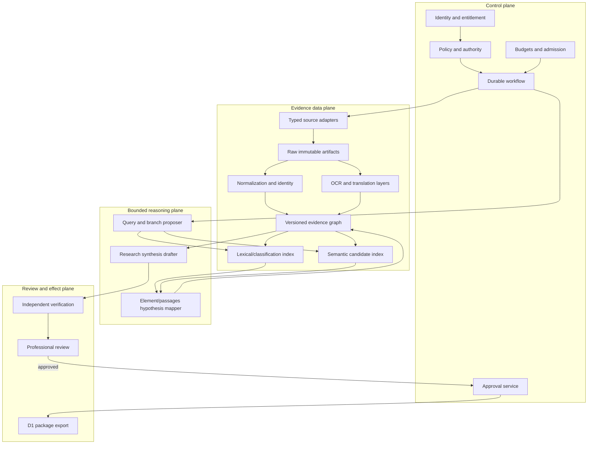
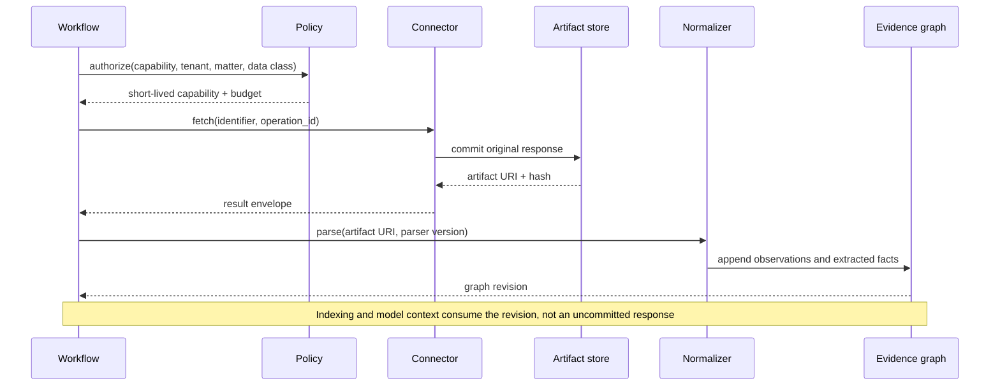

# Reference Architecture, Integrations, and Data Plane

## Architectural decision

Use a deterministic workflow around one bounded investigative loop. Keep source acquisition, identity resolution, transformations, indexing, policy, and effects outside model control. The model may propose research branches and provisional mappings; it may not choose an unapproved source, reinterpret an entitlement, mutate an observation, or export without a gate.



The evidence graph is authoritative. Search indexes are disposable projections. Model context is a compiled view. An export is a versioned external effect.

## Component responsibilities

| Component | Owns | Must not own |
|---|---|---|
| Intake and policy compiler | Matter scope, data class, source entitlements, jurisdiction/date filters, budgets | Legal interpretation of the requested question |
| Durable workflow | Runs, attempts, steps, leases, approvals, stop/recovery state | Source facts or model transcript as authority |
| Source adapter | Authentication, request shaping, rate limits, response capture, connector schema | Cross-source normalization or legal-status conclusions |
| Artifact store | Original files/responses, hashes, MIME/type, acquisition metadata, retention label | Mutable “latest” document content |
| Normalizer | Identifier parsing, field extraction, text-layer coordinates, relation candidates | Destructive merging of conflicting values |
| Evidence graph | Observations, facts, relations, hypotheses, conclusions, supersessions | Hidden model state |
| Index builder | Corpus snapshots and reproducible lexical, classification, citation, and vector projections | Canonical patent identity |
| Investigator | Query branches, candidate ranking rationales, information-gap proposals | Entitlement, budgets, effects, or legal conclusions |
| Verifier | Identifier/date/passage/translation/source checks | Self-approval of the synthesis it generated |
| Package builder | Deterministic manifest and rendering | Dropping unresolved contradictions or coverage gaps |
| Export adapter | Idempotent write to approved internal destination | Filing, docket updates, office submissions, or email by default |

## Workload placement decisions

### Office and registry data

Treat national/regional office records as source-specific observations. Use an official bulk feed or supported API when automation is permitted. Use an official interactive register for targeted human verification. Never scrape an interface whose terms prohibit automation, and never infer absence from a source that lacks jurisdiction, document, or event coverage.

Recommended placement:

| Workload | Default | Reason |
|---|---|---|
| Large recurring bibliographic/full-text ingestion | Licensed/official bulk dataset into an internal snapshot | Reproducible, rate-efficient, and indexable |
| Targeted current register check | Live official source adapter or human verification | Freshness and office authority matter |
| File-wrapper acquisition | Official supported service, matter-scoped | Large, evolving, sometimes access-limited |
| Cross-office family navigation | Licensed/official aggregate plus direct-office verification for consequential facts | Aggregates improve discovery; offices resolve local facts |
| Legal-event monitoring | Versioned feed plus jurisdiction-specific projections | Events arrive late, correct, and differ by authority |

For example, EPO describes INPADOC legal-event data as worldwide data from more than 50 authorities, but its conditions disclaim completeness and accuracy. The European Patent Register’s post-grant national data likewise points users to national authorities for authoritative verification. WIPO’s Patent Register Portal is a routing aid across jurisdictions, not a global status oracle. See the [EPO INPADOC dataset](https://www.epo.org/en/searching-for-patents/data/bulk-data-sets/inpadoc), [EPO Federated Register coverage](https://www.epo.org/en/searching-for-patents/legal/register/documentation/data-coverage), and [WIPO Patent Register Portal](https://www.wipo.int/en/web/wipo-inspire/patent-register-portal).

### Classification data

Ingest IPC/CPC schemes, definitions, concordances, revision notices, and corrections as versioned reference datasets. Store the scheme edition on both the document assignment and query expansion. Do not “update in place.” Reclassification may be retroactive or family-propagated, and a symbol’s definition may change.

- IPC is revised regularly; WIPO publishes the scheme and master files. As of the research baseline, IPC 2026.01 is current ([WIPO IPC](https://www.wipo.int/en/web/classification-ipc)).
- CPC publishes releases, pre-releases, archives, and Notices of Changes. USPTO documented a 2026 distribution disruption and later alignment, demonstrating why release identity and correction ingestion matter ([CPC releases](https://www.uspto.gov/patents/search/classification-standards-and-development), [CPC corrigenda](https://www.uspto.gov/web/patents/classification/cpc/html/corrigenda-and-amendments.html)).

### Search workloads

Run high-volume reproducible search on internal, licensed snapshots. Use official interactive tools for exploration and verification within their terms. A web UI is not an implicit API.

PATENTSCOPE’s terms prohibit automated queries, bulk acquisition, downloading, storing, and scraping and identify excessive query behavior; therefore its public UI is a human-facing verification source unless a separate authorized channel exists ([PATENTSCOPE terms](https://www.wipo.int/en/web/patentscope/data/terms_patentscope)). EPO directs automated retrieval to Open Patent Services under usage terms and treats Espacenet as entry-level rather than bulk infrastructure ([EPO fair use](https://www.epo.org/en/service-support/ordering/fair-use), [EPO website terms](https://www.epo.org/en/terms-of-use/terms-and-conditions-use-website-european-patent-office)). USPTO Patent Public Search supports rich Boolean searching but should not be treated as a hidden bulk interface ([Patent Public Search](https://www.uspto.gov/patents/search/patent-public-search)).

### Licensed databases

A licensed patent database is a connector plus a rights contract, not simply a superior corpus. The integration record must capture:

- licensed entities, users, tenants, jurisdictions, and environments;
- query and result quotas, concurrency, and rate limits;
- allowed caching, indexing, embedding, model input, training, derivative-data, export, and redistribution;
- retention and deletion obligations;
- attribution and audit requirements;
- restrictions on personal data, images, full text, and third-party content;
- service availability, schema/version notices, and termination behavior;
- whether a derived vector, normalized family, or extracted passage remains restricted data.

If a right is unspecified, default to prohibited until the data owner or counsel resolves it. Maintain a licensed-corpus kill switch that can stop new access, block exports, and identify stored derivatives for quarantine/deletion without corrupting unrelated evidence.

### Documents, PDFs, images, and file wrappers

Preserve original bytes and separately generate:

1. native structured text, when supplied;
2. embedded PDF text;
3. OCR text;
4. normalized display text;
5. translation layers;
6. page/region/paragraph/claim coordinates.

Never overwrite one layer with another. A cited passage records the layer and transformation version. Images, chemical structures, sequence listings, formulae, tables, and handwritten annotations may require specialist extraction or human review; generic OCR failure must not silently convert them to empty text.

### OCR

Route OCR by document type, language, layout, confidentiality, and rights. Prefer native office XML/text over OCR. Use OCR for image-only or deficient pages, then retain page images and confidence/quality diagnostics. WIPO ST.22 addresses OCR presentation considerations, and PATENTSCOPE itself warns that OCR text may contain errors ([WIPO ST.22](https://www.wipo.int/documents/d/standards/docs-en-03-22-01.pdf), [PATENTSCOPE terms](https://www.wipo.int/en/web/patentscope/data/terms_patentscope)).

Low OCR confidence is not the only failure signal. Detect missing pages, implausible claim numbering, broken hyphenation, column interleaving, symbol loss, altered subscripts, and disagreement with embedded text. Any mapped passage dependent on changed OCR becomes stale and requires re-verification.

### Translation

Translation is a parallel text layer with source language, target language, engine/model version, processor, timestamp, and confidentiality decision. It supports discovery; consequential element mapping must show authoritative-language text and receive bilingual or professional review when meaning could change.

WIPO states machine translations are for convenience and have no legal value. Its public translation page also warns users not to submit undisclosed or sensitive data. The architecture therefore sends no confidential invention disclosure, unpublished claim draft, or privileged analysis to a public translator ([WIPO Translate](https://www.wipo.int/en/web/ai-tools-services/wipo-translate), [WIPO public translation warning](https://patentscope.wipo.int/translate/translate.jsf?interfaceLanguage=en)). Use approved tenant-isolated, region-compatible, contractually permitted translation or an offline service.

### Non-patent literature and third-party integrations

Non-patent literature may include papers, standards, manuals, theses, catalogs, videos, archived web pages, product documents, source code, and evidence of public use. Metadata availability does not grant full-text reuse. Each connector must distinguish:

- metadata retrieval;
- abstract/snippet retrieval;
- full-text access;
- internal caching/indexing;
- model processing;
- excerpting in a review package;
- redistribution to external reviewers.

Store a bibliographic reference plus a permitted evidence excerpt or internal access pointer. Do not copy an entire paywalled work into the package. Standards documents and product manuals can be especially rights-sensitive; route access through approved subscriptions and preserve the edition/date.

## Typed source adapter contract

Adapters implement the repository’s [tool contract](../../tools/tool-contracts.md) and add source rights and temporal coverage:

```yaml
source_adapter:
  adapter_id: epo-ops-biblio
  adapter_version: 3.2.0
  source_authority: EPO
  channel: supported_api
  credential_ref: secret-broker://epo-ops/tenant-acme
  entitlement_id: entitlement-72
  data_classes_allowed: [public_patent_data]
  automation_allowed: true
  retention_policy_id: epo-licensed-derived-v2
  request_policy:
    rate_bucket: epo-ops-acme
    timeout_ms: 20000
    max_attempts: 3
  coverage_statement_id: coverage-epo-ops-2026-08
  schema_contract: connector-schema.v4
```

A successful result does not return only normalized fields:

```yaml
tool_result:
  operation_id: op-7f2b
  source_request_id: req-1a90
  observed_at: 2026-08-31T09:20:11Z
  response_artifact:
    uri: artifact://tenant-acme/sha256/9d...
    sha256: 9d...
    media_type: application/xml
  source_metadata:
    authority: EPO
    endpoint_family: published-data
    terms_snapshot_id: rights-2026-08-01
    coverage_statement_id: coverage-epo-ops-2026-08
  normalized_preview:
    publication_candidates: [EP1234567A1]
  warnings: []
  retry_class: not_needed
```

Capture the response before parsing. A parser failure then becomes recoverable without repeating a licensed call.

## Source capability registry

Every connector is discovered through a versioned registry rather than tool-name guessing:

| Field | Example | Control value |
|---|---|---|
| `capability` | `patent.bibliographic.lookup` | Separates intent from vendor |
| `jurisdictions` | `[EP, WO]` | Prevents unsupported inference |
| `temporal_coverage` | `provider statement ref` | Makes gaps inspectable |
| `freshness` | weekly snapshot | Guides live verification |
| `automation_right` | API yes; UI no | Stops scraping by fallback |
| `data_classes` | public patent only | Blocks confidential input |
| `transform_rights` | internal index yes; model training no | Controls derived data |
| `rate_policy` | token bucket + weekly quota | Admission/backpressure |
| `schema_version` | `v4` | Allows contract tests |
| `degradation_mode` | queue, alternate, human check, unavailable | Prevents silent omission |

Pin the selected capability and adapter version in the run. Tool registry lifecycle follows [tool registries, versioning, and lifecycle](../../tools/tool-registries-versioning-and-lifecycle.md).

## Operation-level capability manifests

A connector-level flag such as `can_search: true` is too broad. Qualification and policy apply to one operation because search, record retrieval, bulk download, family lookup, legal events, images, usage inspection, and export have different data, limits, rights, failure modes, and confidentiality exposure.

```yaml
operation_capability_manifest:
  manifest_version: patent-operation-capability.v1
  provider: EPO
  channel: OPS
  operation_id: epo.ops.published_data.biblio.retrieve
  provider_contract:
    service_version: "3.2"
    documentation_version: "1.3.20"
    schema_artifact_sha256: "..."
    terms_snapshot_id: terms:epo-ops:2026-08-31
  invocation:
    method: GET_OR_POST
    request_schema: ops-published-data-request.v1
    response_schema: epo-docdb-exchange-pinned.xsd
    pagination_or_range: provider_documented
  semantics:
    accepted_identifiers: [publication_docdb, publication_epodoc]
    returned_entities: [publication_observation, bibliographic_fields]
    date_fields: [application_filing_date, publication_date, priority_claim_date]
    absence_semantics: not_observed_in_this_response
  authorization:
    credential_type: oauth_access_token
    allowed_data_classes: [public_patent_data]
    allowed_purposes: [research, verification]
  rights_and_limits:
    automation: allowed_via_supported_api
    cache_and_derivative_policy: rights:epo-ops:2026-08-31
    rate_and_volume_policy: limit:epo-ops-current
  reliability:
    timeout_ms: 20000
    retryable: [timeout_before_response, 429, provider_5xx]
    never_blind_retry: [response_received_artifact_uncommitted]
    cancellation: stop_before_next_page
  evidence_receipt:
    required: [operation_id, request_hash, response_hash, observed_at, provider_request_metadata, quota_headers]
  qualification:
    report_id: qual:epo-ops:3.2:1.3.20:2026-08-31
    expires_on: provider_schema_terms_or_limit_change
```

The runtime rejects an operation whose manifest or qualification report is missing, expired, broader than the authority envelope, or inconsistent with the run’s version pins. Standards such as WIPO ST.90/ST.96/ST.97 can shape an adapter schema, but do not prove that a provider implements a particular endpoint.

### Provider-specific operation inventory

This is an integration boundary, not a promise of access. Re-open the linked documentation and the organization’s contract immediately before implementation.

| Provider/channel | Operations that may be qualified | Current availability boundary at the 2026-08-31 research cut | Mandatory adapter behavior |
|---|---|---|---|
| USPTO Open Data Portal | Patent File Wrapper application search/read; document list/download; bulk-product search/download; separately documented office-action/citation datasets | Supported APIs are documented through ODP; API key is required for APIs, and ODP announced USPTO.gov account/MFA registration requirements in 2026. The legacy Developer Hub was decommissioned, so old endpoints are not fallbacks ([PFW application data](https://data.uspto.gov/apis/patent-file-wrapper/application-data), [PFW documents](https://data.uspto.gov/apis/patent-file-wrapper/documents), [bulk search](https://data.uspto.gov/apis/bulk-data/search), [API syntax/access](https://data.uspto.gov/apis/api-syntax-examples)) | Discover and hash current Swagger/OpenAPI/JSON schemas; qualify search and document retrieval separately; test public-record coverage and unavailable/unpublished cases; never infer that a UI field and API field have identical semantics |
| EPO Open Patent Services | Published-data search/bibliography/full text/images/equivalents; INPADOC extended-family lookup; number conversion; EP Register retrieval/search; legal data; CPC/classification; consumption/usage | OPS 3.2 documentation version 1.3.20 lists these as separate services. Registration/OAuth is required; fair-use rules currently include a 4 GB weekly free threshold, throughput controls, and operation-sensitive request limits ([OPS service/downloads](https://www.epo.org/en/searching-for-patents/data/web-services/ops), [OPS 3.2 reference](https://link.epo.org/web/searching-for-patents/data/en-ops-v3.2-documentation-version-1.3.20.pdf), [fair use](https://www.epo.org/en/service-support/ordering/fair-use)) | One manifest per service/constituent; retain quota/throttling headers; use number service only as a sourced conversion; label family as INPADOC extended family; keep Register and worldwide legal data scopes distinct; use bulk products for complete/very large collections |
| WIPO PATENTSCOPE public UI | Human search, CLIR exploration, permalink/manual verification | Public terms forbid automated queries, bulk acquisition/storage, and scraping. This channel therefore has no agent-callable search operation ([PATENTSCOPE terms](https://www.wipo.int/en/web/patentscope/data/terms_patentscope)) | Manifest sets `automation: prohibited`; record a human verification event and permalink/screenshot metadata where permitted; never create an unofficial API by driving the UI |
| WIPO PCT subscription products/web service | Contracted PCT bibliographic/text/image products and conditional SOAP/Java web-service document retrieval | Fee-based products and conditional-use web services are available by subscription; WIPO states national/regional office patent data is not currently available in these products ([PCT data products](https://www.wipo.int/en/web/patentscope/data/index), [product terms](https://www.wipo.int/en/web/patentscope/data/terms)) | Qualify only operations named in the executed subscription; encode PCT-only content scope, 10-retrieval-actions/minute conditional limit where applicable, redistribution class, derivative/non-derivative license, and missed-week/backfile recovery |
| Lens Patent API/bulk | Patent search/get, cursor pagination, usage inspection, and bulk release/download when purchased | API documentation reported API 2.19.3 and patent schema 1.6.5, updated 2026-04-17. Trial access is short and limited; ongoing automated/commercial access is a paid/custom plan with terms/attribution ([Lens API docs](https://docs.api.lens.org/), [access plans](https://support.lens.org/knowledge-base/lens-patent-and-scholar-api/), [bulk downloads](https://support.lens.org/knowledge-base/bulk-data-downloads/)) | Bind token/plan/attribution and allowed use; pin API and patent-schema versions; verify cursor/429 behavior and quota usage; treat Lens IDs, family fields, normalized parties, status, and scores as provider records, not office truth |
| Google Patents UI | Human query exploration and document viewing | Google documents UI query syntax, privacy/log handling, approximate result counts, and simple-family result deduplication, but the reviewed official material does not document a general Google Patents search API ([search help](https://support.google.com/faqs/answer/7049475), [result behavior](https://support.google.com/faqs/answer/7049588), [privacy](https://support.google.com/faqs/answer/6391039)) | Set UI automation to prohibited unless a later explicit agreement says otherwise; human verification records exact query/date and notes approximate counts/family suppression; never scrape an undocumented endpoint |
| Google Patents Public Datasets on BigQuery | SQL analysis through BigQuery, subject to the actual dataset/table contract | BigQuery public datasets are queryable through supported BigQuery interfaces, are billed by query, and have no Public Dataset Program SLA. The original patent-dataset announcement describes third-party IFI data and historical scope, so current table metadata must be inspected rather than assuming those 2017 counts/coverage remain current ([BigQuery public datasets](https://docs.cloud.google.com/bigquery/public-data), [Google Patents dataset announcement](https://cloud.google.com/blog/topics/public-datasets/google-patents-public-datasets-connecting-public-paid-and-private-patent-data)) | Pin project/dataset/table and last-modified/schema snapshots; cap bytes billed; save normalized SQL and job ID; qualify row semantics/coverage against direct sources; do not treat analytical tables as a live register or Google Patents search API |

### Non-office operation inventory

| Adapter class | Separate operations | Required semantics and limits |
|---|---|---|
| Document/file wrapper | list metadata, fetch bytes, fetch document history, verify checksum | Preserve source document ID, edition, MIME, page count, access decision, byte hash, and observed time; listing success is not download success |
| OCR | detect text layer, OCR page/region, assemble structure, quality check | Input page hash and coordinates; engine/model/language/version; confidence plus structural diagnostics; never overwrite native/embedded text |
| Translation | discover language, translate discovery layer, request human review, accept reviewed translation | Direction, engine/version, confidentiality route, segment alignment, omissions/uncertainty; no legal-force flag and no public processor for restricted input |
| Lexical/classification/semantic index | build snapshot, activate snapshot, query, explain route, retire | Corpus/text-layer/cutoff/analyzer/model/scheme pins; atomic activation; authorization before ranking; deterministic lexical replay and bounded semantic nondeterminism |
| Graph/analytics | add sourced edge, compute family/citation component, deduplicate, aggregate, export measure | Edge provenance and algorithm/version; family definition and temporal cut; no entity/family/status assertion created solely from graph proximity |
| Matter/document system | resolve approved destination, read metadata, create package version, fetch receipt/hash, supersede link | Matter ACL and ethical wall; package hash and approval binding; no docket/deadline/filing/matter mutation; write is an external effect with reconciliation |

### Qualification test suite

Every operation—not merely every vendor—passes these tests before production and after a trigger change:

| Test | Evidence | Fail closed when |
|---|---|---|
| Contract/schema | Captured official schema/Swagger/XSD, sample fixtures, unknown-field and missing-field tests | Current contract cannot be pinned or unknown fields would be coerced |
| Identity/date goldens | Office/kind/application/publication/grant/priority/date fixtures including corrections | Identifier type or typed date can be silently conflated |
| Pagination/completeness mechanics | Boundary sizes, stable sort/cursor, duplicate/missing-page injection, resumable checkpoint | Pagination can skip/duplicate without detection |
| Coverage and absence | Stratified comparison with direct sources by jurisdiction, era, kind, language, event/document type | Adapter would translate `not_observed` into nonexistence |
| Authentication/authorization | Expired, revoked, wrong-tenant, wrong-plan, least-scope, region and data-class cases | Credential scope or entitlement cannot be enforced per operation |
| Rights/confidentiality | Terms snapshot, caching/index/model/export test matrix, restricted-input rejection | Intended transformation/export right is absent or unclear |
| Quota/retry/cancellation | 429/403/quota headers, timeout before/after response, page cancellation, backoff and circuit breaker | Retry can duplicate cost/effect or violate provider policy |
| Evidence capture/replay | Raw request/response hashes, timestamps, parser replay, deterministic normalized delta | Successful bytes can be lost before observation commit |
| Corrections/drift | Backfill/corrected-record fixture, schema and enum drift, terms/coverage change detector | Old facts would be overwritten or dependent outputs remain current |
| Adversarial content | Malformed XML/PDF, XXE, compression bomb, active links, hidden instructions, oversized payload | Parser/model can expand authority or access network/secrets |
| Reconciliation | Lost acknowledgement, remote lookup by operation/key/hash, exact/absent/ambiguous states | A write/export would be blindly retried |
| Load and cost | Source-specific concurrency, byte/request quota, p95/p99, billed-query/OCR/translation units | Declared SLO/cost cannot be met without silent coverage loss |

A qualification report includes fixture hashes, timestamps, provider/schema/terms versions, measured coverage strata, known gaps, approved data classes/purposes, operation owner, expiry triggers, and the release IDs allowed to invoke it.

## Acquisition and normalization flow



## Failure and degradation matrix

| Failure | Unsafe response | Required response |
|---|---|---|
| Official source unavailable | Substitute an aggregate as “official” | Mark source unavailable, use labeled alternate for discovery, queue official verification |
| API schema drift | Coerce unknown fields | Store raw response, fail contract validation, quarantine adapter version |
| Rate/weekly quota exhausted | Skip source and continue silently | Pause or produce reviewer-visible degraded coverage |
| Licensed entitlement expired | Reuse cached restricted data without checking | Block new access/export, preserve audit evidence, invoke rights playbook |
| OCR loses claims page | Treat empty output as no claim | Page-count/claim-sequence validation; reacquire or human transcription |
| Translation service rejects region/data class | Send to a public fallback | Stop branch; use approved processor or human review |
| National register reports nothing | Record “not entered/lapsed” | Record `not_observed_in_source` with coverage and timestamp |
| Source returns corrected record | Rewrite old fact | Append observation and superseding fact; invalidate dependent projections |

## Build-versus-buy rule

Buy or license broad cleaned data, family/status aggregates, OCR, and translation when the contract covers the intended transformations and the vendor’s quality/coverage is measurable. Build the evidence contract, identity reconciliation, authority policy, query protocol, review workflow, provenance, and correction propagation: those encode the organization’s risk and cannot be safely outsourced as opaque answers.

## Integration readiness checklist

- [ ] Official, licensed, and interactive sources are labeled distinctly.
- [ ] Every automated path is permitted by terms and entitlement.
- [ ] No UI is scraped as an undocumented fallback.
- [ ] Original responses are immutable and parsers are replayable.
- [ ] Coverage, freshness, jurisdiction, and observation time accompany source facts.
- [ ] OCR and translation are parallel layers with quality and confidentiality controls.
- [ ] Search indexes can be rebuilt from authorized evidence snapshots.
- [ ] Quotas and unavailability create explicit degradation records.
- [ ] Connector schema, terms, and coverage changes trigger contract tests.
- [ ] Source credentials never enter the reasoning plane.
