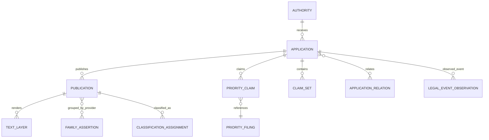

# Patent Identity, Dates, Families, and Classifications

## Why identity is a research control

Patent research fails when a convenient display identifier becomes a universal key. Applications can have multiple publications and kind codes; publications can be corrected or republished; one priority chain can produce related applications with different claims; family providers use different definitions; classifications change; and “status” belongs to a jurisdictional right at an observation time, not to a technical idea.

The system must preserve the provider’s record first, then build explicit typed relations. It never collapses records because titles, applicants, embeddings, or family IDs look similar.

## Core entity model



Separate entity IDs from display numbers:

```yaml
publication_identity:
  entity_id: pub:sha256:...
  authority_code: EP
  publication_number_canonical: "1234567"
  kind_code: A1
  display_number: EP 1 234 567 A1
  source_observation_ids: [obs:epo:...]
  parser_version: publication-id.v3
  confidence: exact_structured_field
  unresolved_candidates: []
```

The canonical parser preserves the original token and rejects ambiguity. It does not invent leading zeroes, kind codes, or office codes.

## Canonical identity, version, and time semantics

The evidence model uses immutable record identity plus explicit versions/relations. A convenient provider row or UI card is never the canonical object.

| Object | Stable identity | Version/date semantics that must be stored | Forbidden collapse |
|---|---|---|---|
| Application | Authority plus office-defined application identifier, retaining raw and canonical forms | Filing date assertion(s), application type, office procedure observations, relation versions | Publication number, grant number, family, or current right |
| Publication | Authority + publication number + kind/edition when supplied; unresolved kind remains unresolved | Publication date assertion, correction/republication relation, language, source observation | Application filing, grant/right, or an unversioned “patent” |
| Grant publication and jurisdictional right | Grant publication identity is a publication; right identity is authority/jurisdiction/right identifier | Grant/issue event and date are observations; right state is reconstructed only as a source-scoped projection at an observation cut | Grant document, live right, enforceability, and expiry |
| Priority claim | Claimant application + referenced filing + source assertion | Claimed date/number/authority, observed time, verification and correction state | “Earliest priority” as automatically valid/effective priority |
| Family assertion | Provider + provider family ID/definition + dataset snapshot | Complete member assertion at snapshot, provider algorithm/definition version where exposed | Same invention, identical disclosure/claims, shared status, or universal family ID |
| Claim set, claim, and research element | Publication/application text edition + language + artifact hash + structure coordinate; element additionally pins decomposition version | Exact source text, dependency graph, correction/supersession, parser and reviewer version | Claim across family members; normalized paraphrase as source wording; element as legal construction |
| IPC/CPC assignment | Subject publication/application + scheme + edition + symbol + assignment source/level | Assignment/observation date, direct/family-propagated/applicant/examiner/predicted level, correction | Timeless class meaning or office assignment when model-predicted/propagated |
| Citation | Citing object + cited raw identifier/NPL reference + source record and category | Citing procedure/document, target claims/passages if supplied, observation and correction time | Technical relevance, prior-art eligibility, or agent-assigned office category |
| Applicant, assignee, inventor, owner assertion | Source record + raw name + source role + subject | Address/role/date as permitted, normalizer version, candidate entity and review state | Applicant with assignee/current owner; inventor with applicant; normalized entity with legal ownership |
| Jurisdictional application/right | Authority/jurisdiction + verified application/right identity | Event stream and observation cut; regional, unitary, validated, national-phase and national rights remain linked but separate | WO or EP record as one global/national status |
| Legal event and status projection | Event observation ID; projection ID pins subject, source, mapper/projector and event cut | Effective, publication/entry, observation and snapshot dates are distinct | Raw event with legal effect; source projection with enforceability/expiry/ownership |
| Observation and evidence snapshot | Observation ID + response artifact hash; snapshot ID + provider/dataset edition and manifest hash | Request/observed/captured times, coverage and rights snapshots, parser input revision | Today’s mutable provider view with historical evidence |
| Matter, research case, and run | Matter is the access/retention/ethical-wall boundary; case is one versioned question; run is one execution | Authority/protocol versions, actor/tenant, created/closed times, graph revisions | Conversation/session with matter authority; new protocol with same case version |
| Query and result set | Query ID pins normalized expression, branch, provider operation, fields/analyzers/classification/translation versions; execution has its own operation ID | Temporal cutoff, corpus/index/source snapshot, sent/observed times, cursor/pages, result manifest hash, error/degradation | Query text with execution; zero results with failed/uncovered branch; rerun with original result set |
| Decision and approval | Decision/approval ID + subject type/ID/version/hash + actor role | Recorded/effective/expiry time, policy version, rationale code, supersession/invalidation | Approval for one graph/package/protocol reused after dependency change |
| External effect | Effect ID + idempotent operation ID + destination + payload/package hash | Attempt times, authorization, pending/unknown/committed/reconciled state, remote receipt | Intent/attempt with committed write; export with filing/docket/legal effect |
| Correction | New immutable correction/supersession record linking old and new records | Detected/decided/effective times, source/reason/actor, impacted dependencies and remediation decision | In-place historical rewrite or silent model “self-correction” |

`created_at` means when this system created a record; `observed_at` means when it saw a source; neither substitutes for a provider-reported event, filing, publication, grant, or effective date. Every package pins the record revisions that were visible to it.

## Number and kind-code rules

Use WIPO standards as exchange guidance, then honor office-specific implementation:

- ST.3 defines two-letter codes for offices/organizations.
- ST.6 concerns numbering of published patent documents.
- ST.13 concerns application-number formats.
- ST.16 provides recommended kind codes, but digits and exact meanings can be office-specific.
- ST.9 identifies bibliographic data elements.

The current WIPO standards index and versions are the reference point, not copied constants in prompts ([WIPO Standards — Part 3](https://www.wipo.int/en/web/standards/part_03_standards)). ST.16 explicitly requires interpreting the kind code with the ST.3 office code and reserves certain digits for corrections ([WIPO ST.16](https://www.wipo.int/documents/d/standards/docs-en-03-16-01.pdf)).

Therefore:

1. parse `office + number + kind` into separate fields;
2. store the exact source string;
3. resolve meaning through an editioned office/kind-code table;
4. keep a publication without a kind code distinct from one with an inferred kind code;
5. model corrections/republished documents as relations, not silent replacements;
6. never use a publication number as an application ID.

## Dates are typed facts, not one timeline

At minimum distinguish:

| Field | Object | Meaning | Research use |
|---|---|---|---|
| `priority_filing_date` | Priority filing | Date reported for a claimed priority | Navigate priority chain; counsel decides entitlement/effect |
| `application_filing_date` | Application | Filing date reported by authority | Identity and chronology |
| `publication_date` | Publication | Date this publication became available according to source | Candidate temporal filter, subject to verification |
| `international_filing_date` | PCT application | PCT filing date | PCT chronology |
| `national_phase_date` | National application/event | Office-reported national-phase event date | Jurisdictional chronology, not global existence proof |
| `grant_date` | Right/publication/event | Office-reported grant date | Status history input |
| `legal_event_effective_date` | Event | Provider-reported effective date | Projection input; may differ from publication/entry date |
| `event_publication_date` | Event notice | Date event was published | Availability/audit chronology |
| `source_observed_at` | Observation | When the system saw the record | Temporal reproducibility and staleness |
| `corpus_snapshot_at` | Dataset | Snapshot boundary | Reproduce search/evaluation |
| `review_as_of` | Package | Reviewer’s chosen cut | Scope statement, never substituted for source dates |

Never map these to a single `date`. Preserve date precision (`YYYY`, `YYYY-MM`, full date), calendar, timezone where applicable, raw value, and source. An impossible or ambiguous date is a conflict, not `null` plus guess.

### Date assertion schema

```yaml
date_assertion:
  fact_id: fact:date:4f...
  subject_id: pub:ep:1234567:a1
  date_type: publication_date
  value: 2023-04-12
  precision: day
  asserted_by_source: EPO
  observation_id: obs:epo:9a...
  observed_at: 2026-08-31T09:20:11Z
  jurisdiction: EP
  normalization: exact_structured_field
  supersedes: null
  conflict_set_id: null
```

### Relevant-date boundary

The agent accepts an accountable reviewer’s date theory as a typed **research filter**. It does not derive which law applies or whether priority is valid. WIPO’s PCT International Search and Preliminary Examination Guidelines show why: the relevant date and treatment of priority can depend on the task and facts, and doubts may require citation with a special category rather than silent exclusion ([PCT ISPE 6.01–6.05](https://www.wipo.int/en/web/pct-system/texts/ispe/6_01_05), [PCT ISPE 15.63–15.72](https://www.wipo.int/en/web/pct-system/texts/ispe/15_63_72)).

```yaml
temporal_eligibility:
  candidate_publication_id: pub:...
  protocol_id: protocol:v7
  filter_type: publication_available_before
  boundary: 2024-03-18
  result: uncertain
  reasons:
    - publication_date_conflict
  legal_relevance: not_determined
  reviewer_required: true
```

## Priority relations

A priority claim is an assertion observed in a source. It has claimant application, referenced filing, claimed date, country/office, number, source, and current verification state. Do not convert “earliest listed priority” into a universally effective priority date.

```yaml
priority_claim:
  relation_id: rel:priority:...
  claimant_application_id: app:ep:...
  referenced_filing:
    authority_code: US
    application_number_raw: "..."
    filing_date_reported: 2021-02-03
  assertion_source: EPO-bibliographic
  observed_at: 2026-08-31T09:20:11Z
  verification: source_reported_unadjudicated
  notes: No conclusion about entitlement or effective priority
```

WIPO ST.92 defines an exchange package for priority documents and metadata; it can guide interoperability but does not make every office implementation or legal consequence uniform ([WIPO standards index](https://www.wipo.int/en/web/standards/part_03_standards)).

## Family relations

Family is a provider-defined grouping for discovery and navigation.

| Relation | Typical basis | Useful for | Not evidence of |
|---|---|---|---|
| DOCDB/simple family | Same priority or combination under provider rules | Deduplication, language/member navigation | Identical claims, identical disclosure, same legal status |
| INPADOC/extended family | Direct/indirect priority links | Broad related-application discovery | One invention, one right, same scope |
| Domestic continuation/divisional relation | Office procedural relation | Claim-history and related-application navigation | Same claims or same relevant dates |
| PCT/national-phase relation | International-to-national relation | Jurisdictional navigation | National entry in every designated state |
| Model-suggested relatedness | Text/citation/entity similarity | Candidate discovery | Family membership or legal relationship |

EPO explains that simple and extended families use different priority-based definitions ([EPO patent families](https://www.epo.org/en/searching-for-patents/helpful-resources/first-time-here/patent-families)). Its guidance also cautions that corresponding family documents may contain relevant subject matter absent from another member, and family members can have materially different claims ([EPO Guidelines B-X 9.1.2](https://www.epo.org/en/legal/guidelines-epc/2026/b_x_9_1_2.html), [Espacenet resource book](https://link.epo.org/web/espacenet_resourcebook_v3.0_en.pdf)).

Store family assertions by provider and version:

```yaml
family_assertion:
  assertion_id: famassert:docdb:...
  provider: EPO-DOCDB
  provider_definition: simple_family_same_priority_combination
  provider_family_id: "..."
  members: [pub:ep:..., pub:wo:...]
  dataset_snapshot: docdb-2026-08-15
  observed_at: 2026-08-31T09:20:11Z
  derived_use: navigation_and_evaluation_partitioning
  prohibited_inference: claim_identity
```

When providers disagree, retain both assertions. For evaluation leakage control, use the broadest known relation graph plus text-near-duplicate detection to keep related members out of different splits.

## Application relations

Represent continuations, divisionals, continuations-in-part, reissues, supplementary protection, regional/national phases, and office-specific relations only when asserted by a recognized source. The relation type includes `authority`, `source_term`, `normalized_relation`, `observed_at`, and `verification` because superficially similar terms may have jurisdiction-specific meaning.

No model may create a verified procedural relation from title/text similarity.

## Classification assignments

An assignment has four identities:

1. symbol;
2. scheme and edition;
3. assignment source and date/snapshot;
4. assignment level—document, family-propagated, examiner, applicant, machine-predicted, or unknown.

```yaml
classification_assignment:
  assignment_id: class:...
  subject_id: pub:ep:1234567:a1
  scheme: CPC
  scheme_edition: 2026.08
  symbol: H04L67/00
  source: EPO-DOCDB
  assignment_level: family_propagated
  assignment_date: null
  observed_at: 2026-08-31T09:20:11Z
  predicted: false
```

Espacenet notes that some CPC classifications are propagated across families and that historical searchable text may be OCR-derived ([Espacenet release notes](https://www.epo.org/en/searching-for-patents/technical/espacenet/release-notes)). The system must therefore not present a propagated symbol as if assigned directly by an examiner to every publication.

Machine-predicted classifications live in `similarity_hypothesis`, never beside authoritative assignments without a clear `predicted` type. They can expand a search but cannot overwrite office/provider classifications.

## Classification-aware query expansion

Pin the scheme edition and expansion operation:

```yaml
classification_expansion:
  seed_symbol: H04L67/00
  scheme: CPC
  edition: 2026.08
  operations:
    - include_descendants_depth: 2
    - include_concordant_ipc: true
  source_files:
    - uri: artifact://reference/cpc-2026-08-scheme
      sha256: ...
    - uri: artifact://reference/cpc-2026-08-concordance
      sha256: ...
  emitted_symbols: [...]
```

Avoid unconditional ancestor expansion: high-level classes can explode recall and cost. Use definitions and neighboring groups during interactive review. Record excluded symbols and why.

## Text and claim-set identity

The same publication can have multiple representations. Store:

- publication edition/kind;
- language;
- source artifact hash;
- text layer (`native_xml`, `embedded_pdf`, `ocr`, `machine_translation`, `human_translation`);
- structure coordinates and parser version;
- claim-set version and individual claim source offsets;
- correction/supersession relation.

A claim hash alone is not an identity if whitespace/normalization differs. Use source artifact + structure coordinate + normalized hash. Preserve dependencies and claim references as extracted syntax, subject to reviewer correction.

## Entity-name normalization

Applicants, assignees, inventors, agents, and owners are source facts plus derived entity-resolution hypotheses. Name normalization helps retrieval but must remain reversible. USPTO PatentsView has publicly documented a data-quality correction in its derived disambiguation data, illustrating that normalized entities can change ([PatentsView data-quality notice](https://patentsview.org/data-in-action/patentsview-team-identifies-data-quality-error-q1-2025-data-update)).

Store raw name, address as permitted, source role, source date, normalizer version, candidate entity, confidence, and review status. Never treat a current assignee field as a complete ownership conclusion.

## Contradiction examples

| Conflict | Preserve | Do not do | Review path |
|---|---|---|---|
| Publication date differs across bulk snapshot and current register | Both date assertions, observation times, coverage, correction relation | Pick the newest value silently | Direct office publication record check |
| Aggregate shows family member absent from national register search | Family assertion and national `not_observed` result | Conclude no national application | Verify identifier format/coverage; consult national source |
| CPC assignment changes after scheme update | Both assignments and editions | Rewrite old search history | Re-run only under a new protocol version |
| English claim differs between MT and human translation | Both layers and reviewer decision | Replace authoritative-language text | Bilingual review; mark dependent mappings stale |
| Two sources normalize applicant to different entities | Raw assertions and hypotheses | Merge entity IDs globally | Entity-resolution queue with reversible decision |

## Identity resolution algorithm

1. Parse without inference; retain raw token.
2. Identify authority and identifier type from explicit context.
3. Resolve candidates through approved structured sources.
4. Compare number, kind, application/publication relation, dates, title, and source coverage.
5. Emit one exact identity, multiple unresolved candidates, or `unresolved`.
6. Append typed relations; do not merge raw records.
7. Require review before unresolved identity is used in date filtering, family expansion, element mapping, or export.

## Review checklist

- [ ] Publication, application, priority, grant, and event identifiers are distinct.
- [ ] Kind codes are interpreted with the office and a versioned mapping.
- [ ] Every date has a type, precision, source, and observation time.
- [ ] The reviewer—not the agent—supplied the legal/research date theory.
- [ ] Priority claims are assertions, not automatically effective dates.
- [ ] Family assertions name provider, definition, and snapshot.
- [ ] Family membership is never described as claim identity or status identity.
- [ ] Classification assignments include scheme edition and assignment source/level.
- [ ] Machine-predicted classifications and entity matches remain hypotheses.
- [ ] Corrected publications and updated facts supersede rather than erase history.
- [ ] Unresolved identity/date conflicts block consequential mapping and export.
