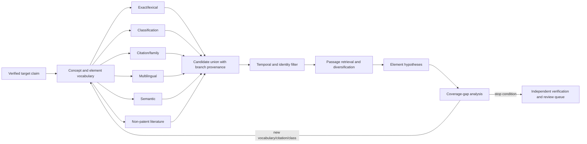

# Prior-Art Search and Retrieval Strategy

## Search objective

The agent retrieves **candidates for professional review**. It does not decide that a reference is prior art, anticipates a claim, renders it obvious, or proves a search complete. Those questions depend on law, date, jurisdiction, claim interpretation, evidence of availability, and professional judgment outside the agent boundary.

Patent language is deliberately broad, variable, multilingual, and historically inconsistent. A robust search therefore combines lexical, classification, citation, family, entity, semantic, and non-patent-literature branches. One embedding query is never a search protocol.

## Search protocol as a durable object

```yaml
search_protocol:
  protocol_id: protocol:target-001:v7
  objective: find_candidates_for_professional_prior_art_review
  target:
    claim_set_id: claimset:...
    claims: [1]
    authoritative_language: en
  counsel_supplied_scope:
    jurisdictions: [EP]
    publication_filter:
      type: available_before
      date: 2024-03-18
      uncertain_dates: retain_for_review
  sources:
    patent_snapshots: [docdb-2026-08-15]
    live_verification: [epo-register]
    non_patent: [approved-index-A]
  query_branches:
    - exact_claim_phrases
    - concept_synonyms
    - classification_neighborhood
    - citations_and_family_navigation
    - inventor_assignee_context
    - multilingual_variants
    - semantic_candidate_generation
    - non_patent_literature
  budgets:
    max_source_requests: 200
    max_candidates_for_passage_scan: 500
    max_candidates_for_human_review: 40
    max_rounds: 6
  stopping_policy: stop-policy.v3
  exclusions: [legal_determination, exhaustive_search_assertion]
  approved_by: reviewer:opaque-42
```

Changing a cutoff date, source, claim version, classification edition, query branch, or budget creates a new protocol version.

## Query provenance and temporal replay

Store a logical query separately from each provider/index execution. This preserves intent when syntax, analyzers, coverage, or data change.

```yaml
query_execution:
  query_id: query:44
  query_version: 3
  branch: exact_and_proximity
  derived_from:
    element_ids: [element:claim1:E3]
    vocabulary_decision_ids: [decision:term:12, decision:term:19]
  logical_expression:
    concepts: [controller, successive_samples, drift_threshold]
    required_relations: [controller_determines_drift]
  compiled_request:
    provider_operation: internal.lexical.search
    expression: 'claims:(controller NEAR/8 "successive samples")'
    fields: [claims, description]
    analyzer_version: patent-lexical-en.v6
    classification_edition: CPC-2026.08
    normalized_request_sha256: "..."
  temporal_scope:
    candidate_publication_filter: before_or_uncertain:2024-03-18
    corpus_snapshot: patent-corpus-2026-08-15
    metadata_visible_through: 2026-08-15T00:00:00Z
  execution:
    operation_id: op:query:44:attempt:1
    started_at: 2026-08-31T09:45:00Z
    completed_at: 2026-08-31T09:45:02Z
    pages_or_cursor_refs: [artifact:query-page:1]
    raw_result_manifest_sha256: "..."
    total_reported_by_provider: 184
    total_captured: 184
    completion_state: complete
    warnings: []
```

Preserve the provider’s compiled syntax, request/response artifacts, cursor/range, reported approximate count, every page hash, rank/score as returned, and acquisition order. A replay uses the pinned snapshot and analyzer; the same logical query against current data is a refresh and receives a new execution. If a UI only exposes approximate counts or suppresses family members, record that behavior and do not claim an exact result universe.

## Search pipeline



The controller may parallelize independent branches, but it commits each query, result snapshot, and error independently. A branch failure cannot be converted into “zero results.”

## Step 1 — establish the target

Before generating queries:

- resolve the exact publication/application and claim-set version;
- preserve the authoritative-language claim and approved translations;
- resolve dependencies for the selected claim without flattening away source structure;
- obtain the reviewer-supplied date filter and jurisdiction scope;
- classify confidentiality and source eligibility;
- identify technical domains, units, symbols, named standards, and terms likely to be generic boilerplate;
- record what is intentionally excluded.

Claims should be read with the description and drawings for search understanding, but the agent must not make a binding claim construction. WIPO’s PCT search guidance likewise describes interpreting claims in light of the description and drawings and searching the claims as filed ([PCT ISPE 5.20–5.28](https://www.wipo.int/en/web/pct-system/texts/ispe/5_20_28), [PCT ISPE 15.21–15.28](https://www.wipo.int/en/web/pct-system/texts/ispe/15_21_28)).

## Step 2 — build a vocabulary graph

For each review element, keep distinct lists:

| Vocabulary class | Examples | Source |
|---|---|---|
| Exact source phrase | Quoted phrase from claim | Claim offsets |
| Structural variant | Reordered or dependency-expanded wording | Deterministic transformer |
| Technical synonym | Domain synonym/older terminology | Reviewer, thesaurus, seed documents |
| Functional expression | What a component/process does | Provisional model proposal |
| Abbreviation/full form | Acronym expansion | Source or verified glossary |
| Translation variant | Language-specific term | Approved translation/reviewer |
| Classification term | IPC/CPC definition and notes | Editioned official scheme |
| Discovered term | Phrase from a verified high-value candidate | Candidate passage citation |
| Excluded ambiguity | Same words, wrong technical meaning | Reviewer decision |

Every proposed synonym has provenance and status (`proposed`, `accepted`, `rejected`, `domain_limited`). The model must not quietly promote a broad functional paraphrase into an equivalent claim term.

## Step 3 — execute complementary branches

### Exact and lexical retrieval

Use phrase, proximity, fielded, stemmed, spelling, identifier, and Boolean searches. Search titles/abstracts for precision, claims for legal-style wording, and descriptions for disclosure detail. USPTO Patent Public Search exposes fielded indexes including claims and supports advanced operators; it reports Boolean retrieval followed by TF-IDF-style ranking rather than semantic search ([searchable indexes](https://www.uspto.gov/patents/search/patent-public-search/searchable-indexes), [FAQs](https://www.uspto.gov/patents/search/patent-public-search/faqs), [operators](https://www.uspto.gov/patents/search/patent-public-search/operators)).

BM25 remains a strong transparent baseline for exact technical language and rare terms ([Robertson and Zaragoza, *The Probabilistic Relevance Framework: BM25 and Beyond*](https://www.staff.city.ac.uk/~sbrp622/papers/foundations_bm25_review.pdf)). Log analyzer/tokenizer version, fields, boosts, stopwords, stemming, and query syntax because they change results.

### Classification retrieval

Use reviewer-approved IPC/CPC seeds, definitions, neighboring groups, descendants to a bounded depth, and versioned concordances. Combine classification with discriminating terms rather than hard-filtering too early. A wrong or historical classification can otherwise eliminate relevant candidates.

Classification is both a search branch and a diagnostic: if high-value candidates repeatedly appear outside the initial class neighborhood, revise the class hypothesis and record why.

### Citation and family navigation

Traverse backward/forward patent citations, examiner/applicant citation metadata when available, non-patent citations, cited passages/categories, and related applications. WIPO ST.14 standardizes citation identification and categories such as X, Y, A, and L, but those are source annotations, not the agent’s legal conclusions ([WIPO ST.14](https://www.wipo.int/documents/d/standards/docs-en-tracked-changes-03-14-01_changes_2016.pdf)).

Do not restrict the result to a single family member. A member in another language or jurisdiction may contain a useful passage or a different claim set. Keep discovery relation, publication identity, and actual cited passage separate.

### Inventor, applicant, and assignee context

Use normalized entities to discover technical neighborhoods, continuation chains, earlier employer work, and portfolio vocabulary. Treat disambiguation as a hypothesis and avoid relevance boosts that merely reproduce a known assignee. Entity search is an expansion path, not evidence that a candidate discloses an element.

### Multilingual retrieval

Generate language-specific terminology through approved translation, classification definitions, bilingual seed documents, and cross-lingual retrieval. Search original-language text when possible. WIPO PATENTSCOPE offers a cross-lingual information retrieval interface across multiple languages, illustrating supervised concept/variant selection, but its public terms constrain automation ([PATENTSCOPE CLIR](https://patentscope.wipo.int/search/en/clir/clir.jsf), [PATENTSCOPE terms](https://www.wipo.int/en/web/patentscope/data/terms_patentscope)).

Translation variants retain direction and engine. A hit in machine-translated text must cite the original-language location and be reviewed when consequential.

### Semantic candidate generation

Use embeddings or late-interaction/sparse-neural retrieval to find paraphrases and terminology shifts. Useful reference architectures include Sentence-BERT for sentence embeddings, SPLADE for learned sparse retrieval, and ColBERT for token-level late interaction ([Sentence-BERT](https://aclanthology.org/D19-1410/), [SPLADE v2](https://arxiv.org/abs/2109.10086), [ColBERT](https://arxiv.org/abs/2004.12832)).

Production rule: semantic retrieval may **generate or rank candidates**. It may not label a claim element covered, a document anticipatory, or a search sufficient. Store vector model/version, text layer, chunk coordinates, query representation, corpus snapshot, raw score, rank, calibration bucket, and lexical/classification corroboration.

### Non-patent literature

Search papers, standards, manuals, theses, catalogs, archived pages, code, videos, and product material through rights-approved sources. Use identifiers, citations, authors, organizations, terminology, and dates found in patent documents to seed NPL branches.

NPL requires a stronger availability record: bibliographic source, edition/version, publication or public-availability evidence, archived capture where lawful, acquisition time, content hash, and rights. A date printed in a PDF is not automatically proof of public availability. The agent records the evidence and uncertainty; counsel decides legal relevance.

## Step 4 — candidate union and filtering

Do not let the highest-scoring branch erase provenance. Each candidate keeps a route list:

```yaml
candidate:
  candidate_id: cand:0d...
  document_id: pub:ep:...
  discovered_by:
    - branch: exact_claim_phrases
      query_id: query:18
      rank: 4
      score: 17.22
    - branch: classification_neighborhood
      query_id: query:31
      rank: 19
      score: 8.01
  identity_state: verified
  temporal_eligibility: eligible
  family_relation_to_target: none_observed
  passage_scan_state: pending
```

Apply hard filters only for policy, source rights, exact duplicates, verified temporal exclusion under the approved research rule, and corrupt/unavailable artifacts. Use soft ranking for technical relevance. Retain uncertain dates in a separate review lane rather than discarding them.

Deduplicate exact publication artifacts but diversify review across family, classification, time, language, assignee, and branch. A review queue filled with family members can inflate apparent recall and waste professional attention.

### Family deduplication and coverage bias

Use two layers rather than deleting family members:

1. **Evidence layer:** retain every publication/edition and its actual passage, dates, text layer, routes, and source observations.
2. **Review projection:** group by a declared provider family assertion or broader leakage component, choose a representative for queue diversity, and expose every suppressed member plus selection reason.

```yaml
review_group:
  group_id: review-group:...
  grouping_rule: epo_docdb_simple_family_at_snapshot
  family_assertion_id: famassert:docdb:...
  representative: pub:de:...:a1
  selection_reason: authoritative_language_and_best_native_text
  other_members: [pub:wo:...:a1, pub:ep:...:a1]
  member_level_evidence_preserved: true
```

Never deduplicate NPL into a patent family or merge continuations/divisionals merely because text is similar. Exact-byte, normalized-text, provider-family, procedural-relation, and near-duplicate groupings are separate relations.

Coverage bias is measured and disclosed by source/jurisdiction, publication era/kind, language, technical class, text layer, document section, applicant/assignee normalization quality, NPL type, and update lag. Search-branch contribution can otherwise hide a blind spot—for example, English machine translations can improve apparent recall while original-language old documents remain poorly OCRed. Sample direct-office records inside each material stratum, preserve branch failures, compare provider family/status fields to their declared semantics, and attach the measured gaps to the package. Sampling estimates observed error/coverage; it does not prove completeness.

## Step 5 — passage retrieval

Passage retrieval identifies exact locations worthy of element review. Rank native structured paragraphs/claims before OCR/translation when quality permits. Return enough surrounding context to understand references, definitions, negation, alternatives, figure labels, and dependent language.

```yaml
passage_candidate:
  passage_id: passage:...
  document_id: pub:...
  text_layer: native_xml
  language: de
  locator:
    section: description
    paragraph: "[0042]"
    page: 7
    character_offsets: [881, 1290]
  source_artifact_sha256: ...
  retrieval_routes:
    - method: lexical_bm25
      query_id: query:44
      rank: 2
    - method: semantic_late_interaction
      model: colbert-patent-v5
      rank: 5
  rendered_context_artifact: artifact://...
```

The UI must let a reviewer open the original page beside extracted text. Highlighting is a view; the source bytes and coordinates are the evidence.

## Step 6 — controlled query reformulation

The investigator may propose a new branch when it identifies a specific information gap:

```yaml
branch_proposal:
  proposal_id: proposal:...
  gap: element-E4 has no reviewed candidate passages
  basis:
    - accepted_candidate passage:...
    - official_class_definition classdef:...
  proposed_queries:
    - fields: [claims, description]
      expression: "..."
  expected_value: high
  expected_cost:
    source_requests: 2
    candidate_scans: 50
  policy_check: pending
```

The controller validates fields, syntax, sources, data class, cutoff filters, and budget. Avoid recursive “search more” instructions with no stated gap or novelty test.

## Stop policy

No system can prove no relevant document exists. Stop means the approved protocol has reached a bounded research condition.

Stop when any mandatory limit is reached or when all of these hold:

- required branches were attempted or explicitly unavailable;
- each element has reviewed candidate evidence or a documented gap;
- recent rounds add no materially new high-value vocabulary, classification, citation neighborhood, or candidate family;
- uncertain identity/date/translation/status items are queued or accepted as limitations;
- human review capacity is saturated;
- the accountable reviewer accepts the coverage statement.

```yaml
stop_decision:
  decision_id: stop:...
  protocol_id: protocol:target-001:v7
  reason: saturation_plus_review_budget
  metrics:
    rounds: 5
    new_review_worthy_candidates_last_two_rounds: 0
    required_branches_attempted: 8
    unavailable_branches: [licensed-standard-fulltext]
  unresolved_gaps: [element-E4 multilingual NPL coverage]
  decided_by: deterministic_stop_policy.v3
  reviewer_acceptance: pending
```

## Retrieval evaluation

### Offline metrics

Report multiple views:

- recall at review budget (`Recall@40`, `Recall@100`);
- precision at the professional-review budget;
- mean/median first relevant rank and success@k;
- nDCG or graded relevance where adjudication supports grades;
- family-diverse recall and unique-family precision;
- passage recall/precision and exact-locator correctness;
- branch contribution and ablation;
- temporal eligibility error rate;
- cost and latency per verified candidate;
- reviewer minutes per accepted candidate;
- empty-result false reassurance and abstention rate.

Classic NTCIR patent tasks used claims as topics and examiner/professional relevance judgments; CLEF-IP used prosecution citations and historical EPO collections ([NTCIR-5 collection](https://research.nii.ac.jp/ntcir/permission/ntcir-5/perm-en-PATENT.html), [CLEF-IP 2010 collection](https://researchdata.tuwien.at/records/jqrsc-jbq51)). These are valuable fixtures but have label bias, age, language, coverage, and licensing limits. A citation is not a complete relevance set, and family expansion can reward systems that discover related members rather than technically independent evidence.

### Leakage controls

- split all known extended families and near-duplicates together;
- use publication-time cutoffs so the retrieval/index snapshot predates the target evaluation point;
- remove target citations, later prosecution signals, and derived fields unavailable at the simulated search time;
- isolate query templates and reviewer notes derived from test cases;
- document overlap between model pretraining and public patents as an uncontrolled risk;
- maintain private, newly adjudicated cases and rotate only through governed releases;
- do not tune on the final holdout after reviewing failures.

### Online quality

Production labels come from reviewer actions: accepted/rejected passages, missed candidates added by humans, corrected identities/dates, branch usefulness, and stated sufficiency within the protocol. These labels need sampling and adjudication because reviewer behavior is not automatically ground truth.

## Anti-patterns

| Anti-pattern | Why it fails | Replacement |
|---|---|---|
| “Embed the claim and take top 20” | Misses exact/legal language and treats similarity as coverage | Hybrid branches plus passage/element review |
| Search only title and abstract | High precision but incomplete disclosure coverage | Fielded retrieval across claims and description |
| Expand to all family members and count them as hits | Inflates metrics and review burden | Family-aware grouping and diverse ranking |
| Use current metadata in historical evaluation | Leaks future classifications/citations/status | Time-appropriate corpus snapshot |
| Drop post-cutoff and uncertain records by model guess | Hides date uncertainty | Typed deterministic filter and review lane |
| Treat examiner citations as exhaustive labels | Produces optimistic, biased evaluation | Additional adjudication and private cases |
| Search public sites with confidential claim drafts | Can disclose sensitive material and violate terms | Approved private corpus/processors |
| Claim completeness after budget ends | Misstates bounded work | Coverage statement with attempted/unavailable branches |

## Search review checklist

- [ ] Target publication, claim set, language, jurisdiction, and research cutoff are verified.
- [ ] Protocol and every query are versioned and reproducible.
- [ ] Lexical, classification, citation/family, multilingual, semantic, and NPL branches are considered.
- [ ] Branch failures are errors or gaps, never zero-result facts.
- [ ] Semantic scores are candidate signals only.
- [ ] Candidate passages resolve to original bytes and exact coordinates.
- [ ] Original-language text accompanies consequential translations.
- [ ] Families are grouped for diversity but members remain distinct.
- [ ] Stopping follows budget/saturation/coverage rules and reviewer acceptance.
- [ ] The package describes sources, dates, limitations, unavailable branches, and non-exhaustiveness.
