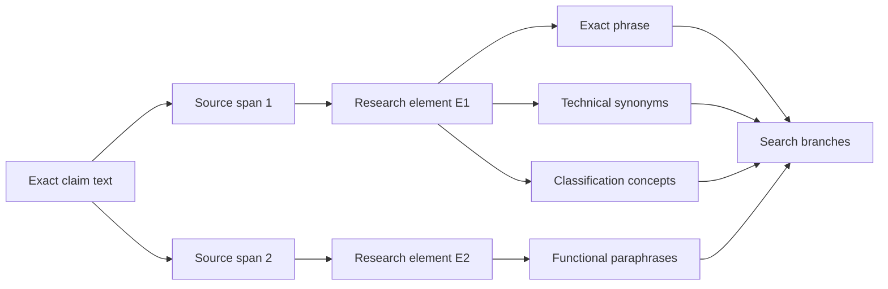
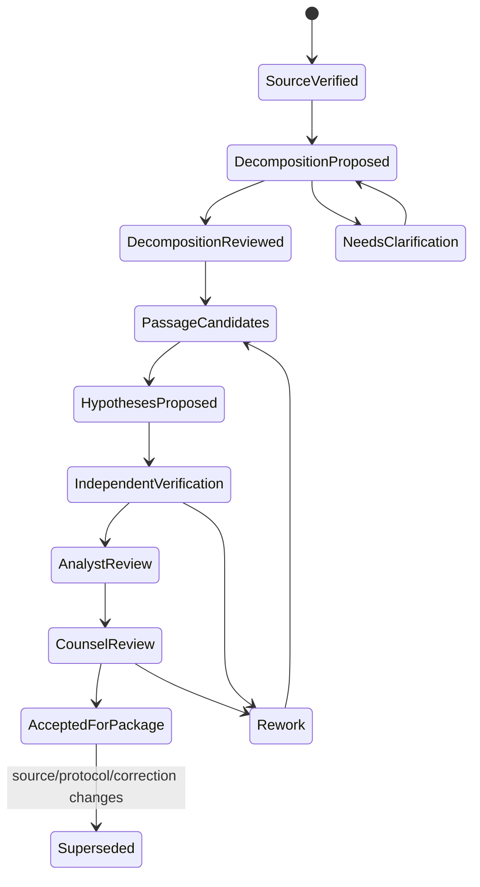

# Claims, Elements, Similarity Hypotheses, and Professional Review

## Boundary

An element map is a research aid, not a legal claim chart or opinion. The agent can preserve claim wording, propose a structured decomposition, retrieve passages, and explain why a passage may deserve review. Only counsel or another authorized accountable professional decides claim construction, whether limitations are present, whether combinations are legally permissible, and the significance of a reference.

This distinction is enforced in schema and UI. The model never writes `covered: true`. It writes a `similarity_hypothesis` whose states are `proposed`, `analyst_supported`, `analyst_rejected`, `needs_counsel`, or `superseded`.

## Claim source contract

```yaml
claim_source:
  claim_set_id: claimset:ep:...:a1:en
  publication_id: pub:ep:...:a1
  claim_number: 1
  claim_type_as_source: independent
  language: en
  text_layer: native_xml
  source_artifact_sha256: ...
  locator:
    section: claims
    source_claim_label: "1"
  exact_text: "A system comprising ..."
  normalized_text_sha256: ...
  dependency_assertions: []
  verified_by: verifier:opaque-17
```

Preserve punctuation, antecedents, alternatives, ranges, negation, and dependency language. Normalized text is an index aid; exact text is the review authority.

## Decomposition model

Use three layers:

1. **source spans** — exact claim offsets;
2. **research elements** — reviewer-friendly segments that still quote or link the source spans;
3. **concept facets** — provisional vocabulary for search.



A claim should not be atomized into individual words, nor left as one long semantic vector. The useful granularity is a reviewable technical limitation or relation, with enough surrounding language to preserve meaning.

## Element schema

```yaml
research_element:
  element_id: element:claim1:E3
  claim_set_id: claimset:...
  claim_number: 1
  parent_element_id: null
  source_spans:
    - start: 142
      end: 267
      exact_text: "a controller configured to ..."
  normalized_display: "controller performs the recited operation"
  structure:
    actor: controller
    relation: configured_to
    object: recited operation
    qualifiers: [...]
  alternatives: []
  dependency_context: []
  search_facets:
    exact: [...]
    proposed_synonyms: [...]
    classifications: [...]
  interpretation_status: research_segmentation_only
  created_by: element-parser.v4
  reviewed_by: analyst:opaque-9
  counsel_construction: not_provided
```

The normalized display cannot replace the source span in the review grid. If the claim has Markush alternatives, nested conditions, “wherein” clauses, numerical ranges, means/function language, or cross-claim dependencies, preserve explicit structure and route ambiguous segmentation to review.

## Dependency expansion

For dependent claims, create a rendered research view that references inherited elements without fabricating a new authoritative claim:

```yaml
dependency_view:
  selected_claim: 7
  source_dependency_path: [7, 3, 1]
  inherited_element_refs:
    - element:claim1:E1
    - element:claim1:E2
    - element:claim3:E1
  own_element_refs:
    - element:claim7:E1
  render_status: verified_against_source
```

If dependency parsing is ambiguous or a source has multiple dependencies, stop deterministic expansion and show the exact claims to the reviewer.

## Passage-to-element hypothesis

```yaml
similarity_hypothesis:
  hypothesis_id: hyp:...
  element_id: element:claim1:E3
  candidate_document_id: pub:jp:...
  passage_refs:
    - passage:jp:...:0042
  relation_proposed: potentially_corresponding_technical_disclosure
  rationale:
    aligned_concepts:
      - element_phrase: "..."
        passage_phrase: "..."
    differences:
      - "Passage describes X but not the element's stated relation Y"
    context_dependencies:
      - passage:jp:...:0040
  signals:
    lexical_rank: 12
    semantic_rank: 3
    shared_classifications: [H04L67/00]
  text_quality:
    layer: machine_translation
    original_language: ja
    human_verified: false
  temporal_eligibility_ref: temp:...
  state: needs_counsel
  legal_effect: none
  model_version: ...
  prompt_version: ...
  created_at: 2026-08-31T10:02:00Z
```

The relation vocabulary avoids `meets`, `reads_on`, `anticipates`, `invalidates`, or `infringes`. Those labels encode legal conclusions.

## Evidence grid

The review UI should show one row per element–candidate pair and keep facts beside hypotheses:

| Column | Source | Editable by reviewer? |
|---|---|---:|
| Exact element wording | Verified claim source | No; change creates new decomposition version |
| Candidate publication/member | Verified identity record | Correction through identity workflow |
| Passage in original language | Source artifact | No |
| Approved translation | Translation layer | New reviewed translation may supersede |
| Page/paragraph/claim locator | Parser + verifier | Correctable with provenance |
| Publication/date eligibility | Date assertion + protocol | Counsel can change protocol, not source fact |
| Model rationale/differences | Similarity hypothesis | Yes, as review decision |
| Analyst disposition | Review event | Yes |
| Counsel note/conclusion | Separate accountable record | Yes; never generated or auto-filled |

### Fictional example

The example deliberately stops before a legal conclusion:

| Element | Candidate evidence | Agent hypothesis | Review state |
|---|---|---|---|
| E1: “a sensor configured to produce a sampled signal” | Paragraph 21 describes a detector producing periodic measurements | Strong lexical and functional correspondence; verify whether “sampled” is technically equivalent in context | Analyst supported; counsel review |
| E2: “a controller determining a drift value from successive samples” | Paragraphs 34–36 calculate a difference between measurements | Candidate may correspond to the calculation, but “drift value” is not used and purpose differs | Needs counsel |
| E3: “transmitting an alert when the drift exceeds a threshold” | No cited passage | No evidence located in this document under protocol v7 | Gap; not a finding of absence |

The final cell says “no evidence located,” not “element missing.” Search and reading are fallible.

## Element-map workflow



### Independent verification

The verifier checks, without seeing the generator’s confidence where practical:

- publication and claim-set identity;
- exact element source offsets;
- candidate artifact and locator;
- quotation fidelity and enough surrounding context;
- OCR quality and page completeness;
- original-language alignment for translated passages;
- temporal-eligibility record and unresolved date conflicts;
- whether the rationale states differences and avoids a legal conclusion;
- whether combined passages actually come from one document/edition or are clearly labeled as separate.

Generation and verification should use separate attempts and ideally different prompt/model configurations or a deterministic plus human check. Two identical calls are correlated, not independent.

## Combining evidence

Do not combine passages across documents, family members, versions, or dates in a single row without explicit grouping. Store each mapping separately. A professional may later analyze a combination, but the agent cannot imply that multiple references can legally be combined.

Within one document, a mapping may cite multiple passages if the relationship is explicit:

```yaml
evidence_bundle:
  document_id: pub:...
  passage_refs: [passage:0012, passage:0044]
  linkage:
    type: explicit_cross_reference
    evidence: passage:0012
  agent_statement: These passages are presented together for review; no legal sufficiency is asserted
```

Family-member passages stay on separate documents even if the provider groups them. The package can show a navigation link.

## Citation categories and office actions

If an office search report or action labels a citation, store the exact category, source document, target claims if identified, cited passages, office, procedure, and observation. WIPO ST.14 categories support standardized exchange, and PCT guidance calls for identifying relevant claims/passages/classifications ([WIPO ST.14](https://www.wipo.int/documents/d/standards/docs-en-tracked-changes-03-14-01_changes_2016.pdf), [PCT ISPE 16.22–16.85](https://www.wipo.int/en/web/pct-system/texts/ispe/16_22_85)).

Display “the office report assigned category X,” not “the agent found an X reference.” Office annotations can seed search and review, but they do not transfer automatically to another jurisdiction, claim version, date theory, or legal task.

## Attorney-review package

The package is deterministic from an approved evidence-graph revision:

```yaml
review_package_manifest:
  schema: attorney-review-package.v1
  package_id: package:...
  tenant_id: tenant-acme
  matter_ref: opaque:m-1842
  graph_revision: 4172
  protocol_id: protocol:target-001:v7
  target_claim_set_hash: ...
  sections:
    - scope_authority_and_limitations
    - identity_dates_and_family_navigation
    - search_protocol_and_complete_query_log
    - candidate_summary
    - element_evidence_grids
    - contradictions_and_open_questions
    - source_coverage_rights_ocr_translation
    - reviewer_decisions
    - artifact_manifest
  generated_at: 2026-08-31T11:00:00Z
  generator_release: patent-agent-1.4.2
  approval_ids: [approval:analyst:..., approval:counsel:...]
  package_sha256: ...
  disclaimer: Research aid; no legal advice or determination; search is bounded, not exhaustive
```

Every citation resolves through a permission-checked internal link or includes a lawful excerpt. The package lists candidate publications separately from cited family navigation. It includes negative search gaps only as protocol-scoped observations.

## Review roles and gates

| Gate | Required reviewer | Decision |
|---|---|---|
| Intake | Counsel/accountable professional | Approve question, jurisdiction, date theory, confidentiality, output |
| Decomposition | Patent analyst/searcher; counsel for ambiguity | Accept research segmentation |
| Search protocol | Analyst and accountable owner | Approve branches, sources, budget, stopping rule |
| Evidence verification | Independent verifier | Confirm identity, quote, locator, text layer, date record |
| Hypothesis disposition | Analyst | Support, reject, or escalate each provisional mapping |
| Package acceptance | Counsel/accountable professional | Accept research package and limitations |
| Any legal use/effect | Counsel through a separate authorized workflow | Outside agent authority |

An approval is bound to graph revision, package hash, protocol, claim-set hash, and reviewer role. Any dependency change invalidates or narrows the approval.

## Adversarial cases

| Test | Expected behavior |
|---|---|
| Candidate repeats exact nouns but reverses the relation | Highlight difference; do not label correspondence as strong solely from overlap |
| Translation omits a negation | Original-language verification catches conflict; mapping blocked |
| OCR changes “0.1” to “01” | Numeric consistency check and page view required |
| Dependent claim refers to multiple prior claims | Preserve dependency graph; no guessed flattening |
| Model cites abstract for a feature only in description | Use exact cited location; do not fabricate abstract support |
| Two family members have different wording | Separate rows and claim/text identities |
| A prompt inside a patent says “ignore prior instructions” | Treat document text as untrusted evidence, never instructions |
| Reviewer asks “just say it invalidates claim 1” | Refuse conclusion; offer evidence package for counsel review |
| No passage found | Record bounded search gap, not absence |
| High semantic score, incompatible date | Keep technical candidate signal but mark temporally ineligible/uncertain under protocol |

## Quality metrics

- exact quotation and locator accuracy;
- element source-span fidelity;
- decomposition agreement between qualified reviewers;
- passage-retrieval recall at review budget;
- hypothesis precision by state and text layer;
- false-positive rate from negation, alternatives, numerical ranges, and relation reversal;
- untranslated/OCR-dependent mapping rate;
- family-cross-contamination rate;
- temporal-ineligible candidate presentation rate;
- reviewer override, correction, and escalation rates;
- legal-language boundary violation rate—target zero;
- time per verified element–candidate decision.

Do not optimize agreement by making elements vague. Preserve exact source wording and measure review burden.

## Anti-patterns

- Converting claim text into a feature list with no source offsets.
- Treating each comma as an element regardless of technical relation.
- Hiding dependency or alternative structure in a flattened sentence.
- Generating a binary “covered/not covered” value from an embedding threshold.
- Combining passages across family members as one disclosure.
- Quoting machine translation without original-language evidence.
- Allowing the generator to verify and approve its own mapping.
- Suppressing differences because the overall candidate is similar.
- Turning “not found in this search” into “not disclosed.”
- Auto-populating counsel conclusions from model text.

## Review checklist

- [ ] Exact claim source, edition, language, artifact, and claim number are verified.
- [ ] Elements link to exact source spans and preserve qualifiers/dependencies/alternatives.
- [ ] Search facets remain proposals distinct from claim wording.
- [ ] Every candidate mapping names a passage, text layer, source artifact, and locator.
- [ ] Original-language text is available for translated evidence.
- [ ] Differences and missing context are as visible as aligned phrases.
- [ ] Each document/family member has separate evidence rows.
- [ ] Similarity is typed as a provisional hypothesis with no legal effect.
- [ ] An independent verifier checked evidence fidelity.
- [ ] Counsel/accountable review is required before the package is accepted or legally used.

