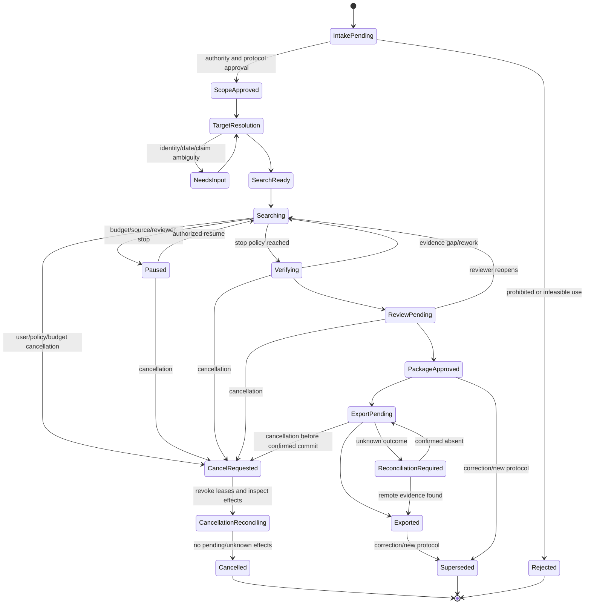
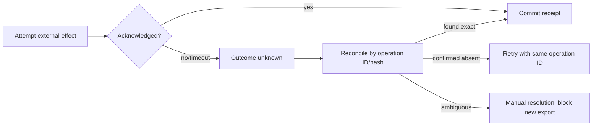

# State, Context, Memory, Orchestration, and Recovery

## System of record

The evidence graph plus durable workflow state is the system of record. The transcript is neither. Model context is compiled from authorized state for one step and may be discarded after the step. This is the patent specialization of [agent state and event contracts](../../runtime/agent-state-and-event-contracts.md), [durable execution](../../runtime/durable-execution.md), and [context engineering](../../context-memory/context-engineering.md).

## Four IDs are not enough

Maintain distinct identifiers for:

| Identifier | Scope |
|---|---|
| `conversation_id` | User-facing interaction, if any |
| `matter_ref` | Opaque professional work boundary |
| `research_case_id` | Versioned patent research question |
| `run_id` | One execution against a protocol |
| `attempt_id` | Retry/recovery attempt of a run or step |
| `step_id` | Durable state-machine step |
| `operation_id` | Idempotent source call or external effect |
| `observation_id` | Immutable source capture |
| `artifact_id` | Immutable bytes/object |
| `graph_revision` | Consistent evidence-state revision |
| `approval_id` | Decision bound to subject/version/hash |
| `package_id` | Deterministic review package version |
| `trace_id` | End-to-end telemetry correlation |

Never use a conversation ID as an idempotency key or a matter ID as a tenant authorization proof.

## State machine



State transitions are deterministic and append events. A model response can propose an event payload, but a transition validator checks current state, authority, required evidence, budgets, and approvals.

## Authoritative state schema

```yaml
research_run_state:
  schema_version: patent-run-state.v1
  tenant_id: tenant-acme
  matter_ref: opaque:m-1842
  research_case_id: case:target-001
  run_id: run:01J...
  status: Searching
  protocol_id: protocol:target-001:v7
  authority_envelope_id: auth:...
  graph_revision: 3811
  target:
    claim_set_id: claimset:...
    selected_claims: [1, 7]
  search:
    round: 4
    completed_branches: [exact, classification, citation]
    active_branches: [multilingual]
    unavailable_branches: []
    budgets:
      source_requests_used: 87
      source_requests_max: 200
      candidate_scans_used: 212
      candidate_scans_max: 500
  open_conflicts: [conflict:date:19]
  open_review_items: [review:translation:44]
  approvals: [approval:scope:...]
  active_clocks:
    run_deadline: 2026-08-31T12:00:00Z
    source_budget_window: epo-ops-week-2026-36
    approval_expiry: 2026-09-07T00:00:00Z
  active_leases: []
  effects:
    pending: []
    unknown: []
  last_committed_event: event:01J...
  state_hash: sha256:...
```

Use optimistic concurrency on `state_hash` or revision. Two workers cannot both advance the same branch or consume the same budget lease.

## Semantic record types

These records are structurally distinct:

### Observation

```yaml
observation:
  observation_id: obs:epo:...
  source_capability: patent.bibliographic.lookup
  source_authority: EPO
  operation_id: op:lookup:...
  observed_at: 2026-08-31T09:20:11Z
  artifact_id: artifact:sha256:...
  request_artifact_id: artifact:sha256:...
  connector_version: epo-adapter-3.2.0
  coverage_statement_id: coverage:epo:2026-08
```

An observation says what was captured, not what it means.

### Extracted fact

```yaml
extracted_fact:
  fact_id: fact:publication-date:...
  subject_id: pub:ep:...
  predicate: publication_date
  value: 2023-04-12
  source_observation_ids: [obs:epo:...]
  extractor_version: biblio-parser-4.1.0
  extraction_method: exact_structured_field
  status: current
  supersedes: null
```

An extracted fact is normalization, not synthesis.

### Legal-status record

```yaml
legal_status_record:
  record_id: status-event:...
  subject_id: app:ep:...
  jurisdiction: EP
  event_code_source: "..."
  event_description_source: "..."
  effective_date_reported: 2025-02-10
  event_publication_date: 2025-03-01
  observation_id: obs:register:...
  observed_at: 2026-08-31T09:30:00Z
  normalized_st27_category: null
  source_projection: source_reports_event
  universal_status: not_asserted
```

This is neither a legal opinion nor a cross-jurisdiction current-state conclusion.

### Similarity hypothesis

```yaml
similarity_hypothesis:
  hypothesis_id: hyp:...
  subject_element_id: element:claim1:E2
  object_passage_ids: [passage:...]
  proposed_relation: potentially_corresponding_technical_disclosure
  evidence_and_differences: {...}
  state: proposed
  legal_effect: none
```

### Research conclusion

```yaml
research_conclusion:
  conclusion_id: conclusion:...
  conclusion_type: candidates_warranting_professional_review
  statement: "Under protocol v7, candidates A and B were accepted for review; element E4 remains an open search gap."
  supporting_record_ids: [...]
  limitations: [...]
  protocol_id: protocol:target-001:v7
  graph_revision: 4172
  accepted_by: reviewer:opaque-42
  accepted_at: 2026-08-31T10:55:00Z
  legal_determination: none
```

### External effect

```yaml
external_effect:
  effect_id: effect:export:...
  effect_type: export_approved_review_package
  operation_id: op:export:...
  package_id: package:...
  destination_policy_id: approved-repository-v2
  authorization_id: approval:package:...
  state: committed
  remote_receipt: receipt:...
```

Only the effect record describes a change outside the evidence graph.

## Event contract

```yaml
event:
  event_id: event:01J...
  event_type: search.branch.completed.v1
  occurred_at: 2026-08-31T10:12:00Z
  recorded_at: 2026-08-31T10:12:01Z
  tenant_id: tenant-acme
  research_case_id: case:target-001
  run_id: run:01J...
  attempt_id: attempt:2
  step_id: step:search:multilingual:4
  trace_id: trace:...
  actor:
    type: service
    id: search-controller
  authority_envelope_id: auth:...
  input_revision: 3802
  output_revision: 3811
  payload:
    branch_id: branch:multilingual:4
    query_ids: [query:51, query:52]
    candidate_count: 18
    artifact_refs: [...]
  idempotency_key: sha256:...
  previous_event_id: event:...
```

Event payloads reference artifacts instead of embedding large source text. Event schemas are versioned and upcast at read time; old events remain immutable.

## Effect ledger, clocks, and cancellation

The effect ledger is a durable projection from effect-attempt/reconciliation events. It distinguishes intent, attempt, remote acceptance, local commit, and correction:

```yaml
effect_ledger_entry:
  effect_id: effect:export:...
  operation_id: op:export:...
  effect_type: export_approved_review_package
  payload_sha256: "..."
  destination: matter-repository:opaque-7
  authorization_id: approval:package:...
  state: unknown
  attempts:
    - attempt_id: attempt:export:1
      started_at: 2026-08-31T11:02:00Z
      outcome: acknowledgement_lost
  remote_receipts: []
  reconciliation:
    next_check_at: 2026-08-31T11:07:00Z
    strategy: lookup_by_operation_id_then_payload_hash
  blocks: [second_export, run_finalization]
```

Active clocks are persisted facts: run deadline, source quota window, lease expiry, retry/backoff time, review SLA, approval expiry, retention/deletion time, monitoring schedule, and reconciliation deadline. Resume recomputes remaining time from a trusted clock; it never resets a deadline because a process restarted.

Cancellation is a requested transition, not proof that work stopped. The controller fences workers, revokes leases/capabilities, stops issuing new pages/tasks, commits already captured responses, and marks queued work cancelled. It then reconciles every pending/unknown effect. A run reaches `Cancelled` only when effects are committed, confirmed absent, or assigned to an accountable manual-resolution owner. Already exported evidence is not “uncancelled”; any withdrawal or correction is a new authorized effect.

## Planning and orchestration

The plan is a versioned hypothesis, not hidden chain-of-thought:

```yaml
research_plan:
  plan_id: plan:case-001:v5
  based_on_graph_revision: 3811
  objective: close or document remaining evidence gaps
  tasks:
    - id: task:verify-date-conflict
      type: deterministic_verification
      dependencies: []
      expected_artifact: date-conflict-resolution-record
      owner: verifier-queue
    - id: task:search-E4-ja
      type: bounded_investigative_branch
      dependencies: [task:verify-date-conflict]
      gap: element-E4 lacks original-language candidates
      budget: {source_requests: 10, candidate_scans: 30}
      owner: search-queue
  invalidation_conditions:
    - target_claim_set_changed
    - date_protocol_changed
    - source_entitlement_revoked
```

Use deterministic topology for known work: acquisition → normalization → indexing → search branches → verification → review → package. Use the model only where semantic uncertainty exists: vocabulary, branch proposals, passage hypotheses, and bounded synthesis. See [planning and replanning](../../orchestration/planning-and-replanning.md).

### Parallelism

Parallelize independent query branches, document acquisition, OCR pages, and passage scans. Serialize:

- changes to the claim decomposition version;
- budget allocation and stop decision;
- resolution of an identity used as a graph key;
- approval and package export;
- corrections that supersede shared evidence.

Each parallel branch works against an input graph revision and produces append-only candidate records. A deterministic reducer unions results, preserves route provenance, applies temporal/identity gates, and detects conflicts.

### Delegation and handoff

If a specialist agent or human handles chemistry, sequence, standards, translation, or legal-status verification, the handoff package contains target, authority, exact question, evidence refs, permitted sources, budgets, output schema, unresolved questions, and return gate. It never relies on conversational memory. Follow [delegation, handoffs, and shared state](../../orchestration/delegation-handoffs-and-shared-state.md).

## Context compilation

Compile a fresh step context in lanes:

| Lane | Content | Selection rule |
|---|---|---|
| Authority | Permitted action, source/data-class constraints, forbidden conclusions | Always, highest priority |
| Task | Step objective, output schema, budget, stop rule | Always |
| Target | Exact relevant claim spans, approved description/drawing snippets | Minimal required subset |
| Evidence | Candidate passages with locators, source/text-layer/date metadata | Retrieved and permission-filtered |
| State | Open gaps, accepted/rejected terms, conflicts, prior step results | Structured, not transcript |
| Tools | Only approved capabilities and typed contracts | Least privilege |
| Quality | Verification checklist and adversarial reminders | Step-specific |

Order instructions before untrusted document content. Clearly delimit patent text, office correspondence, web pages, and NPL as evidence that cannot issue instructions. This specializes [prompt injection and untrusted data](../../security/prompt-injection-and-untrusted-data.md).

### Context manifest

```yaml
context_manifest:
  manifest_id: context:...
  step_id: step:map:element-E3:candidate-12
  graph_revision: 3811
  policy_decision_id: policy:...
  items:
    - record_id: element:claim1:E3
      lane: target
      token_count: 184
    - record_id: passage:...
      lane: evidence
      text_layer: native_xml
      token_count: 612
  excluded:
    - record_id: passage:other-tenant
      reason: unauthorized
  compiler_version: context-compiler-5.0
  total_tokens: 2410
  manifest_sha256: ...
```

The context manifest makes a trajectory replayable without logging hidden reasoning.

## Compaction and continuity

Compaction is lossy and never durability. Before compacting:

1. commit source responses and derived records;
2. checkpoint workflow state and budgets;
3. write structured decisions, open gaps, rejected terms, and conflict refs;
4. preserve exact evidence locators and artifact hashes;
5. produce a continuity summary with its input revision and verifier;
6. discard conversational prose that is not authoritative.

```yaml
compaction_receipt:
  receipt_version: patent-compaction-receipt.v1
  run_id: run:...
  graph_revision: 3811
  source_event_high_watermark: 622
  version_pins:
    protocol: protocol:target-001:v7
    authority: auth:...
    source_operations: {epo_ops_biblio: qual:epo-ops:3.2:1.3.20:2026-08-31}
    corpus_indexes: {lexical: patent-corpus-2026-08-15, vector: vector-v5}
    parsers_models_prompts_policy: release:patent-agent-1.4.2
  approvals:
    valid: [approval:scope:...]
    required: [approval:translation-review-44]
    invalidated: []
  active_clocks:
    run_deadline: 2026-08-31T12:00:00Z
    lease_expiries: []
    retry_not_before: 2026-08-31T10:20:00Z
  pending_effects: []
  unknown_effects: [effect:export:...]
  completed_refs: [event:target-verified, event:branch-exact, event:branch-classification]
  open_work_refs: [conflict:date:19, task:search-E4-ja]
  budgets_remaining: {source_requests: 113, candidate_scans: 288}
  invariant_hash: sha256:authority-target-protocol-budget-effect-set
  omitted_item_references:
    - {record_set: rejected-low-rank-passages, manifest: artifact://omissions/..., reason: token_budget}
  next_safe_action:
    type: reconcile_unknown_effect
    subject: effect:export:...
    preconditions: [rehydration_verified, authority_still_valid]
  generated_by: continuity-builder.v3
  receipt_sha256: "..."
```

The receipt is loss-aware: omitted content is addressed by stable manifests rather than summarized away. It is a resume index, not authority. On restart or provider/model switch, load events through `source_event_high_watermark`, rebuild authoritative workflow/effect projections, verify artifact hashes and `invariant_hash`, re-evaluate authority/rights/approvals/clocks, and compare the selected provider operation to the pinned semantic contract. Rehydrate omitted evidence on demand. If any pin is unavailable or semantics differ, pause for an explicit migration/refresh decision; never continue from prose or silently substitute a provider. See [compaction and continuity](../../context-memory/compaction-and-continuity.md).

## Memory classes

Default to no cross-matter semantic memory. This is the canonical policy table; it defines exactly seven lifetimes.

| Lifetime | Use or reject | Retention and deletion | Poisoning controls | Evaluation controls |
|---|---|---|---|---|
| Turn/scratch memory | Use only for one model call’s parsing, tentative terms, and comparison notes; reject as evidence, authority, or a future input by default | Destroy after the step except privacy-minimized trace metadata under short trace retention | Delimit untrusted text, schema-validate output, prevent write-through, and discard on injection/taint | Assert zero later-step dependence and zero protected-text residue after expiry |
| Working/run memory | Use matter-scoped open gaps, budgets, plan nodes, query/result refs, and temporary ranking state; authoritative graph/workflow wins on conflict | Checkpoint typed items for run recovery; delete temporary projections at run closure under matter policy | Source/actor provenance, authorization-before-retrieval, taint labels, reversible term decisions, stale-revision rejection | Restart/compaction equivalence, budget conservation, stale/poison record injection, and no cross-run bleed |
| Session memory | Use authenticated UI continuity and explicit user clarifications for the active matter; reject source rights, approval, claim construction, and legal authority | Short TTL bound to actor/tenant/matter/purpose; delete at sign-out/expiry and honor hold policy for separately durable decisions | Never ingest document instructions; scope keys on every item; confirmation for materially changed clarification | Wrong-user/matter/session tests, expiry tests, and proof that session loss cannot change authoritative outcome |
| Durable workflow/task memory | Use as authoritative application state for events, evidence graph, decisions, approvals, effects, reconciliation, corrections, and packages | Retain/version under matter, privilege, rights, regulatory, hold, backup, tombstone, and verified deletion policies | Append-only observations, hashes/signatures, optimistic concurrency, reviewer/policy gates, correction/supersession rather than overwrite | Event replay, invariant/property tests, tamper detection, duplicate delivery, DR restore, correction impact and audit reconstruction |
| Domain knowledge memory | Use only human-published glossaries, office/source semantics, classification/reference editions, and approved search playbooks; reject matter facts | Version/effective-date and owner; periodic review; retire/supersede and delete revoked licensed material plus derivatives | Curator separation, signed source artifacts, provenance, conflict sets, no automatic promotion from runs | Holdout queries by edition/jurisdiction/language, poisoned glossary fixtures, rollback, and stale-definition detection |
| Long-term/preference memory | Use opt-in presentation/accessibility preferences and separately approved matter-specific conventions; reject preferences that alter source choice, completeness, legal language, approval, or effects | Purpose/consent/ACL/expiry per item; user/matter deletion and supersession; no indefinite raw transcript/vector store | Narrow writable schema, confirmation and reviewer provenance, anomaly/abuse review, no confidential term globalisation | Preference-on/off equivalence for substantive results, deletion proof, cross-tenant leakage probes, and adversarial preference injection |
| Episodic/outcome memory | Use curated missed-art cases, reviewed outcomes, corrections, incidents, and export defects for evaluation/failure mining; reject as authority or direct retrieval evidence in a new matter | Matter-scoped or rights-reviewed de-identified corpus; governed partitions, retention/hold/deletion lineage, no training by default | Two-person curation, de-identification and rights/privilege review, family/near-duplicate grouping, label disagreement retained | Temporal/family-disjoint evaluation, contamination audit, outcome/trajectory replay, controlled failure mining, and removal/rollback tests |

Every memory item has owner, tenant/matter scope, provenance, confidentiality, purpose, permitted consumers, expiry, deletion status, poison/review state, and supersession. Retrieval filters authorization before relevance. Details follow [memory architecture](../../context-memory/memory-architecture.md).

Do not learn global synonyms from a confidential invention disclosure. Do not copy one matter’s counsel construction into another. Reviewer corrections may become a de-identified product rule only through an approved curation pipeline.

## Idempotency and reconciliation

### Read operations

Reads are not necessarily free: licensed quotas, audit logs, source-side jobs, and cost may be effects. Generate a stable operation ID from tenant, capability, normalized request, source snapshot/live mode, and protocol step. The adapter records attempts but links one committed observation per identical response artifact.

### Internal writes

Use uniqueness constraints for:

- `(tenant_id, operation_id, response_hash)` observation;
- `(subject, predicate, value, source_observation, extractor_version)` fact;
- `(element, candidate, passage_set, model_version, protocol)` hypothesis;
- `(package_manifest_hash, destination)` export.

Retries can return the committed record rather than append duplicates.

### Unknown outcomes

If a source or destination might have accepted an operation but the response is lost, state is `unknown`, not failed. A reconciliation worker queries by remote receipt/idempotency key, compares destination content hash, and decides `committed`, `confirmed_absent`, or `manual_resolution`. Never retry an export blindly.



## Recovery behavior

| Interruption point | Committed truth | Resume action |
|---|---|---|
| Before source request | Step intent and budget lease | Reissue with same operation ID |
| After response, before parse | Raw artifact and observation | Replay parser; no source call |
| Mid-OCR/translation | Original artifact and per-page/layer checkpoints | Resume missing partitions with pinned processor version |
| After hypothesis write, before state advance | Append-only hypothesis | Reducer detects existing record and advances once |
| During verification | Review item and partial decisions | Resume unverified checks; never auto-accept |
| After package creation, before approval | Manifest/hash, no approval | Present same package; any graph change rebuilds |
| Export timeout | Effect state unknown | Reconcile; do not create a second package copy |
| Policy/entitlement revoked | Evidence retained per policy; active leases invalid | Cancel queued calls, block context/export, run rights/deletion playbook |

Recovery never depends on re-generating identical model prose. It depends on durable inputs, artifacts, versions, and deterministic reducers.

## Failure-injection checklist

- [ ] Duplicate event delivery does not duplicate observations, hypotheses, budgets, or exports.
- [ ] Stale workers cannot commit after lease expiry or graph-version conflict.
- [ ] Restart reconstructs active branches and remaining budgets exactly.
- [ ] Raw response capture allows parser replay without another source call.
- [ ] Compaction loses no evidence, decisions, conflicts, or approvals.
- [ ] Unauthorized records cannot enter context, memory, trace payload, or export.
- [ ] Unknown external outcomes enter reconciliation rather than blind retry.
- [ ] Target claim/date/protocol changes invalidate dependent plans and approvals.
- [ ] A correction marks dependent hypotheses, conclusions, and packages stale.
- [ ] Model nondeterminism cannot change authoritative facts or effects without a new versioned record and gate.
