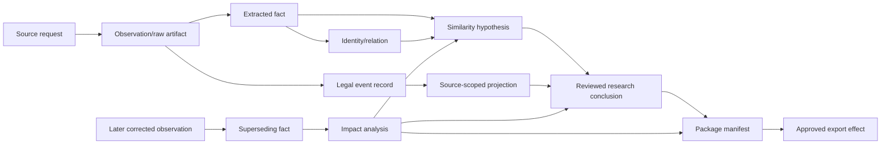

# Legal-Status Records, Provenance, Contradictions, and Temporal Correctness

## The central rule

There is no unqualified `patent_status` field. A defensible record says which source reported which event or projection for which application/right in which jurisdiction, when the event was said to occur, and when the system observed it.

Legal status can be material and complex. This agent preserves office data for counsel review; it does not determine enforceability, expiry, ownership, lapse, revival, term, coverage, or legal effect.

## Event-first status model

WIPO ST.27 defines legal-status exchange around events and categories, while recognizing differences in office practices, formats, languages, and timeliness. Its state categories are useful exchange constructs, not a reason to pretend all offices implement the standard or that one feed is complete ([WIPO ST.27](https://www.wipo.int/documents/d/standards/docs-en-tracked-changes-03-27-01-changes-2019.pdf), [WIPO implementation survey](https://www.wipo.int/en/web/standards/surveys/papi-p2/collated)).

Store raw events first:

```yaml
legal_event_observation:
  record_id: eventobs:...
  subject:
    application_id: app:us:...
    right_id: null
  source:
    authority: USPTO
    dataset_or_register: patent-center-public-record
    observation_id: obs:...
    observed_at: 2026-08-31T09:30:00Z
  jurisdiction: US
  event:
    code_raw: "..."
    description_raw: "..."
    effective_date_reported: 2025-02-10
    publication_date_reported: 2025-03-01
    sequence_raw: 17
  normalization:
    st27_category: null
    mapper_version: legal-event-map.us.v8
    confidence: unmapped
  correction_of: null
```

Then optionally derive a source-scoped projection:

```yaml
status_projection:
  projection_id: projection:...
  subject_id: right:us:...
  jurisdiction: US
  as_reported_by: USPTO-maintenance-data
  as_of_observation: 2026-08-31T09:30:00Z
  based_on_events: [...]
  projected_state: source_reports_fee_window_state_X
  projector_version: us-maintenance-projection.v3
  caveats:
    - USPTO does not calculate patent expiration dates
    - maintenance data is not a universal enforceability determination
  legal_conclusion: none
```

USPTO explicitly says it does not calculate expiration dates, so a maintenance-fee record cannot be converted into a computed patent expiry by this agent ([USPTO maintain a patent](https://www.uspto.gov/patents/maintain)).

## Jurisdiction and right boundaries

Keep separate:

- international application/publication events;
- regional application/grant events;
- validated/unitary/national post-grant rights and events;
- national-phase application events;
- continuations, divisionals, reissues, extensions, certificates, and office-specific rights;
- ownership/assignment records;
- litigation or administrative records, if separately authorized.

A WO publication has no one global grant/status. An EP grant does not produce one timeless status across all states. Absence of national-phase data in PATENTSCOPE does not necessarily mean no national entry, and WIPO notes differing coverage/update frequencies ([PATENTSCOPE national-phase information](https://www.wipo.int/en/web/patentscope/data/national_phase/procedures)). EPO likewise disclaims completeness/currentness for post-grant national data and directs users to national authorities ([Federated Register coverage](https://www.epo.org/en/searching-for-patents/legal/register/documentation/data-coverage), [Register lapse help](https://register.epo.org/help?lng=en&topic=lapses)).

## Temporal dimensions

Every package answers four different questions:

1. **What date did the source report for the underlying event?**
2. **When was that event published or entered, if known?**
3. **When did this system observe the source?**
4. **Which corpus/source version was used to make the package?**

Do not reconstruct a historical answer from today’s mutable register without marking it as a later observation. For a question “what was knowable on date T,” use a snapshot captured on/before T where possible. A later source may provide correction evidence, but it is not contemporaneous evidence.

PATSTAT is updated periodically and is a research snapshot, while a current register can later correct a record. EPO documents PATSTAT’s twice-yearly release pattern and its analytical purpose ([PATSTAT](https://www.epo.org/en/about-us/observatory-patents-and-technology/observatory-tools/patstat), [new to PATSTAT](https://www.epo.org/en/about-us/observatory-patents-and-technology/observatory-tools/patstat/new-to-patstat)). Bind every analytical result to the database edition.

## Provenance graph



Every edge has a transformation or decision identity. A user can traverse from a sentence in a package to the exact source artifact, request, connector, parser, model hypothesis, verification event, reviewer decision, and package/export receipt.

## Provenance minimums

| Record | Required provenance |
|---|---|
| Observation | Source/authority, request, connector version, observed time, rights/coverage snapshot, response artifact/hash |
| Extracted fact | Observation(s), artifact coordinates, parser/normalizer version, method, supersession |
| Translation/OCR | Input artifact/layer, processor/model/version, language, regions/pages, quality, timestamp, reviewer |
| Classification | Scheme/edition, assignment source/level, snapshot, observation |
| Family assertion | Provider, definition, family ID, member list, snapshot, observed time |
| Legal event | Application/right identity, jurisdiction, raw code/description, event dates, source observation, mapping version |
| Similarity hypothesis | Element, passages, text layers, retrieval routes/scores, model/prompt, differences, temporal record |
| Research conclusion | Supporting record IDs, protocol, graph revision, limitations, reviewer acceptance |
| Package/effect | Manifest/hash, release versions, approvals, destination, operation ID, receipt/outcome |

## Coverage statements

Every source snapshot has a machine-readable coverage statement:

```yaml
coverage_statement:
  coverage_id: coverage:provider:2026-08
  source: provider-X
  jurisdictions: [EP, WO]
  document_types: [published_applications, grants]
  content: [bibliographic, full_text, legal_events]
  start_end_dates_as_provider_reports: {...}
  update_frequency: weekly
  known_lag: provider_does_not_guarantee
  known_gaps: [...]
  absence_semantics: not_observed_only
  provider_documentation_url: https://...
  captured_at: 2026-08-01T00:00:00Z
  artifact_sha256: ...
```

Provider marketing claims do not replace measured coverage. Sample against direct office sources by jurisdiction, document age, kind, and event type.

## Contradiction model

Contradictions are first-class sets, not overwritten values:

```yaml
conflict_set:
  conflict_id: conflict:publication-date:19
  subject_id: pub:...
  predicate: publication_date
  assertions:
    - fact_id: fact:date:A
      value: 2023-04-12
      observed_at: 2026-08-15T00:00:00Z
    - fact_id: fact:date:B
      value: 2023-04-13
      observed_at: 2026-08-31T09:30:00Z
  materiality:
    affects_temporal_filter: true
    affected_protocols: [protocol:target-001:v7]
  status: unresolved
  resolution: null
```

Resolution does not delete losing assertions:

```yaml
conflict_resolution:
  resolution_id: resolution:...
  conflict_id: conflict:publication-date:19
  selected_fact_id: fact:date:B
  basis:
    - direct_office_corrected_publication_record
  decided_by: verifier:opaque-17
  approved_by: reviewer:opaque-42
  decided_at: 2026-08-31T10:20:00Z
  scope: protocol:target-001:v8
  supersedes_resolution: null
```

The previous protocol remains reproducible with its original unresolved/selected state. A resolution may apply only to one question.

## Contradiction precedence

Do not hardcode a universal “official source always wins” rule. Use a review policy:

1. confirm that records refer to the same application/publication/right;
2. compare source authority for the specific jurisdiction and fact type;
3. compare observation time, effective date, correction indicators, and coverage;
4. inspect original artifacts rather than normalized displays;
5. distinguish a later correction from a conflicting interpretation;
6. record the selection and scope;
7. keep unresolved when evidence is insufficient;
8. escalate legally consequential interpretation to counsel.

An aggregate may be fresher than a stale office snapshot; a direct office register may omit post-grant national information; two sources may use different status vocabularies. Provenance and scope decide, not brand alone.

## Absence and unknown states

Use a typed lattice:

| State | Meaning |
|---|---|
| `observed_present` | Source response contained a matching record |
| `observed_absent_in_response` | Successful query did not contain it, within stated query/coverage |
| `not_covered` | Source documentation excludes jurisdiction/type/time |
| `source_unavailable` | No reliable observation was obtained |
| `identity_unresolved` | Query target could not be resolved |
| `permission_denied` | Entitlement prevented observation |
| `parse_failed` | Response captured but not reliably interpreted |
| `conflicting` | Multiple material assertions disagree |
| `unknown` | Evidence insufficient or outcome indeterminate |

Only the first is presence. None of the others means nonexistence.

## Status projection rules

A projection is allowed only when:

- it is useful for triage, not a legal conclusion;
- the jurisdiction/right identity is verified;
- the source and observation cutoff are explicit;
- event normalization is versioned and tested;
- late/out-of-order/corrected events are handled;
- `unknown` and `conflicting` are valid outputs;
- the UI names it “source-reported projection” and exposes events;
- counsel can require direct-register verification.

Never compute patent term/expiry, enforceability, ownership, or freedom to operate from a generic event feed. Those require jurisdiction-specific legal analysis and sometimes facts not present in patent data.

## Legal-status monitoring contract

Monitoring re-observes approved sources and reports deltas; it does not maintain a universal status. Each watch is versioned and right/source specific:

```yaml
status_watch:
  watch_id: watch:...
  matter_ref: opaque:m-1842
  subjects:
    - right_id: right:ep:...
      jurisdiction: EP
  source_operations:
    - operation: epo.ops.register.retrieve.events
      qualification: qual:epo-ops:3.2:1.3.20:2026-08-31
    - operation: national-register-manual-verification
  schedule: monitor-policy:weekly-business-day
  comparison:
    prior_observation_cut: 2026-08-24T00:00:00Z
    event_identity_rule: source_code_dates_sequence_and_raw_hash
    correction_detection: enabled
  alert_policy:
    categories: [new_event, changed_event, disappeared_record, source_conflict, stale_source]
    legal_materiality: not_determined
    reviewer_role: patent_counsel
  expires_at: 2027-08-31T00:00:00Z
```

For each cycle, commit the raw source response before comparing it with the prior cut. Emit separate records for a genuinely new event, a late-arriving older-effective-date event, a changed/corrected event, a record no longer returned, a source failure, and a source disagreement. A disappearance is not a retraction unless the source says so. Re-fetching today cannot prove what the register displayed at an earlier date.

An alert states the exact delta, source, dates, observation age, affected right, open conflict, and packages/watches impacted. It never says “patent expired,” “now enforceable,” or “FTO risk changed.” The reviewer may close an alert as acknowledged, request direct-office verification, record a scoped interpretation outside the agent, change the watch, or create an authorized downstream task. Deduplicate alerts by watch + source event/correction identity, not by free-text summary.

Monitoring stops or pauses on cancellation, watch expiry, entitlement revocation, unresolved identity, source schema drift, repeated acquisition failure beyond policy, or a deletion/hold constraint. Pausing is visible and does not convert missed cycles into “no change.” On resume, backfill only through a supported historical feed; otherwise declare the observation gap.

## Corrections and impact propagation

```yaml
correction_record:
  correction_id: correction:...
  trigger: source_corrected_event
  old_record_id: status-event:old
  new_record_id: status-event:new
  reason: provider_backfile_correction
  detected_at: 2026-09-02T02:00:00Z
  affected:
    hypotheses: [hyp:12]
    conclusions: [conclusion:9]
    packages: [package:7]
  actions:
    - mark_stale
    - queue_reverification
    - notify_accountable_owner_for_materiality_decision
```

The system does not retract or notify external recipients autonomously. It identifies impact and provides evidence; the accountable owner decides remediation through an authorized process.

## Temporal replay

To reproduce a package:

1. load its protocol and claim-set hash;
2. load the exact corpus, scheme, source, parser, OCR, translation, model, prompt, and policy versions;
3. select graph records visible at the package’s revision, including then-unresolved conflicts;
4. rebuild indexes or use verified snapshot hashes;
5. replay deterministic filtering/reducers;
6. compare candidate/query/locator/manifest hashes;
7. report model nondeterminism or unavailable licensed artifacts as explicit limits.

Re-running against current data is a **refresh**, not a replay. It creates a new package and delta:

```yaml
package_delta:
  from_package: package:v7
  to_package: package:v8
  changes:
    - type: corrected_publication_date
      records: [...]
    - type: newly_observed_legal_event
      records: [...]
    - type: source_became_unavailable
      source: ...
  unchanged_evidence_count: 317
  reviewer_reacceptance_required: true
```

## Status and provenance failure tests

| Injection | Expected result |
|---|---|
| Event feed arrives two weeks late | New observation and projection revision; old package remains reproducible |
| Corrected event has earlier effective date | Superseding event plus impact analysis; no history rewrite |
| Aggregate and national source disagree | Conflict set, source-specific displays, review gate |
| National-phase query returns no row | `observed_absent_in_response`, not “no national phase” |
| ST.27 mapper cannot map office code | Preserve raw event and output unmapped/unknown |
| Current classification replaces historical symbol | Both assignments/editions survive; old query replay unchanged |
| OCR correction changes cited number/date | Dependent facts and hypotheses stale; re-verification |
| Machine translation engine upgrade changes passage | New layer; accepted mapping not silently updated |
| Licensed artifact expires | Provenance retained subject to policy; package shows inaccessible evidence and blocks unauthorized redistribution |
| Clock skew changes acquisition timestamp | Trusted server timestamp and source time kept separate; alert on skew |

## Review checklist

- [ ] No unqualified global `status` field exists.
- [ ] Raw events and source-scoped projections are separate.
- [ ] Application/right identity and jurisdiction are verified before projection.
- [ ] Effective, publication/entry, observation, snapshot, and review dates are distinct.
- [ ] Absence is source- and query-scoped.
- [ ] Provider coverage and update lag are stored and measured.
- [ ] Conflicts retain every assertion and resolution basis.
- [ ] Later corrections supersede rather than rewrite.
- [ ] Provenance traverses package sentence to original bytes and decisions.
- [ ] Replays use historical revisions; refreshes create versioned deltas.
- [ ] Legal significance stays with counsel/accountable professionals.
