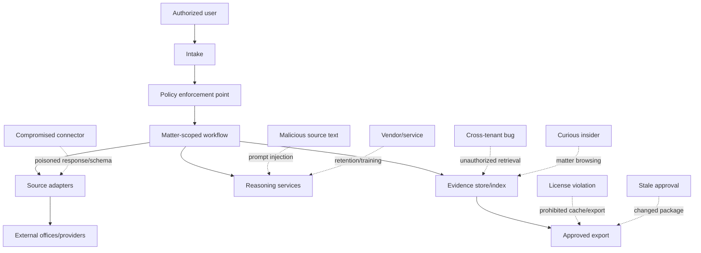
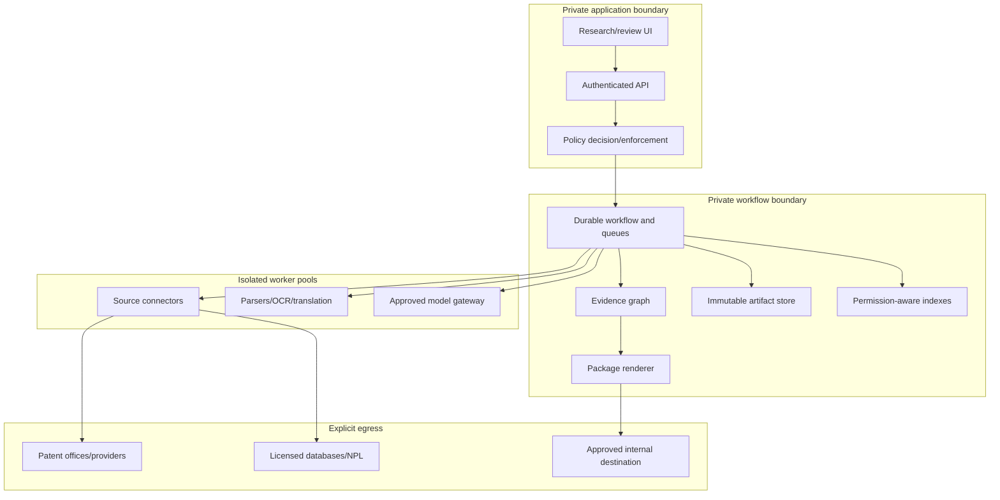

# Security, Confidentiality, Source Rights, Tenancy, and Deployment

## Security objective

Protect unpublished inventions, privileged work product, client/matter boundaries, licensed corpora, personal data, credentials, and the integrity of research evidence. A patent-research system can cause irreversible harm without filing anything: a public query can disclose an invention; a cross-matter retrieval can breach privilege; a model prompt can leak licensed full text; and a poisoned document can redirect the agent.

Apply the repository’s [agent threat model](../../security/agent-threat-model.md), [prompt-injection controls](../../security/prompt-injection-and-untrusted-data.md), and [permissions, sandboxing, and secrets](../../security/permissions-sandboxing-and-secrets.md) with matter-level isolation and source-rights enforcement.

## Data classification

| Class | Examples | Default processing |
|---|---|---|
| Public patent data | Published documents, public register records | Approved public/enterprise processors subject to source rights |
| Public non-patent data | Open papers, public manuals/web pages | Rights-aware acquisition and excerpting |
| Licensed/restricted content | Commercial database full text, standards, paywalled papers | Entitlement-scoped storage/model/index/export; no training by default |
| Confidential matter data | Search brief, counsel notes, selected candidates, private analysis | Matter-isolated enterprise/offline processors only |
| Unpublished invention material | Disclosure, draft claims, lab data | Highest confidentiality; no public query/OCR/translation/model service |
| Privileged/work-product material | Legal strategy, counsel conclusions | Separate access compartment and logs; minimized model exposure |
| Credentials/security data | API keys, cookies, source tokens | Secrets broker only; never artifact/context/trace |
| Personal data | Inventor/contact/address records | Purpose limitation, minimization, jurisdictional retention/access controls |

Classification is inherited by derived data unless a rights/privacy review explicitly changes it. Embeddings, query terms, extracted passages, caches, model traces, and evaluation examples can reveal source content and therefore inherit restrictions.

## Confidentiality, privilege, and professional-responsibility boundary

Confidentiality, attorney-client privilege, patent-agent privilege, work-product protection, protective orders, and contractual secrecy are different regimes. The system stores counsel-supplied labels and access policy; it never decides that a communication is privileged, that protection was waived, or that disclosure to a processor is legally permitted. ABA Model Rule 1.6 reaches information relating to a representation and requires reasonable efforts against unauthorized access/disclosure; ABA Formal Opinion 512 applies competence, confidentiality, communication, supervision, and verification duties to lawyers’ generative-AI use. USPTO practitioners also operate under 37 CFR Part 11 professional-conduct rules ([ABA Rule 1.6](https://www.americanbar.org/groups/professional_responsibility/publications/model_rules_of_professional_conduct/rule_1_6_confidentiality_of_information/), [ABA Formal Opinion 512](https://www.americanbar.org/content/dam/aba/administrative/professional_responsibility/ethics-opinions/aba-formal-opinion-512.pdf), [USPTO ethics rules](https://www.uspto.gov/learning-and-resources/patent-and-trademark-practitioners/current-patent-practitioner/ethics-rules)). Applicable law, client terms, court orders, and bar rules may be stricter.

| Boundary | Enforced system behavior | Human/legal decision |
|---|---|---|
| Matter opening | Opaque matter ID, ethical-wall group, client/tenant, data/privilege/work-product labels, processor/export policy | Counsel confirms representation, conflicts, purpose, labels, and permitted processors |
| Model/tool use | Data-flow preview; processor/region/retention/training contract match; least evidence; no confidential public fallback | Counsel/authorized owner determines whether use/disclosure is permitted and whether consent/notice is required |
| Review notes | Separate counsel compartment; models see only explicitly released research instructions | Counsel determines whether notes are legal advice/work product and who may access them |
| Logging/support | Content-free telemetry by default; time-bounded approved diagnostics; support access just-in-time and matter-audited | Authorized professional approves exceptional content access and remediation |
| Export/discovery | Deterministic manifest, privilege/confidentiality labels, rights scan, destination ACL, approval/hash binding | Counsel decides production, disclosure, withholding, privilege log, clawback, or waiver questions |

Treat vendor “no training” or “zero retention” settings as contract/configuration evidence to verify, not a privilege guarantee. Keep query terms, prompts, embeddings, cache keys, reviewer comments, and model outputs inside the same matter boundary as their source. A de-identified label is reusable only after an approved reviewer finds re-identification and privilege risk acceptable.

## Threat model



### High-impact threats and controls

| Threat | Control |
|---|---|
| Public search reveals draft claim concepts | Source policy blocks confidential data from public capabilities; redaction is reviewed, not model-assumed |
| Patent/PDF/web text issues tool instructions | Strict evidence delimiters, no tool authority from content, allowlisted typed capabilities, post-model validation |
| Cross-matter vector retrieval | Authorization filter before ANN search plus post-filter, separate encryption/index partitions for high sensitivity, isolation tests |
| Licensed passage appears in another tenant’s package | Entitlement label on every artifact/chunk/derived record; export policy traverses lineage |
| Connector credential leaks in prompt/log | Short-lived credential injection inside adapter sandbox; secret scanning and structured logging |
| Malicious or corrupted office response | Raw signed/hashed capture, schema validation, content limits, parser sandbox, quarantine |
| Reviewer approval reused after evidence changes | Approval binds package/graph/protocol/claim hashes and expires on dependency change |
| OCR/translation vendor retains confidential text | Approved processor contract/config, data-region control, no-training/retention setting verified, or offline processing |
| Model memorizes one matter for another | No cross-matter memory/training by default; purpose/consent/rights gate for feedback |
| Export contains excessive full text | Deterministic rights-aware renderer, excerpt limits, internal access pointers, export scanner |

## Capability authorization

Authorize a tuple, not a tool name:

```yaml
capability_request:
  actor_id: service:search-worker
  tenant_id: tenant-acme
  matter_ref: opaque:m-1842
  capability: patent.search.snapshot
  source_id: licensed-corpus-X
  data_class: unpublished_invention_material
  purpose: prior_art_candidate_generation
  operation: query
  region: eu-west
  requested_at: 2026-08-31T09:00:00Z
```

Policy evaluates actor, tenant/matter membership, data class, purpose, source entitlement, operation, processor, region, retention, rate/budget, authority envelope, and time. It returns a short-lived capability or denial reason. The model never sees credentials or broad connector access.

### Two authorization points

1. **Before retrieval/search**: prevent unauthorized records from becoming candidates or influencing ranking.
2. **Before render/export**: traverse provenance so restricted source content or derived data cannot leave its permitted boundary.

Post-filtering an unauthorized vector search is insufficient because scores, timing, snippets, and model context can leak existence/content.

## Tenant and matter isolation

Use a hierarchy:

```text
organization tenant
└── client/workspace (optional ethical wall)
    └── matter
        └── research case
            └── run / package
```

Every durable row, artifact object, search chunk, memory item, queue message, cache entry, trace, and export contains or derives an immutable tenant/matter scope. Database row-level security alone is not enough; enforce at storage prefixes/keys, encryption context, indexes, queues, caches, and service authorization.

### Isolation strategies

| Sensitivity/scale | Evidence store | Search indexes | Compute |
|---|---|---|---|
| Early single tenant | Dedicated database/bucket | Dedicated indexes | Dedicated worker pool preferred |
| Multi-tenant public data + confidential metadata | Shared public corpus; tenant-scoped graph | Shared public corpus index, tenant overlay | Policy-scoped pools |
| Privileged/high-value matter | Separate encryption key/store partition | Dedicated matter index or isolated namespace with pre-filter proof | Dedicated/attested pool, no public processors |
| Licensed corpus with per-seat rights | Restricted shared corpus partition | Entitlement-aware index, query audit | Connector and renderer enforce user/tenant license |

Never pool confidential embeddings for “better recall.” Public corpus indexes may be shared only if tenant queries and relevance feedback are not logged into a cross-tenant learning loop.

## Confidential search design

Avoid sending the exact invention disclosure to external search endpoints. When an approved source requires a live query:

1. classify the input;
2. choose an approved query projection—public claim, counsel-approved redaction, or non-sensitive concept terms;
3. show the reviewer what will leave the boundary;
4. log the exact outgoing request as a restricted artifact;
5. minimize identifiers and matter metadata;
6. enforce provider retention/training and region terms;
7. prefer search against an internal licensed snapshot for full confidential queries.

Do not assume a model-generated paraphrase is non-confidential. It can preserve the inventive concept.

## Prompt injection and untrusted content

Patent descriptions, office actions, web pages, PDFs, metadata fields, OCR, translations, and retrieved snippets are untrusted data. They may contain explicit instructions, hidden text, malformed XML, oversized content, external links, or content designed to trigger a tool.

Controls:

- parse in a sandbox with CPU/memory/time/file limits;
- disable macros, active content, network fetches, and embedded-object execution;
- normalize or reject XML external entities and decompression bombs;
- store links as evidence; do not browse them unless a policy-approved branch requests it;
- label evidence blocks and instruct the model never to follow instructions within them;
- give the model only step-specific read capabilities;
- validate outputs against a schema and forbidden-action/legal-language policy;
- require source references to existing authorized records;
- cap document/chunk counts and detect invisible/overlay text;
- compare OCR/embedded/native text when discrepancies matter.

## Source-rights ledger

```yaml
rights_record:
  rights_id: rights:corpus-X:2026-08
  provider: provider-X
  contract_ref: contract:opaque-19
  effective_period: [2026-01-01, 2026-12-31]
  entitled_tenants: [tenant-acme]
  allowed:
    query: true
    internal_cache: true
    internal_fulltext_index: true
    embeddings: true
    model_inference: true
    model_training: false
    internal_excerpt_export: true
    external_redistribution: false
  retention:
    raw_days: 365
    derived_on_termination: delete_or_quarantine
  attribution: required
  personal_data_terms: purpose_limited
  audit_required: true
  terms_artifact_sha256: ...
```

EPO raw-data and OPS terms, for example, distinguish permitted uses and disclaim data completeness while preserving third-party rights ([EPO raw-data terms](https://www.epo.org/en/service-support/ordering/raw-data-terms-and-conditions), [OPS terms](https://developers.epo.org/sites/default/files/terms_and_conditions_OPS%202.0%20EN_DE_FR.pdf)). USPTO notes that although many federal works are public domain in the United States, third-party material can remain protected ([USPTO terms of use](https://www.uspto.gov/terms-use-uspto-websites)). Patent-document images, NPL, standards, and provider-added data require separate treatment.

### Rights propagation

When derived from multiple inputs, use the most restrictive applicable controls and retain a lineage set. A normalized citation can sometimes be retained after full text must be deleted, but that must be contractually and legally established—not assumed.

## Retention, deletion, and legal hold

Retention policy is evaluated by data class, tenant/matter, source rights, region, purpose, artifact type, and legal hold. A deletion workflow:

1. authorizes the request and checks holds;
2. freezes new processing/export;
3. enumerates raw artifacts, derivatives, indexes, caches, memory, evaluation copies, logs, and backups through lineage;
4. deletes or cryptographically erases active copies;
5. tombstones graph records without leaking content;
6. schedules backup expiry under policy;
7. records non-content proof and exceptions;
8. tests that retrieval and package regeneration cannot recover deleted content.

Do not delete immutable audit evidence blindly. Minimize its content at creation so required audit metadata can survive without the protected text.

## Secrets and connector isolation

- Store credentials in a secrets manager, addressed by opaque references.
- Mint short-lived tokens for one connector/source/tenant/purpose.
- Run adapters in network-constrained sandboxes with only required endpoints.
- Rotate and revoke without redeploying prompts/models.
- Scrub headers, query strings, response dumps, exception messages, and terminal output.
- Treat browser sessions/cookies as credentials and never reuse across tenants.
- Audit credential issuance and source operations by non-secret identifiers.
- Test expired, revoked, wrong-tenant, and insufficient-scope credentials.

## Export-control and cross-border processing gate

Public patent publications are not a blanket classification for the matter around them. An unpublished invention disclosure, source code, process parameter, technical drawing, or research note may contain controlled technology or be subject to sanctions, contractual, government-funding, or national-security restrictions. Under the U.S. EAR, electronic transmission of non-public controlled technology abroad and release of controlled technology/source code to a foreign person can be exports/deemed exports; publicly available information and fundamental research have separate treatment ([BIS EAR scope](https://www.bis.gov/ear/title-15/subtitle-b/chapter-vii/subchapter-c/part-730/ss-7305-coverage-more-exports), [BIS deemed-export guidance](https://media.bis.gov/learn-support/deemed-exports/what-deemed-export), [EAR Part 734](https://media.bis.gov/regulations/ear/734)). Other jurisdictions can differ.

Before a restricted matter crosses a region, provider, support team, reviewer pool, translation/OCR service, or model endpoint, require an accountable export/compliance decision containing item/data classification, origin, recipients and nationalities where legally relevant, destination/region, end user/use, authorization/license/exception basis, expiry, and denied-party/sanctions screening reference where applicable. The agent may enforce the decision but may not classify controlled technology or select a legal authorization. An absent or expired decision blocks cross-border processing; it does not trigger a domestic public-service fallback.

## Software, model, and data supply chain

Parsers, OCR/translation engines, embedding/reranking models, model gateways, browser/PDF libraries, container images, classification files, and provider schemas can all alter evidence or create execution risk. Follow NIST SSDF’s provenance and third-party component practices and treat indirect prompt injection/data poisoning as expected GAI risks ([NIST SP 800-218](https://csrc.nist.gov/pubs/sp/800/218/final), [NIST AI 600-1](https://nvlpubs.nist.gov/nistpubs/ai/NIST.AI.600-1.pdf)).

- allowlist suppliers and repositories; pin code/image/model/tokenizer/data digests rather than mutable tags;
- produce and retain an SBOM/model-and-data bill, build provenance, signatures/attestations, license and vulnerability status per release;
- scan and sandbox third-party parsers, disable unneeded codecs/features/network, and fuzz patent XML/PDF/image/ZIP formats;
- verify official scheme/schema/data signatures or hashes where published and independently hash every acquired artifact;
- stage provider/schema/model updates against captured fixtures; quarantine unexpected enum/cardinality/content changes;
- separate the ability to publish domain memory, model artifacts, connector builds, policies, and production releases;
- revoke a component/data/model independently, identify every active run/package derived from it, and test rollback/forward correction;
- monitor dependency/model/provider advisories and define patch, exception, end-of-life, and emergency-disable owners.

## Deployment topology



Use separate egress rules for office, licensed, OCR/translation, model, and export endpoints. The evidence store and indexes have no unrestricted internet access. Production cannot call a developer’s public fallback key.

### Environment separation

- Development uses synthetic/public fixtures, not copied matters.
- Test uses rights-approved, minimized, time/version-pinned corpora.
- Staging mirrors controls and schemas but not unrestricted production data.
- Production access is just-in-time, role/matter scoped, audited, and reviewed.
- Evaluation exports are sanitized and entitlement-checked.

Release manifests bind image digests, schemas, policies, source connectors, terms/coverage snapshots, classification/index builds, OCR/translation/model versions, prompts, and eval results. Follow [deployment, release, and incident response](../../operations/deployment-release-and-incident-response.md).

## Logging and observability privacy

Default traces contain IDs, types, sizes, hashes, timings, policy decisions, result counts, and error classes—not claim text, queries, passages, credentials, applicant addresses, or counsel notes. Use a restricted evidence viewer to resolve IDs when authorized.

Debug content capture is disabled by default, time-bounded, matter-approved, encrypted separately, and automatically deleted. Redaction must happen before log emission; a downstream log scrubber is defense in depth.

## Security incident classes

| Incident | Immediate containment | Evidence/remediation |
|---|---|---|
| Cross-tenant retrieval/export | Disable affected capability/index/export, preserve audit, revoke tokens | Identify all accessed/rendered records; accountable privacy/legal response |
| Confidential query sent to unapproved service | Revoke connector, block run, obtain provider retention/deletion response | Trace exact payload/receipts; matter owner decides notification/remediation |
| License entitlement lapse | Stop new queries/exports and derived-data processing | Enumerate affected artifacts/derivatives; follow contract termination plan |
| Prompt injection caused unauthorized call attempt | Revoke run capability and quarantine artifact/parser/model path | Reproduce trajectory, add adversarial test, verify no effect occurred |
| Evidence tampering/hash mismatch | Quarantine artifact and dependent packages | Reacquire from source, verify storage integrity, impact analysis |
| Secret exposure | Revoke/rotate, stop affected adapter | Trace use, scrub retained outputs, harden emission path |

The agent may assist containment through preauthorized operational controls but does not decide legal notifications.

## Security acceptance tests

- [ ] A public model/search/translation path rejects unpublished or privileged text.
- [ ] Query paraphrasing cannot downgrade confidentiality.
- [ ] Pre-retrieval authorization blocks cross-matter ANN leakage.
- [ ] Export lineage blocks restricted full text and derived content.
- [ ] Prompt injection in XML/PDF/OCR/metadata cannot expand tools or effects.
- [ ] XXE, decompression bomb, oversized page, malformed image, and active-content fixtures are contained.
- [ ] Credentials never appear in model context, artifacts, logs, traces, packages, or errors.
- [ ] Tenant/matter IDs and encryption context cover stores, indexes, queues, caches, and backups.
- [ ] Approval becomes invalid after package, protocol, claim, or graph revision changes.
- [ ] Deletion finds raw, derived, indexed, cached, memory, evaluation, and backup copies.
- [ ] License termination drill blocks use and identifies affected derivatives.
- [ ] Development/staging cannot query unrestricted production matters.

## Production checklist

- [ ] Data classes and inherited restrictions are defined.
- [ ] Capability policy covers actor, tenant/matter, purpose, data, source, operation, processor, region, retention, and effect.
- [ ] Confidential queries stay on approved private processors/corpora.
- [ ] Every source has a current rights/coverage record and change owner.
- [ ] Matter isolation includes retrieval, caches, feedback, traces, and exports.
- [ ] Parsers and connectors are sandboxed with least network privilege.
- [ ] Source text is always untrusted evidence.
- [ ] Retention/deletion/legal-hold behavior is tested end to end.
- [ ] Release and incident processes can revoke source, model, index, and export independently.
- [ ] Counsel/accountable professionals retain all legal decisions.
