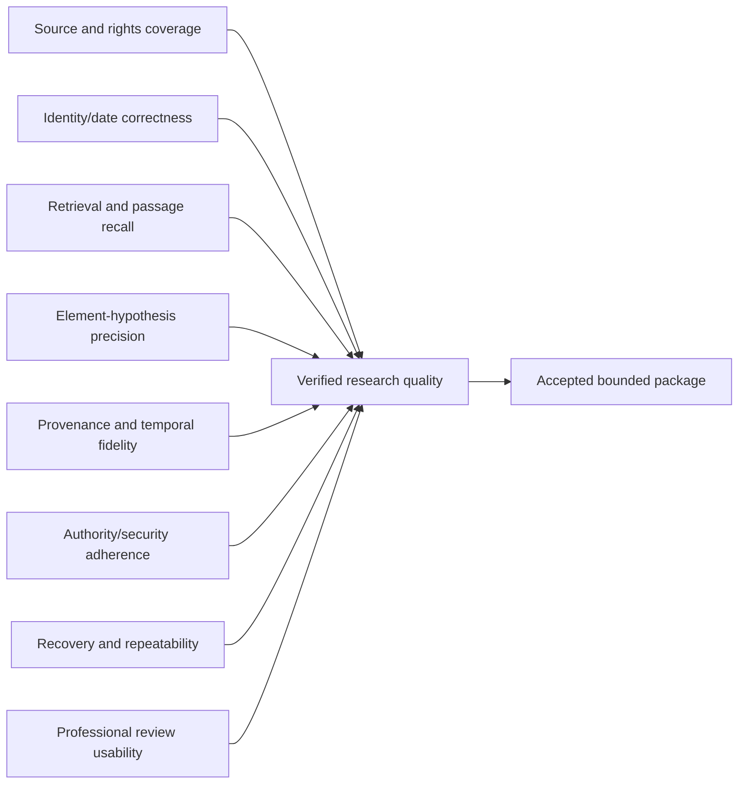
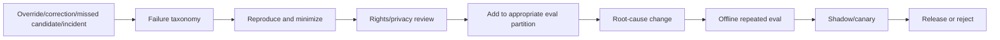

# Evaluation, Observability, Operations, Scaling, and Continuous Evolution

## Operating principle

Optimize **cost and latency per professionally verified research outcome**, not tokens, documents processed, or fluent reports. Production quality is a joint property of source coverage, identity/date correctness, retrieval, passage fidelity, review, security, recovery, and honest limitations.

Use final-state, trajectory, and repeated reliability evaluation as described in [trajectory and reliability evaluation](../../evaluation/trajectory-and-reliability-evaluation.md) and [evaluation-driven development](../../evaluation/evaluation-driven-development.md).

## Quality model



A system with high candidate recall but wrong dates is unsafe. A system with perfect citations but confidential leakage is unacceptable. Use hard gates for authority, isolation, provenance, and temporal integrity; use trade-off metrics for relevance, latency, cost, and reviewer burden.

## Evaluation planes and hard gates

| Plane | Core question | Representative measures | Release rule |
|---|---|---|---|
| Outcome evaluation | Did the bounded research package help qualified reviewers find and assess useful evidence? | Known-relevant family/passages found at review budget, accepted candidate groups, reviewer time, unresolved-gap honesty, package acceptance | Task/language/jurisdiction thresholds are pre-registered; never converted into completeness |
| Trajectory evaluation | Did the workflow reach the package through allowed, efficient, reproducible steps? | Identity-before-search, required-branch attempts, query provenance, cutoff application, retries, stop decision, independent verification, approval/effect order | Any unauthorized/future-leaking/hidden-fallback trajectory fails even if final evidence is useful |
| Evidence evaluation | Are every displayed fact, quote, chart cell, status delta, and limitation grounded in exact authorized records? | Artifact/hash/locator resolution, quote fidelity/context, original-language linkage, fact–hypothesis separation, source coverage/observation time, package-to-receipt traversal | Fabricated/misattributed citation, unresolved consequential identity, or missing package lineage is a hard failure |
| Invariant evaluation | Did safety and state truths survive nondeterminism, concurrency, failures, compaction, and change? | Budget conservation, event replay hash, no cross-tenant record, approval/version binding, no duplicate effect, conflict preservation, restart/provider-switch verification | Authority, isolation, rights, temporal, or effect invariant violations block release at any observed rate |
| Human-factor evaluation | Can a qualified reviewer understand uncertainty and catch errors under realistic load? | Error-detection rate, score anchoring, caveat comprehension, stale-package rejection, inter-reviewer disagreement, queue age, time/element, fatigue/escalation/override | UI or workload that induces material overtrust/rubber-stamping fails even when offline model metrics improve |

Report results by task product, jurisdiction, language, technical field, publication era/kind, source, text layer/OCR quality, family density, and confidentiality path. Averages cannot hide a hard-gate violation or a weak material stratum.

## Evaluation suites

### Unit and contract suites

- number/kind-code/date parsers by office and historical format;
- family/classification/status mapping by provider version;
- source-adapter schemas, rate/retry behavior, rights/coverage metadata;
- claim structure/dependency extraction fixtures;
- text-layer coordinates, quote fidelity, page/paragraph mapping;
- policy decisions for data class, source, processor, region, and export;
- event/state transitions, idempotency, stale-lease rejection, reconciliation;
- package manifest determinism and rights-aware rendering.

### Golden evidence cases

Each case contains:

```yaml
evaluation_case:
  case_id: eval:private:042
  task_type: prior_art_candidate_research
  jurisdiction_scope: [EP]
  target_claim_set_hash: ...
  simulated_as_of: 2024-03-18
  corpus_snapshot_ids: [...]
  allowed_sources: [...]
  adjudicated:
    relevant_candidate_groups: [...]
    passage_judgments: [...]
    element_hypothesis_judgments: [...]
    identity_date_conflicts: [...]
    acceptable_abstentions: [...]
  prohibited_outputs: [legal_determination, exhaustive_claim]
  partition_group_ids:
    extended_family_component: family-component:...
    near_duplicate_cluster: duplicate-cluster:...
  rights_record_id: rights:eval:...
```

Gold labels include disagreement and adjudication notes. They need qualified searcher/counsel input for the intended task; bulk citations alone are not complete truth.

### Scenario suites

| Suite | Cases |
|---|---|
| Identity and families | Missing kind code, corrected publication, continuation/divisional, conflicting family providers, different claims across members |
| Dates and status | Priority uncertainty, post-cutoff publication, late event, national absence, aggregate/register conflict, correction/backfill |
| Retrieval | Rare exact phrase, paraphrase, old terminology, wrong classification, multilingual candidate, NPL, citation snowball, family-heavy results |
| Claims/elements | Negation, alternatives, numeric range, relation reversal, dependency chain, functional phrase, missing antecedent |
| Text quality | OCR loss, column interleave, formula/symbol corruption, missing page, bad MT, original/translation disagreement |
| Security/rights | Confidential public-query attempt, prompt injection, cross-tenant retrieval, expired entitlement, prohibited excerpt/export |
| Reliability | Timeouts before/after response, duplicate event, stale lease, index/source drift, export unknown outcome, correction during run |
| Human factors | Reviewer accepts stale package, overtrusts score, misses disclaimer, disagrees on element segmentation, excessive review queue |

## Metrics and gates

### Final-state metrics

| Dimension | Metrics |
|---|---|
| Retrieval | recall@review-budget, precision@k, first-relevant rank, unique-family recall, branch contribution |
| Passages | relevant-passage recall, precision, exact locator/quotation rate, sufficient-context rate |
| Elements | source-span fidelity, decomposition agreement, hypothesis precision/recall by element/type, difference-detection rate |
| Identity/time | identifier resolution accuracy, date-type accuracy, temporal exclusion/uncertainty error, family-conflation rate |
| Status | raw-event fidelity, projection accuracy within mapping definition, unknown/conflict preservation, direct-source verification rate |
| Provenance | resolvable citation %, complete lineage %, artifact hash match, replay match |
| Review | reviewer minutes/candidate and element, override/correction/escalation, package acceptance, missed-candidate additions |
| Safety | legal-authority violation, confidential egress, cross-tenant access, rights/export violation, prompt-injection effect |
| Reliability | task success across repeated runs, resume success, duplicate-effect rate, unknown-outcome reconciliation success |
| Efficiency | cost/accepted candidate, cost/accepted package, source/OCR/translation/model cost, p50/p95/p99 latency |

Authority, unauthorized disclosure, cross-tenant access, fabricated citation, and duplicate external effect have zero-tolerance release gates. Relevance thresholds vary by task and review capacity.

### Trajectory metrics

Inspect whether the system:

- resolved target identity before search;
- applied the approved date protocol deterministically;
- attempted required branches and recorded unavailable ones;
- used discoveries to close explicit gaps rather than loop generically;
- respected budgets and source terms;
- cited original artifacts before proposing hypotheses;
- preserved contradictions and uncertain dates;
- obtained independent verification and required approvals;
- avoided hidden source/model fallbacks;
- exported only the approved manifest.

A good final candidate found through a leaked future citation or unauthorized source is a failed trajectory.

### Repeated-run reliability

Run the same case multiple times across model sampling, worker timing, retries, and partial failures. Report:

- `pass@1` and probability all of N runs meet hard gates;
- candidate-set overlap and accepted-candidate stability;
- branch/stop variance;
- provenance and package-manifest determinism;
- worst-run rather than average authority/temporal errors;
- cost/latency distribution.

## Recall-oriented evaluation without completeness claims

Patent-search recall has an open-world denominator: unknown relevant documents can remain undiscovered. Use several bounded estimates and state each denominator:

1. **Known-item recall:** seed independently adjudicated relevant publications/NPL and measure whether each route and the union retrieve them at fixed review budgets.
2. **Pooled conditional recall:** union candidates from independent qualified searchers, lexical/classification/citation/multilingual/semantic routes, and approved databases; blind-adjudicate the pool and report recall only against that pool.
3. **Stratified reject audit:** randomly sample below-cutoff/unreviewed results by source, rank band, language, era, class, text layer, and family density; adjudicate with inverse-probability weighting and confidence intervals to estimate missed-relevant rate in sampled strata.
4. **Independent miss study:** have a second searcher or process work without the first trajectory, then adjudicate unique finds and root causes. Capture–recapture-style comparisons may signal poor overlap but do not prove the total relevant population or independence.
5. **Discovery curves and branch ablations:** plot new adjudicated candidate families/passages against source calls and reviewer minutes; measure what each branch uniquely contributes and where saturation appears.

Group family/near-duplicates before counting; preserve member-level evidence; pre-register review budget and stopping rules; include unavailable/failed branches. Report `known_relevant_found / known_relevant_in_denominator`, sample design, uncertainty, adjudicator disagreement, source/corpus cut, and residual blind spots. Never report “100% recall” without qualifying that it is 100% of a finite disclosed test set or adjudicated pool.

## Benchmark use and leakage

NTCIR-5 used patent claims as search topics and professional/examiner judgments; its collection is restricted to research use and historical Japanese data ([NTCIR-5 patent collection](https://research.nii.ac.jp/ntcir/permission/ntcir-5/perm-en-PATENT.html)). CLEF-IP’s historical EPO-derived corpora and prosecution citations remain useful reproducible IR fixtures, but the dataset license, time period, family construction, and label mechanism limit production inference ([CLEF-IP download/licensing](https://www.ifs.tuwien.ac.at/~clef-ip/download-central.shtml), [CLEF-IP 2010 data](https://researchdata.tuwien.at/records/jqrsc-jbq51)).

Use them to compare retrieval components, never to claim real-world search completeness. PatentMatch and similar research datasets can test passage matching but inherit task/label construction assumptions ([PatentMatch](https://arxiv.org/abs/2012.13919)).

### Mandatory leakage audit

- group simple/extended families, continuations, citations-derived duplicates, and near-identical text before splitting;
- simulate historical availability with corpus and metadata cutoff;
- remove future citations, later classifications, legal events, and post-target family signals;
- separate query/prompt/model tuning cases from final holdout;
- record whether public benchmark text may be in foundation-model pretraining;
- prohibit evaluation cases or restricted labels from unapproved model training;
- add private recent cases and newly discovered human misses;
- refresh without repeatedly peeking at final holdout.

## Observability and tracing

Use privacy-minimized spans:

```text
research.run
├── policy.compile
├── target.resolve
├── claim.decompose
├── search.round
│   ├── query.lexical
│   ├── query.classification
│   ├── query.citation
│   ├── query.semantic
│   └── source.acquire
├── artifact.normalize
├── passage.retrieve
├── hypothesis.map
├── evidence.verify
├── reviewer.wait
├── package.build
└── package.export
```

Each span records tenant/matter opaque IDs, run/step/operation/trace IDs, protocol, graph revision, source/capability, version/digest, input/output counts and hashes, policy result, queue/service timing, cost units, error class, and status. It does not record protected text by default. Follow [observability and tracing](../../evaluation/observability-and-tracing.md).

### Evidence plane

Operational telemetry answers *what happened*; the evidence plane answers *what supports the work product*. Keep it queryable across:

```text
package sentence/chart cell
→ reviewed conclusion/hypothesis/decision
→ exact fact/status record/passage and text layer
→ observation + request/response artifact hashes
→ provider operation manifest, coverage/rights snapshot, parser/model versions
→ run events, approval and export/reconciliation receipt
```

Continuously sample traversals from both ends: package-to-bytes detects unsupported display, while corrected-observation-to-packages detects missed impact. SLIs include resolvable-edge rate, hash match, locator/context fidelity, observation age, unresolved-conflict visibility, stale-dependent backlog, and time to reconstruct an issued package. Traces store IDs/hashes; an authorized evidence viewer resolves protected content.

### Required dashboards

- source availability, quota, latency, schema errors, staleness, and coverage sampling;
- queue depth/age by tenant/source/workload/priority;
- end-to-end time excluding and including human review;
- evidence/provenance completeness and verification backlog;
- retrieval/acceptance/correction by jurisdiction, language, age, source, and text layer;
- OCR/translation failure and human-review rates;
- policy denials, injection detections, entitlement expiry, and export blocks;
- cost by accepted candidate/package and abandoned run;
- release/corpus/model/index versions in active packages;
- correction impact and stale-package backlog.

## SLOs

Define separate SLOs for system work and human review:

| SLI | Example objective | Notes |
|---|---|---|
| Intake-to-search-start | 99% within 5 minutes after approval | Excludes waiting for missing scope |
| Supported source acquisition | 99.5% successful within source-specific window | Respect provider quota; degraded coverage is not success |
| Evidence artifact durability | 99.99% retrievable with matching hash | By retention class |
| Provenance completeness | 100% package citations resolvable | Hard gate |
| Resume/recovery | 99.9% runs resume without duplicate evidence/effect | Tested via injection |
| Review-queue freshness | 95% evidence items verified within internal target | Capacity planning, not model latency |
| Package build | 99% within 10 minutes after approvals | Deterministic build |
| Export correctness | 100% exact manifest or explicit unknown/reconciliation | Zero duplicate-effect target |

Choose actual numbers from business impact and measured capability. Never hide source downtime by returning an incomplete package as successful. Burn-rate alerts distinguish source, platform, and reviewer-capacity failures.

## Queueing, backpressure, and scale

### Workload classes

| Queue | Cost driver | Concurrency key | Backpressure behavior |
|---|---|---|---|
| Source acquisition | Provider calls/bytes/quota | source + entitlement | Token bucket; wait or explicit unavailable state |
| Bulk ingestion | Files/bytes/parser CPU | dataset snapshot | Low-priority, checkpointed |
| OCR | Pages/resolution/layout | tenant + processor + region | Page batches; cap oversized docs |
| Translation | Characters/tokens/languages | tenant + processor + region | Data-class routing; human-review queue |
| Lexical/class index | Corpus size/update | snapshot/shard | Build offline, validate, atomic switch |
| Vector index/rerank | chunks/model/GPU | corpus + model | Candidate cap and tenant fair share |
| Research run | branches/candidates | tenant + matter priority | Weighted fair scheduling and budget admission |
| Verification/review | human minutes | skill/language/jurisdiction | Expose backlog; do not overproduce |
| Package/export | artifacts/pages/destination | tenant + destination | Idempotent serialized effect |

Admission estimates source calls, document bytes/pages, OCR/translation units, lexical/semantic candidate count, model tokens, reviewer minutes, and export size. Reserve the scarce resource before work. Use [queues, scheduling, and backpressure](../../operations/queues-scheduling-and-backpressure.md).

### Fairness and isolation

- per-tenant and per-source quotas;
- weighted fair queues for urgent individual matters versus portfolio batches;
- maximum active runs and candidate backlog per matter;
- reserved capacity for verification and incident correction;
- no cross-tenant cache of confidential queries/results;
- source circuit breakers that do not trip unrelated connectors;
- priority changes are audited and cannot bypass source terms.

### Graceful degradation

| Pressure/failure | Degrade by | Never degrade by |
|---|---|---|
| Semantic GPU saturated | Lexical/classification first; queue rerank | Label lexical-only results as full hybrid coverage |
| OCR backlog | Prioritize claims/cited pages; disclose unprocessed pages | Pretend missing pages contain nothing |
| Translation backlog | Search original language/classes; queue human/MT | Use public translator for confidential material |
| Official register down | Show last observation age; queue verification | Promote aggregate to authoritative current status |
| Licensed quota exhausted | Wait, narrow with reviewer approval, or mark branch unavailable | Scrape provider UI |
| Reviewer queue saturated | Stop candidate generation at review budget | Auto-approve mappings |

## Disaster recovery and recovery load

Declare RPO/RTO separately for workflow/event state, immutable source artifacts, evidence graph, indexes, secrets/policy, and approved packages. Search indexes are rebuildable projections and may have a longer RTO; accepted decisions, approvals, effect receipts, and correction links are not disposable.

A restore drill must:

1. restore a time-consistent event/evidence/artifact cut in an isolated environment;
2. verify hashes, tenant/matter encryption contexts, high-watermarks, effect ledger, approvals, active clocks, and deletion/hold tombstones;
3. rebuild indexes from authorized snapshots and compare document/chunk/query fixtures;
4. reconcile pending/unknown effects before workers resume;
5. re-evaluate expired credentials, source rights, processor regions, and authority rather than copying live capability;
6. replay issued packages and quantify irrecoverable licensed/provider artifacts as explicit limitations;
7. load the recovering system with forecast backlog plus new arrivals and prove fair queues/circuit breakers keep correction and verification work available.

Test region loss, corrupted backup, unavailable key, missing licensed snapshot, schema-version mismatch, mass entitlement revocation, and a correction storm. Measure restore/rebuild/reconciliation duration, reviewer backlog recovery, duplicate suppression, stale-package detection, source re-download cost/quota, and maximum data loss by class. Backups that have never passed a tenant-isolated restore are not recovery evidence.

## Cost engineering

Attribute cost to case, run, branch, source, document, candidate, and accepted package:

```yaml
cost_record:
  run_id: run:...
  branch_id: branch:semantic:3
  units:
    source_requests: 4
    source_bytes: 1830021
    ocr_pages: 22
    translated_characters: 0
    embedding_tokens: 48210
    rerank_candidates: 120
    model_input_tokens: 18200
    reviewer_minutes: 17
  currency_cost: {...}
  accepted_candidate_ids: [cand:12]
```

Optimize in this order:

1. eliminate duplicate acquisition/transformation with authorized content-addressed caching;
2. use structured native text before OCR;
3. apply cheap lexical/classification/citation retrieval before expensive reranking;
4. cap passages/chunks and route only uncertain cases to stronger models;
5. stop generating candidates when review is the bottleneck;
6. batch snapshot work without violating latency or isolation;
7. measure saved reviewer time, not merely lower model spend.

Caching keys include entitlement, corpus/text-layer/model/parser/version. A cheap cache that crosses rights or matters is not optimization.

## Incident response

### Severity examples

| Severity | Examples |
|---|---|
| SEV-0/1 | Cross-tenant disclosure, unpublished invention sent to public service, evidence tampering, unauthorized external effect |
| SEV-2 | Widespread wrong date/status projection, corrupted index, material citation/locator failure in issued packages |
| SEV-3 | One source unavailable, elevated OCR failures, queue/SLO breach with explicit degraded state |

### Response flow

1. contain affected source/model/index/export capabilities;
2. preserve privacy-minimized audit evidence and immutable artifacts;
3. identify affected runs, hypotheses, conclusions, packages, tenants, and destinations through lineage;
4. restore or roll back a compatible release bundle;
5. queue verification/correction; do not rewrite packages;
6. accountable legal/security owners decide notification and external remediation;
7. create minimized regression cases and update runbooks/policy;
8. verify remediation through replay, canary, and monitoring.

The agent may automatically pause and mark stale; it does not make breach-notification or legal-remedy decisions.

## Release, upgrade, and rollback

Treat these as separately versioned change classes:

- connector/API/schema and source terms/coverage;
- office standard, kind code, IPC/CPC scheme, concordance;
- corpus snapshot and legal-event backfile;
- parser, OCR, translation;
- embedding/reranker/LLM/tokenizer/prompt;
- context compiler, policy, stop rule, package schema;
- evidence/event/state schemas and database migrations.

### Release manifest

```yaml
release_manifest:
  release_id: patent-agent-1.4.2
  code_image_digest: sha256:...
  schemas: {...}
  policies: {...}
  connector_versions: {...}
  source_terms_coverage_snapshots: {...}
  classification_editions: {IPC: "2026.01", CPC: "2026.08"}
  corpus_index_snapshots: {...}
  models_prompts_tokenizers: {...}
  ocr_translation: {...}
  evaluation_report_id: eval-report:...
  approved_change_records: [...]
  rollback_bundle: patent-agent-1.4.1-compatible
```

Shadow new connectors/parsers/models against captured authorized artifacts. Build indexes offline, validate counts/hashes/retrieval, then atomically switch new runs. Existing runs remain pinned or migrate through an explicit compatible checkpoint. Rollback cannot restore a source license that expired; policy state may require forward remediation.

### Whole behavior-bundle canary and rollback

Canary the behavior users actually receive, not one model in isolation. The signed bundle includes operation manifests/qualifications, source terms/coverage, schemas/migrations, parsers, OCR/translation, corpus and classification snapshots, lexical/vector indexes, models/tokenizers/prompts, context compiler/compaction receipt, memory policy, authority/rights policy, planner/stop/reconciliation rules, package renderer, UI labels, and reviewer routing.

- Shadow on the same authorized inputs and compare candidates, omissions, evidence lineage, conflicts, cost, review load, and hard gates.
- Admit only eligible new runs to a 5–10% canary; pin the complete bundle for the run. Do not mix old parser/new index/new policy after restart.
- Route corrections and high-risk/confidential matters to the stable bundle until separately approved.
- Abort automatically on any authority/isolation/rights/fabricated-citation/duplicate-effect failure and on pre-registered temporal, evidence, reviewer-load, SLO, or cost regression.
- Roll back routing atomically, fence incompatible workers, reconcile effects, and leave canary records reproducible under their original bundle.
- Use forward correction when data, terms, credential, external effects, or issued packages cannot safely be rolled back.

The release decision records exposure, cases, bundle hashes, metrics by stratum, reviewer sign-off, aborts, rollback time, and affected packages. A model-quality win cannot compensate for a weaker source, policy, provenance, or UI behavior.

## Correction mining and continuous evaluation

Every material human correction becomes a governed candidate for improvement:



### Failure taxonomy

| Class | Examples | Likely owner |
|---|---|---|
| Source/coverage | Missing jurisdiction, stale feed, quota, schema drift | Data integration |
| Identity/time | Wrong kind, merged application/publication, date conflation | Normalization |
| Retrieval | Vocabulary miss, class miss, family domination, NPL gap | Search |
| Text layer | OCR/MT error, missing page, coordinate drift | Document processing |
| Reasoning | Bad decomposition, relation reversal, ignored difference | Model/prompt/workflow |
| Verification/review | Rubber stamp, inconsistent judgment, overload | Human workflow |
| Policy/security | Wrong source/data class, injection, entitlement leak | Security/platform |
| Reliability | Duplicate, stale lease, unknown effect, bad resume | Runtime |
| Product/UI | Score overtrust, hidden caveat, confusing family/status display | Product/design |

Fix the earliest causal layer. Do not prompt-tune around a broken source parser or impossible review queue.

### Feedback governance

- Corrections remain matter-confidential unless separately approved.
- Curators de-identify and verify reusable cases.
- Source licenses must permit evaluation/training use.
- Privileged legal conclusions are excluded from general model training by default.
- Accepted/rejected hypotheses are not universal labels; preserve task/jurisdiction/protocol.
- A case enters exactly one governed partition and carries family/near-duplicate group IDs.
- Holdouts are access-controlled; model developers receive aggregate failure categories where possible.

## Operational readiness checklist

- [ ] Hard safety/provenance/time gates and task-specific relevance thresholds are defined.
- [ ] Golden cases include identity, date, family, multilingual, OCR/MT, rights, and recovery failures.
- [ ] Temporal and family/near-duplicate leakage controls are automated.
- [ ] Trajectory and repeated-run reliability are measured, not only final text.
- [ ] Traces are useful without storing protected content.
- [ ] Source, workflow, review, package, and correction dashboards exist.
- [ ] SLOs distinguish explicit degraded coverage from success.
- [ ] Admission control and weighted fair queues protect providers, tenants, and reviewers.
- [ ] Cost is tied to accepted candidates/packages and reviewer time.
- [ ] Incident lineage identifies all affected evidence and packages.
- [ ] Releases pin source, corpus, classification, parser, OCR/MT, model, prompt, policy, and schema versions.
- [ ] Rollback and forward-correction paths are tested.
- [ ] Corrections become rights-reviewed regression cases, not automatic cross-matter memory.
- [ ] Counsel/accountable professionals remain the authority for conclusions and remediation.
