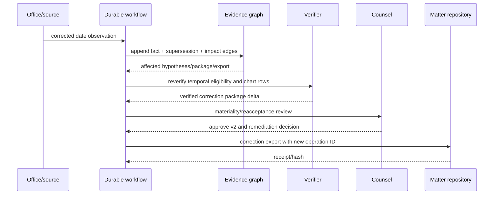

# Worked Production Flows

## Purpose and fixture

These fictional flows show record and authority behavior, not legal analysis. Names, dates, identifiers, passages, and event codes are invented so they cannot be mistaken for a real patent opinion. The accountable professional supplies every legal/date theory and owns every legal conclusion.

The running matter concerns a confidential cold-chain sensor concept. Counsel asks for **patentability-support research** against a redacted research claim, not a determination that the concept is novel or patentable.

```yaml
matter:
  matter_ref: opaque:m-2041
  tenant_id: tenant-north
  confidentiality: unpublished_invention_material
  processors: [private-corpus, private-model, approved-offline-ocr]
research_case:
  research_case_id: case:m-2041:patentability-support:v1
  product: patentability_support
  target_claim_set: claimset:internal:redacted:v3
  counsel_supplied_filter:
    candidate_publication_available_before: 2024-05-31
    uncertain_dates: retain_for_review
  permitted_output: attorney-review-package.v1
  prohibited: [patentability_conclusion, novelty_conclusion, filing_action]
```

No exact confidential claim text is sent to a public search, translation, OCR, or model endpoint. A later FTO question would be a different research case with jurisdictions, product mapping, live claim versions, and status sources; it cannot reuse this search’s cutoff or convert its element map into an infringement chart.

## Flow A — novelty-support search to reviewed evidence

### 1. Verify the target and segment it

The verifier captures the exact internal claim artifact and approves a research-only segmentation:

| Element | Exact-source relationship retained | Search facet examples | Legal status |
|---|---|---|---|
| E1 | Sensor produces a time series of measurements | sensor, detector, sampled measurements, periodic readings | Research segment only |
| E2 | Controller derives a drift value from successive measurements using a temperature correction | drift/offset/baseline change; successive samples; thermal compensation | Research segment only |
| E3 | Controller transmits an alert when corrected drift crosses a threshold | threshold notification; alarm/report; corrected drift | Research segment only |

The normalized facets cannot replace the exact source spans. Counsel has not supplied a binding construction.

### 2. Execute complementary, versioned searches

The controller authorizes private snapshot operations and runs independent branches:

| Branch | Example operation | Captured provenance | Failure/coverage behavior |
|---|---|---|---|
| Exact/proximity | Claim/description fielded lexical query | Logical expression, compiled syntax, analyzer, snapshot, result pages/hashes | Empty result is query-scoped only |
| Classification | Reviewer-approved CPC/IPC neighborhood + discriminating terms | Scheme edition, definitions/concordance hashes, included/excluded symbols | Historical/reclassified documents sampled separately |
| Citation/family | Backward/forward citations and provider family navigation from verified seeds | Citation source/category; family provider/definition/snapshot | Family member is navigation, not duplicate evidence |
| Multilingual | German/Japanese terms from approved bilingual seeds and class definitions | Language, source term, reviewer/translation version | Original-language candidate retained; public MT prohibited |
| Semantic | Private index candidate generation | Model/tokenizer/index/text-layer pins, score/rank, exact chunk | Score cannot create an element finding |
| NPL | Approved standards/manual/article indexes | Edition, public-availability evidence, rights and access record | Printed PDF date alone remains uncertain availability |

The query ledger shows 46 executions across seven route types, 312 exact publication results, 181 review groups after declared family projection, 55 passage-scanned groups, and 18 verifier items. These counts describe this run only; they do not estimate the universe of prior art.

### 3. Preserve candidates, family members, and date uncertainty

Three fictional candidates survive triage:

| Candidate | Identity/date evidence | Discovery | Open issue |
|---|---|---|---|
| A — `DE-FAKE-100-A1` | Direct publication artifact says 2023-11-09; older aggregate snapshot says 2023-11-02 | Exact + CPC + citation | Publication-date conflict; both before research cutoff |
| B — `JP-FAKE-200-A` | Aggregate says 2024-05-30; direct-office correction later says 2024-06-02 | Japanese lexical + semantic | Initially date-conflicting; later crosses research cutoff |
| C — `NPL-FAKE-MANUAL-v2` | Cover says 2023; archive first captured 2024-06-12 | NPL citation from A | Public availability before cutoff unverified |

Candidate A’s provider family contains fictional DE, WO, and EP publications. The review projection selects DE for its native structured German text but retains separate rows/artifacts for WO and EP. It does not combine their wording or status.

### 4. Build an element–evidence chart

The chart records passages and hypotheses, not `covered/not covered`:

| Element | Candidate and exact evidence | Agent hypothesis and differences | Verification/review |
|---|---|---|---|
| E1 | A, German paragraph `[0031]`, native XML plus reviewed translation | May correspond to periodic sensor readings; verify whether the sampling relation matches the source wording | Quote/locator verified; analyst supported |
| E2 | A, paragraphs `[0044]–[0047]` | Describes offset from successive readings and a temperature term; purpose and mathematical relation differ from the target | Verified; needs counsel |
| E3 | A | No passage located under protocol v1 | Search gap, not a statement of absence |
| E2 | B, Japanese paragraph `[0052]`, OCR + machine translation | Translation appears to say “without temperature correction”; negation alignment is uncertain | Blocked pending original-page bilingual review |
| E3 | B, Japanese paragraph `[0060]` | May describe threshold notification, but the threshold input may be raw rather than corrected drift | Locator verified; differences visible; date conflict open |
| E1–E3 | C | Manual appears relevant at a high level; no use as cutoff-eligible evidence until availability is supported | Retained as uncertain NPL lead |

The generator does not see the verifier’s final disposition in advance. The verifier checks artifact identity, offsets, surrounding context, original language, OCR/translation quality, and temporal record. Any later text/date correction stales the dependent row.

### 5. Record stopping and attorney review

The deterministic stop rule fires after every required branch is attempted, the last two approved rounds add no new review-worthy family, the 18-item verifier budget is full, and two gaps remain visible. The analyst does not declare sufficiency; counsel accepts or reopens the bounded protocol.

```yaml
review_decision:
  decision_id: decision:counsel:package-v1
  subject:
    graph_revision: 811
    protocol_id: protocol:m-2041:v1
    claim_set_hash: "..."
    package_hash: "..."
  accepted_research:
    - candidate_A_for_further_legal_review
  limitations:
    - candidate_B_publication_date_conflicting
    - candidate_C_public_availability_unverified
    - element_E3_search_gap_after_bounded_protocol
  legal_conclusions: none
  next_professional_action: counsel_owned
```

Counsel can separately decide whether the material affects drafting, disclosure, filing, or further searching. Those decisions are not inferred from the acceptance event.

## Flow B — family and legal-status reconciliation for a separate FTO-support case

Counsel later opens `case:m-2041:fto-support:v1` for Germany and France as of a supplied review date. The intake rejects “tell me if we are clear” and accepts “retrieve potentially relevant published/granted claims and source-reported legal events for counsel review.”

The agent observes:

1. an aggregate provider family assertion linking DE, WO, EP, and a national member;
2. an EP Register event sequence for the regional application;
3. a federated view with a French post-grant field;
4. a national-register query with no matching row because its documented coverage excludes the relevant event type;
5. a commercial display label reading “active.”

It creates separate records:

```yaml
conflict_set:
  conflict_id: conflict:fto-status:17
  subject_id: right:fr:fake
  assertions:
    - {source: federated-register, value: source_reported_event_X, observed_at: 2026-08-31T09:00:00Z}
    - {source: commercial-provider, value: display_label_active, observed_at: 2026-08-31T09:03:00Z}
    - {source: national-register, value: not_covered, observed_at: 2026-08-31T09:07:00Z}
  status: unresolved
  legal_effect: not_determined
```

The package displays exact current claims for each selected publication/right, raw events and dates, source coverage/age, and the unresolved conflict. It does not project “in force,” determine ownership/expiry, combine regional and national rights, or say whether any claim covers the product. Counsel requests a direct national-source check and owns the FTO analysis.

## Flow C — monitoring, restart, unknown export, and correction

### Monitoring delta

Counsel creates a weekly watch for the selected EP and national rights. Cycle 8 observes a new register event with an effective date older than cycle 7’s observation cut. The system labels it `late_arriving_event`, appends it, rebuilds only the source-scoped projection, and marks packages that displayed the earlier event sequence for review. It does not rewrite the prior cycle or send “status changed” without the exact source delta.

### Provider throttle and restart

During cycle 9, EPO OPS returns a quota/throttling response after two pages. The workflow commits the completed pages and a branch-degraded event, releases the source lease, and writes a compaction receipt. On restart it:

1. replays events to the recorded high-watermark;
2. verifies authority, qualification report, source/terms/schema pins, approvals, clocks, effect ledger, artifacts, budgets, and invariant hash;
3. checks the provider’s current quota window;
4. resumes from the supported next page with the same logical query and a new attempt;
5. produces a new observation for newly captured bytes without duplicating prior pages.

If OPS semantics/version no longer matched the pin, the run would pause for migration instead of switching to scraped Espacenet or an aggregate provider.

### Unknown package export

After counsel approves package v1, the document system accepts the payload but the acknowledgement connection fails:

| Time | Event | Durable state | Next safe action |
|---|---|---|---|
| 11:02:00 | Export intent committed | Effect `pending`; operation/package/destination hashes fixed | Attempt once |
| 11:02:03 | Connection lost after upload | Effect `unknown`; run cannot finalize or export again | Query destination by operation ID |
| 11:04:10 | Destination returns object with exact package hash | Remote receipt captured | Commit effect as reconciled |
| 11:04:11 | Local effect commit succeeds | Package `exported` once | Continue monitoring |

A user cancellation received at 11:03 would fence new work but remain `CancellationReconciling` until the unknown export was found or confirmed absent. Cancellation cannot erase the remote object.

### Material date correction

Two days later, the direct office publishes a correction for candidate B: publication date changes from 2024-05-30 to 2024-06-02. The new observation supersedes the old selected date assertion for protocol v2 but preserves both source artifacts. Impact traversal finds:

- B’s temporal-eligibility record;
- two B element hypotheses;
- counsel’s accepted package v1;
- the external export receipt;
- the saved query/result snapshots, which remain historically reproducible.

The system marks the hypotheses and package stale, rebuilds a candidate delta with B outside the counsel-supplied cutoff, and queues reverification. It does not delete B, reinterpret the law, retract the package, or notify recipients autonomously. Counsel approves package v2 and decides whether/how the prior recipient is informed. A new authorized correction export links v1, its receipt, the correction evidence, and v2.



## Handoff package

If Japanese bilingual review or a chemical/sequence specialist is needed, the workflow hands off durable state rather than a chat summary:

- exact task/product boundary and authority envelope;
- matter/data class and permitted processors/sources;
- target claim spans and candidate original-page artifacts;
- question, differences already observed, and forbidden legal labels;
- protocol/cutoff, family/date/status conflicts, and text-layer versions;
- budget, deadline, return schema, reviewer role, and escalation path;
- input graph revision, evidence manifest, approvals, active clocks, and no pending/unknown effect relevant to the handoff.

The recipient returns sourced observations, a reviewed translation or specialist note, limitations, and a decision event. It cannot silently modify the target, protocol, family/status resolution, or package approval.

## Flow acceptance checklist

- [ ] Each research product has its own case, protocol, date/jurisdiction theory, output vocabulary, and reviewer.
- [ ] Every query execution pins syntax, provider/index, corpus/cutoff, page/result hashes, and completion/degradation state.
- [ ] Family grouping changes the review projection only; member evidence remains separate.
- [ ] Element rows quote exact target/passages, show differences, and carry no legal conclusion.
- [ ] Status monitoring reports source events/deltas and coverage, never universal status.
- [ ] Restart verifies authoritative state, version pins, clocks, approvals, invariant hash, and effects before work.
- [ ] Unknown exports block retry/finalization until reconciliation.
- [ ] Cancellation fences work but does not pretend an uncertain external effect disappeared.
- [ ] Corrections append, traverse impact, stale dependents, and require professional remediation decisions.
- [ ] Handoffs are artifact/state packages with a return gate, not conversational memory.

Related contracts: [claims and evidence mapping](05-claims-elements-similarity-and-review.md), [state and recovery](06-state-context-memory-orchestration-and-recovery.md), [status and contradictions](07-status-provenance-contradictions-and-temporal-correctness.md), and [evaluation and operations](09-evaluation-operations-scaling-and-evolution.md).
