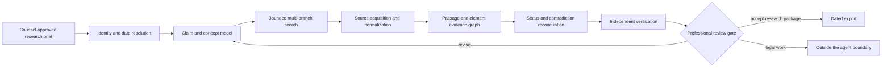

# Patent and Intellectual-Property Research Agent

> A production blueprint for evidence-first patent research that helps qualified professionals find, normalize, compare, and review patent and non-patent literature without pretending to make legal determinations.

## What this area covers

A patent-research system has to preserve distinctions that ordinary web research can safely blur. A publication is not an application. A simple family is not an identity relation between claim sets. A legal event is not a timeless global status. A similarity score is not disclosure of a claim element. Machine-translated text is not authoritative text. A search that found nothing is not proof that nothing exists.

This blueprint therefore treats the agent as a **research instrument under professional supervision**. Its durable product is an evidence graph and review package, not a conversational answer. It can:

- turn a counsel-approved question into a versioned research protocol;
- resolve publication, application, priority, family, classification, jurisdiction, and observation-time identities;
- run reproducible keyword, classification, citation, family, inventor/assignee, semantic, and non-patent-literature search branches;
- decompose a selected claim into reviewable elements while preserving the source wording;
- map passages to elements as cited observations and similarity hypotheses;
- reconcile office and commercial-source records without inventing a universal legal status;
- expose contradictions, missing coverage, OCR and translation uncertainty, and search limitations;
- assemble a dated, source-rights-aware package for patent counsel or an accountable patent-search professional.

It must not:

- declare patentability, novelty, obviousness/inventive step, validity, invalidity, infringement, non-infringement, freedom to operate, ownership, enforceability, or claim scope;
- file, submit, amend, prosecute, pay fees, calculate deadlines, or modify a docket, matter, register, or office record;
- treat semantic similarity, a citation category, a family relation, or a model confidence as legal claim coverage;
- expose an unpublished invention disclosure or privileged work product to an unapproved public search, translation, OCR, or model service;
- represent an incomplete search as exhaustive.

Counsel or another explicitly accountable professional owns the legal question, jurisdictional rules, date theory, claim construction, research sufficiency, conclusions, and any external action.

## Research products and replacement boundaries

The intake record must name the research product. Similar queries can require different corpora, date rules, family treatment, status checks, and reviewers.

| Product | Agent-supported work | Required output language | What remains outside the agent |
|---|---|---|---|
| Prior-art research | Find and preserve patent and non-patent candidates against a reviewer-supplied target and date filter | “Candidates located under protocol P”; passage evidence; gaps and unavailable branches | Whether a reference is legally prior art or anticipates/renders obvious any claim |
| Patent landscape support | Build a declared corpus, family proxy, classifications, entities, time series, and sampling/quality notes | “Observed in dataset/snapshot S under methodology M” | Market definition, competitive significance, portfolio strength, or a claim that the landscape is complete |
| Freedom-to-operate support | Retrieve jurisdiction-specific potentially relevant claims, family members, and source-reported legal events for a counsel-defined product/territory/date | “Candidate right for counsel review”; exact claim and status-event evidence | Claim construction, infringement, enforceability, ownership, exhaustion, license, design-around, or clearance conclusion |
| Validity evidence support | Search earlier materials, prosecution/citation records, claim versions, and passages for a counsel-selected right | “Evidence candidate”; no combination or invalidity label | Validity/invalidity, applicable grounds, burden, admissibility, and legally permissible combinations |
| Patentability support | Search an approved disclosure or claim draft using a practitioner-supplied date/jurisdiction theory | Bounded candidate package for drafting/prosecution review | Patentability, filing strategy, duty-of-disclosure decisions, claim drafting, prosecution, or filing |
| Legal-status monitoring | Re-observe named rights/sources, append raw events, detect deltas/conflicts, and route alerts | “Source X reported event Y as observed at Z” | Expiry, enforceability, ownership, deadline, remedy, or action on the monitored event |
| Attorney-owned conclusion | Assemble verified evidence and reviewer decisions | Deterministic evidence export only | The conclusion itself and every legal or office/matter effect |

Use deterministic retrieval instead of an agent when the task is an exact identifier lookup, fixed-field register report, known-document fetch, saved-query rerun, edition-pinned aggregation, or mechanical monitoring comparison. Use a qualified patent searcher when terminology/classification strategy and recall-oriented investigation dominate. Replace the agent with qualified counsel or a registered practitioner, as applicable, whenever the request asks what law applies, what a claim means, whether work is sufficient, whether a right blocks activity, what must be disclosed or filed, or what action/deadline follows. EPO warns that an Espacenet no-result search is not freedom of action, and USPTO describes public prior-art searching as preliminary and recommends qualified practitioner support ([EPO website terms](https://www.epo.org/en/terms-of-use/terms-and-conditions-use-website-european-patent-office), [USPTO applying for patents](https://www.uspto.gov/patents/basics/apply)).

## The production shape

The outer workflow is deterministic. One bounded investigative loop may propose query branches, vocabulary, classifications, citations, and follow-up documents. Policy, source access, budgets, state transitions, verification, approvals, and exports remain deterministic. This keeps semantic uncertainty inside a controlled envelope.

## Guide map

| Guide | Production question |
|---|---|
| [01 — Zero to production and authority](01-zero-to-production-and-authority.md) | What is built at stages 0–6, who may decide what, and what evidence is required to advance? |
| [02 — Architecture, integrations, and data plane](02-architecture-integrations-and-data-plane.md) | Which office, registry, classification, OCR, translation, licensed-database, and third-party workloads belong in which plane? |
| [03 — Patent identity, dates, families, and classifications](03-patent-identity-dates-families-and-classifications.md) | How are publications and their changing relationships normalized without false equivalence? |
| [04 — Prior-art search and retrieval](04-prior-art-search-and-retrieval.md) | How does a reproducible, high-recall, multi-strategy search work, and when does it stop? |
| [05 — Claims, elements, similarity, and review](05-claims-elements-similarity-and-review.md) | How are claims decomposed and passages mapped without turning a model score into a legal conclusion? |
| [06 — State, context, memory, orchestration, and recovery](06-state-context-memory-orchestration-and-recovery.md) | What is durable, what enters a model context, and how does the workflow resume safely? |
| [07 — Status, provenance, contradictions, and temporal correctness](07-status-provenance-contradictions-and-temporal-correctness.md) | How are facts, events, hypotheses, conclusions, and unresolved conflicts kept distinct? |
| [08 — Security, source rights, tenancy, and deployment](08-security-source-rights-tenancy-and-deployment.md) | How are confidential inputs, entitlements, licenses, exports, and tenant boundaries enforced? |
| [09 — Evaluation, operations, scaling, and evolution](09-evaluation-operations-scaling-and-evolution.md) | How is quality demonstrated repeatedly and operated under load, failures, cost, and change? |
| [10 — Worked production flows](10-worked-production-flows.md) | How do novelty support, an element-evidence chart, family/status conflicts, monitoring, attorney review, an unknown export, and a later correction behave end to end? |

The supporting [research packet](../../research/packets/patent-ip-research-agent-blueprint.md) records the research baseline, primary sources, conflicts, and refresh triggers used to produce this area.

## Shared contracts reused from this repository

This area specializes patent research instead of copying generic agent theory. Read it with these canonical contracts:

- [Agent state and event contracts](../../runtime/agent-state-and-event-contracts.md) and [durable execution](../../runtime/durable-execution.md)
- [Execution boundaries](../../runtime/execution-boundaries.md) and [run controls](../../runtime/run-controls.md)
- [Tool contracts](../../tools/tool-contracts.md), [artifact provenance](../../tools/tool-results-artifacts-and-provenance.md), and [tool lifecycle](../../tools/tool-registries-versioning-and-lifecycle.md)
- [Context engineering](../../context-memory/context-engineering.md), [compaction and continuity](../../context-memory/compaction-and-continuity.md), and [memory architecture](../../context-memory/memory-architecture.md)
- [Planning and replanning](../../orchestration/planning-and-replanning.md) and [delegation and handoffs](../../orchestration/delegation-handoffs-and-shared-state.md)
- [Prompt injection and untrusted data](../../security/prompt-injection-and-untrusted-data.md), [permissions and secrets](../../security/permissions-sandboxing-and-secrets.md), and the [agent threat model](../../security/agent-threat-model.md)
- [Idempotency and side effects](../../reliability/idempotency-and-side-effects.md) and [failure taxonomy](../../reliability/failure-taxonomy.md)
- [Trajectory evaluation](../../evaluation/trajectory-and-reliability-evaluation.md), [observability](../../evaluation/observability-and-tracing.md), and [evaluation-driven development](../../evaluation/evaluation-driven-development.md)
- [Deployment and incident response](../../operations/deployment-release-and-incident-response.md), [scaling and SLOs](../../operations/scaling-capacity-and-slos.md), [queues and backpressure](../../operations/queues-scheduling-and-backpressure.md), and [model routing](../../operations/model-routing-cost-and-latency.md)

## The non-negotiable semantic separation

Every durable record has exactly one semantic class:

| Class | Meaning | May it contain interpretation? | Example |
|---|---|---:|---|
| Observation | Immutable capture of what a source returned | No | “Register response at 2026-08-31T09:20Z contained event code …” |
| Extracted fact | Typed value parsed from one or more observations | Only normalization | Publication number, priority date, cited paragraph |
| Legal-status record | Source-attributed event or office-reported state, scoped by jurisdiction and observation time | No cross-jurisdiction conclusion | “Office X reported event Y on observed date Z” |
| Similarity hypothesis | Candidate relationship proposed for review | Yes, explicitly provisional | “Passage P may correspond to element E” |
| Research conclusion | A bounded synthesis accepted by an accountable reviewer | Yes, with scope and limitations | “Within protocol V, these candidates warrant counsel review” |
| External effect | An action outside the evidence graph | No hidden legal effect | Export a review package to an approved repository |

Mixing these classes is a schema violation, not a writing-style issue.

## Default authority model

| Decision | Agent | Patent searcher/analyst | Counsel/accountable professional |
|---|---:|---:|---:|
| Suggest synonyms, classifications, citations, and candidate passages | Propose | Review/refine | May review |
| Select approved sources and search budget | Enforce configured bounds | Recommend | Approve material scope |
| Resolve identifiers and preserve conflicting records | Perform mechanically | Verify exceptions | Escalation authority |
| Decompose claims into research elements | Draft | Verify | Approve where consequential |
| Decide relevant law, effective date, claim construction, or legal sufficiency | Never | Never unless separately authorized | Required |
| Label a candidate as a similarity hypothesis | Propose | Accept/reject | May accept for legal analysis |
| Make a legal conclusion or take an office/matter action | Never | Never | Outside this agent; separate authorized process |
| Accept a dated research package | Never self-approve | Quality approval if delegated | Final accountability |

## First implementation slice

The smallest useful system is not an autonomous patent lawyer. It is a single-tenant, read-only, one-jurisdiction research workspace that accepts a redacted or approved public claim set, searches an entitlement-checked corpus, preserves every query and result snapshot, produces cited passages and element hypotheses, and requires human acceptance before export. Legal-status reconciliation, multilingual search, licensed databases, and portfolio scale arrive only after the evidence contract and recovery behavior are proven.

Start with [01 — Zero to production and authority](01-zero-to-production-and-authority.md).
