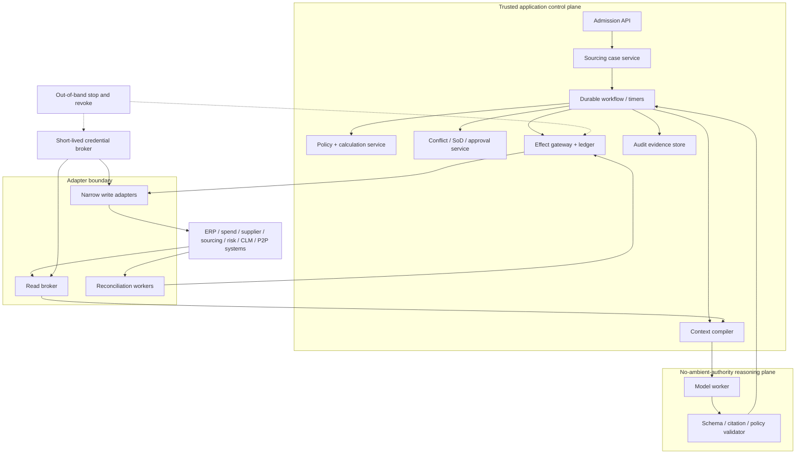

# Reference Architecture, Runtime, and Integrations

> **Purpose:** Choose a proportionate control-plane architecture and integrate procurement systems without treating an SDK or vendor API as an end-to-end safety guarantee.

## Recommended production shape

Use a durable sourcing coordinator with replaceable, stateless model workers. Keep the source-to-pay or e-sourcing platform authoritative for its event and bid objects; keep policy, conflict, approval, effect, and audit controls in trusted application services.



The model cannot call vendor APIs directly. Read brokers enforce field, row, tenant, event, and purpose filters. Write adapters expose canonical procurement operations rather than raw HTTP methods. Reconciliation uses authoritative reads and provider correlation IDs.

## Component responsibilities

| Component | Owns | Must not own |
| --- | --- | --- |
| Admission API | Initiator identity, tenant/legal entity, case type, duplicate key, regime profile | Free-form model interpretation of authority |
| Sourcing case service | Case ID, state/version, owner, deadlines, release manifest, domain events | Procurement-platform bid truth or legal contract truth |
| Durable workflow | Timers, waits, cancellation, retries, assignment, resume | Exactly-once claims for arbitrary external APIs |
| Context compiler | Minimum event-authorized evidence, labels, budgets, compaction receipts | Authorization or irreversible filtering of authoritative evidence |
| Model worker | Typed proposals, cited observations, questions, abstention | Policy, official score, conflict decision, approval, effect commit |
| Policy/calculation service | Thresholds, route rules, currency/unit math, scoring formulas, preconditions | Interpretation of ambiguous bid prose |
| Conflict/approval service | Role eligibility, SoD graph, declarations, exact grants, expiry | Relying on a model's assertion that approval exists |
| Effect gateway | Canonical target, intent hash, credential attachment, dispatch, receipt, postcondition | Open-ended vendor method selection |
| Audit evidence store | Unsampled decisions, versions, hashes, receipts, access lineage | Sampled diagnostics or a mutable transcript |
| Telemetry pipeline | Latency, errors, cost, queue health, redacted traces | Business state, approval evidence, or raw bids by default |

## Architecture decision table

| Option | Durability | Control and audit | Build/operate burden | Best fit | Reject when |
| --- | --- | --- | --- | --- | --- |
| Workflow and rules only | High with ordinary BPM/workflow | Strongest | Low–medium | Structured requisitions, catalogs, standard RFQs | Semantic ambiguity is the measured bottleneck |
| Custom synchronous agent loop | Low unless added | High if application-owned | Low initially | One bounded, read-only step | Work waits across deadlines/approvals or performs effects |
| Agent SDK application | SDK-dependent | Application still owns guarantees | Medium | Team wants maintained loop/tool/trace primitives | SDK state is mistaken for procurement state or lock-in is unacceptable |
| Durable workflow + model activity | High | Strong, explicit boundaries | Medium | Recommended for real sourcing events | One short, read-only interaction is the whole workload |
| Procurement-suite-native extension | Product-specific | Can reuse native roles/audit | Medium and vendor-dependent | Suite is authoritative and extension surface is adequate | API permissions, versioning, evidence export, or reconciliation cannot be proven |
| Multi-agent topology | Handoff-dependent | Harder to reason about | High | Rare independent read investigations | Organizational role-play is the only rationale |

A procurement platform may already supply workflow, sealed bids, scorecards, approvals, and audit logs. Reuse those features when they satisfy the organization's controls. Do not replicate a system of record merely to introduce an agent.

## Runtime and language choices

| Runtime | Strengths in this workload | Limits | Practical role |
| --- | --- | --- | --- |
| TypeScript / Node.js | Strong HTTP/OAuth/OpenAPI ecosystem, JSON schema ergonomics, efficient I/O | CPU-heavy document work needs separate workers; numeric discipline must be explicit | API/control plane for teams already operating Node services |
| Java / Kotlin | Mature transactions, messaging, policy and enterprise integration, strong typing | More ceremony for experiments | Durable control plane in JVM estates |
| C# / .NET | Enterprise identity, workflow and ERP integration, strong operations tooling | Provider SDK parity must be verified | Control plane in Microsoft-centric estates |
| Python | Extraction, document/ML tooling, analytics, evaluation harnesses | Dynamic typing and mixed async/process behavior require discipline | Isolated proposal/evaluation workers; control plane only with a mature Python platform |
| Go | Small services, concurrency, static binaries, predictable operations | Less first-party model/document ecosystem in some deployments | High-throughput adapters and reconciliation workers |

Choose from team operations, procurement/ERP SDK support, workflow-runtime support, diagnostics, data libraries, and deployment constraints—not benchmark fashion. Use decimal types for money, explicit time zones, versioned schemas, and generated clients from pinned specifications in every language.

## Model strategy

Required capabilities are reliable structured output, long-document evidence use, tool selection under hard bounds, multilingual procurement text where applicable, and calibrated abstention. No provider feature removes application-side validation.

Use task-specific routing:

| Task | Default model class | Fallback |
| --- | --- | --- |
| Category candidate or simple extraction | Small, schema-reliable model | Deterministic keyword/taxonomy search or human queue |
| Complex bid evidence mapping | Higher-capability document/reasoning model | Split deterministic extraction plus specialist review |
| Recommendation narrative from verified facts | Mid/high capability with no write tools | Template-based report from deterministic comparison |
| Policy, math, scoring, conflict, approval | No model | Deterministic service or human authority |

Pin provider, model snapshot or versioned alias behavior, instruction release, tool set, schema, temperature/sampling controls where available, and context-builder release in the behavior manifest. Route a task only after the same procurement critical slices pass for that route. Do not fall back to a weaker model if it fails confidentiality, citation, or abstention thresholds; route to a person or deterministic artifact.

## Third-party integration map

| System class | Read needs | Permitted writes | Critical controls |
| --- | --- | --- | --- |
| ERP / requisition / budget | Requisition, cost center, budget reference, historic spend aggregates | Staged requisition annotation at most | Field minimization, currency/period semantics, source revision |
| Procurement / e-sourcing suite | Event metadata, authorized bids after opening, scores, audit log | Approved publish, invitation, clarification, deadline, award operations | Native role recheck, event version, sealed-state enforcement, correlation ID, reconciliation |
| Supplier master / onboarding | Canonical supplier, site, status, duplicate candidates | Create an approved onboarding case, not unrestricted supplier mutation | Entity resolution, SoD, bank-data exclusion, downstream owner acknowledgement |
| Identity / HR / delegation | Actor, role, employment, manager/delegation, recusal | None from agent | Current revocation, stable IDs, aggregate-role SoD |
| Policy / approval | Thresholds, required roles, grants, exceptions | Submit exact proposal for decision | Effective dates, version, expiry, intent hash, one-time use |
| Registries / sanctions / debarment | Entity identifiers, aliases, list entries, timestamps | None | Jurisdiction/scope, source snapshot, fuzzy match as candidate only |
| Commercial supplier-risk data | Financial, cyber, ESG, ownership, adverse signals | None | License/purpose limits, provenance, appeal/correction, score explainability |
| Notice portals / marketplaces | Opportunities, supplier/category data | Approved notice publication if supported | Equal access, completeness, publication receipt, public/confidential split |
| Document service | Malware result, OCR/layout, page/field spans | Store quarantined/derived artifact | Immutable original hash, tenant/event isolation, content limits |
| CLM / legal workspace | Template/reference IDs, handoff status | Create approved commercial handoff package | No legal text authority; payload digest and acknowledgement |
| P2P / contract performance | Read-only signed facts, PO/invoice/performance aggregates for reconciliation | None | Procurement does not operate orders; periods, scope, and corrections explicit |
| Email/chat | Delivery state for internal notification | Approved notification only | Never treat a reaction/message as approval; exact audience and payload |

Browser/RPA integration is a last-resort migration seam when no supported API or export exists. Keep it supervised, event-specific, screenshot/evidence-rich, and outside sealed-bid or award commits. Its fragile state and weak idempotency usually make it unsuitable for production sourcing authority.

## Adapter contract

Every connector operation returns a common evidence envelope even when the vendor schema differs:

```json
{
  "operation": "get_event_bid_snapshot",
  "connector_release": "ariba-event-v2_2026-05",
  "tenant_id": "tenant_acme",
  "principal_id": "workload/procurement-read",
  "resource": {
    "system": "sourcing_platform",
    "event_id": "evt_7812",
    "event_version": 9,
    "sealed_state": "opened_for_evaluator",
    "bid_id": "bid_204",
    "bid_revision": 3
  },
  "status": "ok",
  "observed_at": "2026-08-31T08:22:41Z",
  "source_updated_at": "2026-08-30T17:00:00Z",
  "evidence_id": "ev_01K...",
  "artifact_sha256": "sha256:...",
  "vendor_request_id": "req-493",
  "warnings": [],
  "data": {"document_refs": ["artifact/bid_204_rev3"]}
}
```

Errors distinguish `invalid_input`, `forbidden`, `wrong_tenant`, `sealed`, `not_found`, `stale`, `rate_limited`, `timeout_before_dispatch`, `outcome_unknown`, `schema_incompatible`, and `source_unavailable`. The model never receives an opaque exception and invents the missing fact.

For writes, add `effect_id`, `intent_hash`, `approval_id`, `expected_remote_version`, `deadline`, `idempotency_contract`, and `postcondition`. Reserve the effect before dispatch. If the remote system does not support a caller key, persist an external correlation field where possible and reconcile before retry.

This envelope is necessary but not sufficient. Every deployable operation also needs a `procurement.capability_manifest`, source/configuration-specific conformance report, provider-state mapping, qualification expiry, and typed entity/event/bid/lot/criteria/money/effect/handoff identities. See [Adapter qualification and worked sourcing lifecycle](11-adapter-qualification-and-worked-sourcing-lifecycle.md) for the common suite and current source-family limits.

## Current vendor evidence and limitations

The following are examples, not endorsements or portable guarantees:

- SAP's Event Management API documentation dated 2026-05 covers event, participant, response, scenario, award, sealed-bid, and audit-log operations. It also states that the API does not itself validate whether a user has permission to perform actions and places access control on the client organization. Therefore, the adapter must enforce application policy and use narrowly controlled API identities.
- Oracle Fusion Cloud Procurement 26B publishes versioned REST resources and custom sourcing actions; some resources/actions depend on opt-in features. Pin the resource version and test enabled behavior in the target tenant.
- Coupa publishes current release schemas (R44 at the research date) while its easily indexed sourcing endpoint page is explicitly marked legacy and unmaintained. Build from the target tenant's current supported specification, not a search result or remembered endpoint.

These examples prove that production suites expose useful integration surfaces. They do not prove uniform authorization, idempotency, sealed-bid semantics, audit completeness, quota behavior, or backward compatibility. Verify each on the exact subscribed product release.

## Integration admission checklist

- [ ] System and data owner approve purpose, fields, retention, and legal/contractual use.
- [ ] User/delegation and workload identity are separate; credentials are short-lived, audience-bound, scoped, and model-invisible.
- [ ] Tenant, legal entity, event, supplier, bid, and environment identifiers are canonicalized outside the model.
- [ ] API/product/schema release, enabled features, quotas, pagination, ordering, and freshness are pinned and contract-tested.
- [ ] Read filters prevent sealed, competitor, cross-event, and cross-tenant disclosure.
- [ ] Write operations map to narrow canonical effects with exact approval and state preconditions.
- [ ] Provider idempotency, correlation, timeout, late response, and reconciliation behavior is measured.
- [ ] Webhook authenticity, replay, duplication, ordering, and gap recovery are tested.
- [ ] Raw response artifacts are size-limited, hashed, access-controlled, and separately retained from compact context.
- [ ] Source outage, revocation, schema drift, and manual fallback runbooks exist.

## Sources and next step

- [SAP Ariba Event Management API, document version 2605](https://help.sap.com/docs/ariba-apis/event-management-api/event-management-api)
- [Oracle Fusion Cloud Procurement 26B APIs](https://docs.oracle.com/en/cloud/saas/procurement/26b/api.html)
- [Coupa Core API and current schema downloads](https://compass.coupa.com/en-us/products/product-documentation/integration-technical-documentation/core-api-and-csv-download-formats)
- [OASIS Universal Business Language 2.4](https://docs.oasis-open.org/ubl/UBL-2.4.html)
- [Open Contracting Data Standard 1.1.5](https://standard.open-contracting.org/latest/en/schema/reference/)

Continue with [Requisition, spend, category, and policy evidence](03-requisition-spend-category-and-policy-evidence.md). See [Tool contracts](../../tools/tool-contracts.md) and [Tool registries, versioning, and lifecycle](../../tools/tool-registries-versioning-and-lifecycle.md) for reusable mechanics.
