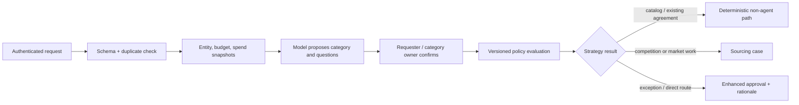

# Requisition, Spend, Category, and Policy Evidence

> **Purpose:** Convert an ambiguous business request into an authorized sourcing strategy while keeping demand ownership, category semantics, budget facts, thresholds, and route decisions deterministic and reviewable.

## The intake contract

“Find a vendor for a new analytics tool” is not an executable sourcing request. Admission requires a typed business-need record:

```json
{
  "requisition_id": "req_01K...",
  "requester_id": "person_842",
  "tenant_id": "tenant_acme",
  "legal_entity_id": "le_india_01",
  "business_owner_id": "person_217",
  "need": {
    "outcome": "governed self-service product analytics",
    "in_scope": ["software_subscription", "implementation_services"],
    "out_of_scope": ["cloud_infrastructure_operations"],
    "required_by": "2027-02-01",
    "locations": ["IN", "GB"],
    "data_classes": ["employee_pseudonymous", "customer_aggregate"],
    "acceptance_measures": ["approved_metric_catalog_integration", "regional_data_controls"]
  },
  "commercial": {
    "estimated_value": {"amount": "420000.00", "currency": "USD"},
    "value_period": "P3Y",
    "budget_reference": "budget_analytics_2027",
    "incumbent_supplier_id": null
  },
  "source_artifacts": ["artifact/business_case_v4"],
  "submission_digest": "sha256:...",
  "submitted_at": "2026-08-31T08:00:00Z"
}
```

The requester and business owner own the need and acceptance outcome. The agent can detect omissions or contradictions, but it cannot expand demand, invent a budget, split spend to avoid a threshold, or choose a favorable legal entity.

## Deterministic intake pipeline



Admission rejects or pauses unauthenticated requests, invalid legal entities, missing business owners, unsupported currencies, inaccessible artifacts, duplicate semantic needs, and impossible deadlines. It does not ask the model to repair control facts.

## Duplicate and aggregation controls

Use two identities:

- `requisition_id` deduplicates delivery of the same submission;
- `demand_key` groups materially similar needs across time, business units, and channels under policy.

A deterministic candidate query can compare category, business outcome, locations, time window, incumbent, budget/program, and normalized line items. The model may explain likely overlap, but a procurement owner decides whether to merge. Evaluate aggregate value and related requirements before thresholds; never let case splitting create a lower approval or competition route.

## Spend evidence without false precision

Spend analysis is a snapshot, not a fact learned from a chat or vector index.

| Evidence | Required semantics | Common failure |
| --- | --- | --- |
| Invoice/PO/contract aggregates | Source, legal entity, supplier IDs, category mapping release, period, currency/FX, corrections, coverage | Mixing booked, ordered, and contracted amounts |
| Existing agreements | Scope, term, remaining value/capacity, eligible entities, items, restrictions | Treating a named framework as automatically usable |
| Demand pipeline | Owner, probability/status, period, amount basis | Double counting tentative and approved demand |
| Supplier concentration | Canonical group ownership, direct/indirect spend, period | Alias fragmentation or stale parent relationships |
| Price/market benchmarks | Comparable scope, unit, geography, time, source rights | Presenting a non-comparable median as a fair price |

Label data as complete, provisional, estimated, corrected, disputed, or stale. Preserve decimals and currencies. The model receives deterministic aggregates and warnings, not unrestricted ERP rows.

## Category classification

UNSPSC, CPV, and internal category trees answer different questions. UNSPSC is a product/service classification used in procurement; CPV is the EU public-procurement vocabulary; an internal taxonomy may encode category ownership, risk, sourcing channels, and policy. NAICS classifies supplier industries and is not a substitute for classifying what is being bought.

Use a versioned mapping contract:

```yaml
classification_proposal:
  requisition_id: req_01K...
  taxonomy_release: internal_category_2026_07
  candidates:
    - code: IT-SW-ANALYTICS
      evidence: ["need.in_scope[0]", "artifact/business_case_v4#p3"]
      rationale: "Subscription is the dominant intended commitment"
      confidence_band: high
    - code: IT-SERV-IMPLEMENT
      evidence: ["need.in_scope[1]"]
      rationale: "Services are a separate line and may require a secondary category"
      confidence_band: medium
  unresolved: ["Is implementation optional or mandatory for acceptance?"]
  model_release: sourcing_classifier_12
```

The category owner confirms the authoritative category. A confidence label is routing metadata, not proof. Exact-match history can assist, but rejected or corrected classifications do not become long-term rules automatically.

## Policy evaluation contract

The policy engine takes canonical facts and returns obligations, not advice:

```json
{
  "policy_release": "sourcing_policy_2026_08_15",
  "evaluated_at": "2026-08-31T09:15:00Z",
  "inputs_digest": "sha256:...",
  "route": "competitive_rfp",
  "required_controls": [
    "category_owner_approval",
    "information_security_review",
    "privacy_review",
    "three_person_evaluation_panel",
    "award_authority_level_3"
  ],
  "supplier_checks": ["entity", "sanctions", "financial", "cyber", "data_location"],
  "publication_profile": "private_invited_event",
  "exceptions": [],
  "explanation_codes": ["VALUE_BAND_3", "SENSITIVE_DATA", "MULTI_COUNTRY"]
}
```

Rules evaluate exact amount basis, currency policy, duration/options, legal entity, category, geography, data/safety criticality, competition route, incumbent/related supplier, emergency/direct-award reason, and cumulative related spend. Store both the historical policy result and current safety revocations. A later policy loosening never enlarges an existing approval.

## Route-to-market decision surface

| Condition | Default route | Model role | Human/control requirement |
| --- | --- | --- | --- |
| Valid existing catalog/agreement fully covers need | Deterministic catalog/call-off process | Explain match or missing fields | Authorized buyer verifies eligibility and capacity |
| Low-complexity, comparable requirement | Structured RFQ | Draft requirements and extract quotes | Procurement approves supplier set and award method |
| Quality and approach materially differentiate | Competitive RFP | Research market and organize cited evidence | Published criteria, independent evaluation, award authority |
| Solution is unclear and engagement is permitted | RFI/market engagement before final event | Summarize responses without favoring a supplier | Equal-treatment and information-release controls |
| Single-source/direct route requested | Exception workflow | Gather evidence and counterarguments | Named authority approves legal/policy basis and rationale |
| Urgent need | Emergency profile | Assist with facts and options | Time-bounded authority, competition where feasible, retrospective review |
| No credible supply-market advantage | Insource/stop decision | Summarize evidence | Business and commercial owners decide; no sourcing event |

Applicable law and policy can change the route. Public-procurement principles from the OECD, UNCITRAL, WTO GPA, EU, World Bank, FAR, or national law apply only when the organization and procurement are in scope. Encode the adopted rule profile; do not blend regimes into a universal prompt.

## Threshold and approval freshness

Recompute policy and require reapproval when any material fact changes:

- estimated or evaluated value, currency basis, term, options, quantity, or lot structure;
- legal entity, funding source, geography, category, data class, safety/criticality, or delivery model;
- route, supplier set, incumbent relationship, competition exception, or conflict state;
- criteria, weights, normalization rules, contract form reference, deadline, or event version;
- policy revocation, approver authority, budget availability, or organizational delegation.

The model may point out that a change is material. The policy engine decides from a versioned rule.

## Failure modes and recovery

| Failure | Detection | Safe response | Recovery evidence |
| --- | --- | --- | --- |
| Duplicate email and portal request | Same digest/demand candidates | Hold merge; do not open two events | Owner merge decision and linked IDs |
| Category ambiguity | Multiple plausible codes or missing scope | Ask bounded questions; route to category owner | Confirmed category and taxonomy release |
| Spend snapshot omits entity/period | Completeness rule fails | Mark unknown; block aggregate decision | Corrected snapshot with lineage |
| Currency or duration mismatch | Typed validation | No threshold calculation | Approved FX/time basis and recomputation |
| Threshold avoidance by split demand | Aggregate-demand rule | Freeze cases and investigate | Related-case decision and approval |
| Policy changes while waiting | Release/revocation mismatch | Re-evaluate; invalidate affected approval | Old/new decisions and transition rationale |
| Existing agreement appears usable but scope is unclear | Coverage predicate unknown | Legal/procurement review; no auto call-off | Eligibility/capacity decision reference |
| Model asserts a budget or emergency | Source mismatch | Reject assertion as unsupported | Authoritative budget or emergency approval |

## Intake readiness checklist

- [ ] Requester, business owner, tenant, legal entity, and budget reference are canonical and authorized.
- [ ] Outcome, scope, exclusions, deadline, locations, data classes, quantities, value basis, term, and acceptance measures are explicit.
- [ ] Duplicate delivery and related-demand aggregation are evaluated.
- [ ] Spend and agreement snapshots include source, revision, period, currency, coverage, and warnings.
- [ ] Category proposals cite evidence and preserve alternatives; a named steward confirms the result.
- [ ] Policy output is deterministic, effective-dated, explainable by codes, and stored with its input digest.
- [ ] Route exceptions, emergency handling, and direct awards require enhanced human rationale and approval.
- [ ] Material change triggers are wired to policy re-evaluation and approval invalidation.

## Sources and next step

- [OECD Recommendation on Public Procurement](https://legalinstruments.oecd.org/en/instruments/OECD-LEGAL-0411)
- [UN Global Marketplace: UNSPSC](https://www.ungm.org/Public/UNSPSC)
- [EU Common Procurement Vocabulary](https://ted.europa.eu/en/simap/cpv)
- [UK GovS 008 Commercial, version 2.2](https://www.gov.uk/government/publications/government-functional-standard-govs-008-commercial-and-commercial-continuous-improvement-assessment-framework/government-functional-standard-govs-008-commercial-html)
- [UK Sourcing Playbook, updated 2026-06-15](https://www.gov.uk/government/publications/the-sourcing-and-consultancy-playbooks/the-sourcing-playbook-html)

Continue with [Supplier discovery, identity, and due diligence](04-supplier-discovery-identity-and-due-diligence.md). Return to the [guide map](README.md#guide-map).
