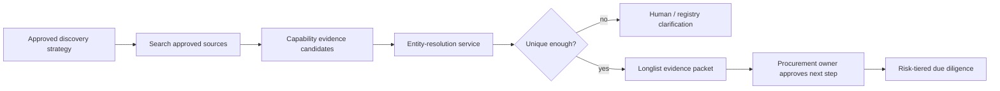

# Supplier Discovery, Identity, and Due Diligence

> **Purpose:** Build a broad, defensible supplier evidence set without turning search ranking, name similarity, private risk scores, or allegations into an automatic qualification or exclusion decision.

## Keep four decisions separate

1. **Discovery:** Which entities might supply the requirement?
2. **Identity resolution:** Which legal entity, site, parent, owner, and alias does each result represent?
3. **Qualification/due diligence:** Which policy checks apply and what does current evidence show?
4. **Disposition:** May the entity be invited, evaluated, awarded, onboarded, mitigated, or excluded under the event's regime?

The model can assist with the first three as an evidence worker. An authorized procurement, compliance, security, finance, or legal owner makes the disposition required by policy. A search engine result is not due diligence, and due diligence is not legal adjudication.

For provider-specific qualification, identity envelopes, current registry and sanctions-service limits, and a worked event, continue to [Adapter Qualification and Worked Sourcing Lifecycle](11-adapter-qualification-and-worked-sourcing-lifecycle.md).

## Discovery strategy contract

```yaml
discovery_strategy:
  case_id: src_01K...
  event_scope: analytics_software_and_implementation
  category_release: internal_category_2026_07
  markets: [IN, GB]
  capability_requirements:
    - governed_metric_catalog_integration
    - regional_data_controls
  mandatory_participation_conditions: []
  diversity_and_access_objectives:
    - include_approved_sme_marketplaces
  allowed_sources:
    - internal_supplier_master
    - approved_marketplace
    - official_company_registry
    - supplier_public_site
  prohibited_features:
    - inferred_protected_characteristic
    - personal_social_graph
    - unapproved_reputation_score
  query_budget: 30
  freshness_cutoff: 2026-07-01
  owner: category_manager_12
```

Create this strategy before search. It prevents an agent from narrowing the market around familiar vendors, a favored geography, a keyword accident, or a biased historical award pattern. Record excluded sources and reasons. Where public-procurement access and non-discrimination rules apply, the authorized procedure and publication channel control participation—not agent ranking.

## Discovery loop



Use multiple query formulations and sources when the market warrants it. Preserve evidence for why a supplier appears, why a source was unavailable, and what remains unknown. Do not present the top-N retrieval order as a quality or eligibility ranking.

## Canonical supplier identity

A supplier is not a name string. Maintain an event-relevant identity graph:

| Record | Examples | Authority and caveat |
| --- | --- | --- |
| Legal entity | Registration number, jurisdiction, legal name, status | Official registry where available; scope and freshness vary |
| Procurement identifiers | Internal supplier ID, SAM Unique Entity ID, network ID, marketplace ID | Source-system identifiers; never assume cross-system equivalence |
| LEI | LEI and Level 1 reference data | Useful global identifier where issued; not every supplier has one |
| Ownership relationships | Direct/ultimate parent, relationship period, reporting exception | GLEIF Level 2 or beneficial-ownership source; exceptions and non-public data are meaningful |
| Sites and accounts | Supplier site, remit-to site, country, procurement-platform contact | Operational identities; not proof of legal ownership |
| Aliases | Trading names, former names, transliterations | Evidence for matching, not a new entity |
| Natural persons | Authorized contacts and disclosed beneficial owners where required | Minimize, purpose-limit, protect, and never infer beyond source |

Represent candidate matches explicitly:

```json
{
  "supplier_candidate_id": "sc_422",
  "canonical_supplier_id": null,
  "observed_name": "Acmé Analytica Pvt Ltd",
  "candidate_entities": [
    {
      "entity_id": "registry/IN-U72900KA2019PTC123456",
      "match_features": ["normalized_name", "city", "website_domain"],
      "conflicts": ["street_number_differs"],
      "status": "needs_review"
    }
  ],
  "source_evidence_ids": ["ev_registry_91", "ev_site_44"],
  "resolver_release": "supplier_identity_8"
}
```

Never merge entities solely on fuzzy name similarity. Never let one provider's opaque company ID replace the internal canonical mapping. Record merges, splits, supersession, and correction history.

## Risk-tiered due diligence profile

The applicable profile is determined from category, jurisdiction, value, service criticality, data/system access, payment/channel risk, ownership complexity, subcontracting, public-official interaction, and policy—not from model intuition.

| Domain | Possible evidence | Decision owner | Important limitation |
| --- | --- | --- | --- |
| Legal existence and status | Official registry, tax/business identifier | Supplier onboarding/procurement | Registry coverage and update cadence differ |
| Sanctions/restricted parties | Applicable official lists and program tags | Sanctions/compliance owner | List scope is jurisdiction-specific; fuzzy score is not a final match |
| Debarment/exclusion | SAM.gov, World Bank list, national lists where applicable | Procurement/legal/compliance | A list applies only under its legal/program scope |
| Beneficial ownership | Registry, GLEIF relationships, BODS-formatted source | Compliance/legal | BODS 0.4 is pre-1.0; absence and reporting exceptions are not “no owner” |
| Anti-bribery/integrity | Business rationale, ownership/associations, red flags, certifications | Compliance | Proportionate, risk-based review; allegations require resolution and fairness |
| Financial standing | Audited statements, official filings, approved provider, ratios | Finance/commercial risk | Period, entity, consolidation, currency, and going-concern context matter |
| Cyber/supply-chain risk | NIST-aligned questionnaire/evidence, product provenance, incident posture | Security/C-SCRM owner | A questionnaire or badge is not a control assessment or guarantee |
| Privacy/data processing | Processing locations, subprocessors, control evidence | Privacy/security/legal | Procurement collects evidence; legal owns obligations and adequacy conclusions |
| Responsible business conduct | Risk-based human-rights, labor, environmental evidence | Sustainability/compliance | Applicability and required response vary by law, policy, sector, and geography |
| Performance | Approved references, internal verified outcomes, formal performance records | Procurement/business owner | Disputed, stale, unrelated, or confidential history must be contextualized |

NIST SP 1326 (July 2026) scopes ICT supplier due diligence around foreign ownership/control/influence, provenance, resilience, foundational cyber practices, and supply-chain tiers. It is useful for ICT profiles, not a universal eligibility algorithm. DOJ and SEC guidance supports risk-based third-party due diligence, business rationale, payment/service coherence, and ongoing monitoring; it does not authorize an agent to make a legal conclusion.

## Evidence snapshot

```json
{
  "snapshot_id": "dd_01K...",
  "supplier_id": "supplier_779",
  "case_id": "src_01K...",
  "profile_release": "software_supplier_high_6",
  "as_of": "2026-08-31T10:00:00Z",
  "checks": [
    {
      "check": "ofac_applicable_lists",
      "source_release": "sls_delta_2026-08-31T09:00Z",
      "result": "candidate_match_requires_review",
      "evidence_id": "ev_ofac_31",
      "expires_at": "2026-09-01T10:00:00Z"
    },
    {
      "check": "legal_entity_status",
      "source_release": "registry_2026-08-30",
      "result": "active",
      "evidence_id": "ev_reg_77",
      "expires_at": "2026-11-29T00:00:00Z"
    }
  ],
  "gaps": ["ultimate_parent_reporting_exception_needs_review"],
  "disposition": "pending_compliance",
  "disposition_owner": "compliance_queue_apac"
}
```

Each check records the exact source/list/program, query/matching method, source and observation times, result vocabulary, evidence, expiry, and owner. A new award or onboarding commit rechecks required sources and policy. Retain the historical snapshot so the decision can be reconstructed.

## Sanctions and exclusions matching

OFAC's Sanctions List Service is the official U.S. delivery point for SDN and consolidated non-SDN list data and its search uses fuzzy logic. Treat that as candidate generation. A production matcher must preserve names, aliases, identifiers, dates, addresses, programs, list type, source release, normalization/transliteration method, and match features. Route ambiguous matches to trained reviewers; do not silently clear or reject.

Apply the same discipline to SAM.gov exclusions and the World Bank ineligible-firms list. The World Bank list updates frequently and distinguishes debarment/cross-debarment and other sanctions; its consequence is tied to Bank-financed procurement rules. A clean check against one list does not establish universal eligibility.

## Commercial data providers and third-party tools

Commercial supplier intelligence can reduce investigation time, but the adapter must expose source dates, coverage, sub-scores, material inputs, entity mapping, license restrictions, correction channels, and outages. Reject a product that returns only a non-reproducible “risk score” for a consequential decision.

Do not allow a vendor's plugin, marketplace app, MCP server, or browser extension to inherit sourcing-platform authority merely because it is convenient. Admit its publisher, version, schemas, data flows, subprocessors, scopes, and update process. Keep reads behind the broker and consequential effects behind the same application policy gateway as first-party adapters.

## Ongoing monitoring without perpetual suspicion

Refresh only checks justified by policy and risk. Trigger review on pre-award, onboarding, source/list change, ownership or legal-status change, material adverse event, contract renewal, scope/access expansion, or a defined periodic cadence. Do not continuously scrape employees or accumulate unverified allegations.

Long-term supplier memory may contain curated, verified dispositions and realized outcomes with provenance, expiry, access, correction, dispute, and deletion handling. Current authoritative evidence wins. A disputed incident or past model suspicion never becomes a permanent hidden penalty.

## Failure matrix

| Failure | Signal | Containment | Recovery |
| --- | --- | --- | --- |
| Two suppliers merged by similar name | Conflicting registration/address/ownership | Block invitation/award for identity-dependent operation | Human resolution, split mapping, affected-case recheck |
| One supplier fragmented across aliases | Duplicate website/registration/parent evidence | Prevent duplicate invitations and concentration math | Merge with provenance and recompute |
| List source stale/unavailable | Release age or fetch failure exceeds policy | `unknown`, not clear; block dependent commit | Fresh official snapshot or authorized exception |
| Fuzzy sanctions false positive | Weak name-only similarity | No automatic exclusion or supplier contact | Trained review with identifiers and recorded rationale |
| Beneficial owner absent | Reporting exception or unavailable registry | Preserve gap; do not infer “no owner” | Required alternate evidence or risk-owner disposition |
| Commercial score changes silently | Provider schema/model/release drift | Quarantine new results | Contract test, source explanation, re-baseline |
| Adverse allegation injected in supplier document | Untrusted unsupported claim | Separate from verified evidence | Independent source acquisition and authorized review |
| Restricted evidence leaks to evaluator | Access-log policy violation | Revoke session, freeze event, preserve evidence | Incident process and independent evaluation reset if required |

## Due-diligence readiness checklist

- [ ] Discovery strategy, sources, market scope, budgets, participation conditions, and prohibited features are approved.
- [ ] Search rank is not presented as supplier quality or eligibility.
- [ ] Legal entity, site, alias, parent, owner, and internal supplier identifiers remain distinct and versioned.
- [ ] Every check has jurisdiction/program scope, source release, observed time, expiry, evidence, result vocabulary, and owner.
- [ ] Fuzzy matches route to review and never automatically clear or exclude.
- [ ] Financial, cyber, integrity, privacy, and responsible-business checks are proportionate to a versioned risk profile.
- [ ] Commercial providers expose enough provenance and correction to support the use made of their data.
- [ ] Required checks refresh before invitation/award/onboarding according to policy.
- [ ] Supplier disputes, corrections, retention, and deletion propagate to cases, indexes, memory, and evaluation data.

## Primary sources and next step

- [OFAC Sanctions List Service](https://ofac.treasury.gov/sanctions-list-service)
- [SAM.gov Exclusions](https://sam.gov/content/exclusions)
- [World Bank Listing of Ineligible Firms and Individuals](https://documents.worldbank.org/en/projects-operations/procurement/debarred-firms)
- [GLEIF Level 2 relationship data](https://www.gleif.org/en/lei-data/access-and-use-lei-data/level-2-data-reporting-exceptions-2-1-format)
- [Beneficial Ownership Data Standard 0.4](https://standard.openownership.org/en/0.4.0/about/)
- [NIST SP 1326](https://csrc.nist.gov/pubs/sp/1326/final)
- [DOJ Evaluation of Corporate Compliance Programs, September 2024](https://www.justice.gov/criminal/criminal-fraud/page/file/937501)
- [DOJ/SEC FCPA Resource Guide, second edition](https://www.justice.gov/criminal/criminal-fraud/fcpa-resource-guide)

Continue with [RFx, bid normalization, evaluation, and award](05-rfx-bid-normalization-evaluation-and-award.md). Return to the [guide map](README.md#guide-map).
