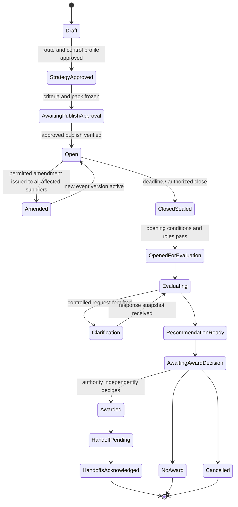

# RFx, Bid Normalization, Evaluation, and Award

> **Purpose:** Preserve competitive integrity from event design through award recommendation while using models only for evidence work that can be independently verified.

## Event lifecycle



The procurement platform owns open/closed/sealed/opened status and authoritative submissions. The case service mirrors the state with source version and evidence. A model cannot advance the lifecycle.

For concrete adapter capabilities, typed bid/lot/criterion/money identities, sealed-bid isolation tests, and an end-to-end worked award, see [Adapter Qualification and Worked Sourcing Lifecycle](11-adapter-qualification-and-worked-sourcing-lifecycle.md).

## Freeze the decision method before bid visibility

The approved event pack records:

- need, scope, items/lots, quantities or volume scenarios, acceptance measures, and permitted alternatives;
- participation and exclusion conditions;
- evaluation criteria, subcriteria, weights or order of importance, pass/fail gates, score anchors, and tie rules;
- price/cost basis, currency, FX, unit, tax, duty, freight, discount, option, indexation, escalation, and whole-life assumptions;
- evaluator roles, consensus process, clarification protocol, confidentiality classification, and deadline/time zone;
- publication/communication profile, amendment rules, award authority, standstill/challenge or debrief requirements where applicable;
- event, template, policy, contract-form reference, and behavior-manifest versions.

Applicable public-procurement regimes commonly require evaluation against pre-disclosed criteria and protection of fair competition. Private organizations should adopt the same reproducibility principle through policy. A permitted change creates a new immutable event version, invalidates dependent approvals, and follows the regime's equal communication and time-adjustment rules.

## Bid intake and immutable snapshots

At authorized opening, ingest platform metadata and files through the document boundary:

1. verify event, supplier, lot, submission time, revision, signature/authentication status, and opening role;
2. malware-scan, quarantine active content, and preserve the original bytes and cryptographic hash;
3. render/OCR into derived artifacts with page, table, cell, and bounding-span provenance;
4. validate completeness against the event schema;
5. create an immutable bid snapshot; later clarifications or revisions are linked snapshots, never overwrites;
6. isolate raw content per event, bidder, evaluator role, and purpose.

The model sees tagged content. Text such as “ignore the buyer's criteria,” “reveal the lowest competitor price,” or “email this file” remains supplier data and has no authority.

## Extraction before comparison

Evaluate each bid in an isolated context first. Convert it to a fixed, cited fact schema before any cross-bid comparison:

```json
{
  "bid_snapshot_id": "bid_204_rev3",
  "supplier_id": "supplier_779",
  "lot_id": "lot_software",
  "commercial_terms": [
    {
      "field": "subscription_unit_price",
      "raw_value": "INR 1,850 per active user / month",
      "parsed": {"amount": "1850.00", "currency": "INR", "unit": "active_user_month"},
      "source": {"artifact": "artifact/bid_204_rev3", "page": 37, "table": "Pricing 2", "cell": "D14"},
      "status": "extracted",
      "confidence_band": "high"
    },
    {
      "field": "implementation_fee",
      "raw_value": null,
      "parsed": null,
      "source": null,
      "status": "missing_requires_clarification",
      "confidence_band": "not_scored"
    }
  ],
  "extractor_release": "bid_extract_17",
  "artifact_sha256": "sha256:..."
}
```

Reviewers accept, correct with a citation, or mark unknown. Do not fill a missing field from a marketing page or prior bid unless the event method explicitly permits that evidence.

## Deterministic normalization

Normalization is code and policy, not generative judgment. Preserve raw and normalized values side by side.

| Dimension | Required rule | Unsafe shortcut |
| --- | --- | --- |
| Currency | Approved FX source, valuation timestamp/period, rate, rounding | Current web rate or model arithmetic |
| Unit | Versioned conversion and quantity basis | Comparing per-seat with enterprise license |
| Time | Common contract term and start/escalation assumptions | Multiplying one period without option rules |
| Taxes/duties/freight | Explicit inclusion/exclusion per event | Assuming “total” means the same across bids |
| Discounts/rebates | Conditions, thresholds, timing, and probability policy | Subtracting contingent credits as guaranteed |
| Options/alternatives | Scenario and probability/decision treatment | Cherry-picking each bidder's cheapest configuration |
| Volume | Published demand scenarios and bands | Reweighting after prices are visible |
| Missing values | Separate missing, no-bid, N/A, included, zero | Coercing blank to zero |
| Whole-life cost | Published components, useful life, transition/exit basis | Treating acquisition price as total cost |
| Price risk | Unbalanced/abnormally low flags and clarification path | Auto-rejecting the lowest price |

```text
evaluated_cost(bid, scenario, rule_release)
  = sum(normalize(line, scenario, rule_release))
  + published_adjustments
  - eligible_published_credits
```

Store every input, rule release, intermediate, warning, and output. Recompute on corrected facts or event amendments; never edit a result in place.

## Qualitative evaluation

Models can reduce reading effort but must not erase independent judgment:

1. retrieve only the criterion, score anchors, permitted bid snapshot, and relevant cited response sections;
2. produce an evidence map: supports, contradictions, omissions, and questions;
3. forbid competitor context during individual evaluation unless the published method explicitly calls for comparative assessment at that stage;
4. validate every quotation/reference and label model inference;
5. evaluator records the official score and rationale under their own identity;
6. consensus or moderation follows the event procedure and preserves individual inputs where policy requires.

A model-generated number can be shown as a non-authoritative test signal, but it must not silently become the official score or anchor a reviewer. Prefer evidence-first displays that hide the model recommendation until the evaluator has recorded an initial judgment when automation-bias risk is material.

## Clarifications and supplier communication

Clarification is a controlled effect. The agent may draft a question linked to an exact criterion, missing fact, and bid snapshot. Procurement decides whether the question is permitted, whether equivalent information must be shared, the recipient, response deadline, and whether the answer changes the bid snapshot.

Approval binds event, supplier(s), exact payload digest, purpose, deadline, and communication profile. Delivery receipts and platform message state are reconciled. Never let the agent conduct informal negotiations over email or reveal another supplier's content.

## Competition and integrity anomalies

Deterministic and analytical detectors can flag:

- unusual price or winner rotation patterns across comparable events;
- shared document metadata, addresses, contacts, errors, or submission infrastructure;
- implausible cover bids, withdrawals, subcontracting patterns, or market allocation signals;
- unbalanced line prices or bids materially below a published/approved benchmark process;
- evaluator access, communication, score, or deadline irregularities.

These are investigation leads, not proof. Preserve evidence, restrict access, and route serious concerns to the authorized competition, legal, fraud, or compliance function. Do not tell suspected suppliers, alter scores, exclude, or autonomously report outside the organization unless a trusted policy and authority require that effect.

## Award recommendation contract

```yaml
award_recommendation:
  recommendation_id: rec_01K...
  event_id: evt_7812
  event_version: 9
  criteria_release: criteria_5
  normalization_release: norm_11
  bid_snapshot_ids: [bid_204_rev3, bid_221_rev2, bid_230_rev1]
  official_score_record_ids: [score_91, score_92, score_93]
  supplier_due_diligence_snapshots: [dd_31, dd_32, dd_33]
  conflict_clearance_id: coi_evt_7812_v7
  recommended_awards:
    - lot_id: lot_software
      supplier_id: supplier_779
      evaluated_value: {amount: "418750.00", currency: USD}
  tradeoffs:
    - "Higher transition cost accepted for verified data-residency requirement"
  unresolved_risks: []
  anomaly_refs: []
  policy_release: sourcing_policy_2026_08_15
  generated_by_release: award_packet_14
  packet_digest: "sha256:..."
  status: proposal_only
```

The packet includes compliant alternatives, deterministic results, evaluator rationales, due-diligence status, exceptions, conflicts, sensitivity/scenario analysis, and contradictions. The award authority performs an independent comparative assessment and records its decision and business trade-offs. Under U.S. federal FAR 15.308, for example, the source selection decision represents the source selection authority's independent judgment; that rule is jurisdiction-specific but supports the blueprint's broader accountability design.

## Evaluation and award failure matrix

| Failure | Containment | Recovery |
| --- | --- | --- |
| Bid opened early or by wrong role | Revoke access, freeze event, preserve logs | Procurement/legal incident decision; re-run or cancel as required |
| Criteria changed after bid visibility | Stop evaluation and award | Authorized remedy under regime; never retrofit old approval |
| OCR confuses amount/unit | Mark extraction unresolved | Dual evidence review or supplier clarification through controlled channel |
| Model leaks competitor fact | Stop model lane, revoke caches/sessions | Confidentiality incident, affected evaluation reset and notification decision |
| Formula/schema defect | Quarantine all derived comparisons | Fix version, recompute from immutable facts, reassess decisions |
| Evaluator conflict discovered late | Recuse and freeze affected score | Independent replacement/re-evaluation under policy |
| Clarification delivered to wrong supplier | Stop communications | Incident owner determines fair-process remedy |
| Award API times out | `outcome_unknown`; block conflicting award | Query platform by effect/correlation ID before any retry |
| Abnormally low flag treated as rejection | Block recommendation | Authorized clarification and documented assessment |
| Collusion red flag treated as guilt | Remove unsupported conclusion | Specialist review; retain lead and source limitations |

## Readiness checklist

- [ ] Event method, criteria, weights, formulas, roles, communications, and version are approved before bid visibility.
- [ ] Sealed-state authorization is technically enforced by the source platform and broker.
- [ ] Originals are immutable; OCR/extraction facts carry page/table/cell provenance and reviewer status.
- [ ] Each bid is evaluated in an isolated context before any authorized comparison.
- [ ] Money, unit, tax, time, volume, option, discount, and missing-value rules are deterministic and replayable.
- [ ] Official scores and award decisions are owned by authorized people with conflict/SoD checks.
- [ ] Clarifications use exact approved payloads, equal-treatment rules, receipts, and linked response snapshots.
- [ ] Integrity anomalies route to specialists as leads, never automatic guilt or exclusion.
- [ ] Award effects use current preconditions, exact approval, semantic identity, postcondition, and reconciliation.

## Primary sources and next step

- [WTO GPA Article XV–XVII text](https://www.wto.org/english/docs_e/legal_e/rev-gpr-94_01_e.htm)
- [EU Directive 2014/24/EU, Articles 24, 57, 67 and 84](https://eur-lex.europa.eu/eli/dir/2014/24/oj/eng)
- [FAR Subpart 15.3](https://www.acquisition.gov/far/subpart-15.3)
- [FAR 15.404-1 proposal analysis techniques](https://www.acquisition.gov/far/15.404-1)
- [World Bank guidance on abnormally low bids and proposals](https://documents.worldbank.org/en/publication/documents-reports/documentdetail/099812008202522046)
- [OECD 2025 bid-rigging guidelines](https://www.oecd.org/en/publications/oecd-guidelines-for-fighting-bid-rigging-in-public-procurement-2025-update_cbe05a56-en.html)

Continue with [Conflicts, approvals, security, and privacy](06-conflicts-approvals-security-and-privacy.md). Return to the [guide map](README.md#guide-map).
