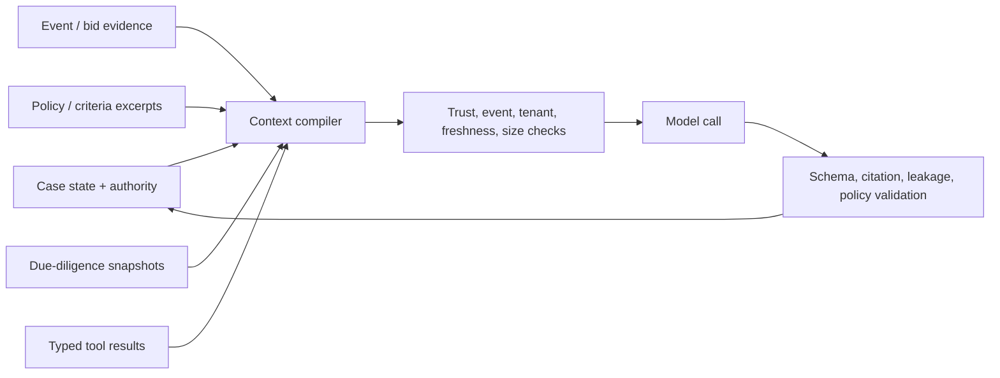

# State, Context, Memory, Planning, and Reliable Effects

> **Purpose:** Make sourcing work resumable across long waits and external systems without confusing conversation, memory, telemetry, workflow replay, or an API response with authoritative business state.

## Authoritative record spine

| Record | Source of truth | Writer | Lifetime | Recovery role |
| --- | --- | --- | --- | --- |
| Requisition/business need | Requisition system plus approved case snapshot | Requester/workflow | Policy-defined | Rehydrate intent and value basis |
| Sourcing case | Case service | Single logical coordinator using version checks | Through closure/retention | Resume state, owner, deadlines, release |
| Procurement event and submissions | E-sourcing platform | Authorized platform operations/suppliers | Regime/policy-defined | Prove event/bid version and remote truth |
| Supplier identity/status | Supplier master and approved registries | Domain owners | Entity lifecycle | Resolve canonical supplier and corrections |
| Policy/calculation result | Versioned policy/calculation services | Trusted services | Decision/audit retention | Replay exact route, threshold, and math |
| Official score/decision | Evaluation/approval systems | Authorized humans | Event/audit retention | Prove accountability and rationale |
| Evidence/artifact | Evidence store | Ingestion/adapters | Data-class policy | Rebuild context and verify claims |
| Effect intent/receipt/postcondition | Effect ledger plus remote system | Gateway/reconciler | Audit retention | Resolve duplicates and unknown outcomes |
| Context/compaction receipt | Case store | Context compiler | Run/case retention | Continue without hidden transcript state |
| Trace/log/metric | Telemetry system | Instrumentation | Diagnostic policy | Diagnose only; never drive correctness |

See [Agent state and event contracts](../../runtime/agent-state-and-event-contracts.md) for reusable identities and ordering rules.

## Sourcing case schema

```json
{
  "case_id": "src_01K...",
  "tenant_id": "tenant_acme",
  "legal_entity_id": "le_india_01",
  "requisition_id": "req_01K...",
  "case_type": "competitive_sourcing",
  "state": "evaluating",
  "state_version": 42,
  "business_owner_id": "person_217",
  "procurement_owner_id": "person_412",
  "regime_profile": "private_enterprise_policy_v12",
  "policy_release": "sourcing_policy_2026_08_15",
  "event": {"system": "sourcing_platform", "id": "evt_7812", "version": 9, "state": "opened_for_evaluation"},
  "criteria_release": "criteria_5",
  "normalization_release": "norm_11",
  "behavior_release": "procurement_agent_2026_08_31_3",
  "pending_approval_ids": [],
  "pending_effect_ids": [],
  "unknown_effect_ids": [],
  "continuity_snapshot_id": "ctx_118",
  "next_deadline": "2026-09-02T12:00:00Z",
  "updated_at": "2026-08-31T11:22:41Z"
}
```

Transitions use compare-and-swap on `state_version`. Queue messages carry the expected version and attempt fence. A transactional outbox commits state plus domain events/effect intents atomically. A stale or cancelled worker cannot write merely because it finishes late.

## Domain event envelope

CloudEvents 1.0.2 is a useful envelope vocabulary; the domain schema and semantics remain application-owned:

```json
{
  "specversion": "1.0",
  "id": "evtmsg_01K...",
  "source": "procurement-sourcing/case-service",
  "type": "com.example.procurement.award_recommendation_ready.v1",
  "subject": "tenants/tenant_acme/sourcing-cases/src_01K",
  "time": "2026-08-31T11:22:41Z",
  "datacontenttype": "application/json",
  "data": {
    "tenant_id": "tenant_acme",
    "case_id": "src_01K...",
    "state_version": 42,
    "event_id": "evt_7812",
    "event_version": 9,
    "recommendation_id": "rec_01K...",
    "packet_digest": "sha256:...",
    "policy_release": "sourcing_policy_2026_08_15"
  }
}
```

Delivery can be at least once. Consumers deduplicate by event ID and use semantic operation identity for business effects. Version event types; tolerate unknown optional fields and reject incompatible major versions.

## Effect records

An award, event publish, supplier invitation, clarification, deadline change, and handoff are separate effects. Never hide several remote writes behind one generic `update_sourcing` tool.

```json
{
  "effect_id": "eff_award_evt_7812_v9",
  "effect_type": "submit_award",
  "case_id": "src_01K...",
  "tenant_id": "tenant_acme",
  "target": {"system": "sourcing_platform", "event_id": "evt_7812", "expected_version": 9},
  "intent": {"award_packet_digest": "sha256:...", "supplier_id": "supplier_779", "lot_id": "lot_software"},
  "intent_hash": "sha256:...",
  "approval_id": "appr_01K...",
  "policy_release": "sourcing_policy_2026_08_15",
  "attempt_fence": 17,
  "status": "authorized",
  "deadline": "2026-08-31T15:00:00Z"
}
```

The state machine is `proposed -> authorized -> committing -> verified`, with `committing -> outcome_unknown` on timeout/crash/lost response. Reconciliation can move `outcome_unknown` to `verified`, `not_committed`, or `manual_resolution`. A retry is allowed only after authoritative absence is proven and intent/approval remain current.

## Context compilation



Order lanes by authority and preserve labels:

1. **Trusted control facts:** task, tenant, event, state/version, authority ceiling, budgets, criteria and policy identifiers.
2. **Authoritative domain snapshots:** approved requisition, platform event/bid metadata, official scores, current approvals and conflicts.
3. **Deterministic derived facts:** normalized costs, threshold results, completeness checks, source freshness warnings.
4. **Untrusted evidence:** bid text, supplier sites, emails, registry names, commercial risk narratives.
5. **Working plan:** bounded questions, completed steps, unresolved evidence, remaining budgets.

For individual evaluation, include only the assigned bid and criterion. For authorized comparison, prefer normalized facts and citations; load raw competitor content only when necessary and permitted. Cache keys include tenant, legal entity, event, bidder/role, data class, source versions, and context-builder release.

## Context budgets and compaction

Retain in this order:

1. exact IDs, state/event/bid versions, authority, conflicts, approvals, deadlines, cancellation, and pending/unknown effects;
2. criteria, weights, formula and policy releases, money, currency, units, quantities, time periods, source freshness, and warnings;
3. accepted facts with citations, contradictory evidence, missing fields, evaluator status, and unresolved questions;
4. concise prior decisions and their accountable owners;
5. explanatory prose.

Compaction is a deterministic, schema-validated, loss-aware continuity artifact:

```yaml
schema_name: procurement.compaction_continuity_receipt
schema_version: 1.0.0
receipt_id: continuity_118
case_id: src_01K...
state_version: 42
event: {id: evt_7812, version: 9, state: opened_for_evaluation}
source_event_high_watermark: 12944
authority_ceiling: P1
releases:
  regime_profile: private_enterprise_policy_v12
  policy: sourcing_policy_2026_08_15
  criteria: criteria_5
  normalization: norm_11
  behavior_bundle: procurement_agent_2026_08_31_3
  capability_manifest: sourcing-event-read/4.2.0
  context_compiler: procurement_context_9
  compactor: procurement_continuity_4
bid_snapshots: [bid_204_rev3, bid_221_rev2, bid_230_rev1]
decisions:
  - {id: dec_71, owner: person_412, status: accepted, evidence: [ev_91]}
money:
  - {kind: evaluated_value, amount: "418750.00", currency: USD, rule_release: norm_11}
conflict_clearance_id: coi_evt_7812_v7
approvals: []
effects: []
unknown_effects: []
unresolved:
  - {id: q_19, question: "Confirm implementation fee for bid_204_rev3", owner: evaluator_44}
deadlines:
  - {kind: evaluation_complete, at: 2026-09-02T12:00:00Z}
preserved_claim_ids: [claim_31, claim_32]
preserved_contradiction_ids: [contradiction_7]
preserved_limitation_ids: [limit_4]
omitted_sections: [resolved_navigation, repeated_background]
known_losses: []
pre_compaction_manifest_sha256: "sha256:..."
post_compaction_snapshot_sha256: "sha256:..."
continuity_check: passed
```

Validate exact preservation of identities, decimals, currencies, units, criteria, exclusions, bid revisions, conflicts, approvals, effect states, warnings, contradictions, limitations, and unresolved questions. `known_losses` must be empty before bid reveal/comparison, official decision, effect, or handoff work. If a source, bid, conflict, approval, money basis, unknown effect or limitation cannot be reconstructed, set `continuity_check: failed`, block consequential work, and rebuild from durable records or escalate the irrecoverable loss. Original events and artifacts remain available for replay. Compaction changes representation, never authority or business truth.

## Memory policy for the exact seven lifetimes

| Memory class | Procurement use | Decision |
| --- | --- | --- |
| Turn/scratch memory | Temporary parsing and reasoning inside one call | Ephemeral, non-authoritative, not reused |
| Working/run memory | Current plan, tool results, evidence references, budgets, unresolved questions | Typed and checkpointed; archived/discarded at run end |
| Session memory | Authenticated analyst's active case and display preferences | Event/tenant/actor-bound with short expiry; cannot carry approval or bid access to another session |
| Durable workflow/task memory | Lifecycle, owners, deadlines, policy, event versions, decisions, effects and handoffs | Required authoritative state with retention, access, correction, fencing |
| Domain knowledge memory | Category taxonomy, policies, approved templates, supplier master references, normalization rules | Versioned and effective-dated; owned by named domain systems/stewards |
| Long-term/preference memory | Curated supplier dispositions, verified performance/outcomes, expiring exceptions and convenience preferences | Optional and disabled for supplier ranking by default; provenance, scope, owner, dispute, expiry, correction, deletion and current-source precedence required; UI preference cannot change criteria, risk or authority |
| Episodic/outcome memory | Reviewed closed-case trajectories, corrections, incidents, counterfactuals | Evaluation/failure-mining input after minimization and governance; never automatic behavior change |

Retrieval indexes, caches and raw conversation/vector recall are **not an eighth memory lifetime**. They are derived projections or prohibited corpora: tenant/legal-entity/event/bid/purpose/version partitioned, authorization-aware, deletable and rebuildable from authoritative records. Unbounded requisitions, bids, evaluator notes, allegations or emails are prohibited across bidders/events. Long-term memory is derived evidence; it cannot override current sanctions, ownership, supplier status, policy, conflicts, approval, bid or signed commercial facts. Deletion/correction propagates to indexes, summaries, evaluation datasets and backups according to policy.

## Planning and orchestration

Use a deterministic controller with bounded model choice:

```text
fixed stage graph
  -> controller exposes permitted next actions for current state
  -> model selects a read/evidence action or abstains
  -> tool result is validated and checkpointed
  -> controller decides continue, wait, human review, effect proposal, or terminal state
```

Dynamic decomposition is useful for market discovery and evidence-gap closure, not lifecycle or authority. The controller owns turn, tool, query, byte, token, cost, wall-time, and deadline budgets. Replan when a source is stale/unavailable, entity resolution is ambiguous, a bid revision arrives, policy/event version changes, a conflict appears, a tool schema changes, or two equivalent actions make no material progress.

Parallelize only independent, read-only tasks with explicit result boundaries—for example separate registry checks after canonical identity is fixed. Do not parallelize coupled score/award decisions, publish concurrent writes, or let workers independently communicate with suppliers.

Multi-agent delegation is rejected by default. A “category agent,” “risk agent,” “legal agent,” and “negotiation agent” would duplicate accountable organizational roles and widen bid access. If measured scale later justifies read-only workers, the case coordinator remains the sole owner; child tasks receive minimum data, no P3 tools, deadlines/budgets, and typed evidence results.

## Tool contracts

Prefer narrow operations:

- `get_requisition_snapshot(requisition_id, expected_version)`
- `get_spend_aggregate(scope, period, category_release, snapshot_id)`
- `search_supplier_sources(strategy_id, query, cursor)`
- `resolve_supplier_identity(candidate_ids, source_snapshot_ids)`
- `get_due_diligence_snapshot(supplier_id, profile_release, as_of)`
- `get_authorized_bid_snapshot(event_id, bid_id, expected_revision, purpose)`
- `calculate_bid_scenario(bid_fact_set_id, scenario_id, normalization_release)`
- `draft_clarification(case_id, bid_snapshot_id, issue_ids)`
- `propose_effect(case_id, canonical_operation, intent)`
- `commit_approved_effect(effect_id, intent_hash, approval_id)`
- `reconcile_effect(effect_id)`

The model cannot construct arbitrary URLs, SQL, recipients, platform methods, supplier IDs, or credentials. Results include status, source/tool release, tenant/event, evidence/artifact ID, source/observation time, freshness, warnings, untrusted-field labels, and pagination/completeness.

## Idempotency and reconciliation table

| Boundary | Semantic identity | Verification/reconciliation |
| --- | --- | --- |
| Requisition intake | Initiator + submission digest + source ID | Read case/demand links |
| Sourcing case creation | Tenant + approved requisition + case type | Read active/closed cases |
| Event publication | Case + event draft version + pack digest | Read platform event/version/publication state |
| Supplier invitation | Event version + canonical supplier/contact + invitation profile | Read participant access/delivery state |
| Clarification/broadcast | Event/bid issue + audience + payload digest + round | Read platform message/delivery and response snapshot |
| Deadline change | Event version + old/new deadline + amendment digest | Read event and notice state |
| Award submission | Event/bid versions + supplier/lot + packet digest | Read authoritative award and audit record |
| Onboarding/legal handoff | Award ID + destination + payload digest | Read destination case/workspace and acknowledgement |
| Outcome snapshot | Award/contract + metric + period + baseline/rule release + actual revision | Recompute and supersede on correction |

Use the remote API's documented key when available, but preserve application semantic identity regardless. The same key with changed intent fails closed. See [Idempotency and side-effect safety](../../reliability/idempotency-and-side-effects.md).

## Recovery rules

- Resume from case state, events, evidence, continuity receipt, and behavior manifest—not hidden provider conversation state.
- Fence old attempts after cancellation, reassignment, state/version change, lease loss, or release quarantine.
- Replay model reads and deterministic calculations from pinned snapshots; never replay a P3 effect without reconciling its operation state.
- Recheck current safety revocations at commit while retaining historical policy for audit.
- Quarantine active cases whose queued schema or behavior release cannot be safely migrated.
- Keep dead-letter records owned, time-bounded, and repairable; they are not a substitute for reconciliation.
- Test restore of case/event pointers, evidence, effect ledger, policy/behavior manifests, encryption keys, and access controls.

## Reliability failure matrix

| Failure | State after detection | Retry safe? | Recovery owner |
| --- | --- | --- | --- |
| Worker dies during analysis | Last durable state; no effect | Yes from snapshot | Workflow platform |
| Worker dies after remote commit before receipt | `outcome_unknown` | No blind retry | Reconciler + procurement owner |
| Duplicate/reordered event | Deduped or version-conflict | Handler must be safe | Case service |
| Stale evaluator/approval result | Rejected by state/event version | Re-evaluate/reapprove | Evaluation/approval owner |
| Context compaction loses amount/conflict | Validation failure; run stopped | Rebuild only | Context service |
| Connector schema changes | Integration quarantined | After compatibility proof | Integration owner |
| Cancel arrives during dispatch | Cancelling plus pending effect | Reconcile late outcome | Gateway/reconciler |
| Model/provider unavailable | Waiting/manual lane | N/A | Operations + procurement |
| Evidence store unavailable | P3 writes halted | Reads may degrade by policy | Evidence platform owner |

## Readiness checklist

- [ ] State, domain events, evidence, effects, context snapshots, and telemetry are separate records.
- [ ] Case updates use versions; events use outbox delivery; stale and late workers are fenced.
- [ ] Context is minimum, labeled, event/bid/role isolated, freshness-checked, and reproducible.
- [ ] Compaction preserves every authority, money, criteria, bid, conflict, approval, warning, effect, and unresolved fact.
- [ ] Every memory class is explicitly allowed or rejected with owner, provenance, lifetime, poisoning, correction, and deletion controls.
- [ ] Planning is bounded; parallelism is read-only and independent; multi-agent organization mirroring is absent.
- [ ] Tools are narrow, typed, evidence-bearing, versioned, and explicit about failure/unknown states.
- [ ] Every external effect has semantic identity, parameter equivalence, receipt, postcondition, and reconciliation.
- [ ] Crash, duplicate, reorder, cancel, stale approval, migration, restore, and provider-outage tests pass.

## Related guides

Continue with [Handoffs and realized-outcome reconciliation](08-handoffs-and-realized-outcome-reconciliation.md). Use [Context engineering](../../context-memory/context-engineering.md), [Compaction and continuity](../../context-memory/compaction-and-continuity.md), [Memory architecture](../../context-memory/memory-architecture.md), and [Durable execution](../../runtime/durable-execution.md) for full reusable patterns.
