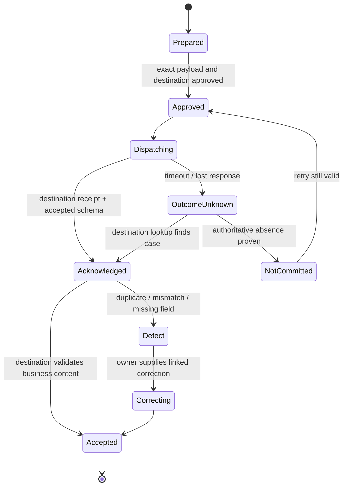

# Handoffs and Realized-Outcome Reconciliation

> **Purpose:** End sourcing authority cleanly, transfer verified commercial facts to accountable downstream owners, and later test whether intended outcomes materialized without taking over legal, order, inventory, shipment, or accounting operations.

## Handoff is a stateful protocol

“Send the award packet” is not completion. Each handoff has a sender, destination owner, schema/version, minimum data, payload digest, policy, effect identity, acknowledgement, defect states, deadline, and reconciliation path.



An API receipt proves transport, not acceptance. The sourcing case remains `handoff_pending` until every mandatory destination acknowledges or an accountable owner accepts an exception.

## Boundary-specific handoffs

| Destination | Procurement sends | Destination owns | Procurement must not send/do |
| --- | --- | --- | --- |
| Supplier onboarding/master | Canonical awarded legal entity/site, identity evidence refs, due-diligence disposition refs, award ID, required onboarding profile | Duplicate resolution, tax/bank verification, master creation/status, ongoing record stewardship | Bank details extracted from email/bid; unrestricted supplier mutation |
| Legal/CLM | Awarded parties/lots, approved commercial facts, pricing schedules, term/option assumptions, deviations/questions, risk/approval refs, required contract-form/template reference | Legal language, clause choice, interpretation, negotiation, signature, obligations | Invent or revise clauses; declare legal compliance; accept terms |
| Supply chain/logistics/P2P | Awarded items/services, quantities/scenarios, locations, lead-time/service facts, supplier/site, agreement/order-enablement reference | Purchase orders, releases, allocation, inventory, shipment, receipt, operational exceptions/recovery | Create/expedite orders; manage inventory or shipment state |
| Finance/accounting | Approved value/baseline, budget and cost-center refs, currency/period, expected benefit method | Ledger/subledger, payment, accrual, accounting treatment | Post entries, approve invoices, claim accounting savings |
| Business/contract owner | Acceptance outcomes, KPI candidates, benefits baseline, residual risks, governance cadence | Contract/service performance and business realization | Operate contract obligations or performance remedies |

Legal and supply-chain work can feed read-only facts back to outcome reconciliation. That does not transfer their operational authority to procurement.

## Handoff package contract

```json
{
  "handoff_id": "ho_legal_evt_7812_v1",
  "handoff_type": "legal_contract_workspace",
  "case_id": "src_01K...",
  "award_id": "award_evt_7812_lot_software",
  "source_event": {"id": "evt_7812", "version": 9},
  "destination": {"system": "clm", "workspace_type": "software_services"},
  "supplier": {"canonical_id": "supplier_779", "legal_entity_evidence_id": "ev_reg_77"},
  "commercial_facts": {
    "evaluated_value": {"amount": "418750.00", "currency": "USD"},
    "pricing_schedule_artifact": "artifact/award_pricing_v1",
    "term": "P3Y",
    "approved_option_model": "one_plus_one_year"
  },
  "deviations_and_questions": ["q_legal_19"],
  "approvals": ["appr_01K..."],
  "due_diligence_snapshot_ids": ["dd_31"],
  "payload_schema": "legal_handoff_v3",
  "payload_digest": "sha256:...",
  "effect_id": "eff_ho_legal_evt_7812_v1",
  "status": "approved"
}
```

Use evidence references instead of copying sensitive source documents when the destination can access the governed store. The destination rechecks authorization. Corrections append a new handoff version linked to the rejected payload; never overwrite the audit trail.

## Contract handoff without practicing law

Procurement may identify that a bid differs from an approved commercial requirement and may label the cited difference. It must not conclude that language creates, waives, or satisfies a legal obligation. The legal handoff separates:

- **approved commercial facts:** party, scope, items, price schedule, quantities/scenarios, term, options, service/KPI intent;
- **supplier-proposed text or deviations:** exact source artifact and location;
- **business/procurement questions:** why the difference matters operationally;
- **legal decisions:** initially empty, written only by the legal owner;
- **approval and exception lineage:** references, not a claim that legal review occurred.

If the CLM/API supports template or workspace creation, use an approved template ID and header schema. Do not allow the model to choose clauses or upload generated “final terms.”

## Supplier onboarding safeguards

Awarded supplier identity and the onboarding target must match. The onboarding system performs duplicate checks and independent tax/bank/contact verification. A change to legal entity, site, ownership, payee, or bank instruction after award is a new high-risk workflow with its own out-of-band verification; it is not a sourcing-case correction.

The sourcing agent may create an onboarding case only after award verification and exact approval. It reads the resulting status and routes defects. It never marks a supplier active because a request was submitted.

## Outcome baseline

Create the baseline before handoff, when definitions cannot be retrofitted to favorable actuals:

```yaml
outcome_baseline:
  baseline_id: base_evt_7812_v1
  award_id: award_evt_7812_lot_software
  metric_release: sourcing_outcome_6
  value_types:
    modeled_evaluated_value:
      amount: "418750.00"
      currency: USD
      scenario: demand_base_v3
      normalization_release: norm_11
    prior_comparable_baseline:
      amount: "467000.00"
      currency: USD
      source_snapshot: spend_2026Q2_v4
  expected_outcomes:
    - metric: governed_metric_catalog_live
      oracle: contract_owner_acceptance_record
    - metric: in_scope_spend_through_awarded_supplier
      oracle: p2p_aggregate
  exclusions: [tax_change, approved_scope_expansion, fx_variance]
  observation_windows: [P90D, P365D]
  owners: [procurement_analytics, business_owner]
  approved_at: 2026-08-31T12:00:00Z
```

Do not collapse all value into “savings.” Keep at least:

| Value label | Meaning | Valid proof |
| --- | --- | --- |
| Modeled opportunity | Scenario before bid/award | Pinned demand, benchmark, assumptions, calculation |
| Evaluated award value | Comparable value used in award | Bid snapshots and normalization release |
| Contracted commercial value | Signed commercial facts | CLM/contract owner source, not draft |
| Avoidance | Approved counterfactual cost not incurred | Defined counterfactual and approval; never mix with cash reduction |
| Realized cash/expense outcome | Actual eligible spend/cost change | Reconciled finance/P2P actuals and approved attribution method |
| Business/service outcome | Requirement achieved without unacceptable harm | Owner acceptance/KPIs and service evidence |
| Unclassified variance | Difference not safely attributable | Explicitly unresolved, not forced into savings |

Procurement can own the sourcing baseline and reconciliation analysis. Finance and business owners own accounting and benefit acceptance where policy assigns them.

## Reconciliation loop


Actuals include source revision and correction state. Compare like with like: scope, item, quantity/volume, time, currency, tax, location, service level, options, and one-time/recurring components. Separate price variance, volume variance, mix, scope, FX, timing, compliance/leakage, and service outcomes. A model may explain the deterministic variance and identify missing evidence; it cannot create the amounts or claim causality.

## Reconciled outcome record

```json
{
  "outcome_id": "out_evt_7812_P365D_v2",
  "baseline_id": "base_evt_7812_v1",
  "contract_snapshot_id": "contract_991_v4",
  "actual_snapshot_id": "p2p_2027Q4_rev3",
  "observation_window": "2027-01-01/2027-12-31",
  "metric_release": "sourcing_outcome_6",
  "variances": [
    {"type": "price", "amount": "-31200.00", "currency": "USD", "status": "validated"},
    {"type": "volume", "amount": "18400.00", "currency": "USD", "status": "validated"},
    {"type": "scope", "amount": null, "currency": "USD", "status": "unresolved"}
  ],
  "service_outcome": "met",
  "reviewers": ["finance_owner_22", "business_owner_217", "procurement_analytics_9"],
  "status": "partially_validated",
  "supersedes": "out_evt_7812_P365D_v1"
}
```

Corrections supersede rather than erase. Outcome evidence can inform future supplier history only after review, relevance scoping, expiry, and dispute handling.

The complete requisition → supplier evidence → sealed RFx → evaluation → award → multi-destination handoff → realized-outcome path is worked through in [Adapter qualification and worked sourcing lifecycle](11-adapter-qualification-and-worked-sourcing-lifecycle.md), including unknown effects and correction handling.

## Handoff and outcome failure matrix

| Failure | State | Containment | Recovery |
| --- | --- | --- | --- |
| CLM/onboarding timeout after create | `outcome_unknown` | Block duplicate handoff | Query by effect/correlation ID; link found destination or prove absence |
| Wrong supplier site/legal entity | `defect` | Stop activation/order enablement | Destination owner corrects identity; new approved handoff |
| Legal workspace created with stale award | `defect` | Freeze contract work | Rebuild from current award; preserve both payloads |
| One of several handoffs succeeds | Per-destination state | Do not claim case complete | Retry/reconcile only missing destination; compensate by owner if needed |
| Signed terms differ from award facts | Outcome/contract exception | Stop baseline promotion | Procurement/legal/business decide authorized variance |
| P2P actuals omit entities or corrections | Outcome `unknown` | No savings claim | Corrected complete snapshot and recomputation |
| Volume/scope change presented as price savings | Attribution validation fails | Withdraw metric | Deterministic decomposition and reviewer approval |
| Supplier performance dispute | Outcome `disputed` | Exclude from automatic future scoring | Contract owner resolution and correction lineage |
| Supply-chain exception enters sourcing queue | Boundary violation | Route without taking action | Supply-chain owner handles order/shipment recovery |

## Completion checklist

- [ ] Every destination handoff has an exact schema, owner, payload digest, effect ID, acknowledgement, acceptance, defect, deadline, and reconciliation path.
- [ ] Legal handoff contains commercial facts and questions, not agent-authored legal obligations or conclusions.
- [ ] Supplier onboarding independently verifies canonical entity, site, tax, contact, and bank/payment data outside the model.
- [ ] Supply-chain handoff ends procurement authority before order, inventory, shipment, and fulfillment operations.
- [ ] Outcome baseline, metric definitions, counterfactuals, exclusions, observation windows, and owners are approved before actuals are known.
- [ ] Modeled, evaluated, contracted, avoidance, realized, service, and unclassified value remain distinct.
- [ ] Actuals carry source revision, completeness/correction state, and like-for-like dimensions.
- [ ] Corrections supersede; disputed outcomes do not become hidden long-term supplier penalties.

## Sources and next step

- [Open Contracting Data Standard contracting-process model](https://standard.open-contracting.org/latest/en/primer/how/)
- [UK GovS 008 Commercial, version 2.2](https://www.gov.uk/government/publications/government-functional-standard-govs-008-commercial-and-commercial-continuous-improvement-assessment-framework/government-functional-standard-govs-008-commercial-html)
- [UK Sourcing Playbook](https://www.gov.uk/government/publications/the-sourcing-and-consultancy-playbooks/the-sourcing-playbook-html)
- [FAR Subpart 42.15 contractor performance information](https://www.acquisition.gov/far/subpart-42.15)
- [DOJ Evaluation of Corporate Compliance Programs](https://www.justice.gov/criminal/criminal-fraud/page/file/937501)

Continue with [Observability, evaluation, failure injection, and incidents](09-observability-evaluation-failure-injection-and-incidents.md). Return to the [guide map](README.md#guide-map).
