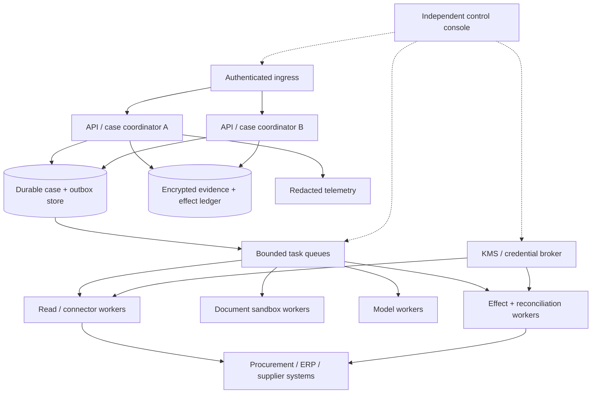
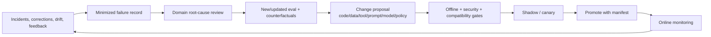

# Deployment, Capacity, Cost, and Governed Evolution

> **Purpose:** Deploy the smallest reliable topology, bound queues and vendor dependencies, recover from infrastructure loss, measure full economics, and change behavior without silently changing active sourcing events.

## Deployment progression

| Shape | Components | Authority ceiling | Promote when |
| --- | --- | --- | --- |
| Local/isolated prototype | Synthetic fixtures, one controller, one model worker, no production credentials | P0 synthetic | Core extraction/classification and adversarial tests pass |
| Shadow MVP | Production read replicas/adapters, case store, evaluation harness, operator UI | P0/P1 | Privacy/access review and baseline improvement proven |
| Small production | Redundant API/coordinator, durable store, bounded queues, read brokers, one optional P3 adapter, audit/telemetry, manual fallback | P1 plus one approved P3 effect | Reliability, effect, SLO, incident, and capacity gates pass |
| Larger production | Tenant/regime cells, isolated worker pools, regional strategy, centralized policy/release governance | Per-cell capability | Noisy-neighbor, DR, source/provider outage, and cost controls pass |

Do not start with a service mesh of role-playing agents, one queue per category, a graph database, or global vector memory. Add a component only when a measured workload, isolation, recovery, or ownership requirement demands it.

## Small-production topology



The case/outbox transaction, evidence/ledger durability, and external systems define recovery. Workers are disposable. A lost queue message is recoverable from durable scheduled work; a queue is not the case database.

## Isolation and cell design

Minimum cache/storage/authorization partitioning is tenant plus legal entity plus event. Create stronger deployment cells when regulation, residency, customer contracts, sealed-bid sensitivity, or blast-radius targets require it.

Separate worker pools by trust and resource shape:

- read/connectors with system-specific scopes;
- untrusted document/OCR sandboxes with no credentials or default egress;
- model workers with broker-only tools;
- P3 effect workers with short-lived, operation-specific credentials;
- reconciliation workers that can read outcome state but cannot rewrite original receipts;
- offline evaluation workers with synthetic/minimized data and no production effects.

Do not share raw bid embeddings, prompt caches, temporary disks, browser profiles, provider conversation IDs, or support exports across cells.

## Admission, queues, and scheduling

Admission verifies identity, case type, size, value/risk band, deadline, data class, source availability, and remaining tenant budgets. Reject or defer before accepting more work than the system or human reviewers can finish.

Prioritize by business deadline and harm, not case value alone:

1. reconciliation of high-impact unknown effects and security/control incidents;
2. imminent event deadlines and approval expiry;
3. supplier clarification/communication windows;
4. required due-diligence refresh before decision;
5. ordinary intake, discovery, extraction, and outcome analysis;
6. background reprocessing and evaluation.

Use per-tenant and global concurrency limits, weighted fair scheduling, bounded retries with jitter, circuit breakers, maximum result bytes, and dead-letter ownership. A backlog metric without manual throughput and deadline slack is incomplete.

## Capacity model

Model each resource separately:

```text
arrival_rate_stage = cases_per_period * average_tasks_per_case_stage
required_concurrency_stage ~= arrival_rate_stage * p_target_service_time_stage / target_utilization
document_slots = sum(page_or_byte_work) / processing_window
model_slots = sum(model_calls * p_target_latency) / processing_window
human_slots = sum(review_minutes_by_risk) / staffed_minutes
connector_headroom = allowed_quota - peak_foreground - reconciliation_reserve
```

Measure distributions, not averages. Large bids, multi-lot events, slow registries, repeated clarifications, evaluator waits, and reconciliation storms create the tail. Reserve capacity for deadline-critical work and incident replay. Provider quotas, commercial-data license limits, platform bulk-operation behavior, OCR/page throughput, evidence storage, and human review are first-class constraints.

Load tests include:

- many small requisitions plus one huge malformed bid;
- one tenant consuming its maximum share;
- deadline bursts at local end-of-day across time zones;
- source/provider rate limiting and partial outage;
- retry/reconciliation surge after recovery;
- a policy or connector release requiring re-evaluation of queued work;
- manual fallback during model outage.

## Full cost model

```text
cost_per_case =
  model_input_output_and_cache
  + document_ingestion_ocr_storage
  + supplier_registry_and_risk_data
  + connector_platform_and_egress
  + workflow_queue_database_compute
  + evidence_audit_telemetry_security
  + human_review_exception_incident
  + expected_reprocessing_and_reconciliation
```

Report cost per case by stage, category, document size, risk band, outcome, and accepted evidence item. Include vendor minimums, API/marketplace subscriptions, sanctions/financial/cyber data licenses, provider retention/residency tiers, secure sandboxes, audit storage, and integration maintenance. Model tokens may be a minority of total cost.

Set per-run and per-tenant budgets for turns, tools, queries, fetched bytes/pages, OCR, model tokens, wall time, fan-out, retries, and vendor calls. Budget exhaustion produces a durable, explainable wait/escalation—not silent truncation or a lower-quality unapproved model fallback.

## Safe degradation

| Dependency failure | Continue | Stop or route |
| --- | --- | --- |
| Model/provider | Deterministic workflow, existing platform, manual review | Pause model-only evidence tasks; never block legal deadlines silently |
| Supplier discovery source | Use other approved sources with disclosed gap | Block completeness claim; procurement decides whether to proceed |
| Required sanctions/debarment source | Draft/read work may continue | Block dependent invitation/award/onboarding unless authorized exception exists |
| Procurement platform read | Work from immutable snapshot only for non-commit analysis if policy permits | Stop publish/open/communicate/award; do not assume remote state |
| Approval/policy service | Read-only evidence work under prior bounded task may continue | Stop all dependent P3 commits |
| Audit/effect ledger | Diagnostic reads may continue by policy | Stop P3 effects |
| Telemetry backend | Correctness continues with local buffers/metrics loss policy | Do not use telemetry outage as authorization failure unless audit path affected |
| Commercial risk provider | Preserve last snapshot as stale; explain | Recheck or authorized human exception before dependent decision |

## Availability and disaster recovery

Define RTO/RPO per state and evidence class from event deadlines and harm. The case store, event pointers, immutable bid/evidence artifacts, policy/behavior manifests, approvals, effect ledger, encryption keys, and access policies must be recoverable together.

Recovery capacity is different from steady state. After an outage the system must restore sealed-bid isolation, reconcile unknown publications/messages/awards/handoffs, refresh due diligence before expiry, and drain evaluator/award-owner queues while new deadlines continue to arrive.

```text
net_recovery_drain_rate = recovery_service_rate - new_arrival_rate
recovery_clearance_time = durable_backlog / net_recovery_drain_rate
```

If the net rate is zero or negative, the plan cannot recover. Admission must shed optional discovery/OCR/model/evaluation backfill, source quota must be reserved, or qualified human/technical capacity must increase. Protect, in order: security/key/seal/tenant controls; unknown effect reconciliation; imminent bid/clarification/award deadlines; expiring sanctions/due-diligence snapshots; independent evaluator/award/handoff decisions; ordinary work; backfill and experiments.

Test:

- point-in-time restore with event and outbox consistency;
- evidence object and digest restoration;
- key recovery without broadening access;
- active approval and credential expiry during outage;
- reconciliation of every in-flight effect against remote systems;
- queued-case pin/migrate/quarantine compatibility;
- region/cell failover without duplicate communications or award;
- catch-up without exhausting vendors or human reviewers.

A restored cell remains bid-read and P3-effect disabled until tenant/legal-entity/event routing, keys, sealed-state policy, conflicts, approvals, evidence digests, behavior/capability releases, and effect high-watermarks are verified. Test production-shaped backlog with an unavailable provider, approaching close time, a simultaneous legal hold, expired approval, absent evaluator, partial key recovery and an unknown award. Database restoration without these pressures is not a DR test.

Active-active P3 writers are rarely necessary and add conflict risk. Prefer one logical writer per case/event with fencing. A read replica may serve safe evidence queries but cannot make stale commits.

## Behavior bundle and release gates

```yaml
behavior_manifest:
  release: procurement_agent_2026_08_31_3
  bundle_schema: procurement.behavior_bundle@1.0.0
  application_commit: sha256:...
  workflow_schema: sourcing_case_v8
  regime_profile_release: private_enterprise_policy_v12
  category_taxonomy_release: internal_category_2026_07
  supplier_identity_release: supplier_identity_graph_5
  due_diligence_profile_release: supplier_due_diligence_8
  criteria_release: criteria_5
  evaluator_and_sod_policy_release: sourcing_independence_6
  normalization_and_money_release: norm_11
  model_routes:
    extraction: {provider: example, model: pinned_snapshot, prompt: bid_extract_17}
  tool_registry: procurement_tools_12
  connector_releases:
    sourcing_platform: ariba_event_v2_2026_05
    supplier_risk: supplier_risk_contract_4
  document_pipeline_release: procurement_documents_7
  context_builder: procurement_context_9
  compactor_release: procurement_continuity_4
  policy_release: sourcing_policy_2026_08_15
  evaluation_suite: procurement_eval_14
  handoff_schema_release: procurement_handoffs_5
  outcome_metric_release: sourcing_outcome_6
  renderer_release: recommendation_packet_14
  sandbox_profile: untrusted_docs_6
  telemetry_schema: procurement_otel_3
```

Treat any changed field as a release. Gates are ordered:

1. schema/static/security and connector contract tests;
2. deterministic unit/property tests for policy, math, state, idempotency, and access;
3. offline capability, confidentiality, authority, failure, latency, and cost suites with repeated trials;
4. historical/synthetic replay with contamination controls;
5. shadow on minimum authorized production projections;
6. canary by tenant/category/risk/effect class with independent rollback;
7. gradual authority promotion only after outcome and operations evidence.

No critical slice regresses, and zero-tolerance failures never average away. Mutable model aliases or vendor endpoints are not allowed without a resolved version/behavior policy.

## Active-case compatibility

Long-running events must not silently change behavior. For each release choose:

- **pin:** old workers/manifests remain for active cases;
- **compatible migrate:** deterministic migration plus before/after invariant tests;
- **restart bounded analysis:** discard non-authoritative model output and rebuild from snapshots;
- **quarantine/manual:** used when policy, schema, or security changes cannot safely replay;
- **revoke:** current safety restrictions stop an effect even if historical workflow logic allowed it.

Historical policy and behavior remain for reconstruction. Current revocations apply at commit. A later policy loosening requires a new grant; it does not retroactively broaden an old plan or approval.

## Governed behavioral evolution



Govern feedback by source and impact:

- requester preference may change presentation, not policy or supplier ranking;
- evaluator correction can propose extraction/rubric evidence tests, not alter official historical scores;
- supplier dispute triggers data-owner review and correction propagation;
- realized outcomes can inform future evidence only after relevance, attribution, and expiry review;
- incidents create hard regression tests and possibly lower authority;
- model/provider, taxonomy, sanctions/list, legal/policy, or connector changes trigger targeted refresh.

Do not fine-tune or retrieve from raw bids across events without explicit legal, contractual, confidentiality, privacy, and evaluation approval. Do not let acceptance rate or cycle time alone optimize behavior toward rubber-stamp recommendations.

## Decommissioning and deprecation

Before removing a model, tool, connector, policy version, schema, or cell:

- inventory active and retained cases/effects that reference it;
- pin, migrate, replay, quarantine, or close them under an approved plan;
- retain the minimum behavior/evidence needed for audit and disputes;
- revoke credentials and network paths;
- delete provider state, caches, indexes, temporary artifacts, and evaluation copies under policy;
- verify no scheduled job, webhook, or retry can resurrect the capability;
- update manual fallback and incident runbooks.

## Production readiness checklist

- [ ] The deployment is no more distributed than measured scale, isolation, or recovery needs require.
- [ ] State/outbox, evidence/ledger, queues, workers, credentials, and stop controls have explicit owners.
- [ ] Tenant/event/bid isolation extends through caches, temporary disks, provider state, telemetry, backup, shadow, and eval.
- [ ] Admission, queues, retries, fan-out, result size, deadlines, and vendor quotas are bounded.
- [ ] Capacity includes document, model, connector, storage, reconciliation, and human-review tails.
- [ ] Cost includes data providers, platform integration, security/audit, people, failures, and reprocessing—not tokens alone.
- [ ] Safe degradation and manual fallback are documented and load-tested.
- [ ] RTO/RPO, restore, key recovery, effect reconciliation, and backlog catch-up drills pass.
- [ ] The whole behavior bundle is immutable and passes ordered release gates.
- [ ] Active cases use an explicit pin/migrate/restart/quarantine/revoke policy.
- [ ] Feedback and memory changes require domain review, evals, shadow/canary, and a reversible manifest.
- [ ] Decommissioning revokes authority and removes hidden resumable paths.

## Related guides

Return to the [blueprint entry point](README.md) and its [zero-to-production stage gates](01-boundaries-workload-fit-authority-and-stages.md). Use [Queues, scheduling, and backpressure](../../operations/queues-scheduling-and-backpressure.md), [Scaling, capacity, and SLOs](../../operations/scaling-capacity-and-slos.md), [Model routing, cost, and latency](../../operations/model-routing-cost-and-latency.md), and [Deployment, release, and incident response](../../operations/deployment-release-and-incident-response.md) for canonical mechanics.
