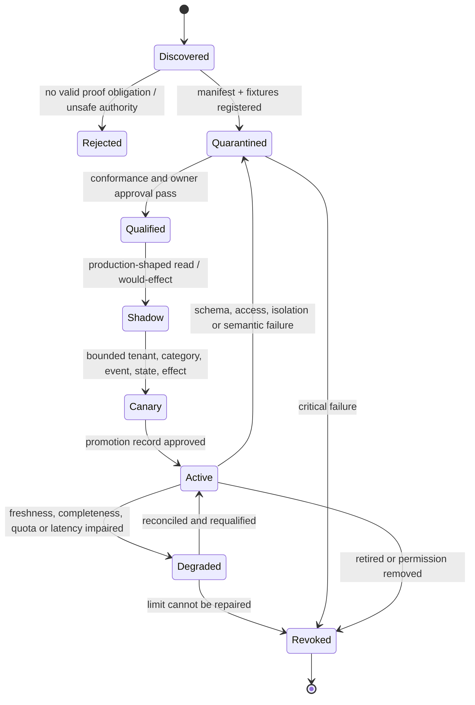
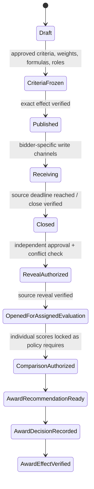

# Adapter Qualification and Worked Sourcing Lifecycle

> **Purpose:** Qualify each procurement capability for a narrow source, tenant, event state, and effect; preserve provider semantics; and walk one requisition through RFx, evaluation, award, downstream handoff, and realized-outcome review without transferring authority to the agent.

## Begin with the deterministic alternative

Do not add a model, new adapter, or MCP server because a product advertises an API. First state the proof obligation:

> For tenant `T`, legal entity `L`, sourcing event `E`, state `S`, purpose `P`, and role `R`, capability `C` can read or perform exactly `O`, preserve the named source semantics and limits, and produce a typed receipt that can be independently reconciled.

Choose the simplest qualified path:

1. an existing procurement-suite workflow/report with native controls;
2. a deterministic read-only API or signed/versioned export;
3. an organization-owned narrow adapter;
4. an approved portal/manual submission with authenticated provenance;
5. supervised browser automation only when no supported API/export exists; or
6. MCP only when an approved server is materially narrower than direct credentials and still passes the same domain contract.

If a spreadsheet comparison and accountable review can safely process the category volume, stop there. The model becomes useful only for measured ambiguity, heterogeneous evidence, or bounded discovery—not lifecycle state, money arithmetic, policy, official scoring, or award.

## Fixed ownership boundaries

| Neighbor | Owns | Procurement sends or reads | Procurement agent must not do |
| --- | --- | --- | --- |
| [Supply Chain and Logistics](../supply-chain-logistics-agent/README.md) | Orders/releases, inventory, allocation, receipt, shipment, carrier/warehouse operations, operational recovery | Acknowledged award/order-enablement facts; read-only fulfillment outcomes | Create/expedite orders, allocate stock, route freight, or resolve fulfillment exceptions |
| [Legal and Contract Operations](../legal-contract-operations-agent/README.md) | Contract language, clause selection, negotiation, legal interpretation, signature and obligations | Approved commercial facts, deviations, questions, evidence references and template/workspace ID | Draft final legal obligations, accept terms, interpret enforceability, or treat workspace creation as contract execution |
| [Finance and Accounting](../finance-accounting-agent/README.md) | Budget/ledger/subledger, invoices, payments, accruals, accounting treatment and finance-approved benefits | Budget reference and later read-only posted/spend aggregates | Change bank data, approve/pay invoices, post entries, or label modeled savings as realized accounting benefit |
| [Back-office Workflow](../back-office-workflow-agent/README.md) | Reusable generic case, approval, effect and exception mechanics | Typed procurement commands/events/effects using those mechanics | Collapse sealed bids, criteria freeze, bidder isolation, source selection or award authority into generic workflow status |

Supplier onboarding/master-data owners independently verify tax, bank, remit-to, legal-entity and duplicate facts. Collusion, corruption, sanctions, privacy and security investigations remain with their authorized functions. Procurement preserves evidence and pauses or routes the case.

## Qualification lifecycle and expiry



Qualification has an expiry. Re-run it after product/API/schema release, tenant feature/configuration, role/permission, sealed-bid rule, webhook, data-license, retention, limit, effect, or incident change.

## Typed capability manifest

The following is an illustrative organization-local contract, not a vendor endpoint or permission claim.

```yaml
schema_name: procurement.capability_manifest
schema_version: 1.0.0
capability_release: sourcing-event-read/4.2.0
provider_product: configured-e-sourcing-tenant
provider_contract_checked_at: 2026-08-31
tenant_and_legal_entity_binding: required
operations:
  - canonical_name: read_authorized_bid_snapshot
    provider_operation_ref: provider-schema/event-response-read
    mode: read_only
    permitted_event_states: [opened_for_evaluation]
    resource_bindings: [tenant_id, event_id, event_revision, bid_id, bid_revision]
    purpose_allowlist: [assigned_criterion_evaluation, approved_comparison]
    output_schema: procurement.bid_snapshot@2.0.0
  - canonical_name: submit_exact_award
    provider_operation_ref: provider-schema/award-submit
    mode: consequential_effect
    required_approval_profile: award-authority/5.0.0
    required_postcondition: exact_award_visible_in_source
auth:
  source_grant_policy_ref: grants/sourcing-platform/v7
  credential_mode: short_lived_workload
  model_visible: false
provider_semantics:
  state_mapping_release: provider-event-state/3.1.0
  money_mapping_release: provider-money/2.0.0
  pagination_and_ordering_release: provider-pages/4.0.0
limits:
  maximum_pages: 200
  maximum_bytes: 524288000
  rate_policy_ref: source-budget/sourcing-platform/v3
known_limitations: [provider_permission_model_requires_application_recheck]
owners: [source-owner, connector-owner, procurement-control-owner]
qualification_report_id: qual_01K...
manifest_sha256: "..."
```

Version meaning is semantic. Increase the major release for any change to identity, authorization, state mapping, sealed visibility, money/quantity semantics, completeness, ordering, canonicalization, or effect/postcondition behavior. Active events never resolve `latest`.

## Common adapter conformance suite

| Test family | Required cases | Hard failure |
| --- | --- | --- |
| Tenant/resource identity | Wrong tenant/legal entity, copied display name, deleted/recreated event, supplier alias, site mismatch | Data/effect accepted without stable source IDs |
| Authorization/state | Revoked role, delegation expiry, sealed/closed/cancelled event, unassigned evaluator, changed event revision | Bid exposed or effect committed outside exact role/state |
| Bidder/evaluator isolation | Cross-bid ID, cross-event cache, competitor attachment, criterion not assigned, provider support export | Protected data reaches unauthorized context or telemetry |
| Pagination/volume | Empty page with cursor, duplicate page, cursor loop, limit/truncation, partial export, retry | Partial population called complete |
| Time/order | Late webhook, out-of-order revision, timezone/DST, inclusive deadline, clock skew | Wrong bid/version accepted as timely/current |
| Schema/provider semantics | Unknown state/enum, missing optional/required field, type widening, feature disabled | Unknown provider state normalized to a known business conclusion |
| Money/quantity | Decimal precision, currency, tax, UOM, tier/volume, term, option, discount, negative/zero/missing | Value changes meaning or missing becomes zero |
| Documents | Malicious archive, active content, formula, password file, OCR rotation/table split, huge file | Untrusted content controls tools or uncited extraction becomes fact |
| Effects | Timeout before/after commit, duplicate, stale approval, changed target, cancellation race | Blind retry can duplicate publication, invitation, message, award or handoff |
| Webhooks/notifications | Invalid signature, replay, duplicate, gap, wrong audience, bounce, thread reply | Notification treated as approval/source truth or unequal disclosure occurs |
| Lifecycle/recovery | Correction, deletion/hold, key loss, regional restore, old release replay | Historical bid/effect cannot be reconstructed or isolation broadens |

The qualification report stores fixtures, canonical expected bytes, source configuration, access matrix, provider requests/responses, measured limits, faults, owners, approval and expiry. A successful connection test is not qualification.

## Provider and standard qualification map

### E-sourcing, procurement, P2P and ERP

| Representative source | Primary-source fact checked 2026-08-31 | Qualification consequence |
| --- | --- | --- |
| [SAP Ariba Event Management API 2605](https://help.sap.com/docs/ariba-apis/event-management-api/event-management-api) | Exposes event, participant, response, scenario, award, sealed-bid reveal/time and audit operations; documentation says the system does not validate intended API-user permission | Treat read, reveal, change, message and award as separate capabilities; enforce application authorization/SoD and prove source audit/postcondition |
| [Oracle Fusion Cloud Procurement 26B](https://docs.oracle.com/en/cloud/saas/procurement/26b/api.html) | Versioned REST resources/custom sourcing actions; some behavior depends on enabled features and explicit function/data privileges | Pin SaaS quarterly release, REST resource version, feature flags, business unit and privilege set; test in target tenant |
| [Oracle supplier sites 26B](https://docs.oracle.com/en/cloud/saas/procurement/26b/fapra/api-suppliers-sites.html) | Supplier-site resources expose GET and potentially POST/PATCH operations under different privileges | Procurement reads canonical/site state; onboarding/master owner performs create/update; never expose bank/payment relationships to the model |
| [Coupa R44 schemas](https://compass.coupa.com/en-us/products/product-documentation/integration-technical-documentation/core-api-and-csv-download-formats) | Indexed page lists separate R44 sourcing, purchasing, invoicing, CLM and supplier-risk schemas but warns that the page is legacy/unmaintained | Retrieve the exact supported schema from current Coupa docs/tenant; do not infer one module’s state or authority from another |
| [OASIS UBL 2.4](https://docs.oasis-open.org/ubl/UBL-2.4.html) | Standardizes many order-to-invoice documents and references, with optional/profile-dependent fields | Use an organization/partner profile with validation rules; schema validity does not prove matching, receipt, liability or payment authority |
| [OCDS 1.1.5](https://standard.open-contracting.org/latest/en/schema/reference/) | Immutable releases describe planning, tender, award, contract and implementation publication data | Useful import/export/publication model; not internal workflow, sealed-bid control, evaluator authority, or contract truth |

Provider statuses remain attributed assertions. `published`, `opened`, `approved`, `awarded`, `active`, `received`, `matched`, `paid`, or `closed` is stored with provider, resource/revision, native code, observation time and mapping release. It becomes procurement state only through a validated transition; it never becomes a legal or finance conclusion.

### Supplier discovery and commercial-risk data

Discovery sources help build a candidate universe. They do not establish legal identity, capacity, diversity status, financial health, cyber safety or eligibility by themselves.

Qualify query/search version, ranking versus deterministic filters, coverage geography/category/company size, refresh/lag, entity identifiers, parent/site/alias behavior, license/purpose, score methodology/version, missing-data treatment, corrections/appeals and export completeness. Preserve the original score and factors as a provider assertion; do not translate every vendor score into a universal `high/medium/low` without an approved mapping.

[GLEIF’s API](https://www.gleif.org/en/lei-data/gleif-api) supports legal-entity and relationship searches, including fuzzy matching. An LEI match and reported parent relationship are useful evidence, not a universal registry/ownership guarantee. Stable entity identity keeps publisher/source identifiers separate from the internal supplier master.

### Sanctions, debarment, ownership and registries

| Source/standard | Current capability or limitation | Safe use |
| --- | --- | --- |
| [OFAC Sanctions List Service](https://ofac.treasury.gov/other-ofac-sanctions-lists) | Primary U.S. list delivery with UI/API and multiple list/data formats; files and hashes update as official actions occur | Pin list/program/file release, publication/retrieval time, digest, query/match method and applicable policy; human resolves candidate match and legal consequence |
| [SAM.gov Exclusions API v4](https://open.gsa.gov/api/exclusions-api/) | Paginated public API; documented 10,000 synchronous-result ceiling and larger async extract ceiling; SAM posted an active change notice on 2026-08-11 | Use exact v4/OpenAPI contract or approved extract, record query/sections/total/limit/token state, and monitor imminent change; name result is not final identity match |
| [GLEIF LEI and relationships](https://www.gleif.org/en/lei-data/gleif-api) | Search/fuzzy match plus parent/child relationship data and reporting exceptions | Preserve LEI record/relationship status and exceptions; corroborate jurisdictional registry and beneficial ownership when required |
| [BODS 0.4](https://standard.openownership.org/en/latest/standard/) | Entity/person/relationship statements with provenance/lifecycle; pre-1.0 and future changes anticipated | Pin 0.4/publisher/dataset/publication policy; validate statement graph and uncertainty; do not treat schema conformity as verified beneficial ownership |

Never use a fuzzy-name threshold as automatic clearance or exclusion. Candidate match status is `no_candidate`, `candidate`, `possible_match`, `confirmed_match`, `confirmed_non_match`, or `unresolved`; only the authorized owner can write the last three under a versioned policy.

### Document, OCR and evidence adapters

The original supplier file remains immutable, encrypted and addressable by bid/revision. OCR, table extraction, translation, redaction and model extraction create derived artifacts with page/table/cell spans, implementation/model release, parameters, record counts, confidence as a routing aid, corrections, and loss statements.

[Google Document AI limits](https://cloud.google.com/document-ai/limits) currently distinguish fixed system limits from adjustable quotas and document file/page constraints. That illustrates why the manifest pins processor/version, region, sync/batch mode, size/page limits, quota project and fallback. Another OCR provider requires its own qualification. An OCR response proves neither faithful layout nor commercial meaning.

Sandbox archives/PDFs/spreadsheets with no procurement credentials or default egress. Disable macros/formulas/active content, bound recursion/pages/bytes/time, scan malware, preserve original formulas and displayed values separately, and reject password-protected/unparseable items into controlled clarification or human review.

### Legal, supplier-master and contract handoffs

The legal adapter exposes `create_approved_commercial_handoff` and `read_handoff_status`, not `generate_and_sign_contract`. It pins workspace/template IDs approved outside the model; passes exact awarded party/lot, commercial schedule, assumptions, deviations, evidence and approvals; and returns destination ID, schema acceptance, owner and defects. Legal writes clauses, negotiation outcomes, signature and obligations.

Supplier onboarding receives canonical awarded legal entity/site and evidence references. It independently verifies duplicates, tax, banking/remit-to and required registration. Bank-detail changes never travel from bid/email/model output into the master adapter.

### Finance, P2P and warehouse outcomes

Prefer read-only, source-owned P2P/ERP views for PO, receipt, invoice and posted-spend facts. A warehouse/lake is a derived source: pin catalog/database/schema/table/view, SQL/query ID and digest, snapshot/isolation, timezone, currency, row count, load watermark, upstream lineage, late/correction policy, access policy and output digest.

Warehouse audit/recovery features do not make a sourcing outcome authoritative. For example, [BigQuery time travel](https://cloud.google.com/bigquery/docs/time-travel) is a configurable two-to-seven-day recovery window, and [Snowflake ACCESS_HISTORY](https://docs.snowflake.com/en/sql-reference/account-usage/access_history) documents latency and statement/visibility limits. Finance/contract owners validate actuals and attribution; procurement records an outcome proposal and their decision.

### Notifications and supplier communications

Separate internal reminders, public notices, equal-information broadcasts, bidder-specific clarifications, award notices and operational alerts into different effect classes. Each binds exact audience IDs, channel/account, event/revision, round, confidentiality class, approved payload digest, locale, schedule/deadline, approval, semantic operation ID and delivery reconciliation.

Email/chat delivery or reaction is not approval. A webhook is a wake-up hint. Reconcile the authoritative platform message/audience and preserve bounces, withdrawals, corrected notices and equal-treatment impact. The model never chooses a recipient from free text.

### MCP only as a bounded transport

MCP does not supply procurement identity, bid isolation, sealed state, provider completeness, money semantics, approval, idempotency or award reconciliation.

Use it only when:

- the server/tool is organization-approved and narrower than a direct API credential;
- protocol date, server release, tool name/input/output schema, annotations, transport, auth, upstream source and qualification report are pinned;
- each result is wrapped in the same provider/evidence envelope as direct adapters;
- tool annotations and returned content are untrusted;
- read tools are separated from reveal/publish/message/award/handoff effects;
- resource/audience binding, least privilege, secret storage and no token passthrough are verified; and
- task ID/auth binding, TTL, polling, cancellation, result retrieval and cross-tenant/event isolation pass when tasks are enabled.

As checked on 2026-08-31, [MCP 2025-11-25 authorization](https://modelcontextprotocol.io/specification/2025-11-25/basic/authorization) requires resource indicators in its HTTP authorization flow and forbids token passthrough. [MCP tasks](https://modelcontextprotocol.io/specification/2025-11-25/basic/utilities/tasks) are experimental and require requestor authorization-context isolation where available. MCP never replaces the sourcing case/effect ledger; durable work is reconstituted from application state.

## Canonical identity chain

| Object | Semantic identity | Must remain distinct from |
| --- | --- | --- |
| Supplier entity | tenant + internal supplier ID + legal entity/site version + source identifier graph | Search result, contact, bank account, parent, beneficial owner |
| Sourcing event | tenant/legal entity + event ID + immutable revision + regime/profile | Requisition, platform display name, award |
| Round | event revision + round ID/version + opening/closing instant | UI status or message thread |
| Bid | event/round + canonical bidder entity/site + source bid ID + bid revision + envelope digest | Extracted fact set, normalized scenario, another lot |
| Lot | event revision + lot ID/version + item/scope manifest | Bid line, award, contract line |
| Criterion | criteria release + criterion ID/version + type + lot applicability | Model observation, evaluator score |
| Official score | evaluator assignment + bid/lot/criterion versions + actor + decision version | Model score, consensus, award decision |
| Money fact | decimal amount + ISO currency + price basis + UOM/quantity + period/term + tax/duty/freight/discount/options + source citation | Normalized comparable value or realized spend |
| Effect | semantic operation ID + target resource/version + exact payload digest + approval/grant | Attempt, API request ID, provider status |
| Handoff | award/version + destination/owner + schema/payload digest + handoff version | Transport receipt, destination acceptance, contract/order/payment |

Do not merge entities or bids in place. Corrections create a new version with `supersedes`, `splits`, `merges_candidate`, `corroborates` or `contradicts` relationships and impact dependent decisions.

## Provider evidence envelope

```yaml
schema_name: procurement.provider_evidence_envelope
schema_version: 1.0.0
envelope_id: pe_01K...
tenant_id: tenant-acme
case_id: src_01K...
attempt_id: attempt_01K...
capability_release: sourcing-event-read/4.2.0
qualification_report_id: qual_01K...
provider:
  product_release: provider-tenant-release-pinned
  operation_ref: event-response-read
  request_id: source-request-44
  account_resource_id: source-account-7
resource:
  event_id: evt-7812
  event_revision: 9
  bid_id: bid-204
  bid_revision: 3
  provider_state: OPENED_FOR_EVALUATION
  state_mapping_release: provider-event-state/3.1.0
observation:
  observed_at: 2026-08-31T08:22:41Z
  source_updated_at: 2026-08-30T17:00:00Z
  pages: 4
  records: 118
  pagination_terminal: true
  raw_artifact_id: raw_77
  raw_sha256: "..."
completeness:
  state: full_for_operation_not_event_universe
  limitations: [provider_api_omits_internal_support_access]
freshness:
  state: within_event_bound
security:
  decision_id: authz_91
  event_role: evaluator_assigned
  sealed_state_verified: true
result: registered_with_limitations
envelope_sha256: "..."
```

Closed completeness states are `full_for_operation`, `full_for_operation_not_source_universe`, `partial`, `truncated`, `retention_limited`, `schema_limited`, `conflicting`, and `unknown`. Freshness states are `within_event_bound`, `late_source`, `late_collection`, `stale`, `not_applicable`, and `unknown`.

## Sealed-bid and evaluator isolation protocol



Required controls:

1. The e-sourcing platform or separate cryptographic/source control enforces the seal. A prompt, UI banner or broker filter is insufficient.
2. Criteria/weights/formulas/normalization, event/lot definitions, evaluator roles and communication rules freeze before any protected bid visibility. An allowed amendment creates a new revision, impact record and equal communication.
3. Each bidder writes only its own envelope. Support/admin access is separately controlled and audited.
4. Reveal/open is a consequential effect with exact event/round, state, authorized actor, conflicts, approval, deadline and source postcondition.
5. Individual evaluation contexts contain only the assigned bid/lot/criterion and required evidence. Cross-bid comparison is a distinct later capability.
6. Evaluator identity maps to a real person and organizational relationships; aliases/service accounts cannot bypass conflict or SoD policy.
7. Model evidence maps remain visibly non-authoritative. Official scores/rationales are evaluator decisions bound to bid/criterion versions.
8. Support exports, provider caches, telemetry, shadow/evaluation data and incident bundles follow the same bidder/event access boundary.

## Worked example: requisition to realized outcome

The amounts and criteria below are illustrative, not a recommended procurement method.

### Step 1: accept and route the requisition

A business owner requests a three-year analytics service with implementation support and an approved planning value of USD 500,000. The system records `req-144@v6`, legal entity, cost center, demand/term assumptions, budget reference, data-residency need and event deadline.

- Deterministic policy resolves `competitive-rfx`, approval profile and applicable regime from pinned facts.
- The model proposes category candidates and two ambiguity questions; the requester approves the exact scope.
- Similar requisitions are surfaced for human aggregation review. The agent cannot split or combine demand to change a threshold.

**Gate:** no event is created until scope/value/route/profile/category owner and required legal/security consultations are explicit.

### Step 2: build the candidate supplier set

Discovery returns eight candidate organizations. Identity resolution produces six legal-entity candidates; two search results are aliases/sites. Procurement approves four for due diligence.

- Each entity graph retains registry IDs, LEI/registration where present, sites, parents, ownership statements, source/version/time and unresolved links.
- Sanctions/debarment searches bind exact official list snapshots and match inputs. One name-only candidate remains unresolved and blocks invitation until a human confirms non-match or applicable disposition.
- Commercial-risk and cyber signals are attributed provider observations, not eligibility decisions.

**Gate:** procurement/compliance owners approve the longlist and every required check is fresh, resolved or explicitly excepted by authorized policy.

### Step 3: freeze and publish the RFx

Event `evt-7812@r9` has two lots: `platform-subscription@v3` and `implementation@v2`. Criteria release `crit-5` contains technical 40%, evaluated price 35%, delivery 15% and risk evidence 10%, with exact lot applicability and an approved deterministic price formula.

- The package, criteria, normalization, dates, bidder list, clarification/equal-information rule, evaluator assignments and conflicts are independently approved before publication.
- The publish effect binds the package digest and expected draft revision. A timeout becomes `outcome_unknown`; the reconciler reads source publication state before retry.
- Supplier communications use the platform; identical broadcast facts are reconciled by audience and payload digest.

**Gate:** source platform confirms the exact published revision, suppliers, dates and sealed configuration.

### Step 4: close, reveal and extract bids

Three suppliers submit bid revisions before close. After the source close state, conflict/assignment checks and exact reveal approval pass, the gateway performs the reveal and verifies it at the source.

Illustrative extracted facts:

| Bid | Subscription | Implementation | Important condition | Normalization state |
| --- | --- | --- | --- | --- |
| A | USD 100,000 per year for three years | USD 80,000 once | Travel included | Comparable candidate: USD 380,000 before stated tax treatment |
| B | USD 330,000 for three years | Marked “included” | Usage above approved tier priced separately; tier amount missing | `unresolved`; never treat missing tier as zero |
| C | USD 115,000 per year for three years | USD 40,000 once | Transition credit of USD 25,000 conditional on a two-year prepayment | Base comparable and conditional scenario remain separate |

The model extracts citations and ambiguity. Decimal money services compute approved scenarios. A controlled clarification asks B for the missing tier and all recipients receive any generally applicable correction required by the event rule.

**Gate:** originals/digests, OCR/extraction versions, source citations, missing-state distinctions and clarification receipts are complete before comparison.

### Step 5: evaluate and decide award

Each evaluator first sees only the assigned bid/lot/criterion. They record official qualitative scores and rationales. Conflict service rechecks at decision time. Deterministic services calculate price scores from the approved formula and produce sensitivity scenarios.

The model drafts a recommendation packet that separates source facts, calculations, evaluator decisions, due-diligence states, contradictions, conditional prices and unresolved risks. Award authority records `accept`, `change`, `reject` or `cancel` with an independent rationale bound to the packet digest. The model never casts the score or award vote.

**Gate:** exact supplier/legal entity, lots, bid revisions, money basis, criteria, official scores, conflicts, exceptions, policy and approval remain current at commit.

### Step 6: commit, correct and notify

The award effect has a semantic operation ID derived from event/award version, awarded supplier/lots and packet digest. A lost response yields `outcome_unknown`; no alternate award or blind retry is permitted until the source is reconciled.

Supplier notices are separately approved effects. If one notice contains the wrong reason or audience, preserve it, stop related communications and issue an authorized linked correction under the regime—never delete history or expose another bid.

### Step 7: hand off without crossing authority

- **Legal:** exact commercial schedule, awarded parties/lots, assumptions, supplier deviations/questions, evidence and approvals create a workspace. Legal accepts or returns defects and owns language/signature.
- **Supplier master:** awarded entity/site and evidence create an onboarding case. Master-data owners verify duplicate/tax/bank/remit-to independently.
- **Supply chain/P2P:** order-enablement facts are acknowledged; procurement does not create or expedite purchase orders.
- **Finance/business:** budget and approved outcome baseline are acknowledged; finance owns posting and benefit acceptance.

The sourcing case remains `handoff_pending` until required destinations acknowledge/accept or an accountable owner records an exception.

### Step 8: reconcile realized outcome

At 90 and 365 days, read-only signed contract facts and P2P/finance aggregates are compared with the pre-approved baseline. Like-for-like decomposition separates price, volume, mix, scope, FX, tax, timing and service outcome.

If actual year-one eligible spend is USD 142,000, procurement does not call the difference from a USD 166,667 straight-line planning value “savings” automatically. It first reconciles one-time implementation, volume tier, prepayment credit, scope, invoice corrections and service acceptance. Finance/business owners validate the final classification; unresolved variance stays unresolved. A corrected invoice creates a new actual/outcome version.

## Effect, handoff and correction contract

```yaml
schema_name: procurement.effect_record
schema_version: 1.0.0
effect_id: eff-award-evt7812-r9-v1
semantic_operation_id: award/evt-7812/r9/decision-31
effect_type: submit_exact_award
target: {system: sourcing-platform, event_id: evt-7812, expected_revision: 9}
intent:
  award_id: award-31
  supplier_entity_id: supplier-779@v4
  lots: [platform-subscription@v3, implementation@v2]
  packet_sha256: "..."
intent_sha256: "..."
approval: {id: approval-91, policy_release: award-authority/5.0.0, expires_at: 2026-09-01T14:00:00Z}
attempts:
  - {attempt_id: attempt-1, dispatched_at: 2026-09-01T12:00:00Z, result: timeout_after_dispatch}
status: outcome_unknown
reconciliation:
  query_by: [provider_event_id, semantic_operation_id, packet_digest]
  deadline: 2026-09-01T12:15:00Z
  owner: sourcing-platform-operations
```

`outcome_unknown` is not failure. Reconciliation moves to `verified`, `not_committed`, or `manual_resolution`. Retry requires authoritative absence plus fresh state, approval and intent equivalence. Cancellation stops future attempts but cannot erase a committed remote effect.

A correction is a new typed command/effect that references the original record, reason, affected parties/decisions, approval and expected postcondition. It never rewrites an invitation, bid, score, award, notice, handoff or outcome.

## Decision gates and exercises

| Gate | Exercise | Pass evidence |
| --- | --- | --- |
| Agent fit | Run representative cases with deterministic workflow/templates | Model assistance measurably reduces bounded semantic work without raising control/review burden |
| Read adapter | Inject wrong event, sealed state, partial pages and unknown enums | All denied/quarantined; complete provider envelope and source limits |
| Bid isolation | Try cross-bid IDs, shared caches, support export and trace leakage | No unauthorized bytes/metadata; security audit record generated |
| Money | Replay tiered, option, tax, FX, zero/missing and rounding fixtures | Exact decimals and source meaning preserved; unresolved stays unresolved |
| Evaluator independence | Use alias/shared service account, late conflict and changed assignment | Access/score/award denied or invalidated by real-person/relationship SoD |
| Effect reliability | Drop response before and after publication/award/handoff commit | Safe retry only before dispatch; one remote outcome after reconciliation |
| Handoff | Make one destination reject schema and another time out | Per-destination states; no false completion; linked repair |
| Outcome | Inject late invoice, credit note, scope and volume changes | Versioned actual, decomposed variance, finance/business decision |
| Recovery | Lose cell near bid deadline with unknown award and reviewer backlog | Seals/keys/ledger restored; no duplicate/leak; protected queues drain in objective |

## Operator runbooks

### Bid or evaluator isolation failure

1. Stop bid reads, model routes, evaluation and award effects for affected event/cell.
2. Revoke sessions/grants/caches; preserve source, broker, provider and access evidence.
3. Identify exact bids, evaluators, model calls, exports, traces, support access and downstream decisions exposed.
4. Procurement, security, privacy/legal owners decide event remedy, notification and re-evaluation.
5. Add minimized failure/counterfactuals to zero-tolerance gates before a bounded canary.

### Provider schema or state drift

1. Quarantine adapter release and unknown states; preserve raw responses.
2. Identify affected events, bids, calculations, effects and handoffs by capability/release.
3. Update state/money/schema mapping and golden fixtures; qualify a new major/minor release as semantics require.
4. Replay and compare exact outputs; shadow/canary before activation. Never reinterpret retained records silently.

### Unknown publish, message, award or handoff outcome

1. Stop conflicting effects for the same event/audience/award/destination.
2. Query source by canonical target, provider correlation and semantic operation ID.
3. Verify exact revision/payload/digest/audience/actor/time/postcondition.
4. Mark `verified`, `not_committed`, or `manual_resolution`; retry only after authoritative absence and fresh authorization.

### Sanctions, ownership or registry change

1. Pin the changed source release and stop dependent invite/award/onboarding paths according to policy.
2. Re-run exact entity/query/match profiles for affected cases, retaining old/new snapshots.
3. Route candidates to authorized resolution; do not automatically clear/exclude or contact suppliers.
4. Record impact on invitations, evaluation, award, handoff and required correction/remedy.

### Recovery backlog after cell loss

1. Restore tenant/event routing, keys, sealed access, case/events, bids, approvals and effect ledger before enabling reads/effects.
2. Reconcile unknown communications/awards/handoffs first; protect imminent deadlines and expiring due diligence next.
3. Reserve qualified evaluator/award-owner capacity and vendor quota; shed OCR/model/backfill work.
4. Measure net drain rate and escalate if backlog cannot clear before deadlines.

## Qualification and lifecycle checklist

- [ ] One narrow proof obligation defines tenant, legal entity, event/state, role/purpose, data and effect.
- [ ] Existing deterministic/native workflow was evaluated before adding an agent, adapter or MCP.
- [ ] Capability manifest, source configuration, provider semantics, conformance report, owner, expiry and release are pinned.
- [ ] Supplier/entity, event/round, bid, lot, criterion, score, money, effect and handoff identities remain distinct.
- [ ] Sealed bid and evaluator isolation extend through source roles, broker, cache, provider, telemetry, shadow, evaluation, support and recovery.
- [ ] Criteria/formulas/roles freeze before bid visibility; permitted amendment creates a new revision and equal-information trail.
- [ ] Fuzzy identity/sanctions/ownership/provider-risk results remain attributed candidates until accountable resolution.
- [ ] OCR/extraction is cited derived evidence; deterministic code owns money/unit/time/option/rounding semantics.
- [ ] Real-person conflict/SoD and official human scores/award decision bind exact inputs and current authority.
- [ ] Every effect has semantic identity, attempt/effect separation, `outcome_unknown`, reconciliation and linked correction.
- [ ] Legal, supplier-master, supply-chain/P2P and finance handoffs end procurement authority and require destination acknowledgement/acceptance.
- [ ] Realized outcomes use approved baseline, signed facts, complete/corrected actuals, decomposition and finance/business validation.
- [ ] Failure injection, SLOs, recovery-load/DR, behavior-bundle shadow/canary/rollback/drift and controlled failure-mining gates pass.

## Current limitations and refresh triggers

Product and protocol facts were checked against primary documentation on 2026-08-31. They are representative, not compatibility guarantees. The research did not access a live SAP, Oracle, Coupa, supplier-risk, sanctions, registry, OCR, CLM, P2P, warehouse, notification or MCP tenant, nor organization contracts/licenses. Requalify the exact deployed edition, release, feature flags, permissions, data coverage, quota/limit, retention, webhook, idempotency, confidentiality and correction behavior. SAM.gov’s active August 2026 Exclusions API change notice makes that adapter an immediate watch item.
