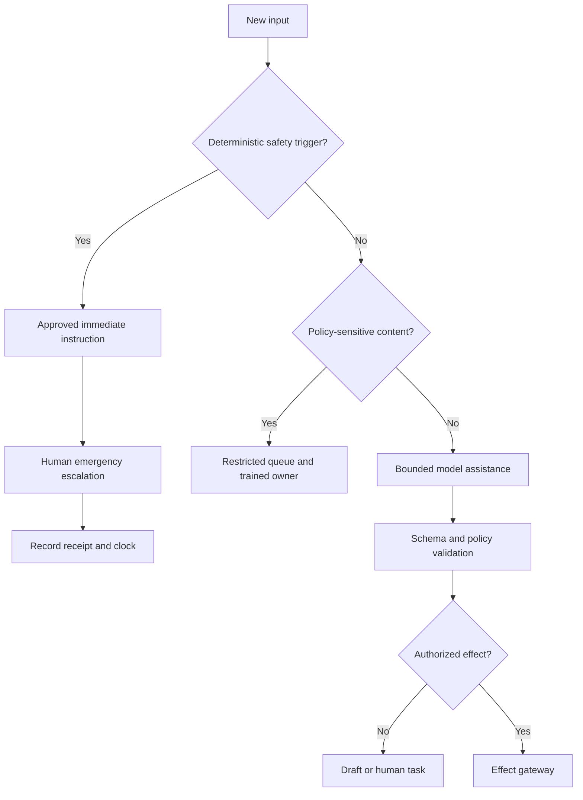

# Mission, Boundaries, Authority, and Stages

## Outcome

Use an agent only where language or document variability defeats a simpler deterministic workflow, and constrain it to reversible preparation until evidence supports narrowly approved effects. The target is faster, more consistent property operations—not automated control over housing, money, legal rights, safety, or doors.

## Start with the job, not the model

A useful mission is specific enough to test:

> For one approved portfolio, convert resident, prospect, property, vendor, and inspection inputs into cited operational proposals; maintain deterministic clocks; and execute only pre-authorized, recoverable effects through scoped connectors, while stopping for safety, legal, housing, screening, pricing, accounting, identity, and access decisions.

An objective such as “manage the property” is not testable and has no defensible authority boundary.

### Workload fit

| Work | Default implementation | Model value | Maximum initial authority |
|---|---|---|---|
| emergency phrase recognition | deterministic rules plus human hotline | none in the critical path | immediate approved script and escalation |
| lease date and amount lookup | typed query and rules | explain cited fields | read only |
| listing completeness | schema validation | suggest clearer copy | propose |
| showing availability | calendar intersection | explain alternatives | hold request, not entry grant |
| application completeness | checklist | clarify missing evidence | request missing item from approved template |
| screening | approved consumer-reporting provider and human policy owner | summarize a provider response without protected-class inference | handoff only |
| resident free-text intake | workflow plus taxonomy | classify and summarize | propose category/priority |
| SLA deadline | deterministic policy engine | explain why a clock applies | no authority to change clock |
| work-order creation | form/workflow | normalize problem statement | human-approved effect at first |
| vendor dispatch | rules, qualification registry, operator | compare qualified options | propose |
| inspection interpretation | structured checklist and licensed/qualified inspector | summarize recorded evidence | never certify |
| rent, fee, deposit, promotion | approved pricing/legal process | excluded | none |
| lease enforcement or eviction | counsel and authorized housing staff | excluded | none |
| payment or accounting | PSP/accounting system and authorized finance staff | explain status references only | none |
| door unlock or credential grant | access-control authority | excluded | none |

### Deterministic and no-agent alternatives

Choose the least complex method that meets the outcome:

1. **Static content:** approved FAQ, emergency poster, office-hours page, lease portal.
2. **Form and validation:** required fields, enumerations, consent capture, document checklist.
3. **Rules:** jurisdiction/property/lease policy tables, SLA timers, priority and escalation matrix.
4. **Search:** exact unit, lease, work-order, or vendor lookup with filters.
5. **Optimization:** a deterministic scheduler for time windows, skills, geography, capacity, and constraints.
6. **Workflow:** human task queues, notifications, reminders, and approvals.
7. **Model-assisted workflow:** only for ambiguous language, document extraction, comparison, or drafting.
8. **No automation:** novel legal disputes, credible threats, accommodation determinations, identity conflicts, final screening, eviction, appraisal, and irreversible access or financial action.

A model is unjustified if a form, rule, query, or solver can produce the same result with better predictability.

## Authority is an explicit contract

### Authority levels

| Level | Meaning | Examples | Release requirement |
|---|---|---|---|
| A0 — observe | read a least-privilege projection | retrieve unit status; read work-order receipt | access and redaction tests |
| A1 — advise | summarize, compare, or cite | missing application items; lease obligation explanation | grounding and abstention evals |
| A2 — prepare | create an inert draft | listing copy, resident reply, work-order preview | schema and policy validation |
| A3 — request | create a reversible internal request | showing hold; approval task | idempotency and cancellation |
| A4 — execute | perform a narrow pre-approved external effect | send approved transactional template; create approved work order | exact approval, verification, rollback/runbook |
| A5 — administer | alter policy, permissions, access, pricing, accounting, or legal status | forbidden for the agent | human/system authority only |

Authority is granted per `tenant × portfolio × property × workflow × effect type × connector × channel`. A system at A4 for a work-order acknowledgement may remain A0 for leases and have no credentials for access control.

### Non-delegable decisions

The agent must not:

- approve, deny, rank, or recommend applicants or occupants;
- infer race, color, national origin, religion, sex, familial status, disability, or any jurisdiction-specific protected characteristic;
- treat language, name, location, household composition, device, income source, disability-related information, or other proxies as a shortcut for eligibility or service quality;
- select a screening threshold, override an approved screening policy, or issue an adverse-action decision;
- determine whether an accommodation, modification, assistance animal, VAWA protection, or similar protected request is valid;
- author legal clauses, decide breach/default, give legal advice, issue an eviction notice, or negotiate a rights waiver;
- set rent, deposits, fees, concessions, renewal price, or price-discriminating promotions;
- estimate market value or make a lending/appraisal conclusion;
- post a ledger entry, refund, charge, disbursement, bank instruction, or reconciliation sign-off;
- unlock, lock, issue/revoke credentials, authorize entry, or bypass a resident's access conditions;
- certify safety, habitability, code compliance, inspection success, or work completion;
- select an unqualified vendor or suppress a reportable hazard.

These exclusions apply even when a connector technically exposes the operation.

## Bounded autonomy policy

Every workflow has a signed authority record:

```yaml
authority_grant:
  version: auth-2026-08-31.3
  tenant_id: tnt_17
  portfolio_ids: [pf_4]
  workflow: maintenance_intake
  allowed:
    - read_property_projection
    - classify_non_emergency_request
    - prepare_work_order
    - create_work_order_after_exact_approval
    - send_template_after_verified_creation
  forbidden:
    - alter_priority_clock
    - select_unqualified_vendor
    - grant_physical_access
    - certify_completion
  limits:
    max_external_effects_per_run: 2
    max_replans: 2
    max_tool_calls: 12
    run_deadline_seconds: 180
  stop_policy_version: stop-11
  approver_roles: [property_operator]
  expires_at: 2026-09-30T23:59:59Z
```

The gateway, not the prompt, enforces this record.

### Mandatory stops

| Signal | Immediate behavior | Owner |
|---|---|---|
| fire, smoke, gas odor, electrical arcing, flooding near electricity, active violence, medical emergency | show approved emergency instruction; create urgent human alert; do not wait for model | emergency operator |
| person/property/unit identity conflict | freeze writes and request verification | property data steward |
| stale or conflicting lease/occupancy facts | cite conflict; no notice, entry, or obligation effect | lease administrator |
| protected-class, accommodation, assistance-animal, VAWA, harassment, retaliation, or discrimination content | segregate record; restrict access; route to trained human | fair-housing/compliance owner |
| consumer-report error, identity theft, dispute, fraud allegation, or screening exception | stop screening workflow; preserve provider reference; route | screening policy owner |
| legal threat, subpoena, default, lease termination, eviction, or rights waiver | stop and preserve evidence | counsel/authorized housing staff |
| pricing, appraisal, lending, payment, refund, or accounting request | decline effect and route | approved domain owner |
| access request without validated authority, consent, and window | no door/credential effect; route | access authority |
| connector timeout after write submission | mark `effect_unknown`; reconcile before retry | operations |
| approval expired or source version changed | invalidate approval and re-prepare | original approver |
| prompt injection, secret request, cross-tenant reference, or policy bypass instruction | quarantine input and alert security | security |
| budget, tool-call, replan, or deadline limit | stop with continuity receipt | workflow owner |

The user-facing response should state what is known, what is not, what was or was not done, who now owns the case, and the next expected time. It must not invent reassurance.

## Safety and escalation precedence



The safety detector should favor recall for approved hazard phrases, support multilingual variants tested by local operations, and be monitored for misses and false alarms. It does not diagnose the hazard; it routes it.

## Stages 0–6

| Stage | Operating mode | Model authority | Consequential effects |
|---|---|---|---|
| 0 — charter and baseline | manual process measured | none | existing human process |
| 1 — deterministic foundation | canonical data, rules, queues, clocks, audit | none | typed human actions |
| 2 — read-only shadow | model sees redacted projections and replays cases | A0 | none |
| 3 — cited proposals | model drafts and explains in operator console | A1–A2 | operator executes separately |
| 4 — governed approvals | exact intents flow through approval gateway | A2–A3 | human-approved internal requests |
| 5 — narrow execution | allowlisted, low-blast-radius effects | selected A4 | prepare–approve–commit–verify |
| 6 — portfolio scale | cells, quotas, DR, release governance | no blanket increase | effect-specific grants only |

Progress is not automatic. A later stage can reduce model authority. The measurable gates and 100-point scorecard are in [Guide 11](11-zero-to-production-roadmap-exercises-and-gates.md).

## Worked boundary examples

### Prospect asks whether families are accepted

Unsafe: infer household status, tailor inventory, or discourage.

Safe:

1. retrieve the approved equal-housing and occupancy-policy text for the jurisdiction/property;
2. return the same available-inventory query used for other prospects;
3. avoid asking for protected information unless an approved application step lawfully requires a field;
4. log template and inventory snapshot versions;
5. route policy disputes to trained staff.

### Resident reports a leaking ceiling

The deterministic gate checks for collapse risk, contact with electricity, active flooding, and inability to safely remain. If triggered, it gives the approved immediate instruction and escalates. Otherwise the model may summarize location, onset, flow, visible damage, and access-window preferences; it may not declare the building safe or grant entry.

### Application has a screening-provider recommendation

The workflow stores provider, report/reference identifier, retrieval time, dispute status, and permitted human review task. The model does not convert the recommendation into a decision, infer missing traits, or produce a denial. If authorized staff takes adverse action based in whole or part on a consumer report, a deterministic reviewed notice process produces the required content and evidence.

## Decision gate

Do not proceed beyond Stage 0 until all answers are “yes”:

- Is the operational outcome narrower than “manage property”?
- Is there an accountable human owner and escalation coverage?
- Is each consequential field mapped to an authoritative source?
- Are prohibited decisions and effects enforceable outside the prompt?
- Can the process operate manually or deterministically during model outage?
- Are jurisdiction, housing program, property, lease, and channel policies identifiable?
- Can every external write be verified or reconciled?
- Can sensitive accommodation, safety, screening, and protected data be segregated?
- Is the expected value greater than workflow, compliance, and incident cost?

If not, fix the process first or do not deploy an agent.

## Exercise

Take one current process and produce:

1. a one-sentence mission;
2. its deterministic/no-agent alternative;
3. a field-authority table;
4. an effect inventory with reversibility;
5. A0–A5 authority per effect;
6. ten mandatory stops;
7. an outage procedure that does not use a model;
8. one measurable safety, fairness, reliability, and operator-efficiency target.

Reject the exercise if any owner is “the AI,” any decision is described only as “use judgment,” or an API capability is treated as authorization.
