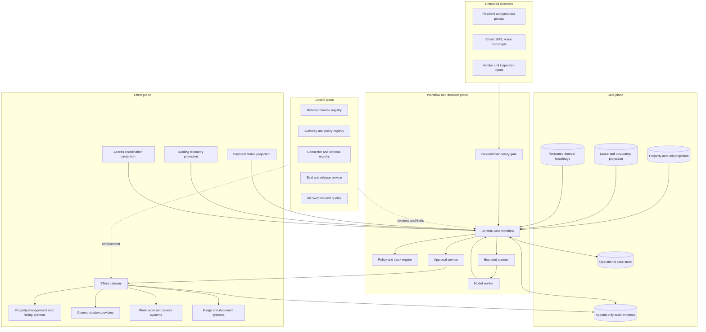
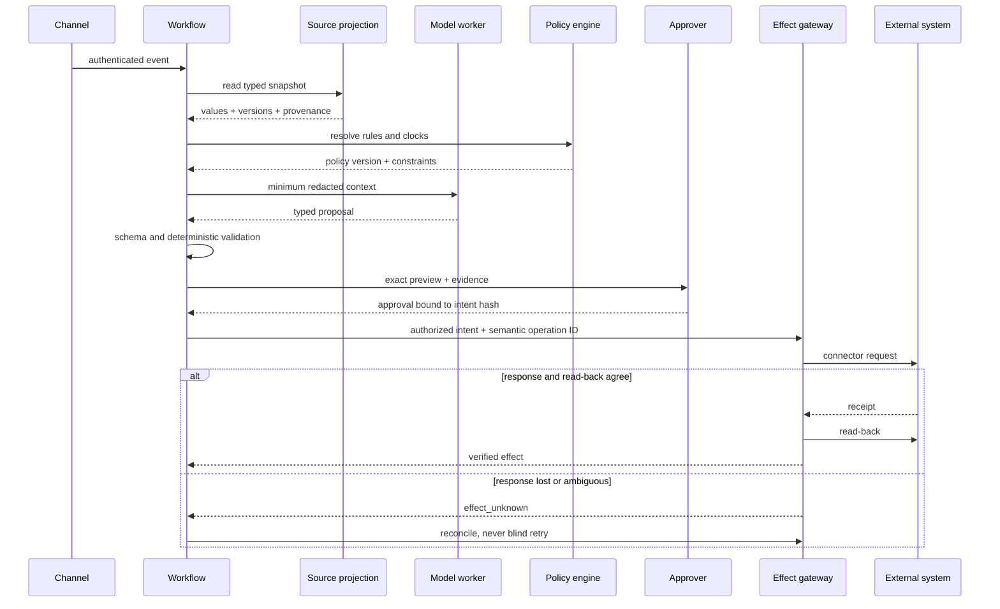

# Reference Architecture, Runtime, and Control Planes

## Architecture decision

Use one durable workflow coordinator per operational case, deterministic services for rules and state, a bounded model worker for language-heavy steps, and a single effect gateway for all external writes. Add separate agents only when a distinct trust domain and owner justify the coordination cost.

## Planes and trust boundaries



Trust boundaries:

1. channel content is data, never instruction;
2. model output is an untrusted proposal, even when schema-valid;
3. retrieved documents are untrusted content with trusted provenance metadata;
4. the workflow state store is durable progress, not domain authority;
5. connector responses are observations until receipt/read-back verifies them;
6. building and access systems are separate high-consequence zones;
7. control-plane changes require stronger roles than ordinary case operation.

## Component responsibilities

| Component | Owns | Must not own |
|---|---|---|
| channel adapter | authentication context, message receipt, attachment quarantine | housing decisions |
| safety gate | tested phrase/rule routing and immediate scripts | diagnosis |
| durable workflow | state transitions, timers, retries, human tasks, continuation | property or lease truth |
| policy engine | versioned deterministic rules, clocks, required approvals | free-form legal interpretation |
| projection service | least-privilege, provenance-rich views of systems of record | silent conflict resolution |
| planner | next permitted steps within a fixed state machine | open-ended goals or authority expansion |
| model worker | extraction, classification, summarization, comparison, drafting | direct credentials or external writes |
| approval service | exact intent preview, role checks, expiry, decision evidence | changing an intent after approval |
| effect gateway | authorization, idempotency, rate limits, write, verify, reconcile | deciding business policy |
| audit store | immutable evidence links and hashes | general-purpose transcript retention |
| control plane | behavior bundles, grants, connector versions, release state, kill switches | case-by-case operational judgment |

## Workflow, not conversation, owns progress

Model calls are retryable activities inside a durable case state machine. Case state includes:

- case, tenant, portfolio, property, unit, person-role, and workflow identifiers;
- authoritative object references and observed versions;
- policy and behavior-bundle versions;
- current state, clocks, blockers, required human role, and next permissible transition;
- completed, pending, and unknown effects;
- approval records and invalidation reasons;
- a typed continuity receipt after compaction or handoff.

A chat transcript may be useful evidence but must not be the only source of deadlines, approvals, or effect status.

### Runtime selection

| Need | Use | Avoid |
|---|---|---|
| fixed steps and timers | durable workflow/state machine | autonomous loop |
| exact deadline/eligibility rule | policy engine | natural-language interpretation |
| fuzzy message or document | bounded model call with typed output | embedding the whole case blindly |
| calendar/resource constraints | deterministic constraint solver | model arithmetic |
| factual retrieval | typed query and cited result | model memory |
| high-stakes exception | human task with evidence | more model debate |
| one narrow external effect | effect gateway activity | tool call directly from model |
| long history | durable state plus typed compaction | resending full transcript |

Technology choice is secondary. A workflow engine can be commercial, open source, or an in-house state machine if it provides durable timers, versioned transitions, retry visibility, human signals, history limits, and replay/migration tests. Workflow code must be deterministic; network and model calls belong in activities. Activities may execute more than once, so application-level idempotency remains mandatory.

## Single coordinator before multi-agent

A single coordinator is usually safer because property operations share state and clocks. Split into another agent only if all are true:

- it has a distinct owner and trust boundary;
- it can communicate through a typed, versioned contract;
- no shared hidden memory is required;
- failure and timeout behavior are independently defined;
- the split improves isolation or evaluation enough to outweigh latency and coordination risk.

Good separations may include a restricted fair-housing/compliance review service or a building-telemetry analysis service. Bad separations include “listing agent,” “lease agent,” and “maintenance agent” that all mutate the same case through conversational handoffs.

## Tenant and portfolio isolation

Apply isolation at every layer:

| Layer | Required control |
|---|---|
| identity | authenticated principal, tenant membership, role, property assignment |
| workflow | tenant and portfolio immutable in workflow identity |
| database | row-level or database-level tenant enforcement; deny missing tenant key |
| retrieval | tenant-specific index/namespace and metadata filter enforced server-side |
| connector | tenant-specific credential and allowlisted property scopes |
| queue | tenant/portfolio routing key, quotas, and poison-message quarantine |
| cache | tenant in cache key; no shared prompt/result cache for sensitive content |
| model | least data, redaction/tokenization, no secrets |
| observability | tenant-aware authorization for traces; redacted central metrics |
| backup/export | tenant-scoped restore and deletion tests |

Never accept `tenant_id` from model output as authorization. Derive it from the authenticated workflow context.

## Planning without open-ended autonomy

The macro plan is a reviewed state graph. The model may produce only a bounded micro-plan:

```json
{
  "case_state": "awaiting_non_emergency_clarification",
  "goal": "collect location and symptom details",
  "steps": [
    {"action": "ask_template", "template_id": "maint-clarify-7"},
    {"action": "wait_for_event", "event": "resident_reply"}
  ],
  "stop_if": ["safety_trigger", "identity_conflict", "two_failed_clarifications"],
  "max_steps": 2,
  "expires_at": "2026-08-31T12:30:00Z"
}
```

The runtime validates actions against the current state and authority grant. Replanning occurs only on a new event, failed precondition, or explicit human correction, up to the configured limit.

## Data flow for a consequential effect



## Control-plane behavior bundle

Every run pins a versioned bundle:

- model/provider and inference settings;
- system instructions and schema versions;
- tool catalog, descriptions, argument/result schemas, and connector adapters;
- authority, stop, redaction, retrieval, policy, and template versions;
- knowledge-corpus manifest and effective dates;
- eval-suite and release evidence digest;
- deployment, feature-flag, and canary cohort;
- compatibility and rollback metadata.

Changing a template, tool description, retrieval corpus, safety dictionary, or policy rule is a behavior change even if model and code are unchanged.

## Degraded operation

| Failure | Degraded behavior |
|---|---|
| model provider unavailable | deterministic intake, emergency routing, queues, clocks, template notices, and manual review continue |
| property source unavailable | serve last-known data only when labeled with age; block consequential writes requiring fresh truth |
| connector write unavailable | queue approved intent until expiry if safe; otherwise cancel and request fresh approval |
| read-back unavailable after write | mark unknown, freeze same-semantic effect, reconcile |
| policy registry unavailable | use pinned cached version only within approved validity; otherwise manual queue |
| retrieval unavailable | do not fabricate; provide source-system route or human handoff |
| audit store unavailable | fail closed for consequential effects or use a tested durable local outbox |
| queue overload | safety and expiring legal/operational clocks get reserved capacity; shed low-priority drafting |

## Architecture decision gate

The design fails review if:

- the model can call a write connector directly;
- a prompt is the only enforcement for a prohibition;
- one broad API credential crosses tenants or includes accounting/access scopes;
- workflow recovery depends on the transcript;
- a timeout is treated as proof that no write occurred;
- approval does not bind source versions and exact content;
- external facts are copied into memory without provenance and freshness;
- outage mode cannot preserve emergency routing and SLA clocks;
- multi-agent coordination replaces a simpler state machine.

## Exercise

Draw the current maintenance-intake system and mark:

1. every authoritative source;
2. every untrusted input;
3. every state store;
4. every place a write can occur;
5. every credential scope;
6. every timer and its owner;
7. the exact point where an outcome becomes unknown;
8. the manual path during model and connector outage.

Then remove any direct model-to-effect edge and justify every remaining component.
