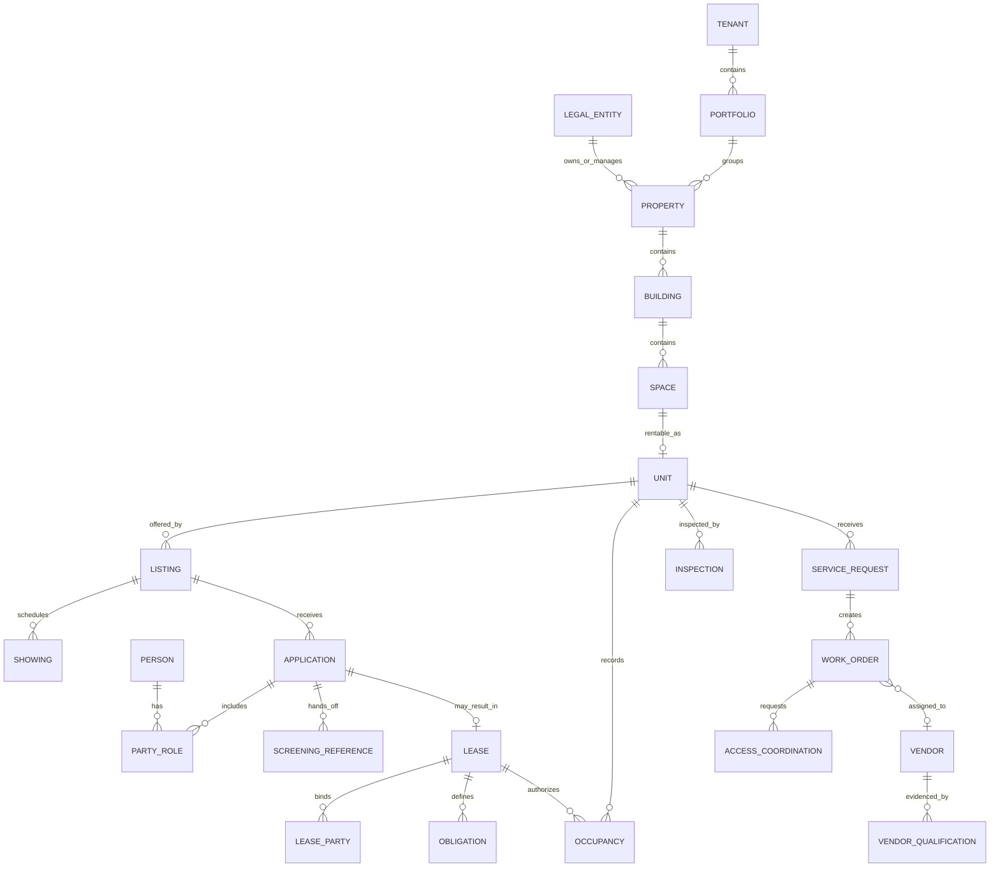
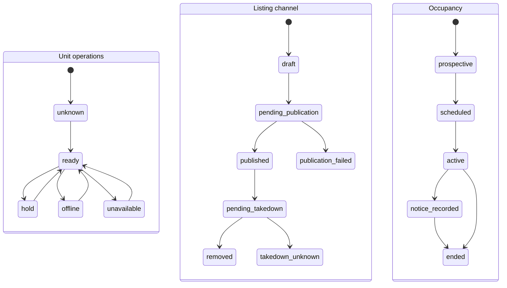
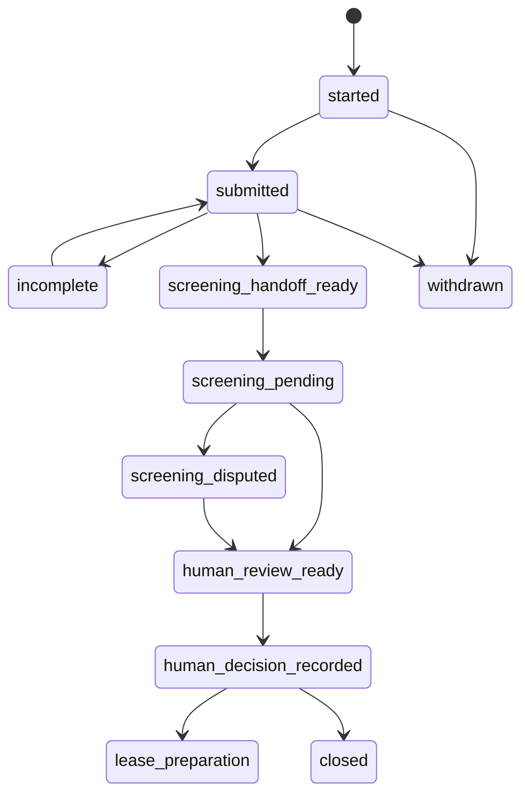
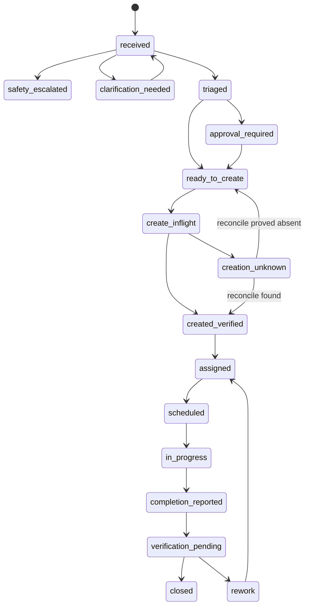

# Property, Unit, Occupancy, Listing, and Lease Contracts

## Domain rule

Never build a consequential workflow on a generic “property record.” Model legal entities, physical places, market offerings, people and roles, agreements, possession/occupancy, operational work, and observations separately. Each field needs one authoritative owner, provenance, version, time semantics, and an explicit unknown state.

## Canonical entity map



Important distinctions:

- `person` is not `applicant`, `tenant`, `occupant`, `guarantor`, `vendor worker`, or `authorized entrant`; those are time-bounded roles.
- ownership, management, leasing, maintenance, and legal-notice entities can differ.
- `unit status`, `listing status`, `lease status`, and `occupancy status` can disagree legitimately.
- a signed lease does not prove move-in; physical presence does not prove authorized occupancy.
- address standardization, geocoding, parcel identity, postal deliverability, emergency location, and internal unit identity are different observations.

## Canonical identity and bitemporal semantics

For every consequential record preserve **effective time** (when it applied in the property/lease world) and **system time** (when this system observed or changed it). Late lease amendments, back-entered payments, reassignment, occupancy corrections, restored connector events and revoked credentials make a single `updated_at` unsafe. Names, addresses, unit labels, external IDs and filenames are aliases, not universal keys.

| Object | Stable identity and scope | Version/effective-time semantics | Never conflate with |
|---|---|---|---|
| Platform tenant | Platform-assigned tenant ID | Isolation policy/config release and active interval | Portfolio, owner or management company |
| Owner | Legal entity ID + typed ownership-interest record | Effective/system intervals, source instrument/registry and percentage/scope | Property manager, payee or contact |
| Manager | Legal entity/person ID + management-authority assignment | Property/portfolio scope, effective dates, delegation, authority version and revocation | Owner, leasing agent, vendor or approver |
| Property | Stable master property ID | Hierarchy/version, jurisdiction/timezone observations and management intervals | Postal address, parcel, listing or building |
| Building | Property-scoped building ID | Structure/hierarchy, entrance, system and lifecycle versions | Property, mailing address or unit |
| Unit | Stable source/master unit ID | Building/space relation, market label, attributes and inventory state version | Listing, lease, occupancy or address subpremise |
| Space | Stable parent-scoped space ID | Type, geometry/label, rentable relation and valid interval | Unit or access-controlled zone |
| Listing | Listing/offer ID plus channel-publication IDs | Offer/source snapshot, terms, audience rights, effective window and per-channel receipt version | Unit availability, inquiry, application or executed lease |
| Applicant | Person/organization ID + application-scoped applicant role | Role, identity/consent/evidence/dispute state and application version | Prospect, tenant, occupant, screening score or selection decision |
| Tenant | Person/organization ID + lease-scoped tenant/lessee role | Role effective interval, executed agreement reference and corrections | Platform tenant, applicant, occupant, payer or contact |
| Occupant | Person ID + occupancy/lease-authorized role | Possession/authorization start/end, source and status version | Tenant, visitor, emergency contact or physical presence observation |
| Lease | Stable lease ID + immutable executed-document manifest | Draft/executed/superseded state; effective/term/signature/system times and party/unit refs | Model abstract, envelope, occupancy or payment plan |
| Amendment | Amendment ID linked to base lease and superseded terms | Executed bytes/hash, effective date, signing chronology and abstract recomputation version | Editing the base document or a renewal proposal |
| Application | Application ID scoped to exact listing/offer | Submitted/corrected/withdrawn state, source receipts and policy/screening references | Applicant identity or selection/adverse-action decision |
| Payment | Ledger/payment-intent/provider-transaction IDs linked by semantic operation | Amount/currency/payer/allocation, created/posted/settled/failed/refunded/reversed times and webhook/read-back version | Charge, balance, rent obligation, deposit or API acceptance |
| Deposit | Custodial/ledger deposit ID + lease/person/property scope | Receipt, custody account, amount, disposition, accrual/return/deduction states and jurisdiction rule version | Rent payment, fee, authorization hold or provider token |
| Service request | Request ID + source channel receipt | Received time immutable; symptom/location/safety triage corrections append | Work order, diagnosis, inspection or completion |
| Work order | CMMS/PMS work-order ID + semantic creation operation ID | Priority/rule, assignment, status event sequence, SLA clocks, supplements, cancel and verification | Service request, vendor dispatch, permission to enter or invoice |
| Asset | Property/building asset ID + source-system crosswalk | Model/serial/location, ownership, condition/telemetry and maintenance-plan versions | Space, sensor point, work order or safety certification |
| Vendor | Vendor/legal entity ID + destination-system crosswalk | Contact/tax/payee details separate from qualification; active/blocked interval | Vendor worker, selected assignee, approver or qualified status |
| Vendor qualification | Qualification ID scoped by service/geography/property | License/insurance/certification/contract evidence, verified/expiry times, restrictions and reviewer | Preferred rank, availability, safe work or payment eligibility |
| Appointment | Appointment ID linked to showing/work/inspection purpose | Requested/held/confirmed/cancelled/no-show states, window timezone and participant versions | Entry permission, access credential, presence or completed work |
| Access credential | Security-system credential/token ID bound to authorized subject/door/group | Issuance/activation/expiry/revocation, allowed zones/times, issuer and audit-event sequence | Appointment, lease, consent, identity proof or successful physical entry |
| Inspection | Inspection ID + governing program/checklist/version | Scheduled/performed/reviewed state, qualified inspector, observations/artifacts and correction deadlines | Model photo analysis, work-order completion or legal compliance conclusion |
| Compliance obligation | Obligation instance ID from exact rule/lease/program trigger | Rule/source/effective version, trigger evidence, timezone/calendar, due/complete/waived/extended state and owner | Reminder, SLA target, generic policy text or model estimate |
| Document | Immutable artifact ID + byte digest; separate rendition/extraction IDs | Source, signer/creator, object version, page manifest, retention/hold and supersession | OCR text, lease abstract, signature validity or legal interpretation |
| Communication | Communication intent ID + rendered artifact + recipient/channel attempt ID | Template/locale/rule/fact/recipient versions, approval, send attempt, provider status and correction | Draft, conversation, delivery, legal notice or consent |
| Approval | Approval ID for one intent hash and resource/version set | Human principal/role/scope, reason, granted/expiry/revoked/use state and SoD evidence | Recommendation, login session, button click or effect success |
| Effect | Semantic operation ID for one exact external business intent | Intent hash, preconditions, dispatch attempts, provider IDs, verified/unknown/rejected/cancel state and reconciliation | Tool call, HTTP request, desired state or provider `2xx` |
| Correction | Correction ID linked to original fact/decision/communication/effect | Authorized reason, before/after references, effective/system time and downstream propagation state | Deletion, history rewrite, retry or silent mutation |

For each cross-system mapping retain source ID, canonical ID, mapping rule/version, observed time, confidence/ambiguity and a reversible crosswalk. A model may propose candidates; it cannot bind an ambiguous person, property, unit, payee, access subject, legal entity or effect target.

## Field authority

Authoritative ownership is decided per field, not per object.

| Field group | Authoritative source | Derived/projection use | Conflict behavior |
|---|---|---|---|
| property/unit IDs and hierarchy | property-management/master-data system | search, display, workflow routing | data-steward queue |
| legal ownership/management role | approved legal/entity registry | notices and approval routing | block legal/financial effect |
| market availability | approved inventory source plus hold/lease state | listing/search projection | show “verification required” |
| listing publication state | each channel receipt/read-back | portfolio status | reconcile channel independently |
| applicant-provided data | signed/application source and field provenance | completeness only | ask person or authorized reviewer |
| screening result | approved consumer-reporting provider | reference/status in restricted view | dispute/identity queue |
| final screening decision | authorized human decision record | downstream workflow trigger | never derive |
| lease language and terms | executed document/version and approved abstract | obligation engine | block if abstract and document differ |
| occupancy | approved occupancy/possession source | operations | do not infer from messages |
| charge/ledger balance | accounting/ledger system | read-only status projection | finance queue |
| work-order state | CMMS/PMS work-order record | resident updates/portfolio views | reconcile event sequence |
| safety condition | qualified inspector/emergency/maintenance evidence | restricted operational routing | never certify from model |
| access permission | authorized access/lease/consent system | coordination view | no entry effect |

## Observation semantics

Every consequential value uses an observation wrapper:

```json
{
  "value": "occupied",
  "status": "known",
  "source": {
    "system": "pms",
    "object_type": "occupancy",
    "object_id": "occ_912",
    "field": "status",
    "version": "etag:8d2"
  },
  "observed_at": "2026-08-31T06:12:44Z",
  "effective_from": "2026-08-01T00:00:00-04:00",
  "effective_to": null,
  "confidence": "authoritative",
  "jurisdiction_timezone": "America/New_York"
}
```

`status` is one of:

- `known` — source asserts a value;
- `unknown` — source has no value;
- `stale` — freshness budget exceeded;
- `conflicting` — two applicable authoritative observations disagree;
- `not_applicable` — field does not apply;
- `redacted` — access policy withholds it;
- `unverified` — supplied but not verified;
- `derived` — deterministic result with input and rule references.

Never coerce these states to empty string, zero, or false.

## Property and unit snapshot

```yaml
property_unit_snapshot:
  schema_version: property-unit/1.2
  tenant_id: tnt_17
  portfolio_id: pf_4
  property:
    property_id: prop_103
    source_version: etag:31c
    operational_timezone: America/New_York
    jurisdiction_refs: [us-federal, state_x, city_y]
    housing_program_refs: []
  building:
    building_id: bld_2
  unit:
    unit_id: unit_5c
    market_label: "5C"
    unit_type_ref: two_bed_a
    source_version: etag:a19
  availability:
    status: conflicting
    observations:
      - source: pms
        value: available
        observed_at: 2026-08-31T06:00:00Z
      - source: lease_projection
        value: hold_pending
        observed_at: 2026-08-31T06:01:12Z
  address_refs:
    postal: addr_postal_88
    service: addr_service_44
    emergency_location: emloc_3
  allowed_uses: [showing_search, maintenance_routing]
  prohibited_uses: [screening_rank, rent_pricing]
```

The conflict blocks publication or promise of availability until the designated owner resolves it.

## Address and spatial contract

Store separate typed records:

- **postal address:** formatted for mail; normalization does not prove existence or occupancy;
- **service address:** vendor/navigation destination and instructions;
- **emergency location:** dispatch-approved building, entrance, floor, unit, and hazard details;
- **parcel/cadastral reference:** jurisdiction-specific land identifier;
- **geocode:** coordinates, CRS, precision, provider, benchmark/vintage, match type, and time;
- **internal spatial reference:** building, floor, room, equipment, and entrance graph.

GeoJSON coordinates follow longitude then latitude. Pin geocoder benchmark/vintage instead of relying on a moving “current” default. Never expose sensitive resident or access details in a general map index.

## State machines

### Unit, listing, and occupancy are independent



Do not atomically label all three “occupied.” A unit can be offline with active occupancy; a listing can remain published after a lease; a lease can be signed before occupancy.

### Application and screening



No transition named `agent_approved` or `agent_denied` exists.

### Lease and obligation

```yaml
lease_obligation:
  schema_version: lease-obligation/1.1
  obligation_id: obl_551
  lease_id: lease_91
  lease_document:
    version_id: docv_7
    sha256: "9a...42"
    citation:
      section: "12"
      page: 18
  type: resident_notice_window
  obligated_party_role_id: role_203
  beneficiary_role_id: role_88
  rule:
    policy_version: renewal-policy/state_x/2026-07
    calculation: deterministic
    inputs:
      lease_end_local_date: 2027-01-31
      required_days: 60
  due:
    local_date: 2026-12-02
    timezone: America/New_York
    instant_policy: start_of_business
  status: pending
  authority: lease_administrator
  agent_permissions: [explain_with_citation, draft_reminder]
  agent_prohibitions: [waive, modify, interpret_dispute, send_legal_notice]
```

The policy engine calculates dates. A model can explain the cited calculation but cannot create a deadline from prose alone.

### Work-order lifecycle



“Technician says complete” and “qualified verification accepted” are separate events.

## Event and version rules

- Use immutable IDs; labels can change.
- Include aggregate version/ETag in every prepare and approval.
- Express business effective time separately from observation and ingestion time.
- Store original timezone and normalized instant; do not infer midnight semantics.
- Reject out-of-order events that violate the aggregate version; quarantine ambiguous order.
- Use a source-specific deduplication ID plus payload hash.
- Represent correction as a new event linked to the superseded observation.
- Preserve document and policy hashes used for consequential decisions.

## Invariants

1. A listing references exactly one approved offer/unit scope and cannot override unit authority.
2. A showing does not create occupancy or physical-entry permission.
3. An application can have multiple party roles; no single person field implies household eligibility.
4. A screening reference cannot transition to a housing decision without an authorized human record.
5. A lease transition requires a known document version and authorized signatory evidence.
6. Occupancy and lease status are reconciled, not assumed identical.
7. A work order cannot be assigned to a vendor whose required qualification is missing, expired, or out of scope.
8. Access coordination cannot contain a reusable unlock secret.
9. A closed work order retains source receipt and verification evidence.
10. Cross-tenant references fail closed.

## Contract tests

Test at minimum:

- stale property data and fresh lease hold disagree;
- duplicate unit labels across buildings;
- postal address normalizes but unit ID is unknown;
- geocoder changes match after benchmark upgrade;
- application adds/removes a co-applicant without overwriting person identity;
- consumer-report dispute arrives after human review task was created;
- lease amendment changes one obligation and invalidates the old approval;
- move-out recorded before listing takedown receipt;
- work-order completion arrives before assignment event;
- vendor qualification expires while dispatch approval waits;
- DST changes a local deadline calculation;
- tenant A guesses tenant B's object ID.

## Decision gate

No consequential workflow proceeds until:

- every referenced entity has a stable tenant-scoped ID;
- every field has authority and freshness;
- states distinguish unknown, conflict, and stale;
- leases and policies are versioned and citable;
- listing, lease, occupancy, and access are independent;
- optimistic concurrency and out-of-order behavior are tested;
- restricted fields have purpose and role controls;
- migration and replay preserve invariants.
