# Listings, Showings, Applications, Screening, and Leases

## Operating rule

Automate the movement of evidence, not the exercise of housing discretion. The agent can validate listing facts, schedule from approved inventory, collect complete applications, hand off to an approved screening process, and prepare lease/renewal work. Authorized humans own housing decisions, exceptions, legal terms, and consequential notices.

## End-to-end lifecycle

```mermaid
flowchart LR
    T[Unit and offer truth] --> L[Listing draft]
    L --> Q[Schema, policy, and fair-housing checks]
    Q --> P[Publish through effect gateway]
    P --> S[Showing request]
    S --> B[Calendar hold and coordination]
    B --> A[Application intake]
    A --> C[Completeness and consent]
    C --> H[Approved screening-provider handoff]
    H --> R[Restricted human review]
    R --> D{Human decision}
    D -->|Proceed| E[Lease preparation]
    D -->|Do not proceed| N[Reviewed notice workflow]
    E --> X[E-sign and verification]
    X --> O[Occupancy/move-in workflow]
    O --> W[Renewal obligation clocks]
```



At each arrow, preserve the source version, rule version, actor, effect receipt, and resulting state.

## Listing truth and publication

### Build from an approved offer snapshot

A listing draft may use only allowlisted fields from an approved listing projection:

- property and unit marketing identifiers;
- availability state and earliest date with freshness;
- approved rent/fee/concession values as immutable source references, never model-generated values;
- approved features and accessibility fields with evidence;
- pet, smoking, parking, amenity, utility, application, and occupancy-policy text from reviewed templates;
- approved images with rights, accessibility text, and provenance;
- contact and showing channels;
- required disclosures and equal-housing content for the applicable jurisdiction/program.

The model can improve clarity and produce channel-length variants. It must not add a feature, make a safety/accessibility guarantee, use protected-class targeting, or vary inventory/terms by inferred audience.

### Publication is per channel

```yaml
listing_effect:
  semantic_operation_id: listing:unit_5c:offer_8:channel_3:publish:v12
  listing_id: lst_48
  source_versions:
    unit: etag:a19
    offer: etag:55b
    template: listing-copy/17
  channel: channel_3
  content_hash: sha256:ab91...
  effective_window:
    starts_at: 2026-09-01T09:00:00-04:00
    ends_at: 2026-09-14T17:00:00-04:00
  approval_id: apr_904
  verification:
    method: channel_read_back
    expected_fingerprint: sha256:ab91...
```

Track `pending_publication`, `published`, `publication_failed`, `pending_takedown`, `removed`, and `takedown_unknown` separately for each channel. A successful API response is not proof that the public page is correct. When a unit becomes unavailable, start takedown reconciliation; never promise takedown until verified.

### Fair-housing advertising controls

- Use the same eligibility-neutral templates, inventory query, service levels, and channel choices for equivalent requests.
- Do not infer protected status or build lookalike/proxy audiences.
- Ban steering language about neighborhood demographics, “fit,” schools as a protected-class proxy, safety guarantees, religion, family composition, disability, or preferred tenants.
- Require evidence for accessibility claims; “accessible” is not a decorative adjective.
- Run counterfactual pairs that change names, language cues, disability/family references, or other controlled protected/proxy signals while holding the operational request constant.
- Keep current reviewed policy rather than relying on withdrawn platform-advertising guidance; see the [research packet](../../research/packets/real-estate-property-operations-agent-blueprint.md).

## Showing coordination without access authority

The workflow may:

- retrieve eligible listing and staff calendars;
- offer identical available slots under deterministic rules;
- place an expiring hold;
- collect attendee count, accessibility/requested-assistance routing, contact consent, and arrival instructions;
- verify host assignment and send reviewed reminders;
- record cancellation/no-show and restore the slot.

It may not:

- choose who gets priority based on inferred traits or unreviewed “lead score”;
- promise availability or qualification;
- reveal resident presence, alarm, lockbox, credential, or sensitive access details;
- unlock a door, issue a PIN/mobile credential, or authorize self-tour access;
- treat identity verification by one vendor as proof of right to enter;
- bypass an accommodation route.

### Showing contract

```json
{
  "showing_id": "shw_203",
  "listing_id": "lst_48",
  "slot": {
    "starts_at": "2026-09-03T14:00:00-04:00",
    "ends_at": "2026-09-03T14:30:00-04:00",
    "timezone": "America/New_York"
  },
  "status": "hold_pending",
  "host_role_id": "role_leasing_12",
  "access_mode": "hosted",
  "access_authority_ref": null,
  "identity_check": {"status": "pending", "provider_ref": null},
  "accommodation_route": {"requested": false},
  "expires_at": "2026-09-01T15:10:00Z"
}
```

`access_authority_ref: null` blocks any physical-access effect but does not block a hosted-calendar hold.

## Application intake

Collect the minimum required by a versioned, jurisdiction/property/program-specific checklist. For each field record:

- purpose and legal/policy basis;
- source/person;
- required/optional/conditional status;
- verification status;
- consent or notice reference;
- retention and deletion class;
- visibility roles;
- whether it is prohibited from model context.

The model may map a document to expected fields, but deterministic validation decides completeness. Low-confidence extraction requires visual/manual verification. Original documents remain authoritative.

Do not ask conversational follow-ups that expand scope. Use reviewed templates and allow an applicant to choose an accessible or human channel. Never request detailed disability/medical records in ordinary application chat.

### Identity, fraud, and disputes

Identity proofing is risk-based and separate from authentication, application eligibility, screening, and access permission. A mismatch routes to a trained reviewer with redress; it does not become an automated denial. Preserve the provider reference and specific mismatch, not a vague “fraud score.”

## Screening is a restricted handoff

The screening adapter may submit only fields authorized by permissible purpose, consent, contract, and reviewed policy to an approved consumer-reporting provider. Store:

```yaml
screening_reference:
  application_id: app_77
  provider_id: cra_4
  provider_report_ref: scr_902
  permissible_purpose_ref: pp_21
  consent_ref: consent_33
  requested_product_version: tenant-screen/6
  request_receipt: rcpt_402
  status: human_review_ready
  completed_at: 2026-09-04T16:11:00Z
  dispute_status: none_known
  identity_match_status: review_required
  retention_class: restricted_screening_reference
  human_decision_ref: null
```

Do not:

- train or prompt the model on raw reports when a smaller structured reference suffices;
- infer missing protected characteristics;
- create a composite “quality” score;
- allow the provider's recommendation to become the final decision automatically;
- suppress stale, duplicated, expunged/sealed, identity-mismatched, or disputed information;
- explain a denial with invented reasons.

The authorized reviewer sees the approved policy, provider evidence, dispute/redress state, and an audit-safe checklist. The decision record is human-authored or explicitly confirmed.

### Adverse-action workflow

If authorized staff takes an adverse action based in whole or in part on a consumer report, a deterministic, counsel-reviewed template engine produces the applicable notice. FTC guidance identifies denial, a required cosigner, a larger deposit, or higher rent as examples of adverse action and describes required consumer-reporting-company contact and dispute/free-report information. The exact current rule, delivery method, language, retention, and jurisdictional additions belong in the versioned policy—not in the model prompt.

The agent may populate already-approved fields from verified sources and explain the process. It cannot decide that adverse action applies or choose the reason.

## Lease preparation and signing

### Approved assembly

Lease generation starts only from:

- a recorded authorized housing decision;
- verified legal entity, property, unit, party roles, and approved offer;
- a jurisdiction/program/property template and addendum manifest;
- approved values from authoritative sources;
- a named lease administrator;
- an immutable preview and document hash.

The model may summarize differences or flag missing data. It must not draft new legal clauses, resolve conflicting terms, decide required addenda, or change an approved business term.

```yaml
lease_package:
  package_id: lp_102
  template_manifest: lease/state_x/city_y/v31
  property_version: etag:31c
  unit_version: etag:a19
  offer_version: etag:55b
  human_decision_ref: hd_404
  party_roles: [role_applicant_1, role_applicant_2, role_owner_7]
  documents:
    - document_id: lease_main
      version: docv_1
      sha256: 4d...91
    - document_id: addendum_pet
      version: docv_3
      sha256: a1...33
  signature_provider_ref: env_pending
  authority_owner: lease_administrator
```

### E-sign is evidence, not complete legal proof

Verify:

- signer authentication/attribution evidence;
- intent/consent and consumer electronic-record disclosures where applicable;
- ability to retain/access the record;
- exact document hashes, signing order, timestamps, and completion certificate;
- signatory authority for legal entities;
- delivery/receipt requirements;
- jurisdictional notarization, witness, language, cooling-off, or paper-option rules;
- cancellation/expiration behavior.

Electronic form alone does not prove correct parties, authority, required notice, or enforceability.

## Renewals and obligations

The obligation engine extracts no live deadline directly from a model. Lease administrators approve a structured lease abstract and policy mapping. Deterministic rules compute:

- renewal option and notice windows;
- offer preparation/review milestones;
- document and disclosure requirements;
- resident response and expiration clocks;
- inspection or certification prerequisites;
- move-out, deposit, and records tasks routed to authorized owners.

Pricing is an external approved input. The agent may not recommend renewal rent, concessions, deposits, or fees.

When a lease amendment, policy, source value, or jurisdiction changes, recompute affected obligations, preserve the old calculation, invalidate pending approvals, and notify the owner.

## Worked example: listing to lease

1. Inventory projection reports Unit 5C ready; a hold projection conflicts. Workflow blocks publication.
2. Data steward resolves the hold; a new version is emitted.
3. The model prepares copy from approved features and terms; policy checker flags an unsupported “safe neighborhood” phrase and removes it.
4. Operator approves exact content. Gateway publishes with a semantic operation ID and reads back the public page.
5. Prospect receives the same deterministic available slots as comparable requests. Staff hosts the showing.
6. Application intake collects approved fields and routes an accommodation request to a restricted human queue.
7. Screening provider returns a result with an identity mismatch. Workflow pauses; no denial is inferred.
8. Human resolves the mismatch, reviews the approved policy, and records a decision.
9. Lease package is assembled from a pinned template manifest. Lease administrator approves exact hashes; e-sign receipts are verified.
10. Occupancy remains `scheduled` until the separate move-in source confirms it. Listing takedown is reconciled per channel.

## Failure controls

| Failure | Control |
|---|---|
| stale availability | freshness block and source refresh |
| discriminatory or unsupported listing copy | banned-claim rules, counterfactual eval, human review |
| duplicate showing | semantic hold ID and calendar read-back |
| self-tour credential leak | no credential in model/tool context; separate access authority |
| document extraction error | confidence, citation, human visual verification |
| screening result tied to wrong person | identity/dispute stop; provider redress |
| provider recommendation auto-accepted | schema requires human decision reference |
| lease term changed after approval | hash/version mismatch invalidates approval |
| e-sign response lost | provider-envelope reconcile before resend |
| listing remains public | per-channel takedown_unknown queue and SLO |

## Decision gate

No Stage 5 effect until:

- listing claims trace to current approved fields;
- equivalent inventory and slots remain stable in counterfactual tests;
- screening credentials and data are segregated;
- a final decision cannot be written by a model identity;
- every adverse-action path is current, reviewed, and deterministic;
- document hashes and signatory authority are verified;
- listing and signing connectors support reconciliation;
- showing workflows cannot grant physical access;
- all exceptions have trained human owners and redress.
