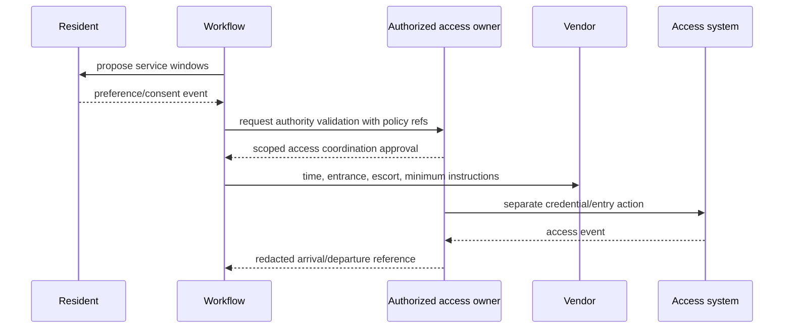

# Tenant Communications, Maintenance, Vendors, Inspections, and Access

## Operating rule

The workflow may coordinate property work, but qualified people and authoritative systems own safety, diagnosis, repair, inspection, entry, and completion. Emergency routing is deterministic and precedes any generative step.

## Resident communication contract

Each outbound message carries:

```yaml
communication_intent:
  intent_id: comm:case_72:ack:v3
  tenant_id: tnt_17
  case_id: case_72
  recipient_role_ref: role_resident_9
  purpose: transactional_work_order_acknowledgement
  channel: sms
  template_version: maint-ack/sms/14
  variable_sources:
    work_order_id: {source: cmms, version: etag:91}
    response_window: {source: policy, version: maint-sla/state_x/8}
  consent_or_basis_ref: pref_87
  language: en
  accessibility_mode: plain_text
  content_hash: sha256:bb18...
  approval_requirement: policy_preapproved
  expires_at: 2026-08-31T08:00:00Z
```

Distinguish:

- transactional/service communication from marketing;
- delivered, failed, bounced, opted out, and unknown from “sent”;
- contact preference from legally required or emergency communication rules;
- language preference from protected-class inference;
- delivery receipt from legal notice effectiveness;
- ordinary correspondence from restricted accommodation, VAWA, harassment, safety, or legal records.

Use channel-specific consent and opt-out registries, approved templates, quiet-hour rules, and accessible alternatives. Do not let a model decide whether a communication is legally sufficient.

## Safety gate

### Immediate routing

The first pass is a deterministic, multilingual, tested detector over the original input and structured signals.

| Trigger family | Immediate instruction source | Escalation | Model role |
|---|---|---|---|
| fire/smoke/explosion | approved emergency script; local emergency route | emergency services/operator | none before routing |
| gas/chemical odor | approved leave/avoid ignition script | emergency utility/services/operator | none before routing |
| sparking, shock, energized water | approved avoid-contact script | emergency services/qualified electrician | none before routing |
| major active water/flooding | approved safe shutoff guidance only if policy permits | emergency maintenance; emergency services when applicable | collect location after routing |
| structural collapse/signs | approved evacuate/avoid area script | emergency services/qualified inspector | none before routing |
| medical emergency/active violence | approved emergency script | emergency services/security under policy | none before routing |
| no heat/cooling/water or habitability concern | jurisdiction/property policy | urgent operator | summarize without legal conclusion |
| lead/asbestos/mold/pest concern | reviewed hazard-specific policy | qualified environmental/maintenance owner | record symptoms/evidence, no diagnosis |
| lockout | identity/access policy | authorized staff/locksmith | coordinate only |

Emergency scripts must be location-aware, approved by safety/legal operations, available without model/provider access, and tested for screen-reader and low-bandwidth use. Never delay “call emergency services/leave the area” while collecting a full form.

### Safety escalation event

```json
{
  "event_type": "safety.escalation_started",
  "case_id": "case_72",
  "trigger_rule": "gas_odor/v6",
  "original_message_ref": "msg_998",
  "script_version": "emergency-gas/state_x/9",
  "instruction_displayed_at": "2026-08-31T06:14:01Z",
  "human_alert_receipt": "pager_332",
  "ack_deadline_at": "2026-08-31T06:16:01Z",
  "property_emergency_location_ref": "emloc_3",
  "diagnosis": null
}
```

## Maintenance intake

For non-emergency cases, collect only operationally useful facts:

- authenticated reporter and contact route;
- property, building, unit/space, room/asset;
- observable symptom, onset, frequency, and current condition;
- photo/video/document references after malware/privacy checks;
- whether essential service is affected;
- people currently at risk without requesting unnecessary medical detail;
- resident's preferred windows and entry/notification constraints;
- pets or site conditions needed for safe coordination;
- duplicate/related request references.

The model produces a typed summary with citations to the original messages. It may propose a taxonomy category. Priority and SLA come from deterministic policy using verified inputs.

### Priority does not equal diagnosis

```yaml
triage:
  request_id: sr_204
  safety_gate: clear_non_emergency
  observations:
    symptom: "slow leak under kitchen sink"
    active: true
    electrical_proximity: false
    containment: "bucket"
  proposed_category:
    value: plumbing_leak
    model_confidence: 0.91
    evidence_refs: [msg_998#char=20-58]
  priority:
    value: urgent
    rule_version: maint-priority/22
    rule_inputs: [active_leak, occupied_unit]
  diagnosis: null
```

Low confidence, contradictory facts, repeated failures, suspected hidden hazards, or a resident challenge routes to a human without lowering priority.

## Work-order contract and lifecycle

A work-order preview includes:

- source case and service-request IDs;
- property/unit/asset references and versions;
- problem statement and evidence references;
- deterministic priority/SLA rule and clocks;
- required trade/skills and qualification profile;
- scope limits and “do not” instructions;
- resident communication/access-coordination reference;
- approval requirement and cost threshold policy reference;
- semantic operation ID and verification query;
- restricted-information redaction.

Do not include disability, VAWA, immigration, screening, or unrelated household details in a vendor work order. Translate a protected request into the minimum operational accommodation authorized by the trained owner.

## Vendor qualification and assignment

Maintain a separate, effective-dated qualification registry:

| Evidence | Example fields | Enforcement |
|---|---|---|
| identity/business | legal entity, vendor ID, tax/payment refs held elsewhere | must match contracting system |
| trade/license | jurisdiction, class, number ref, verification source, expiry | block out-of-scope/expired |
| insurance/bond | coverage type/amount ref, issuer, expiry | threshold by work/risk |
| safety/training | program/course/certification refs, expiry | required for hazard/equipment |
| background/site access | approved status ref, scope, expiry | access authority still separate |
| geographic/service scope | properties, hours, response class | deterministic filter |
| contract/rate | approved contract/catalog version | agent cannot negotiate |
| conflict/sanction checks | approved provider/result ref | restricted review |
| performance | verified SLA/quality outcomes | never use protected/proxy resident data |

The system first filters by hard requirements, then a deterministic scheduler/optimizer can consider availability, travel, capacity, approved cost catalog, continuity, and workload fairness. A model may summarize trade-offs among already qualified options. It cannot waive a hard qualification.

For work disturbing paint in covered pre-1978 housing or child-occupied facilities, route through the current EPA Renovation, Repair and Painting policy and certified-firm/renovator evidence where applicable. Hazardous-energy control and similar regulated safety procedures remain with qualified employers/workers; an agent never issues a lockout/tagout clearance.

## Access coordination is not physical access authority

The workflow can:

- identify authorized notice/consent requirements from reviewed policy;
- request and record a resident-selected window;
- ask the separate authorized owner to validate entry basis;
- pass a minimal “permission to enter”/escort requirement to a work order;
- notify parties with approved templates;
- record arrival/departure evidence from authorized systems;
- escalate no-access or suspected misuse.

It cannot:

- decide that lease, statute, emergency, or consent permits entry;
- generate, reveal, or transmit reusable lockbox codes or credentials;
- call an unlock endpoint;
- enroll a face/biometric or identity;
- change an access-control list;
- let a vendor self-attest authorization;
- convert “permission to enter” metadata into an unlock command.



The effect boundary deliberately prevents W→X.

## Inspections and completion

Inspections use a versioned standard/checklist appropriate to property and program. HUD NSPIRE standards apply to specified HUD-assisted and insured contexts, not every building. Other local code, contract, safety, insurer, and program standards require their own reviewed mappings.

Capture:

- inspector identity, qualification, organization, and authorization;
- property/unit/asset and inspection-standard versions;
- scheduled/performed timestamps and timezone;
- checklist observations, measurement units, evidence, and unavailable areas;
- deficiency classification made by qualified rules/person;
- correction clock and responsible owner;
- dispute/reinspection and supersession links.

The model may transcribe or summarize. It cannot invent a measurement, label a condition code-compliant, suppress a deficiency, or sign/certify an inspection.

“Work reported complete” enters `verification_pending`. Close only after the applicable evidence: resident confirmation, technician evidence, supervisor review, measurement, inspection, invoice match, or system read-back. Resident silence alone is not universal proof.

## SLA and portfolio operations

### Clock contract

```yaml
sla_clock:
  clock_id: sla_case_72_response
  case_id: case_72
  class: urgent_maintenance_response
  policy_version: maint-sla/state_x/property_103/v8
  started_at: 2026-08-31T06:14:00Z
  target_at: 2026-08-31T06:29:00Z
  timezone: America/New_York
  pauses: []
  current_state: running
  breach_owner: on_call_property_operator
  escalation_schedule: [5m_remaining, breached, 15m_breached]
```

Do not encode a universal response time. Resolve jurisdiction, housing program, lease, contract, property, hazard, time-of-day, and service-class rules. Model calls cannot pause clocks.

### Portfolio queues

Partition and monitor:

- safety escalations and acknowledgement age;
- expiring notices/obligations;
- untriaged requests;
- waiting-for-resident/vendor/operator cases;
- work orders by qualification/skill/geography;
- unknown effects and reconciliation debt;
- failed communications;
- inspections/corrections due;
- listing publication/takedown drift;
- restricted fair-housing, accommodation, VAWA, screening, and legal queues.

Use reserved capacity for safety and reconciliation. Apply per-tenant and per-property quotas, but never rate-limit an emergency response behind marketing or routine drafting. Do not expose restricted categories on general portfolio dashboards.

## Operational runbooks

### Gas, fire, electrical, or active threat

1. Display the approved immediate script and emergency route.
2. Record trigger/script/timestamps; do not diagnose.
3. Page the emergency owner with property emergency-location reference.
4. Start acknowledgement clock and secondary escalation.
5. Block normal vendor automation and model-led troubleshooting.
6. Preserve original input and delivery evidence under restricted access.
7. After qualified clearance, open linked remediation/incident workflows.

### Active water event

1. Check deterministic electrical/structural/person-risk triggers.
2. Give only approved safe actions; never direct an untrained person into hazard.
3. Page emergency maintenance and record receipt.
4. Create work order once through the effect gateway.
5. Reconcile dispatch, arrival, containment, affected units, and follow-on inspection.
6. Keep resident updates separate from certification of safety.

### Vendor no-show

1. Verify scheduled window and arrival source.
2. Notify resident with approved apology/status template.
3. Escalate to dispatcher; do not automatically disclose resident details to a new vendor.
4. Re-run hard qualification and capacity filter.
5. Obtain fresh access coordination if vendor/time materially changes.
6. Preserve SLA and vendor-performance events.

### Unknown work-order creation

1. Mark `creation_unknown` and suppress same-semantic retries.
2. Search by semantic operation ID, source case, unit, and time range.
3. If found, bind external ID and verify content.
4. If absence is proven under connector contract, reissue with the same semantic ID.
5. If still ambiguous, assign a human reconciliation task.

### Inspection failure

1. Preserve inspector/checklist/evidence and applicable standard version.
2. Start reviewed correction clock.
3. Route hazard/safety conditions immediately.
4. Create scoped remediation work, not a model-authored compliance conclusion.
5. Require reinspection or approved verification.
6. Record supersession without erasing the original finding.

## Decision gate

Before narrow execution:

- emergency routing works without a model and meets tested acknowledgement targets;
- priority/SLA comes from reviewed deterministic rules;
- work orders exclude unrelated sensitive data;
- vendor hard qualifications fail closed;
- access tools are absent from the agent credential;
- communication purpose, consent/basis, language, and delivery evidence are recorded;
- inspection/completion requires qualified evidence;
- unknown writes reconcile before retry;
- portfolio dashboards and queues preserve restricted-record isolation;
- on-call teams have rehearsed every runbook.
