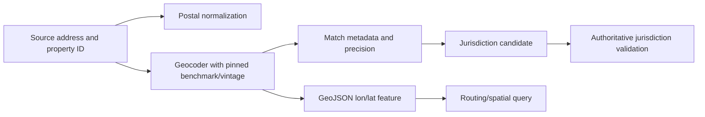

# Integrations, Connectors, Geospatial and Building Systems, and Tool Qualification

## Integration rule

An API surface is not an authority grant. Qualify each connector for one typed use, expose a narrower internal tool, pin versions and time semantics, and prove its retry and reconciliation behavior before it can make an effect.

## Capability matrix

The matrix is a discovery guide, not an endorsement. Exact availability, permissions, contracts, certification profiles, fields, and semantics must be verified in the target tenant and version.

| System/standard | Candidate use | Default access | Key qualification issue | Never infer |
|---|---|---|---|---|
| property-management platforms such as Entrata, AppFolio, Buildium, Yardi | properties, units, occupancies, leads, leases, work orders, vendors, status projections | scoped read; narrow approved write | commercial access, tenant-specific fields, rate/time/version behavior | broad API means broad agent authority |
| RESO Web API/Data Dictionary | listing exchange/mapping | read and publish through approved listing service | participant/MLS permission, certification profile versus ratified version | RESO supplies MLS data or rights |
| OSCRE Industry Data Model | mapping vocabulary for property/lease/space/facility data | design-time mapping | licensing and use-case-specific coverage | vocabulary is a system of record |
| CMMS/EAM such as Maximo | service requests, work orders, assets, inspections | scoped work-order projection/effect | product/version-specific APIs, actions, status model | “Admin API” is the work-order API |
| communication provider | transactional email/SMS/voice status | template-only write | consent, opt-out, throughput, delivery/webhook authenticity | accepted equals delivered/legal notice |
| e-sign/document provider | approved envelope creation/status | exact package write | signer authority, hashes, evidence, duplicate envelopes | e-sign alone proves enforceability |
| payment service provider | hosted payment intent/status/token reference | read/status; no card data | PCI scope, webhook and refund authority | tokenization eliminates all PCI scope |
| accounting/ledger | balance/charge status projection | read-only | field authority, cutoff, reversals, PII | agent can post/reconcile |
| USPS/address service | postal formatting/deliverability | read | unit/subpremise ambiguity | postal match proves property/occupancy |
| Census/geocoder | coordinates/jurisdiction candidate | read | benchmark/vintage, match type, precision | “current” is reproducible |
| OGC API Features/GeoJSON | parcels/assets/areas | read | CRS/axis order and feature authority | geometry proves legal boundary |
| Brick/Project Haystack | building/asset/telemetry semantics | read-only projection | ontology/version/tag mapping and units | semantic match authorizes control |
| BACnet/BAS | building telemetry | isolated read projection | OT safety, segmentation, protocol/security profile | interoperability makes control safe |
| access-control/OSDP-backed system | arrival/audit reference | redacted read; separate authority writes | physical-security owner, credential secrecy | a workflow may unlock |

### Current standard version cautions

- RESO had ratified Web API Core 2.1.0 while its public certification baseline remained Web API Core 2.0.0 and Data Dictionary 2.0 at the research date. Pin the implemented and certified profile; do not say merely “RESO compliant.”
- BACnet's published standard and a deployed controller's supported objects/security profile are different facts.
- Brick's stable ontology release should be pinned; nightly builds are not production contracts.
- Project Haystack 4 is current while version 5 work is evolving; pin the exact defs and transport behavior.
- A current Census geocoder benchmark/vintage moves. Store the chosen identifier and raw match metadata.

## Connector qualification packet

Complete one packet per `tenant × connector account × environment × operation`.

| Area | Required evidence |
|---|---|
| ownership | business owner, technical owner, security contact, vendor escalation |
| legal/commercial | permitted use, data rights, DPA, subprocessors, retention/deletion, incident notification, audit rights |
| identity | auth protocol, credential rotation, workload identity, MFA/admin controls |
| authorization | scopes, property/unit filters, role mapping, denied-scope tests |
| data contract | schema/version, optionality, enums, identifiers, provenance, deletes/tombstones |
| time | timezone, DST, effective/created/updated meaning, precision, ordering |
| reads | pagination, limits, filtering, consistency, ETag/version, deleted objects |
| changes | webhook/change feed, signature, replay window, duplicate/out-of-order behavior |
| writes | validation, concurrency precondition, idempotency, async job/receipt |
| ambiguity | timeout semantics, read-back/search key, vendor support procedure |
| limits | rate/burst/day quotas, concurrency, payload/attachment limits |
| resilience | retryable codes, Retry-After, maintenance, region, SLA, DR |
| security/privacy | encryption, logs, secrets, PII fields, residency, tenant separation |
| testing | sandbox fidelity, contract fixtures, fault injection, production canary |
| observability | correlation ID, operation ID, status endpoint, audit export |
| exit | export, credential revoke, webhook removal, deletion evidence |

Reject the connector for effects if outcome ambiguity cannot be reconciled.

## Narrow internal tool contracts

Do not expose vendor-native generic clients to the model. Wrap them:

```json
{
  "tool_name": "prepare_work_order_v2",
  "description": "Prepare an inert work-order intent from an existing maintenance case. Does not create, assign, dispatch, authorize entry, or send a message.",
  "input": {
    "case_id": "case_72",
    "case_version": 11,
    "problem_summary": "string",
    "evidence_refs": ["msg_998#char=20-58"]
  },
  "output": {
    "intent_id": "int_441",
    "validation": "valid|invalid|review_required",
    "missing_fields": [],
    "policy_refs": ["maint-priority/22"],
    "expires_at": "RFC3339"
  },
  "errors": ["STALE_CASE", "SAFETY_ESCALATION_ACTIVE", "TENANT_SCOPE_DENIED"]
}
```

The effect tool is not model-callable:

```yaml
effect_tool:
  name: create_approved_work_order_v1
  callers: [durable_workflow_effect_gateway]
  requires:
    - exact_intent_hash
    - unexpired_approval
    - current_source_versions
    - semantic_operation_id
  denies:
    - model_worker_identity
    - access_permission_changes
    - unqualified_vendor_assignment
  result_states: [verified, rejected, unknown]
```

Tool descriptions state return types, error behavior, side effects, freshness, and prohibitions. “Create work order” is insufficient.

## Error taxonomy

| Class | Example | Runtime behavior |
|---|---|---|
| validation | missing unit, invalid enum | do not retry; correct or human task |
| authorization | scope/role denied | do not retry; security evidence |
| concurrency | version/ETag mismatch | refresh, invalidate approval, re-prepare |
| rate limit | 429 plus retry time | bounded delayed retry before expiry |
| transient read | timeout before any write | bounded retry with jitter |
| write unknown | timeout after submission | reconcile before any retry |
| provider rejection | policy/business error | human owner; no model workaround |
| contract drift | unknown enum/schema/field | quarantine connector/version |
| webhook trust | signature/replay failure | reject and alert |
| cross-tenant | response object outside scope | quarantine, disable connector, incident |

Normalize vendor errors to RFC 9457-style problem details internally, but retain redacted original response and correlation ID.

## Property/listing mapping

RESO and OSCRE can reduce semantic ambiguity but do not replace local contracts:

1. map source ID to canonical ID without using an address as identity;
2. record source standard/profile/version per field;
3. preserve unknown and vendor extensions;
4. normalize units/enums/time zones with reversible mapping;
5. test round trips; never silently drop a legal/operational field;
6. store listing data rights and channel permission separately;
7. isolate commercial/licensed artifacts under their terms.

### Example mapping row

| Canonical field | Source field | Transform | Authority | Loss behavior |
|---|---|---|---|---|
| `unit.bedroom_count` | source-specific RESO/DD-aligned field | integer, no rounding | inventory source | conflict if multiple current values |
| `listing.asking_rent_ref` | PMS offer ID/amount | reference only; no model edit | pricing/offer system | block publication if missing/stale |
| `occupancy.status` | PMS occupancy resource | enum mapping v4 | occupancy system | preserve unknown enum and quarantine |
| `work_order.permission_to_enter_ref` | vendor-specific field | map to coordination record only | authorized access owner | never convert to unlock |

## Geospatial integration

### Safe pipeline



Controls:

- USPS formatting is for postal use; retain the source text and subpremise.
- Store provider, benchmark/vintage, match status, coordinate system, longitude/latitude order, precision, and retrieval time.
- Validate jurisdiction against an authoritative boundary/source before applying law or policy.
- Treat parcel geometry and legal boundary as jurisdiction-owned data.
- Round/generalize locations for analytics; never reveal occupied-unit or access coordinates without purpose.
- Re-geocode through a controlled migration, diffing property/unit assignments and policy impacts.

## Building-system integration

Building automation is operational technology. NIST identifies building automation systems among OT with safety, reliability, and availability constraints. Separate IT/model workloads from BAS networks through an approved gateway.

### Read-only semantic projection

```yaml
telemetry_observation:
  asset_id: asset_ahu_12
  semantic_model:
    scheme: brick
    version: 1.4.4
    class: Air_Handling_Unit
  source:
    protocol: bacnet
    object_ref: restricted
    gateway_id: basgw_4
  point:
    type: supply_air_temperature
    value: 17.2
    unit: Cel
  observed_at: 2026-08-31T06:20:00Z
  quality: good
  control_authority: none
```

The agent may correlate a resident report with recent telemetry and suggest a qualified review. It cannot command equipment, change setpoints/schedules, acknowledge life-safety alarms, clear interlocks, or declare conditions safe. Any future automation control belongs to a separately engineered OT safety system, not this agent.

Project Haystack read/history/watch operations can support telemetry projections; write operations must remain absent. Brick/Haystack mappings need unit, point-quality, equipment-topology, and version tests.

## Access-system integration

OSDP can improve reader/controller interoperability and secure-channel capability; it does not authorize an application to grant access. The property agent receives only purpose-limited references such as “authorized arrival recorded” when necessary. Access credentials, door commands, biometric templates, lockbox codes, and controller topology never enter model context, general logs, or the property-operations connector account.

Use:

- separate security owner and account;
- explicit physical-access policy engine;
- credential vault/HSM controls;
- time/property/door/person scopes;
- anti-passback and emergency policies owned by the access system;
- immutable access audit and emergency revocation;
- no generic webhook payload to the model.

## Third-party acceptance scorecard

Score each 0–2; all hard gates must pass.

| Category | 0 | 1 | 2 | Hard gate? |
|---|---|---|---|---|
| tenant/property authorization | absent | coarse | enforced and tested | yes |
| idempotency/reconciliation | neither | one | both | yes for writes |
| schema/version notice | opaque | documented | pinned plus change process | yes |
| audit/correlation | absent | partial | end-to-end | yes for effects |
| security/privacy | material gap | mitigated | contractually/technically verified | yes |
| sandbox/contract testing | none | limited | representative | no |
| data export/deletion | absent | manual | tested | yes for sensitive data |
| outage/DR/support | unknown | informal | contracted/tested | no |
| rate/backpressure controls | unknown | documented | measured and enforced | no |
| scope minimization | broad only | partial | operation-specific | yes |

Do not average away a hard-gate zero.

## Contract-test suite

Before production:

- authenticate with allowed and forbidden properties;
- force page boundaries, deleted objects, and unknown enum values;
- send duplicated and out-of-order webhooks;
- rotate credentials and webhook secrets;
- test DST/timezone and precision;
- cause 429, 5xx, timeout-before-write, timeout-after-write, and delayed response;
- reuse and mutate idempotency keys;
- change an object between prepare and commit;
- lose response and reconcile by semantic operation ID;
- return an object from another tenant;
- exceed attachment limits and scan malicious files;
- disable model provider while clocks and deterministic intake continue;
- revoke connector and prove queued effects cannot execute.

## Decision gate

No connector receives write authority until:

- business, security, privacy, and technical owners sign the qualification packet;
- credentials are least-privilege and tenant/property scoped;
- schema, profile, timezone, limits, and deletion behavior are pinned;
- the internal tool is narrower than the vendor API;
- timeout ambiguity has a proved reconciliation path;
- conformance/standard claims are exact;
- building and access control writes are absent;
- contract and failure-injection tests pass;
- kill switch and credential revocation are rehearsed.
