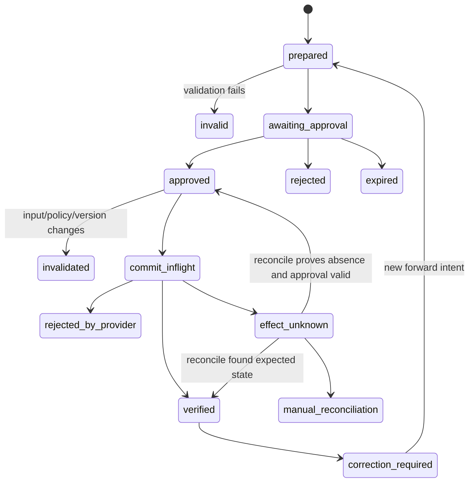

# State, Events, Effects, Approvals, Reconciliation, and Recovery

## Reliability rule

Exactly-once business effects are not a transport guarantee. Make intent identity stable, bind approval to the exact current intent, record an outbox before submission, treat ambiguous outcomes as unknown, reconcile against the destination, and retry only when absence is proved.

## State versus events

- **Domain sources** own property, lease, occupancy, listing, work-order, vendor, and ledger state.
- **Workflow state** owns the case's progress, clocks, approvals, and effect status.
- **Events** are immutable observations that something was reported or recorded.
- **Commands/intents** request a transition.
- **Effects** are externally observable changes.
- **Receipts** are provider acknowledgements.
- **Verification** proves the destination reached the expected state.

A receipt may not prove verification; an event may arrive late; a workflow snapshot can be rebuilt from history but remains a projection.

## Event contract

Use a CloudEvents-like envelope with domain semantics:

```json
{
  "specversion": "1.0",
  "id": "evt_01951f",
  "source": "urn:pms:tnt_17:property_103",
  "type": "property.work_order.status_observed.v2",
  "subject": "work-order/wo_880",
  "time": "2026-08-31T06:40:12.431Z",
  "datacontenttype": "application/json",
  "tenantid": "tnt_17",
  "portfolioid": "pf_4",
  "correlationid": "case_72",
  "causationid": "eff_302",
  "aggregateversion": 7,
  "sourceeventid": "vendor_evt_991",
  "ingestedat": "2026-08-31T06:40:13.101Z",
  "data": {
    "status": "created",
    "observed_source_version": "etag:91",
    "semantic_operation_id": "wo:case_72:create:v1"
  }
}
```

Deduplicate on source/event identity with a payload hash. A reused ID with a different payload is a contract incident, not a normal duplicate.

## Effect contract

```yaml
effect_intent:
  intent_id: int_441
  intent_version: 3
  effect_type: cmms.work_order.create
  semantic_operation_id: wo:case_72:create:v1
  tenant_id: tnt_17
  target:
    connector_id: cmms_4
    property_id: prop_103
  preconditions:
    case_version: 11
    unit_version: etag:a19
    authority_grant: auth-2026-08-31.3
    policy_version: maint-priority/22
    no_active_safety_escalation: true
  payload:
    problem: "Active slow leak under kitchen sink"
    priority: urgent
    access_coordination_ref: ac_39
  payload_sha256: 3c...1a
  reversibility: corrective_follow_up_only
  approval:
    required_role: property_operator
    expires_in_seconds: 900
  verification:
    lookup_keys: [semantic_operation_id, case_id]
    expected_fields:
      property_id: prop_103
      priority: urgent
```

The semantic operation ID describes the business effect. It remains stable across transport attempts. A new materially different business intent gets a new semantic ID and approval.

## Prepare–authorize–commit–verify



### Prepare

1. Read fresh projections.
2. Resolve deterministic policy.
3. Construct typed payload and semantic operation ID.
4. Validate scope, required fields, prohibitions, and connector capability.
5. Compute human-readable preview and canonical intent hash.
6. Record an inert intent with expiry.

### Authorize

Approval binds:

- approver identity, role, tenant/property scope, and authentication strength;
- exact canonical intent hash and preview hash;
- source object versions;
- behavior, policy, template, and connector versions;
- cost/risk threshold and reason;
- time, expiry, and separation-of-duty requirements.

Change to recipient, property/unit, priority, vendor, access window, amount/term, message content, attachment, source version, policy, or connector invalidates approval. Whitespace-only normalization may be exempt only by a documented canonicalization rule.

### Commit

Within one local transaction:

1. verify grant, approval, expiry, versions, quotas, and kill switch;
2. insert effect-outbox row keyed by semantic operation ID;
3. transition workflow to `commit_inflight`.

An effect worker sends through the adapter using the provider idempotency key when supported. Do not hold the local transaction open across the network.

### Verify

Verification is operation-specific:

- create: read back by provider ID and semantic/correlation key;
- update: compare target version/fingerprint;
- message: accepted receipt plus delivery/failure webhook as appropriate;
- listing: public/channel read-back;
- e-sign: envelope/document hashes and status;
- cancellation/takedown: absence or terminal status under the connector contract.

If read-back disagrees, open a correction incident; do not overwrite evidence.

## Approval schema

```json
{
  "approval_id": "apr_904",
  "decision": "approved",
  "approver": {
    "principal_id": "usr_19",
    "role": "property_operator",
    "tenant_id": "tnt_17",
    "property_scope": ["prop_103"],
    "authentication_context": "phishing-resistant-mfa"
  },
  "intent_id": "int_441",
  "intent_version": 3,
  "intent_sha256": "3c...1a",
  "source_versions": {
    "case": "11",
    "unit": "etag:a19"
  },
  "policy_versions": ["maint-priority/22", "authority/auth-2026-08-31.3"],
  "reason_code": "verified_non_emergency_maintenance",
  "approved_at": "2026-08-31T06:30:00Z",
  "expires_at": "2026-08-31T06:45:00Z"
}
```

Never use “approve the agent's plan” as the approval object.

## Unknown outcome algorithm

After any timeout, connection reset, crash, malformed response, or uncertain async status following submission:

1. atomically record `effect_unknown` with attempt and correlation data;
2. suppress the same semantic operation from all workers;
3. query provider receipt/status endpoint by idempotency key if available;
4. search the target by semantic ID, correlation ID, source case, natural keys, and bounded time;
5. compare found object with expected fingerprint;
6. if exact, bind external ID and mark verified;
7. if conflicting/duplicate, quarantine and open incident;
8. if the provider contract proves absence, and approval/preconditions are still valid, retry with the same semantic ID;
9. otherwise require manual reconciliation.

“Not found” from an eventually consistent endpoint is not always proof of absence. Connector qualification must establish the consistency and search window.

## Idempotency layers

| Layer | Key | Purpose |
|---|---|---|
| inbound event | source event ID + payload hash | suppress duplicate webhooks/messages |
| case command | command ID + expected case version | suppress repeated user/UI actions |
| business effect | semantic operation ID | one intended external change |
| provider request | adapter idempotency key | deduplicate transport retries |
| outbox | tenant + semantic operation ID unique constraint | one active dispatch record |
| communication | recipient + purpose + case milestone + content hash | prevent repeated notice/ack |
| approval | intent ID/version/hash | prevent approval reuse |

Do not derive keys from timestamps or randomize on retry.

## Reconciliation

Run three forms:

1. **inline:** after each consequential effect;
2. **scheduled:** compare open/recent effects and source projections;
3. **portfolio:** periodic control totals and exception queues.

```yaml
reconciliation_result:
  run_id: recon_20260831_06
  connector_id: cmms_4
  scope: {tenant_id: tnt_17, property_id: prop_103}
  watermark: 2026-08-31T06:00:00Z
  compared: 184
  matched: 179
  missing_remote: 1
  missing_local: 2
  fingerprint_mismatch: 1
  duplicate_semantic_id: 1
  unknown_effects_aged_over_slo: 0
  exception_refs: [rx_1, rx_2, rx_3, rx_4, rx_5]
```

Control totals help discover omissions but do not replace object-level comparison.

## Compensation and correction

Many property effects are not truly reversible:

| Effect | “Undo” risk | Recovery |
|---|---|---|
| sent resident message | recipient already saw it | corrective follow-up with approval |
| published listing | cached/syndicated copies | takedown plus channel reconciliation |
| work order created | vendor may act | cancel if permitted, confirm, notify |
| vendor assignment | travel/work may have begun | dispatcher-managed reassignment |
| e-sign envelope | links/notifications exist | void under approved process; new package |
| access coordination notice | expectations created | corrected notice; access owner updates separately |
| lease/legal notice | legal effect may exist | counsel-led correction; no automated undo |
| payment/accounting | excluded | finance-controlled reversal/correction |

Record compensation as a new authorized intent linked to the original. Never erase or mutate the evidence to pretend the first effect did not happen.

## Concurrency

- Serialize by the smallest risk-relevant resource: case, listing-channel, lease package, unit transition, or work order.
- Use expected aggregate/source versions.
- Let unrelated units proceed concurrently.
- Prevent two active semantic intents for the same milestone.
- Re-evaluate approval after lock acquisition.
- Detect races between application/lease/availability, listing/takedown, vendor/qualification expiry, and resident access-window changes.

### Race example

Operator approves a vendor at 06:30. Qualification expires at 06:35. Worker obtains the lock at 06:36. The precondition fails, approval invalidates, and the system returns to preparation. “Approved earlier” is not authority to dispatch now.

## Inbox, outbox, and quarantine

- Inbox stores authenticated event envelope, signature result, dedupe key, and processing state.
- Outbox stores exact effect payload hash, attempt state, provider correlation, and next reconciliation.
- Dead-letter is not a disposal bin. Classify as contract drift, poison input, permanent business failure, exhausted transient failure, or security incident.
- Restricted records use separate queues and roles.
- A replay command specifies source range, behavior bundle, side-effect mode, and dedupe policy. Default replay is effect-suppressed.

## Recovery exercises

Inject:

- crash after remote success and before local receipt;
- duplicate webhook with same and different payload;
- provider accepts idempotency key but returns 500;
- read-back lags for ten minutes;
- approval expires during rate-limit delay;
- source version changes after approval;
- two operators approve conflicting intents;
- listing takedown succeeds on one channel and is unknown on another;
- e-sign envelope exists with different hash;
- cross-tenant object returned by vendor.

Pass only if no blind duplicate effect occurs, ambiguity remains visible, the correct owner is paged, and evidence reconstructs every transition.

## Decision gate

Consequential effects remain disabled until:

- semantic IDs and canonical hashes are stable;
- approvals bind exact current intent and cannot be reused;
- write paths use a durable outbox;
- every connector has a proved ambiguity algorithm;
- `unknown` is a terminally visible workflow state, not an exception log;
- reconciliation has an SLO and staffed queue;
- compensations are forward actions with authority;
- concurrency and replay tests pass;
- audit evidence links intent, approval, attempts, receipt, read-back, and final state.
