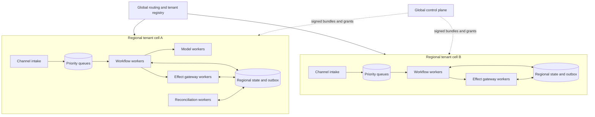
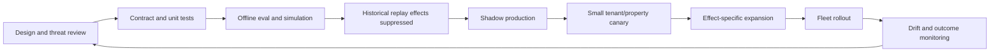

# Deployment, Scale, Cost, Disaster Recovery, Release, and Governed Evolution

## Operating rule

Scale independent stateless workers around a durable workflow and isolated effect gateway. Preserve safety and reconciliation capacity under overload, keep deterministic/manual operation during model outage, and deploy only immutable behavior bundles that can be shadowed, canaried, stopped, and rolled back.

## Deployment topology



Cell boundaries limit blast radius, data residency, connector credentials, and noisy neighbors. Do not split a single workflow's authority across regions simultaneously without a tested ownership/lease/fencing mechanism.

Kubernetes or another orchestrator can replace failed compute, but pods/containers are ephemeral. Durable case history, outbox, approvals, semantic IDs, and reconciliation state live outside worker memory. Readiness stops new work during drain; workers checkpoint/return leased tasks before termination.

## Queue design and backpressure

### Queue classes

| Class | Examples | Capacity policy |
|---|---|---|
| P0 safety | emergency alerts, missed acknowledgement | reserved workers; never mixed with drafting |
| P1 integrity | unknown effects, cross-tenant/security, expired critical clocks | reserved reconciliation/on-call |
| P2 obligations | time-bound notices, access/inspection windows, listing takedown | deadline-aware |
| P3 operations | maintenance, applications, showings, vendor coordination | weighted fair queues |
| P4 enrichment | summaries, analytics, batch refresh | shed/defer first |

Partition by tenant/portfolio and serialize only the relevant resource key. Enforce per-tenant concurrency and spend quotas without starving small tenants. Track oldest age, time-to-deadline, inflight leases, retry age, DLQ/quarantine, and provider-specific backlog.

### Backpressure sequence

1. reject or defer optional enrichment;
2. reduce retrieval and model concurrency while preserving deterministic intake;
3. coalesce safe duplicate reads/notifications;
4. route predictable tasks to templates/rules;
5. pause new low-risk autonomous effects;
6. put operator console into manual/degraded mode;
7. preserve P0/P1 and clock service capacity;
8. communicate truthful delays.

Never solve overload with unbounded retries, larger prompts, skipped verification, weakened tenant checks, or lowered safety priority.

## Autoscaling signals

Scale workers on:

- queue age relative to deadlines, not just depth;
- arrival rate and service time by workflow/model/connector;
- provider rate-limit headroom;
- number and age of unknown effects;
- CPU/memory plus actual concurrency saturation;
- safety/reconciliation reserved-capacity utilization.

Apply maximum concurrency and rate controls downstream. Adding workers against a capped vendor API increases failure, cost, and ambiguity.

## Cost engineering

Model total cost per verified outcome:

```text
cost =
  model_input_tokens × input_rate
  + model_output_tokens × output_rate
  + retrieval_and_storage
  + connector_and_channel_fees
  + workflow_and_observability
  + human_review_minutes × loaded_rate
  + expected_incident_and_reconciliation_cost

cost_per_verified_outcome =
  total_cost / count(verified_correct_outcomes)
```

Measure by workflow, tenant/property, behavior bundle, model route, and outcome. A cheap incorrect or unreconciled effect is not a success.

Optimization order:

1. remove calls that a rule/query/template can replace;
2. reduce context to purpose-limited fields;
3. cache non-sensitive immutable knowledge by version;
4. batch safe reads, not consequential writes;
5. use a smaller/faster model only after slice and trajectory evals;
6. require high-capability route for ambiguous/high-risk proposals;
7. improve tool descriptions/schema so calls succeed once;
8. shorten operator work with evidence-rich previews;
9. cap loops and stop on no progress.

Do not route model quality by rent, neighborhood, language, or a proxy for protected/economic class.

## Provider outage modes

| Dependency | Safe degraded mode | Blocked |
|---|---|---|
| model provider | forms, emergency gate, rules, search, timers, templates, human queues | ambiguous extraction/drafting |
| retrieval/vector service | exact source links and manual search | uncited explanation |
| PMS/property API | labeled cached reads within freshness policy | availability/lease/occupancy-dependent effects |
| CMMS work-order API | intake, clocks, manual dispatcher export | automated creation/dispatch |
| communication API | alternate approved channel/manual call queue | assumption of delivery |
| e-sign | approved manual/paper contingency | duplicate envelope creation |
| identity provider | emergency public instructions; break-glass per policy | normal authenticated writes |
| control plane | pinned signed bundle within validity | new grants/releases/policies |
| audit evidence store | durable local encrypted outbox if tested | otherwise consequential effects fail closed |

Outage communications state what was accepted, what was not performed, and who owns the next action.

## Disaster recovery

Classify data and choose approved RPO/RTO. The sample is illustrative:

| Capability | Example RPO | Example RTO | Recovery invariant |
|---|---:|---:|---|
| safety intake/routing | near-zero | minutes | alternate deterministic channel works |
| workflow/outbox/approvals | ≤ 1 minute | ≤ 30 minutes | no duplicate effect after failover |
| policy/authority/control plane | last signed bundle | ≤ 30 minutes | no unsigned/stale grant expansion |
| audit evidence | near-zero for effects | ≤ 4 hours for query | evidence durable before commit |
| projections | source-rebuildable | ≤ 4 hours | freshness shown; writes blocked until reconciled |
| analytics/eval artifacts | ≤ 24 hours | days | no operational authority |

DR procedure:

1. fence the old effect gateway/region;
2. restore workflow, outbox, approvals, semantic IDs, and control-plane bundle;
3. reconcile all `commit_inflight` and `effect_unknown` records against destinations;
4. refresh source projections and invalidate stale approvals;
5. resume P0/P1 then deadline queues;
6. enable new effects in a small canary;
7. reconcile control totals and audit completeness.

Test backup confidentiality, tenant-specific restore, deletion propagation, corrupted history, lost encryption keys, vendor-region outage, and return to primary.

## Immutable behavior bundle

```yaml
behavior_bundle:
  bundle_id: reops/2026-08-31.2
  code_image_digest: sha256:...
  model_routes:
    maintenance_classifier:
      provider: provider_a
      model: pinned_model_id
      inference_profile: deterministic_profile_4
  prompts:
    maintenance_classifier: sha256:...
  schemas:
    triage: maintenance-triage/3
    continuity_receipt: continuity/1.3
  tools:
    catalog_version: reops-tools/12
    adapter_versions: {cmms_4: adapter/7}
  policies:
    authority: auth-policy/11
    fair_housing: fh-runtime/9
    safety: safety-gate/6
    redaction: pii-redaction/14
  templates: templates/2026-08-15
  knowledge_manifest: knowledge/reops/88
  eval_evidence_digest: sha256:...
  migrations: [workflow-history/reops-31]
  compatibility:
    previous: reops/2026-08-18.5
  approved_by: [system_owner, operations, housing_compliance, security_privacy, safety]
```

Sign and verify the bundle. Pin it per run; a long-running workflow adopts a new bundle only at an explicit compatible transition.

## Release pipeline



### Shadow

Run on production-like inputs with no external effect or resident-visible response. Compare against human outcomes, policy, fairness slices, latency, and cost. Shadow data use still requires purpose, access, retention, and tenant controls.

### Canary

Canary by tenant/property/workflow/effect and exclude cases the pilot has not validated. Maintain a control cohort where appropriate. Define:

- start/end and maximum volume;
- success and guardrail metrics;
- automatic abort thresholds;
- named incident owner;
- rollback and pending-case migration;
- user/operator communication.

Start with proposals, then reversible requests, then one low-blast-radius effect. Do not canary access, screening decisions, pricing, accounting, or legal enforcement.

## Kill switches and rollback

Independent switches:

- all model calls;
- one behavior bundle/model route;
- one workflow or tenant/property;
- external effects globally or by type/connector;
- communications by channel/template;
- listing publication;
- work-order dispatch;
- retrieval corpus/document;
- long-term memory/feedback ingestion.

Rollback must address:

- code/model/prompt/tool/policy/template/knowledge versions;
- workflow history compatibility;
- already prepared/approved intents;
- queued effects and approvals whose inputs changed;
- external effects already visible;
- caches and retrieval indexes.

Rollback code does not undo a sent message or published listing. Use forward correction and reconciliation.

## Drift monitoring

Monitor:

- input language/topic/attachment distribution;
- unknown enum/schema and connector-error changes;
- retrieval document age, coverage, and source conflicts;
- model output/schema/tool/abstention drift;
- safety and fairness slices;
- human override reason and time;
- effect error, unknown, duplicate, and reconciliation debt;
- queue age, latency, spend, provider throttling;
- realized resident/operational outcomes and complaints.

Do not automatically retrain or change prompts from live feedback. Feedback is evidence:

1. authenticate and classify source;
2. remove PII and detect abuse/poisoning;
3. link to bundle, trace, outcome, and policy;
4. human-triage into bug, policy gap, source-data issue, training/usability issue, or preference;
5. add a versioned eval case;
6. make a reviewed bundle change;
7. shadow/canary again.

Override rate can fall because operators disengage, not because quality improved. Pair it with outcome sampling and approval-time/usability studies.

## Change classes

| Change | Minimum gate |
|---|---|
| copy-only approved template | template tests, compliance owner, small canary |
| tool description/schema | contract, trajectory, injection, shadow |
| connector adapter/version | full contract/fault/reconciliation suite |
| model/provider/inference | complete model, trajectory, fairness, cost, shadow/canary |
| safety rule/script | safety owner, multilingual replay, live drill |
| housing/legal policy | effective-date/counsel/compliance review, regression and migration |
| knowledge corpus | provenance/poisoning/freshness review, retrieval eval |
| authority expansion/effect type | architecture/threat review and Stage 5 gate |

## Decision gate

Scale is blocked if:

- safety and reconciliation share exhaustible capacity with low-priority work;
- workers rely on local memory for durable state;
- autoscaling ignores downstream rate limits and deadlines;
- no-model mode loses emergency routing or clocks;
- DR can duplicate unknown effects;
- releases are mutable collections of “latest” assets;
- rollback ignores queued approvals/effects;
- feedback changes production behavior online;
- canaries lack automatic abort and an owner;
- cost reductions weaken tenant isolation, verification, fairness, or safety.
