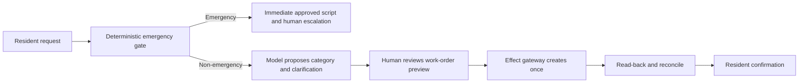

# Real-Estate and Property-Operations Agent Playbook

This playbook designs a **durable, bounded property-operations workflow with an AI worker inside it**. It does not design an autonomous landlord, property manager, lawyer, lender, appraiser, accountant, screening decision-maker, revenue manager, or physical-access controller.

The safe operating model is simple:

1. property, unit, occupancy, lease, vendor, and ledger systems remain authoritative;
2. deterministic rules own invariants, clocks, permissions, and emergency routing;
3. the model may classify, retrieve, draft, compare, and propose;
4. an approval and effect gateway controls consequential writes;
5. receipts, read-back, reconciliation, and audit evidence prove what happened;
6. a named human role owns every housing, safety, legal, screening, access, and money decision.

The examples are implementation blueprints, not legal advice. Housing, accessibility, landlord-tenant, licensing, notice, screening, privacy, consumer-reporting, safety, and records rules vary by jurisdiction, program, property, lease, and communication channel. Encode reviewed rules as dated, versioned policy data; never ask a model to reconstruct them from memory.

## Scope

The playbook covers:

- property, building, space, unit, occupancy, listing, showing, application, lease, and obligation truth;
- resident and prospect communications;
- maintenance intake, work orders, vendors, inspections, access coordination, safety escalation, and SLA control;
- portfolio queues, reconciliation, observability, incident response, deployment, recovery, and governed evolution;
- context, memory, planning, security, privacy, fair-housing controls, evaluation, and counterfactual testing.

It explicitly excludes autonomous:

- legal interpretation, lease approval, notice-of-default, eviction, or litigation activity;
- lending, appraisal, underwriting, or title conclusions;
- inference of protected characteristics or use of protected/proxy traits to rank people;
- final tenant-screening, accommodation, or adverse-action decisions;
- rent or fee pricing, competitor-data exchange, or discriminatory price/promotion targeting;
- accounting entries, refunds, disbursements, reconciliation sign-off, or custody of payment credentials;
- unlocking doors, issuing credentials, changing access permissions, or deciding who may enter.

The system may prepare an evidence packet for an authorized professional. It may never impersonate that professional's judgment.

## Learning path

Read in order when building a new system. Experienced teams can enter at the decision they own.

| Guide | Question it answers | Primary artifact |
|---|---|---|
| [01 — Mission, boundaries, authority, and stages](01-mission-boundaries-authority-and-stages.md) | Should an agent exist here, and what may it do? | authority matrix and stop rules |
| [02 — Reference architecture and runtime](02-reference-architecture-runtime-and-control-planes.md) | Where do deterministic, model, data, and effect controls live? | reference architecture |
| [03 — Domain contracts](03-property-unit-occupancy-listing-and-lease-contracts.md) | What is authoritative, and how is state represented? | entity and state contracts |
| [04 — Leasing operations](04-listings-showings-applications-screening-and-leases.md) | How are listings, showings, applications, screening handoffs, leases, and renewals governed? | bounded leasing workflow |
| [05 — Resident and property operations](05-tenant-communications-maintenance-vendors-inspections-and-access.md) | How are communications, maintenance, vendors, inspections, access, safety, and SLAs handled? | work-order operating model |
| [06 — Connectors and qualification](06-integrations-connectors-geospatial-building-systems-and-tool-qualification.md) | Which third parties are fit for which effect? | connector qualification matrix |
| [07 — Effects and recovery](07-state-events-effects-approvals-reconciliation-and-recovery.md) | How do writes survive retries, ambiguity, and partial failure? | prepare–authorize–commit–verify protocol |
| [08 — Context, memory, planning, and protection](08-context-memory-planning-security-privacy-and-fair-housing.md) | What may the model see, remember, and plan? | continuity receipt and memory policy |
| [09 — Evaluation and operations](09-evaluation-observability-slos-failure-injection-and-incidents.md) | How is quality, fairness, reliability, and incident readiness proved? | eval suite, SLOs, and runbooks |
| [10 — Deployment and governed evolution](10-deployment-scale-cost-dr-release-and-governed-evolution.md) | How does the service scale, degrade, recover, and change safely? | behavior bundle and release gates |
| [11 — Zero-to-production roadmap](11-zero-to-production-roadmap-exercises-and-gates.md) | What must be true at Stages 0–6 and at 100/100 readiness? | staged implementation plan |

The dated [research packet](../../research/packets/real-estate-property-operations-agent-blueprint.md) records the primary sources, conflicts, architecture decisions, and refresh triggers behind the design.

## Recommended first production slice

Start with **maintenance intake and human-approved work-order creation** for one portfolio and one property-management system:

This slice exercises domain truth, safety, tenant isolation, model usefulness, approval binding, idempotency, unknown effects, vendor integration, SLA clocks, communication, audit, and incident response without delegating a housing eligibility or physical-access decision.

Do not begin with application ranking, lease enforcement, rent recommendations, door control, or accounting. Those combine high consequence with weak reversibility.

## Production definition

The service is not production-ready because a demonstration completes. It is production-ready only when:

- source authority and freshness are explicit for every consequential field;
- deterministic/no-agent operation remains available during model or provider outage;
- every effect is typed, scoped, idempotent where possible, and followed by verification;
- ambiguous effects stop and reconcile before retry;
- approvals bind the exact intent, object versions, policy version, approver, and expiry;
- safety phrases bypass generative reasoning and reach a tested escalation path;
- protected traits and sensitive safety/accommodation records cannot enter ordinary ranking or retrieval paths;
- counterfactual, slice, trajectory, contract, recovery, and failure-injection evals meet release thresholds;
- queue age, safety latency, duplicate effects, unknown outcomes, cross-tenant access, reconciliation debt, and human overrides have SLOs;
- on-call staff can execute the incident runbooks without the model;
- the current behavior bundle can be shadowed, canaried, stopped, and rolled back;
- the applicable gate in [the Stage 0–6 roadmap](11-zero-to-production-roadmap-exercises-and-gates.md) is signed by operations, housing/compliance, security/privacy, safety, and the system owner.

## Design principles

1. **Workflow owns progress.** A durable state machine, not a chat transcript, owns deadlines and recovery.
2. **Sources own facts.** The model receives typed projections with provenance; it never becomes the property or lease database.
3. **Policy is data.** Jurisdiction, program, property, lease, channel, and effective dates resolve deterministic rules.
4. **Unknown is a real state.** Missing, stale, conflicting, not-applicable, and redacted values are not `false`.
5. **Proposals are not effects.** Drafting a message or work order cannot accidentally send or create it.
6. **Approval is exact.** Material changes invalidate approval.
7. **Safety outranks fluency.** Emergency instructions do not wait for an LLM.
8. **Fairness is designed and measured.** Prohibited attributes and proxies are blocked in runtime decisions; controlled evaluation checks outcome stability and slices.
9. **Access is coordination, not authority.** The workflow can request a window and record consent; a separate authorized system and person grant or execute entry.
10. **Audit is evidence, not verbose logs.** Preserve the minimum immutable record needed to reconstruct policy, facts, decision, approval, effect, and verification.

## How to use this playbook

- Replace illustrative thresholds with portfolio baselines and risk-approved targets.
- Treat JSON and YAML as semantic contracts; implement them in the repository's chosen schema language.
- Maintain one traceability row from policy obligation to rule, test, metric, runbook, owner, and evidence.
- Pin vendor/API versions and time semantics discovered during qualification.
- Re-run the research packet's freshness review before entering a new jurisdiction, housing program, connector, channel, building system, or high-risk workflow.

The safest mature system is not the one that performs the most tasks. It is the one whose authority, evidence, failure behavior, and human ownership remain clear under ambiguity and stress.
