# Reference Architecture, Sources, Tools, and Integrations

## Selected architecture

Use a **hybrid deterministic workflow with one bounded analyst model**. Source acquisition, authenticity, identifiers, temporal state, policy, professional decisions, and external commits are ordinary application responsibilities. The model proposes typed candidates between acquisition and review.

```mermaid
flowchart LR
    subgraph Acquire["Acquisition lane"]
        SC["Source catalog"] --> AD["Versioned adapter"]
        AD --> RAW["Raw immutable artifact"]
        RAW --> VR["Authenticity · rights · format validation"]
        VR --> DF["Deterministic metadata/text/structure diff"]
    end

    subgraph Analyze["Analysis lane"]
        DF --> Q["Priority + case admission"]
        Q --> C["Typed evidence/context packet"]
        C --> M["Bounded model"]
        M --> V["Schema · citation · temporal validators"]
    end

    subgraph Decide["Decision and effect lane"]
        V --> R["Professional review"]
        R --> D["Decision/obligation ledger"]
        D --> P["Policy + exact approval"]
        P --> O["Transactional outbox"]
        O --> X["GRC · ticket · notification adapter"]
        X --> E["Receipt + postcondition"]
        E --> D
    end
```



This is a pipeline with explicit feedback, not a free-roaming research agent. Replanning is allowed only inside the analysis lane and within admitted sources, facts, tools, and budgets.

## Architecture alternatives

| Path | Fit | Advantages | Failure/limit | Decision |
|---|---|---|---|---|
| Deterministic subscription + rule database | Stable sources, metadata, scopes, and human triage | Lowest cost, strongest auditability, no model ambiguity | Weak on heterogeneous prose and cross-reference synthesis | Mandatory Stage 0 and permanent fallback |
| Custom bounded loop in application service | One or a few advisory workflows | Small surface, precise policy/state integration, easy to test | Team owns loop, validation, and provider adapters | Recommended start |
| Agent SDK/framework | Existing supported SDK adds structured tool calls, budgets, tracing | Faster model integration | Framework session/memory can obscure authoritative state | Use as an implementation library, not the control plane |
| Durable workflow + bounded model activity | Long reviews, future-effective timers, outage waits, and handoff reconciliation | Durable timers/signals/retries and operational visibility | Replay/version complexity and operational burden | Add at Stage 3 when measured waits justify it |
| Multi-agent analyst/reviewer team | Independently evaluated specialties with separate owners | Potential parallel evidence review | More context duplication, inconsistent interpretations, authority confusion | Rejected by default; human review is the independent authority |

The [custom loop vs framework vs workflow engine](../../comparisons/custom-loop-vs-framework-vs-workflow-engine.md) guide owns the general comparison. Here, the bitemporal legal ledger and professional decision seam must remain application-owned regardless of runtime.

## Logical components

| Component | Owns | Must not own |
|---|---|---|
| Source catalog | Jurisdiction, publisher, channel, official-status policy, schedule, rights, owner, fallback | Legal interpretation |
| Connector scheduler | Cursors, overlap windows, rate budgets, full reconciliation | Treating empty results as no change |
| Acquisition validator | Bytes, headers, digest, signature, identifier, media type, malware/size checks | Authority conclusion from domain name alone |
| Document transformer | OCR/layout/structure candidates and pinpoint spans | Replacing raw rendition or hiding uncertainty |
| Instrument/provision ledger | Normalized identity, versions, relationships, bitemporal facts | Human decisions encoded as parser facts |
| Change detector | Metadata, byte, text, and structure differences | Semantic/legal impact conclusion |
| Case controller | State, budgets, policy, approval, deadlines, cancellation | Model transcript as state |
| Context compiler | Minimal typed evidence, temporal filters, trust/rights labels | Unrestricted corpus access |
| Analyst model | Candidate extraction, comparison, hypothesis, questions, summaries | Applicability, interpretation, policy, control, or attestation authority |
| Review service | Exact decision packet, role checks, expiry, signature/digest | Approver identity inferred from conversation |
| Effect gateway | Internal handoff commit, receipt, postcondition, reconciliation | External legal communication or control mutation |
| Evaluator/observer | Offline suites, online sampling, traces/metrics | Becoming the business ledger |

## Source and integration decisions

### Official gazettes and legislation portals

Prefer, in order, an official publisher's authenticated/bulk data, documented API, synchronization feed, or stable metadata page. Web automation is a last-mile adapter, not a source of authority.

Examples demonstrate variability, not a global hierarchy:

- EUR-Lex makes the electronic Official Journal legally authentic, while its consolidated texts are documentation without legal effect.
- U.S. FederalRegister.gov exposes convenient APIs but states that its web/XML rendition is not the official legal edition; official PDFs are available through GovInfo.
- Australia's Federal Register distinguishes authorized versions, compilations, replacements, and unincorporated commenced amendments.
- Canada's Justice Laws consolidations have official evidentiary status but publish a `current-to` boundary and note that original/amending instruments prevail on inconsistency.

Each adapter must encode the publisher's own status vocabulary and verification method. Never generalize one jurisdiction's semantics to another.

### Regulators and rulebooks

Monitor regulators separately from general legislation portals because rulebooks, guidance, FAQs, technical standards, notices, enforcement communications, and consultations can have different identifiers and legal status. Store the publisher's status marker and the internal normalized class; do not infer binding force from imperative wording.

An FCA rule, FCA guidance provision, FDA final guidance, FDA draft guidance, SEC staff statement, and EBA Q&A are different source classes. The source policy records what the publisher says about each class and who may interpret it.

### Standards and incorporated material

Store a bibliographic/rights record before acquiring content. Incorporated-by-reference material may have legal significance without being freely redistributable. The system records edition/date, publisher, incorporation citation, access method, permitted operations, and unavailable sections. It never invents text from a title or abstract.

Akoma Ntoso can preserve document structure; LegalRuleML can inform obligation and temporal vocabulary; ELI can inform identifiers and relationships. Use these as alignment aids, not as evidence that a source is official or a generated rule is legally correct.

### Licensed regulatory-intelligence feeds

A licensed provider may improve discovery, normalization, taxonomy, translations, or alert coverage. It is accepted only when the contract and technical evaluation establish:

- covered jurisdictions, publishers, document types, and explicit exclusions;
- update/correction/withdrawal semantics and measurable latency;
- stable item/version IDs, history export, and source links;
- allowed storage, model processing, embedding, quotation, export, retention, and deletion;
- tenant/subscriber entitlements and user/audit requirements;
- rate limits, outage notices, backfill, reconciliation, and termination export;
- whether any content is authoritative or only publisher analysis.

Commercial summaries remain derived evidence unless the responsible owner explicitly adopts them for a narrower internal purpose.

### General web and discovery search

Use the web to discover a possible change, related authority, consultation, or official destination. A discovered page must pass source-catalog admission before it can support an official-status or obligation record. Search snippets are never source text. Redirects, mirrors, archives, and cached pages retain their own provenance.

### Document processing

The document pipeline must support born-digital HTML/XML/PDF and scanned PDF without assuming equivalent fidelity:

1. malware, decompression, size, and media validation;
2. signature/authenticity verification where the publisher supplies it;
3. original byte preservation and content digest;
4. deterministic text/structure extraction;
5. OCR only when necessary, with page/image coordinates and engine release;
6. table, footnote, annex, heading, numbering, and cross-reference recovery;
7. source-to-extracted span alignment and confidence/quality flags;
8. human exception queue for unreadable or structurally ambiguous material.

Reuse the [document intelligence agent](../document-intelligence-agent/README.md) for detailed OCR/layout architecture. This blueprint owns legal-source identity, temporal relationships, status, and review—not generic OCR.

### Translation

Translation is a typed transformation:

```json
{
  "translation_id": "tr_01K...",
  "source_artifact_id": "art_eu_2026_138_en",
  "source_language": "en",
  "target_language": "de",
  "status": "machine_aid_not_authentic",
  "engine_release": "organization-approved-engine-7",
  "terminology_release": "eu-product-glossary-4",
  "generated_at": "2026-08-31T08:22:00Z",
  "reviewed_by": null,
  "rights_policy_id": "rights_eu_17",
  "warnings": ["not_for_legal_interpretation"]
}
```

Prefer an official authentic language rendition. Machine translation may support retrieval and triage, but candidate records cite the authentic source and label translated spans. Material divergence routes to a qualified linguist/legal reviewer. Translation caches inherit the source's tenant, rights, retention, and deletion policy.

### Organization policy and knowledge

Retrieve only approved, versioned policy fragments and owner metadata relevant to the accepted obligation. Internal policy is not evidence of legal meaning. The policy repository remains the source of policy truth; the agent stores a snapshot reference and proposes mappings.

### GRC, ticketing, and workflow systems

Expose narrow intent-level operations:

- `create_review_case(case_key, packet_digest, owner_role)`
- `submit_approved_obligation_handoff(operation_id, decision_id, payload_digest, destination)`
- `update_handoff_status(operation_id, expected_version, status)`
- `reconcile_handoff(operation_id)`

Do not expose generic `write_record`, arbitrary queries, dynamic object types, or model-selected destinations. A vendor adapter maps the neutral handoff schema to an approved object/version. An OSCAL Control Mapping export can be offered when the organization uses OSCAL, but it must remain a proposed mapping—not a component definition, system security plan, assessment result, or attestation created by the agent.

### Third-party commentary and knowledge bases

Commentary can identify cross-references, market practice, or interpretation questions. Record author/publisher, date, jurisdiction, rights, version, and conflicts. It cannot silently outrank an official source or a professional decision. Citation to commentary does not substitute for pinpoint citation to the underlying source.

## Tool contracts

| Tool class | Example intent | Write/effect | Required evidence and controls |
|---|---|---|---|
| Source catalog | `get_source_policy(source_id, as_of)` | Read | Catalog release, owner, status vocabulary, rights profile |
| Acquisition | `fetch_declared_version(source_id, version_ref)` | External read | Final URL, timestamp, headers, bytes digest, adapter release |
| Reconciliation | `list_source_changes(source_id, cursor, overlap)` | External read | Cursor in/out, page completeness, rate-limit state, warnings |
| Document | `extract_structure(artifact_id, parser_release)` | Derived artifact | Pinpoint map, quality report, parser/OCR release |
| Temporal | `get_instrument_timeline(instrument_id, legal_at, known_at)` | Read | Source-scoped facts and unresolved conflicts |
| Applicability facts | `get_fact_snapshot(entity_scope, as_of)` | Read | Fact owner, system, valid/recorded times, freshness |
| Policy | `get_policy_fragments(policy_ids, version)` | Read | Access decision and immutable snapshot refs |
| Review | `seal_decision(decision_draft, approver, digest)` | Durable decision | Role, exact packet, expiry, reason, signature evidence |
| Handoff | `submit_approved_handoff(operation_id, intent_hash)` | R3 internal effect | Current authorization, approval, target precondition, receipt |
| Reconcile | `reconcile_handoff(operation_id)` | Read/repair state | Destination lookup and postcondition |

Every result follows [tool contracts](../../tools/tool-contracts.md) and separates small model context from raw artifacts as described in [tool results, artifacts, and provenance](../../tools/tool-results-artifacts-and-provenance.md).

## Example source-tool result

```json
{
  "status": "ok",
  "tool_release": "eurlex-adapter-6",
  "source_policy_id": "eu-oj-2026-4",
  "source_item_id": "publisher-native-id",
  "artifact_id": "art_01K...",
  "official_status_assertion": {
    "value": "authenticated_official_publication",
    "asserted_by": "publisher_metadata_and_signature",
    "evidence_refs": ["ev_signature_44", "ev_portal_12"]
  },
  "content_digest": "sha256:...",
  "retrieved_at": "2026-08-31T07:59:00Z",
  "publisher_modified_at": "2026-08-30T21:00:00Z",
  "rights_policy_id": "rights_eu_17",
  "freshness": {"cursor": "cursor_991", "coverage_state": "complete_to_watermark"},
  "warnings": [],
  "data_ref": "object://tenant-cell/art_01K..."
}
```

The normalized `official_status_assertion` is an application claim backed by evidence, not proof created by the model.

## Planning and orchestration

The controller uses a fixed macro-plan:

```text
admit → acquire/verify → deterministic diff → extract candidates
→ join facts → build hypothesis → validate → professional review
→ create accepted obligation → approved handoff → reconcile
```

The model may choose bounded read steps inside `extract candidates` and `build hypothesis`: follow an admitted cross-reference, request a missing source rendition, compare two pinned provisions, or ask for a fact. It cannot add a source, alter precedence, expand scope, invoke a writer, choose an approver, or mark a decision complete.

Parallelize independent source acquisition or provision extraction only when tenant, rights, budget, and completion semantics are explicit. Merge by stable provision IDs and evidence refs, not by conversational consensus. No multi-agent delegation is recommended for v1.

## Integration qualification checklist

- [ ] Official/legal status and the machine-readable rendition's status are documented separately.
- [ ] Stable publisher/item/version IDs and a full-history or reconciliation path exist.
- [ ] Corrections, withdrawals, replacements, deletions, and future-effective changes are observable.
- [ ] Rate limits, pagination, cursor behavior, empty responses, retries, and backfill are tested.
- [ ] Raw bytes and metadata may be retained under an approved rights policy.
- [ ] Model processing, translation, embedding, export, quotation, and backup are separately permitted.
- [ ] Connector credentials are tenant/purpose scoped and brokered.
- [ ] Tool schemas prevent arbitrary URLs, queries, destinations, and object types.
- [ ] Timeouts distinguish definitive failure from unknown outcome.
- [ ] Adapter and destination versions/dossiers are in the behavior-bundle manifest.
- [ ] Contract termination/export and source outage runbooks exist.

Use the [adapter qualification and provider playbooks](11-adapter-qualification-and-provider-playbooks.md) for concrete official-gazette, regulator/docket, licensed-research, enterprise-knowledge, policy/GRC, issue/workflow, and notification dossiers and fault gates. This checklist alone is not production qualification.

## Rejected designs

- One RAG index containing official law, unofficial consolidations, guidance, commentary, internal policy, and counsel notes with no status lanes.
- A general web agent that treats the top result as authoritative.
- A model-generated “global obligation ontology” introduced before source-specific workflows are proven.
- Unbounded memory of legal questions, privileged text, or licensed content.
- Direct model credentials to GRC, email, policy, document, or regulator systems.
- A multi-agent debate whose majority vote becomes an interpretation.
- Hash-only authenticity: a digest proves bytes are stable after acquisition, not that the publisher or legal status is authentic.
- A framework transcript/checkpoint used as the decision or obligation ledger.

## Related guides

- [Source identity, provenance, and change monitoring](03-source-identity-provenance-and-change-monitoring.md)
- [Provision extraction, obligations, impact, and handoff](05-provision-obligation-impact-and-handoff.md)
- [Security, confidentiality, source rights, and tenancy](07-security-confidentiality-source-rights-and-tenancy.md)
- [Tool contracts](../../tools/tool-contracts.md)
- [Adapter qualification and provider playbooks](11-adapter-qualification-and-provider-playbooks.md)
