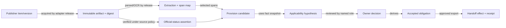

# Source Identity, Provenance, and Change Monitoring

## Production decision

Treat every acquired rendition as an immutable evidence object and every statement about its authority or currency as a versioned, source-scoped assertion. A URL is a locator, not an identity; a digest is integrity evidence, not official status; a consolidation is a derived publication whose legal effect depends on its publisher and jurisdiction.

## Keep source layers separate

| Layer | Example question | Stable identity | Mutability rule |
|---|---|---|---|
| Legal resource/instrument | What act, rule, notice, guidance, standard, or decision is this? | Publisher/jurisdiction identifier plus internal ID | Identity survives versions where publisher semantics allow |
| Version/expression | Which language, point-in-time, amended, corrected, draft, or final expression? | Publisher version ID or derived version ID | Append-only; link replacement/supersession |
| Rendition/manifestation | Which PDF, XML, HTML, JSON, EPUB, or scan? | Rendition ID + content digest | Immutable bytes |
| Acquisition | When and how did this system receive those bytes? | Acquisition ID | Append-only; repeated fetches remain evidence |
| Official-status assertion | What does the publisher/source policy say this rendition represents? | Assertion ID + policy release | Supersede, never overwrite |
| Extraction | What text/structure did a parser derive? | Extraction ID + artifact/parser releases | Rebuildable derived artifact |
| Provision candidate | Which span may express a rule or obligation? | Candidate ID + extraction/span | Reviewable derived claim |

ELI's resource/expression/format distinctions and Akoma Ntoso's legal-document structure are useful alignments. Do not force a publisher into these models when its identifiers or status semantics differ.

## Source catalog contract

The source catalog is approved configuration, not model memory.

```yaml
source_id: eu_official_journal_l
catalog_release: eu-sources-17
jurisdiction: EU
publisher: Publications Office of the European Union
source_classes: [official_journal, legislation]
channels:
  - kind: official_sync_or_feed
    endpoint_ref: secret-free-config-reference
    adapter_release: eurlex-adapter-6
  - kind: official_portal
    endpoint_ref: portal-reference
    purpose: reconciliation
official_status_policy:
  classifier_release: eu-oj-status-4
  authenticated_rendition_rule: publisher-signature-and-oj-identity
  consolidation_rule: documentary_only
identifiers:
  publisher_schemes: [ELI, CELEX]
schedule:
  incremental_interval: PT30M
  overlap_window: P2D
  full_reconciliation_interval: P7D
owners:
  regulatory: team_eu_regulatory
  technical: team_regintel_platform
  rights: team_content_rights
rights_policy_id: rights_eu_17
fallbacks: [eu_oj_official_portal_manual]
coverage_claim:
  included: [declared_L_series_documents]
  excluded: [national_transposition_sources, paywalled_standards]
```

Schedules above are illustrative configuration, not universal recommendations. Each source needs measured publication cadence, delay tolerance, quotas, and reconciliation cost.

## Official-status model

Do not create one `is_official` Boolean. At minimum record these independent fields:

| Field | Example values | Why separate |
|---|---|---|
| Publisher relationship | issuing_authority, official_publisher, regulator, licensed_republisher, commentary | A regulator page and a commercial mirror differ even if text matches |
| Publication status | prepublication, consultation, proposed, adopted, final, corrected, withdrawn | A final document may not yet be effective |
| Legal-form class | legislation, regulation, rule, decision, guidance, FAQ, code, standard, notice | Imperative language does not establish binding effect |
| Rendition authenticity | signed_official, authorized_copy, official_web, unofficial_machine_rendition, unknown | The machine-readable API may be less authoritative than a linked PDF |
| Consolidation status | as_made, official_consolidation, editorial_consolidation, documentary_only, unincorporated_changes | Consolidation semantics vary by publisher |
| Temporal status | future, in_force, partially_in_force, repealed, expired, unknown | Status can vary by provision, purpose, place, or entity |
| Language status | authentic, official_translation, certified_translation, human_aid, machine_aid, unknown | Translation quality and legal authenticity are different |
| Internal verification | verified, warning, quarantined, unresolved | An application assessment, not a legal conclusion |

The jurisdiction's responsible owner approves mappings from publisher metadata to internal values. Model output may suggest an unmapped class but cannot change the mapping.

## Source artifact schema

```json
{
  "artifact_id": "art_01K...",
  "tenant_cell": "tenant_acme:eu",
  "instrument_id": "inst_internal_882",
  "publisher_item_id": "publisher-native-id",
  "publisher_version_id": "publisher-version-id",
  "language": "en",
  "language_status": "authentic",
  "rendition": {
    "media_type": "application/pdf",
    "locator": "official-locator-record",
    "content_digest": "sha256:...",
    "byte_length": 483901,
    "signature": {
      "expected": true,
      "validation_state": "valid_at_acquisition",
      "validator_release": "signature-validator-4",
      "evidence_ref": "ev_sig_44"
    }
  },
  "publisher_metadata": {
    "published_at": "2026-08-30T00:00:00Z",
    "modified_at": null,
    "raw_metadata_ref": "obj://.../metadata"
  },
  "acquisition": {
    "acquisition_id": "acq_01K...",
    "retrieved_at": "2026-08-31T07:59:00Z",
    "channel": "official_sync_or_feed",
    "adapter_release": "eurlex-adapter-6",
    "http_evidence_ref": "ev_http_18"
  },
  "status_assertion_id": "status_220",
  "rights_policy_id": "rights_eu_17",
  "malware_scan_release": "scanner-12",
  "storage_ref": "obj://tenant-cell/art_01K.../original",
  "recorded_at": "2026-08-31T07:59:05Z"
}
```

Do not place confidential URLs, access tokens, or signed-link query parameters in the model context or permanent logs.

## Provenance chain



This follows W3C PROV's entity/activity/agent pattern without requiring RDF as the operational store. The ledger must answer which entities, transformations, software releases, and people produced each record.

## Acquisition and change-detection loop

### Incremental path

1. Read the source cursor and last complete watermark.
2. Query with an overlap window large enough for measured late updates and reordered results.
3. Normalize publisher IDs but retain raw metadata.
4. Deduplicate exact acquisitions; fetch unseen versions/renditions.
5. Validate allowed redirect/domain, size, media, malware, signature when expected, rights, and tenant.
6. Commit artifact plus acquisition evidence before analysis.
7. Compare metadata, digest, structure, and text against the correct prior version.
8. Create change candidates and publish the new cursor through the same transaction/outbox boundary.
9. Mark the watermark complete only after every page/item is accounted for.

### Full reconciliation path

Incremental feeds can miss deletes, replacements, late corrections, backfills, and cursor defects. A scheduled full or partitioned reconciliation compares the catalog's expected identifier/version set with the local ledger. Reconciliation never deletes local history; it records missing-at-source, replaced, withdrawn, or access-denied observations for review.

### Discovery and confirmation

An email alert, commercial feed, search result, social post, or regulator news page may create a `discovery_candidate`. It becomes a source change only after the configured authoritative or accepted source channel confirms identity and content. If official confirmation is unavailable, label the case `unconfirmed` and route it according to risk; do not manufacture official status.

## Change classes

| Change | Detection | Required state/effect |
|---|---|---|
| New instrument/version | New publisher identity/version | Create artifact and initial case if in subscription scope |
| Metadata-only update | Same bytes, changed publisher metadata | Preserve new acquisition; assess material fields/status |
| Text amendment | New affecting act/version or structured/text diff | Link affected provisions; open impact traversal |
| Correction/corrigendum | Publisher correction class or changed official rendition | Append corrected artifact; supersede status; reopen dependants |
| Replacement/rectification | Publisher replacement history | Preserve original and replacement; verify legal/status effect |
| Consolidation update | New point-in-time compilation | Link included affecting acts; never treat as sole authority unless source policy allows |
| Unincorporated amendment | Publisher warning or affecting act not in compilation | Mark consolidation incomplete; include affecting source in context |
| Delay/withdrawal of future effect | New document or amended temporal metadata | Recompute candidate timeline; invalidate decisions/approvals as configured |
| Guidance/FAQ revision | Page/version change, publisher update history | Preserve old page; reassess linked interpretations |
| Source removal/access loss | Reconciliation mismatch or authorization failure | Keep local evidence under rights policy; mark coverage degraded |
| Formatting/parser-only change | Different bytes/structure but equivalent canonical text | Store new rendition; avoid false legal-change alert after deterministic checks |

## Structural diff policy

Compare in this order:

1. publisher identifiers and declared relationships;
2. status and temporal metadata;
3. normalized document tree and stable provision labels;
4. exact text spans, tables, footnotes, annexes, formulas, and definitions;
5. cross-reference graph;
6. model-assisted semantic explanation of the deterministic delta.

The model must not generate the canonical diff from two truncated summaries. A semantic `no_material_change` candidate still requires deterministic evidence and review policy.

## Correction and consolidation protocol

When a correction or later consolidation appears:

```text
store new artifact
→ classify relationship using source evidence
→ preserve prior artifact and status
→ rebuild affected extraction with new parser identity
→ traverse provision → hypothesis → decision → obligation → handoff edges
→ invalidate stale approvals
→ reopen material cases
→ notify owners with before/after evidence
→ reconcile any already-created work items
```

Never edit the prior source text in place. A case owner may decide that the correction is immaterial, but that decision is itself versioned and reviewable.

## Source-specific lessons

| Official source example | Verified publisher behavior | Architecture consequence |
|---|---|---|
| EUR-Lex | Electronic OJ is authentic; consolidated texts are documentation without legal effect; ELI supports identifiers/metadata and synchronization | Verify the OJ rendition; store consolidations as derived aids; follow affecting acts |
| U.S. Federal Register/GovInfo/eCFR | Federal Register is the official journal; FederalRegister.gov API/web says it is unofficial; eCFR warns future-effective amendments may be delayed/withdrawn; GovInfo signs many official PDFs | Separate discovery API from official rendition; monitor future-effect changes; verify signatures where supplied |
| UK legislation.gov.uk | Revised timelines can be prospective, partial, or have outstanding effects; non-textual modifications may not create a new timeline date | Preserve effect records beyond text versions; route qualified/conditional commencement |
| Australian Federal Register | Authorized versions and point-in-time compilations exist; in-force listings can include not-yet-commenced legislation; unincorporated commenced amendments are flagged | Do not equate in-force listing, commencement, and current compiled text |
| Canada Justice Laws/Canada Gazette | Consolidations have official evidentiary status and a current-to boundary; original/amending instruments prevail on inconsistency | Store current-to time and originals; never hide consolidation lag |
| Regulator guidance/Q&A | Publishers such as FDA, SEC, FCA, and EBA distinguish binding rules, nonbinding guidance/statements, provision statuses, and time-bounded Q&As | Source-class mapping is regulator-specific and versioned |

These are examples of publisher mechanics, not advice about any organization's obligations.

## Idempotency and concurrency

| Boundary | Semantic key | Conflict rule |
|---|---|---|
| Source observation | source + publisher item/version + rendition + observed metadata digest | Repeated observation appends only if evidence differs materially |
| Artifact acquisition | tenant cell + canonical locator/version + content digest | Same bytes reuse artifact; different bytes create a new rendition/version candidate |
| Change case | subscription + new artifact + prior comparison base + detector release | One open case; superseding detector run attaches evidence |
| Extraction | artifact digest + parser/OCR release + extraction profile | Immutable output |
| Correction propagation | correcting artifact + affected record + propagation release | Compare-and-swap affected state version |

Connector workers use leases and fencing tokens. A recovered stale worker cannot advance a cursor or mark coverage complete after a newer attempt owns the partition.

## Source outage and backlog behavior

| Condition | Safe degradation |
|---|---|
| Incremental API/feed unavailable | Back off with jitter; use approved alternate channel; retain watermark; schedule reconciliation |
| Official portal unavailable | Store discovery candidates but do not confirm; show coverage degraded |
| Licensed feed entitlement/rate failure | Stop use; do not bypass contract via scraping; contact rights/vendor owner |
| Signature service or certificate path unavailable | Preserve bytes; quarantine authenticity-dependent use; retry verifier independently |
| Parser failure | Keep raw artifact; route manual extraction; do not advance semantic-processing watermark |
| Backlog exceeds objective | Prioritize corrections and owner-set high-risk/future-effective items; shed low-value reanalysis; expose lag |
| Source returns empty/unexpected schema | Treat as fault until reconciled; never as proof of no changes |

## Verification checklist

- [ ] Every source has owner, scope, exclusions, status policy, rights profile, schedule, and fallback.
- [ ] Publisher IDs, versions, expressions, renditions, and acquisitions are distinct.
- [ ] Raw bytes and raw metadata are immutable and independently addressable.
- [ ] Official-status assertions cite publisher evidence and policy release.
- [ ] Incremental cursor tests cover overlap, pagination, reordering, duplicates, and late corrections.
- [ ] Full reconciliation covers removal, replacement, withdrawal, and unincorporated changes.
- [ ] Signature success, failure, expiry, validator outage, and unsigned-but-valid source classes are tested.
- [ ] Parser/OCR output has source-aligned spans and quality warnings.
- [ ] Correction propagation reopens every material dependent record without erasing history.
- [ ] Coverage watermarks and exclusions are visible to users and SLOs.

## Selected primary sources

- [EUR-Lex: Official Journal](https://eur-lex.europa.eu/legal-content/EN/TXT/?uri=LEGISSUM%3Aofficial_journal)
- [EUR-Lex: verify electronic Official Journal authenticity](https://eur-lex.europa.eu/content/help/oj/authenticity-eOJ.html?locale=en)
- [EUR-Lex: consolidated texts](https://eur-lex.europa.eu/collection/eu-law/consleg.html?locale=en)
- [European Legislation Identifier overview](https://eur-lex.europa.eu/eli-register/what_is_eli.html)
- [FederalRegister.gov API and legal-status notice](https://www.federalregister.gov/developers/documentation/api/v1)
- [National Archives: about the eCFR](https://www.archives.gov/federal-register/cfr/about-ecfr)
- [GovInfo authentication](https://www.govinfo.gov/about/authentication)
- [UK guide to revised legislation](https://www.legislation.gov.uk/pdfs/GuideToRevisedLegislation_Jan_2012.pdf)
- [Australian Federal Register FAQ](https://www.legislation.gov.au/help-and-resources/using-the-legislation-register/frequently-asked-questions)
- [Canada Justice Laws official-status note](https://laws-lois.justice.gc.ca/eng/importantnote/)

## Related guides

- [Temporal, version, and applicability semantics](04-temporal-version-and-applicability-semantics.md)
- [Security, confidentiality, source rights, and tenancy](07-security-confidentiality-source-rights-and-tenancy.md)
- [Tool results, artifacts, and provenance](../../tools/tool-results-artifacts-and-provenance.md)
