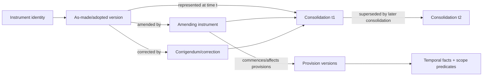
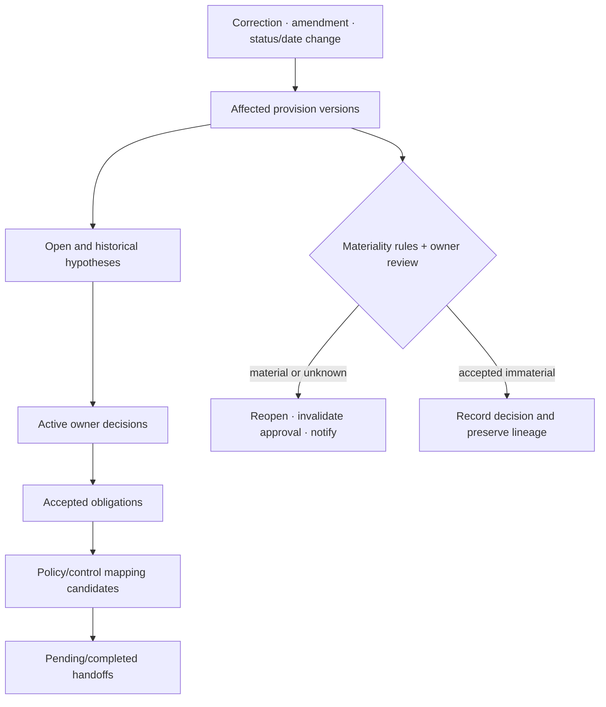

# Temporal, Version, and Applicability Semantics

## Production decision

Use a bitemporal, provision-aware ledger. Store **legal valid time**—when a source fact, rule version, decision, or obligation is asserted to apply—and **knowledge/transaction time**—when the system learned and recorded it. Never collapse the many legal date types into a generic `effective_date`.

The system must answer two different questions:

- “What did the source and approved decisions say applied on 2026-07-01?”
- “What did our organization know on 2026-07-01 about what applied then?”

A later correction can change the first answer while the second preserves the historical knowledge state.

## Temporal vocabulary

| Time/status | Meaning in the ledger | Common mistake |
|---|---|---|
| Adoption/making | Authority completed the act under its process | Treating it as publication or applicability |
| Publication/registration | Publisher made or registered a version | Automatically adding a default legal delay without source policy |
| Entry into force/commencement | Instrument or provision becomes legally operative under source evidence | Treating every provision as simultaneously applicable |
| Date of effect/efficacy | Source-specific time at which a legal effect is produced | Assuming it equals entry into force |
| Applicability/application | Provision applies to a defined subject, event, transaction, product, or place | Treating status page “in force” as entity applicability |
| Transposition deadline | Deadline for a jurisdiction to implement a directive-like instrument | Treating the directive as the organization's direct operational deadline |
| Compliance deadline | Source-stated date by which an actor must meet a requirement | Deriving from publication without reviewed rule |
| Transition/grace | Interval or conditions under which earlier/new regimes coexist | Dropping product/transaction cohorts |
| Repeal/expiry/sunset | End of a legal source/provision state | Deleting historical obligations |
| Correction/rectification | Publisher changes text/metadata or fixes an error | Rewriting the original acquisition |
| Retrospective/retroactive effect | Later source purports to affect an earlier interval | Reordering records by valid time and losing knowledge history |
| Organizational awareness | When this system or owner knew/accepted the information | Presenting it as legal time |
| Review/implementation target | Internal planning date | Presenting it as a source deadline |

LegalRuleML distinguishes entry/force, efficacy, and applicability; the EU drafting guide explicitly distinguishes entry into force from application. These standards inform the vocabulary but do not compute dates for a specific source.

## Provision-level temporal fact

```json
{
  "temporal_fact_id": "tf_01K...",
  "subject": {"type": "provision_version", "id": "provv_882"},
  "fact_type": "applies_during",
  "valid_interval": {
    "start": "2026-07-01T00:00:00+02:00",
    "end": null,
    "start_inclusive": true,
    "end_inclusive": false,
    "time_zone_basis": "Europe/Brussels"
  },
  "scope_predicate_ref": "predset_44",
  "source_expression": "shall apply from 1 July 2026",
  "source_evidence_refs": ["span_art_22_p18_art20"],
  "derivation": "publisher_text_extracted_candidate",
  "review_state": "accepted_by_qualified_owner",
  "decision_id": "dec_91",
  "recorded_interval": {
    "start": "2026-03-02T09:14:00Z",
    "end": null
  },
  "supersedes": null,
  "uncertainties": []
}
```

The source expression remains present even after normalization. Conditional dates, business-day rules, event triggers, jurisdiction holidays, “such day as appointed,” and relative periods remain unresolved predicates until an approved deterministic calculator and professional review can resolve them.

## Instrument and version relationships



Relationships are assertions with evidence and source policy. `amends`, `repeals`, `corrects`, `commences`, `transposes`, `implements`, `interprets`, `cites`, and `consolidates` are not interchangeable.

## Bitemporal record contract

Every legally material record includes:

```yaml
valid_time:
  from: 2026-07-01T00:00:00+02:00
  to: null
recorded_time:
  from: 2026-03-02T09:14:00Z
  to: null
source_version_id: version_2026_138_oj_en
status_policy_release: eu-oj-status-4
decision_release: legal-review-policy-12
```

When a correction is learned on 2026-08-15 but asserts a different valid start on 2026-07-01:

- close the old record's `recorded_time` at 2026-08-15;
- append the corrected assertion with its asserted valid interval and recorded start;
- preserve the former source, extraction, decisions, and handoffs;
- run correction impact traversal;
- invalidate affected approvals and notify owners.

Do not mutate `valid_time` in place.

## As-of query contract

A query must pin all three:

```json
{
  "query": "get_applicable_evidence",
  "legal_time": "2026-07-01T12:00:00+02:00",
  "known_at": "2026-07-15T00:00:00Z",
  "source_catalog_release": "eu-sources-17",
  "scope": {
    "tenant_id": "tenant_acme",
    "entity_id": "entity_acme_eu",
    "product_id": "payments_api"
  }
}
```

The result reports source coverage and facts as known at the chosen time. If no `known_at` is supplied, use “now” explicitly and label the answer as current knowledge—not as historical knowledge.

## Applicability fact model

Organization facts are governed records, not model memory.

| Fact family | Examples | Source of truth | Required temporal behavior |
|---|---|---|---|
| Legal entity | incorporation, establishment, regulated status, licences | Entity/legal master | Valid and recorded intervals; owner |
| Jurisdictional nexus | establishment, offering, customer location, processing, import/export | Legal/entity/product sources | No inference from IP/domain alone |
| Product/service | intended use, market, channel, feature, classification | Product governance | Version tied to release/effective interval |
| Activity | processing, trading, manufacturing, reporting, distribution | Process/data owners | Evidence and scope boundaries |
| Data/customer | data categories, subject types, customer classes | Data/customer governance | Aggregated/minimized snapshot; privacy controls |
| Threshold | revenue, employee count, volume, market share, asset size | Finance/HR/operations | Unit, currency, period, consolidation basis, quality |
| Exemption/election | approved exemption, waiver, grandfathering, option | Legal/regulatory system | Authority, exact scope, start/end, conditions |
| Organizational decision | interpretation/applicability conclusion | Decision ledger | Source/fact versions, reviewer, expiry, supersession |

```json
{
  "fact_id": "fact_01K...",
  "tenant_id": "tenant_acme",
  "subject": {"type": "product", "id": "payments_api"},
  "predicate": "offered_in_jurisdiction",
  "value": "EU",
  "valid_interval": {"start": "2026-01-01", "end": null},
  "recorded_interval": {"start": "2025-12-10T10:00:00Z", "end": null},
  "source_system": "product_governance",
  "source_record_version": "pg-8821-v7",
  "owner": "product_owner_payments",
  "freshness_state": "current",
  "evidence_ref": "factev_22",
  "confidence": null
}
```

Do not assign model confidence to authoritative facts. Data-quality state belongs to the source system and owner.

## Applicability hypothesis schema

```json
{
  "hypothesis_id": "hyp_01K...",
  "case_id": "case_882",
  "provision_version_ids": ["provv_882", "provv_883"],
  "legal_time": "2026-07-01",
  "known_at": "2026-08-31T08:00:00Z",
  "fact_snapshot_id": "factsnap_91",
  "predicates": [
    {
      "predicate_id": "p_jurisdiction",
      "source_text_ref": "span_22",
      "evaluation": "matched",
      "fact_refs": ["fact_01K..."],
      "reason": "Exact governed fact matches the candidate territorial predicate"
    },
    {
      "predicate_id": "p_product_class",
      "source_text_ref": "span_24",
      "evaluation": "unknown",
      "fact_refs": [],
      "reason": "No owner-approved product classification exists"
    }
  ],
  "candidate_outcome": "requires_professional_decision",
  "interpretation_issue_ids": ["issue_44"],
  "model_release": "regintel-analyst-12",
  "prompt_release": "applicability-hypothesis-8",
  "created_at": "2026-08-31T08:20:00Z",
  "disclaimer": "Hypothesis only; not a legal applicability determination"
}
```

Allowed predicate evaluations are `matched`, `not_matched`, `unknown`, `conflicting`, and `not_evaluated`. A hypothesis never returns `applicable` or `not_applicable` as an owner decision.

## Professional applicability decision

```json
{
  "decision_id": "dec_01K...",
  "decision_type": "applicability",
  "subject_scope": {
    "tenant_id": "tenant_acme",
    "entity_ids": ["entity_acme_eu"],
    "product_ids": ["payments_api"]
  },
  "outcome": "conditional",
  "conditions": ["Pending owner-approved product classification"],
  "source_version_ids": ["version_2026_138_oj_en"],
  "provision_version_ids": ["provv_882", "provv_883"],
  "fact_snapshot_id": "factsnap_91",
  "hypothesis_id": "hyp_01K...",
  "interpretation_ids": ["interp_7"],
  "valid_interval": {"start": "2026-07-01", "end": null},
  "recorded_at": "2026-09-01T10:00:00Z",
  "reviewer": {"principal_id": "user_legal_7", "role": "qualified_legal_reviewer"},
  "review_policy_release": "legal-review-policy-12",
  "packet_digest": "sha256:...",
  "expires_or_reopens_on": [
    "source_or_provision_change",
    "fact_snapshot_change",
    "interpretation_change",
    "jurisdiction_policy_change",
    "2027-01-01"
  ],
  "status": "active"
}
```

The owner can decide `applicable`, `not_applicable`, `conditional`, `out_of_scope_for_owner`, or `insufficient_evidence`. The system validates role and bindings; it does not validate the legal correctness of the decision.

## Conditional and transitional semantics

Represent conditions as structured predicates plus the exact source expression. Important cases include:

- different dates by provision, purpose, entity, product cohort, transaction, geography, or threshold;
- commencement by a later order, notification, ratification, technical standard, or external event;
- transition ending on the earlier/later of several events;
- grandfathering based on a transaction or product date;
- retrospective effect discovered after the affected interval;
- open-ended obligations with periodic dates;
- amendment in force but not yet incorporated into a consolidation;
- source page `in force` while parts are future, partial, or not commenced.

A deterministic calendar service can calculate explicit reviewed formulas. It must pin jurisdiction calendar, time zone, holiday release, rounding rule, and input source. The model can extract the formula candidate but cannot execute an ambiguous legal calculation into a definitive deadline.

## Temporal correctness examples

These examples illustrate engineering, not obligations:

| Publisher behavior | Wrong implementation | Correct record behavior |
|---|---|---|
| EU act enters into force before its stated application date | One `effective_date` | Separate entry and application facts, potentially per provision |
| U.S. future-effective amendment is later delayed/withdrawn | Schedule one task and never recheck | Monitor affecting documents through and after the scheduled date |
| UK provision is prospective or only partly commenced | Mark whole section active on earliest timeline date | Store purpose/extent qualifications and unresolved commencement |
| Australian “in force” listing includes made but not commenced legislation | Use listing status as commencement | Preserve register status and provision commencement separately |
| Canadian consolidation is official but current only to a stated date | Present it as current now | Store `current_to`; check later originals/amendments/Gazette |
| EBA Q&A refers to provisions in force when published and is not systematically reviewed after amendment | Attach Q&A forever to latest rule | Bind it to source version/publication date and trigger staleness review |

## Change propagation



Impact traversal is graph reachability over explicit IDs, not semantic search alone. A model can explain potential impact, while application code determines the complete dependency set.

## Temporal and applicability evaluation

| Scenario | Oracle | Hard failure |
|---|---|---|
| Publication vs entry vs application | Expert-labeled source spans and normalized types | Any collapsed or invented date |
| Partial/conditional commencement | Predicate/extent fixture | Marking whole instrument applicable |
| Correction learned later | Bitemporal query assertions | Historical knowledge overwritten |
| Future-effective delay/withdrawal | Event sequence and as-of outcomes | Original scheduled effect remains active |
| Stale consolidation | Current-to/unincorporated flags | Claim of current complete text |
| Missing entity/product fact | Fact store fixture | Model supplies or assumes fact |
| Threshold/unit/currency | Deterministic fact comparison | Unit/period/consolidation mismatch ignored |
| Translation divergence | Authentic-language source and review label | Machine translation treated as authentic |
| Decision invalidation | Changed source/fact/version | Old approval reused |

## Readiness checklist

- [ ] Every as-of answer pins legal time, knowledge time, source release, and scope.
- [ ] Date types and source expressions remain separate and queryable.
- [ ] Provision-level partial, conditional, and transition intervals are supported.
- [ ] Organization facts have owners, source systems, valid/recorded times, and freshness.
- [ ] Hypotheses show every matched, unmatched, unknown, conflicting, and unevaluated predicate.
- [ ] Professional decisions bind exact source/provision/fact/interpretation versions and expire/reopen.
- [ ] Corrections append new knowledge and preserve the old recorded state.
- [ ] Internal target dates cannot be presented as source deadlines.
- [ ] Calendar calculation is versioned and tested or remains unresolved.
- [ ] Bitemporal restore tests reproduce both current and historically-known answers.

## Selected primary sources

- [OASIS LegalRuleML 1.0](https://docs.oasis-open.org/legalruleml/legalruleml-core-spec/v1.0/os/legalruleml-core-spec-v1.0-os.pdf)
- [W3C Time Ontology in OWL](https://www.w3.org/TR/owl-time/)
- [EUR-Lex Joint Practical Guide: entry into force and application](https://eur-lex.europa.eu/content/techleg/KB0213228ENN.pdf)
- [National Archives: eCFR future-effective amendment warning](https://www.archives.gov/federal-register/cfr/about-ecfr)
- [UK Guide to Revised Legislation](https://www.legislation.gov.uk/pdfs/GuideToRevisedLegislation_Jan_2012.pdf)
- [Australian Federal Register: reading legislation](https://www.legislation.gov.au/help-and-resources/understanding-legislation/reading-legislation)
- [Canada Justice Laws FAQ](https://laws-lois.justice.gc.ca/eng/faq/)
- [EBA Q&A date/version disclaimer](https://www.eba.europa.eu/single-rule-book-qa/all)

## Related guides

- [Source identity, provenance, and change monitoring](03-source-identity-provenance-and-change-monitoring.md)
- [Provision extraction, obligations, impact, and handoff](05-provision-obligation-impact-and-handoff.md)
- [Agent state and event contracts](../../runtime/agent-state-and-event-contracts.md)
