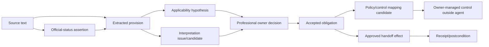
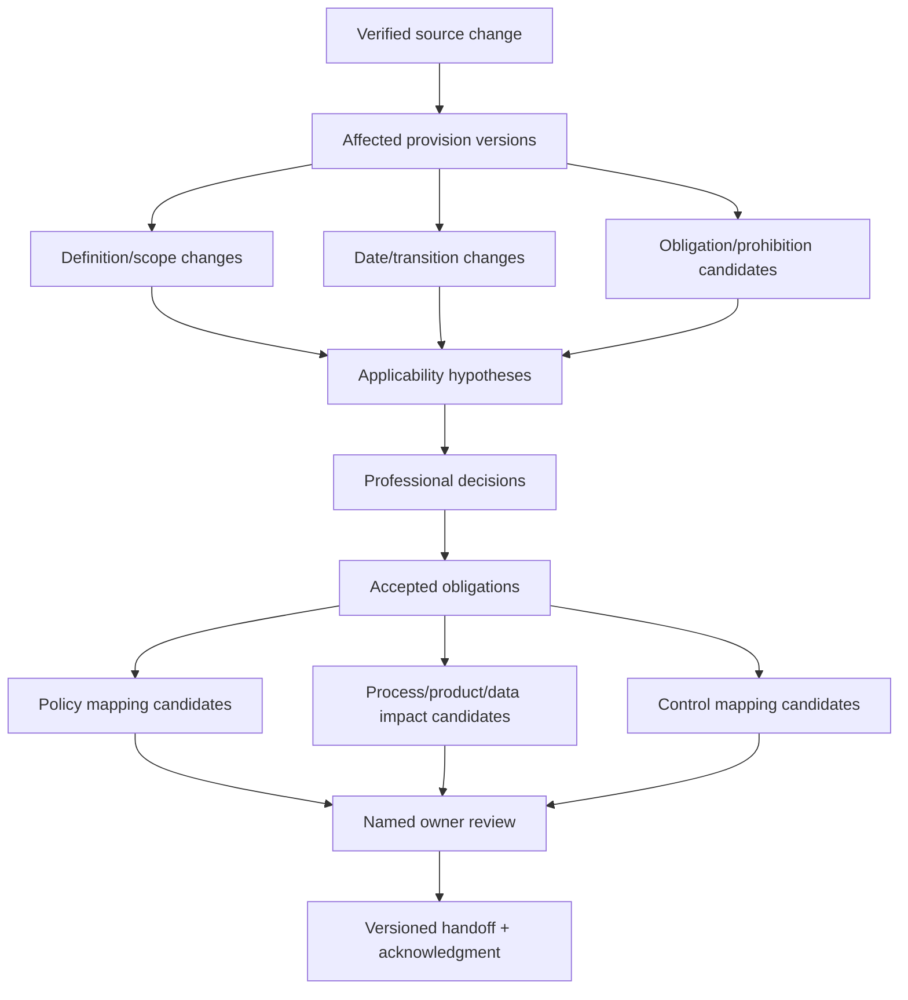
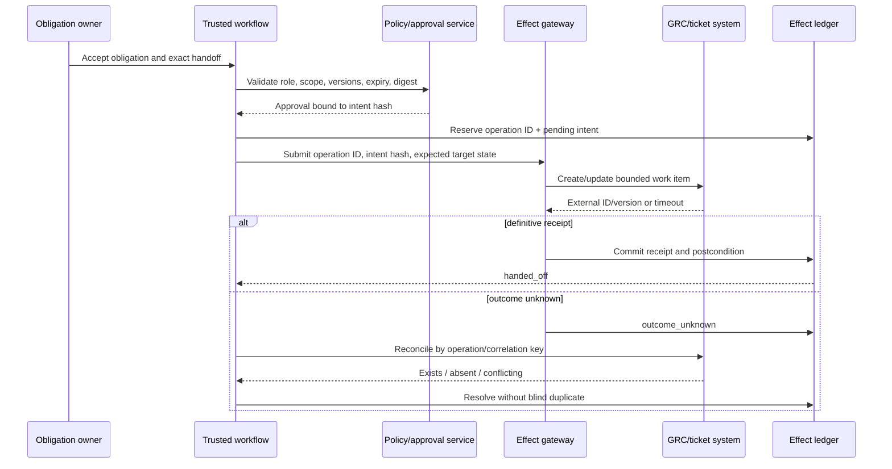

# Provision Extraction, Obligations, Impact, and Handoff

## Production decision

Use an evidence ladder in which each record has a distinct owner, status, and allowed effect. The system may transform source text into review candidates, but only a professional decision can create an accepted organizational obligation. Only a policy/control owner can map or implement a control.

## The evidence ladder

| Record | What it asserts | Created by | Authority |
|---|---|---|---|
| Source artifact/text | Bytes and publisher/source metadata were acquired | Acquisition service | Evidence of acquisition; status comes from separate assertion |
| Official-status assertion | Publisher/source policy classifies the artifact/rendition | Deterministic policy + verifier | Application-owned classification with evidence |
| Extracted provision candidate | A pinpoint span may contain a definition, scope, rule, exception, date, or obligation | Parser/model | Candidate only |
| Applicability hypothesis | Source predicates appear matched/not matched/unknown against a fact snapshot | Model + deterministic fact join | Review aid only |
| Interpretation issue/candidate | Competing readings, cross-references, language or authority conflicts exist | Model or reviewer | Question/candidate only |
| Owner decision | Named professional accepts an interpretation/applicability outcome | Qualified human | Organizational decision within exact scope/version |
| Accepted obligation | Organization records an actor/action/condition/deadline based on a decision | Compliance/regulatory owner | Internal obligation record, not implementation proof |
| Policy/control mapping | Obligation may relate to named policy/control objects | Analyst/owner | Proposed until policy/control owner accepts |
| Implemented control | A control exists and operates in its system of record | Control owner/system | Outside this blueprint |
| External/internal effect | Ticket, notification, or GRC handoff was attempted/committed | Trusted effect gateway | Delivery evidence only; never compliance evidence |



No arrow is implied. Each transition has a policy, validation, role, and event.

## Provision extraction contract

Extract structure before semantics. A candidate cites the smallest complete source unit while retaining enclosing context, definitions, exceptions, footnotes, annexes, tables, formulas, and cross-references.

```json
{
  "provision_candidate_id": "pc_01K...",
  "artifact_id": "art_01K...",
  "extraction_id": "extract_44",
  "instrument_version_id": "iv_882",
  "publisher_locator": "Article 20",
  "span": {
    "page": 18,
    "start_offset": 418,
    "end_offset": 721,
    "bounding_boxes_ref": "obj://.../spans/20"
  },
  "verbatim_digest": "sha256:...",
  "candidate_types": ["application_date", "transitional_rule"],
  "structured_candidate": {
    "actor_text": null,
    "action_text": "shall apply",
    "object_text": "this Regulation",
    "condition_text": null,
    "date_expression": "from 1 July 2026",
    "exception_refs": [],
    "cross_reference_labels": []
  },
  "source_status_assertion_id": "status_220",
  "parser_release": "legal-structure-9",
  "model_release": "regintel-extractor-12",
  "prompt_release": "provision-extraction-7",
  "validation": {
    "schema": "pass",
    "span_alignment": "pass",
    "citation_resolves": true
  },
  "review_state": "candidate"
}
```

The `verbatim_digest` supports integrity; users retrieve the licensed text according to rights. Do not duplicate long restricted passages into general traces or exports.

## Extraction taxonomy

| Candidate | Required fields | Frequent failure |
|---|---|---|
| Scope/applicability | actor/subject, territory, activity/product, thresholds, conditions, exceptions | Generalizing a defined term beyond its context |
| Obligation/prohibition/permission | bearer, action/state, object, trigger, conditions, exceptions | Treating “should” or commentary as binding without status evidence |
| Definition | term, definition text, scope, cross-references, version | Applying a definition across instruments or time |
| Deadline/recurrence | raw expression, event anchor, date/calendar, recurrence, transition | Computing an ambiguous relative date |
| Reporting/recordkeeping | actor, recipient, content, format, channel, period, retention | Inventing a submission mechanism |
| Governance/process | role/body, action, decision/evidence, cadence | Mapping directly to an organizational control |
| Exemption/derogation | eligible subject, conditions, authority, duration, evidence | Assuming an exemption without an owner-approved fact |
| Amendment/correction | affected provision, operation, replacement text, valid time | Comparing only visible consolidated text |
| Guidance/interpretive statement | source status, cited rule, recommendation, alternatives | Treating guidance as a new legal obligation |

The taxonomy is a review aid, not a universal legal ontology.

## Interpretation issue contract

```yaml
interpretation_issue_id: issue_44
case_id: case_882
issue_type: conflict_between_guidance_and_rule_text
question: "Which source-scoped reading should govern the internal applicability decision?"
evidence:
  supporting:
    - {source_version_id: rule_v7, provision_id: rule_12, span_ref: span_91}
  conflicting:
    - {source_version_id: guidance_v3, provision_id: guide_8, span_ref: span_93}
source_status_assertions: [status_rule_7, status_guidance_3]
language_or_translation_notes: []
candidate_readings:
  - reading_id: r1
    summary: "Candidate reading A"
    evidence_refs: [span_91]
  - reading_id: r2
    summary: "Candidate reading B"
    evidence_refs: [span_93]
missing_evidence: []
required_reviewer_role: qualified_legal_reviewer
status: open
```

The model may enumerate readings and arguments. It cannot select the legally correct reading. Do not store a numeric “legal confidence” that users can mistake for authority.

## Owner decision contract

```json
{
  "decision_id": "dec_01K...",
  "case_id": "case_882",
  "decision_type": "interpretation_and_applicability",
  "outcome": "accepted_with_conditions",
  "decision_statement": "Organization-approved internal decision text",
  "conditions": ["Applies only to entity and product scope in factsnap_91"],
  "source_version_ids": ["rule_v7", "guidance_v3"],
  "provision_candidate_ids": ["pc_01K..."],
  "hypothesis_id": "hyp_01K...",
  "interpretation_issue_ids": ["issue_44"],
  "fact_snapshot_id": "factsnap_91",
  "reviewer": {
    "principal_id": "user_legal_7",
    "role": "qualified_legal_reviewer",
    "delegation_id": "deleg_22"
  },
  "review_policy_release": "legal-review-policy-12",
  "packet_digest": "sha256:...",
  "valid_interval": {"start": "2026-07-01", "end": null},
  "recorded_at": "2026-09-01T10:00:00Z",
  "reopen_triggers": ["source_change", "fact_change", "policy_change", "expiry"],
  "status": "active"
}
```

The decision is an organizational record, not a declaration about all entities, products, jurisdictions, or future versions.

## Obligation candidate and accepted obligation

```json
{
  "obligation_candidate_id": "oc_01K...",
  "decision_id": "dec_01K...",
  "bearer": {"type": "organization_role", "candidate": "regulated_entity"},
  "action": "candidate_normalized_action",
  "object": "candidate_object",
  "conditions": ["structured_condition_ref_1"],
  "triggers": ["source_event_or_business_event_ref"],
  "deadlines": [
    {
      "raw_expression": "source text expression",
      "normalized_candidate": null,
      "calendar_release": null,
      "state": "requires_owner_resolution"
    }
  ],
  "recurrence": null,
  "exceptions": ["exception_candidate_1"],
  "evidence_refs": ["span_91", "span_92"],
  "interpretation_ids": ["interp_7"],
  "impact_domains": ["product", "policy", "operations"],
  "model_release": "regintel-analyst-12",
  "status": "candidate"
}
```

An obligation owner promotes this to an `accepted_obligation` by:

- naming the accountable organizational bearer and owner;
- resolving or explicitly retaining conditional/unknown dates;
- binding the exact professional decision and source versions;
- assigning valid/recorded time, review cadence, and reopen triggers;
- accepting or rejecting each impact domain;
- recording internal priority separately from legal status or source deadline.

Priority, risk, implementation target, and compliance status are different fields owned by different people.

## Change and obligation map



This graph supports complete dependency traversal. Embedding similarity may suggest additional candidates, but it cannot determine the definitive impact set.

## Impact-analysis workflow

1. **Freeze the comparison:** identify old/new source versions, deterministic diff, status, dates, language, rights, and parser release.
2. **Find structural dependants:** traverse explicit definitions, cross-references, amendments, decisions, obligations, mappings, and prior handoffs.
3. **Generate candidates:** the model explains changed meaning candidates, affected predicates, and missing evidence with citations.
4. **Join organization facts:** use one governed fact snapshot and show mismatches/unknowns.
5. **Triage materiality:** deterministic thresholds route by source class, deadline proximity, owner scope, and affected active decisions; the model may summarize but not lower risk.
6. **Professional review:** resolve interpretation and applicability; record rejected alternatives and unresolved questions.
7. **Accept obligations:** an authorized owner promotes exact candidate versions and defines accountable owners.
8. **Map and hand off:** policy/control/product/process owners accept mappings and work; the agent records acknowledgment only.
9. **Verify continuity:** future corrections or fact changes reopen the dependency chain.

## Mapping contract

```yaml
mapping_candidate_id: map_01K...
accepted_obligation_id: obl_882
target:
  target_type: internal_policy_or_control
  system: grc_system_alias
  object_id: control_14
  object_version: v9
relation_candidate: partially_addresses
coverage_dimensions:
  action: candidate_match
  scope: unknown
  frequency: mismatch
  evidence: candidate_match
gaps:
  - "Control frequency does not match the accepted obligation candidate"
evidence_refs: [policy_span_14, control_definition_14_v9]
generated_by: regintel-analyst-12
status: proposed
required_owner: control_owner_14
```

Allowed relations should distinguish `addresses`, `partially_addresses`, `supports`, `conflicts`, `unmapped`, and `unknown`. Only the target owner can accept the relation. An accepted mapping does not mean the control is implemented, operating, effective, or compliant.

## Review packet

A professional review view must contain, in priority order:

1. exact action requested, scope, required reviewer role, deadline, and consequence of no decision;
2. source identities, official-status evidence, versions, language/authenticity, rights, and coverage warnings;
3. before/after pinpoint diff with definitions, exceptions, dates, transitions, and affecting acts;
4. applicability predicates with fact references, freshness, and unknowns;
5. supporting and contradictory sources/readings;
6. candidate obligation and impact map;
7. prior active decisions, obligations, handoffs, and invalidation consequences;
8. model/parser/tool releases and known limitations;
9. decision choices, conditions, rationale, expiry, and reopen triggers.

Approval is rejected if the packet digest, source/fact versions, scope, or destination changes after rendering.

## Handoff effect protocol



### Operation identity

```text
operation_id = HMAC(
  tenant
  || accepted_obligation_id
  || obligation_version
  || destination_system
  || destination_object_or_create_key
  || payload_digest
  || operation_kind
)
```

The server stores the canonical intent and rejects reuse with changed parameters. A timeout is `outcome_unknown`, not failure. Before retrying a weakly idempotent destination, query by correlation key and compare postconditions.

## Policy/control-owner handoff checklist

- [ ] Accepted obligation and professional decision are active and not expired.
- [ ] Source, provision, fact, interpretation, obligation, and payload versions are pinned.
- [ ] Destination owner, system, object type, tenant, and allowed fields are deterministic.
- [ ] Mapping candidates are labeled proposed and include gaps/unknowns.
- [ ] No source-rights or confidentiality restriction is violated by the payload.
- [ ] Approval covers exact intent hash and invalidates on relevant changes.
- [ ] Effect operation ID, receipt, external ID/version, and postcondition are durable.
- [ ] Destination acknowledgment means accepted work, not implemented control or compliance.
- [ ] Corrections can find and supersede the work item without deleting its history.

## Failure and recovery cases

| Failure | Containment | Recovery owner/evidence |
|---|---|---|
| Extracted sentence omits exception/definition | Block promotion on structural/citation checks | Parser owner; corrected extraction and regression fixture |
| Model invents obligation actor/deadline | Reject unsupported field; mark missing | Regulatory reviewer; source span and candidate diff |
| Professional decision based on stale facts | Invalidate before handoff; reopen | Fact and decision owners; changed snapshot evidence |
| Correction arrives after handoff | Traverse and flag affected work; invalidate stale approval | Regulatory plus destination owner; old/new lineage |
| Mapping suggests a control that no longer exists | Reject target precondition | Control owner; current target version |
| GRC commit succeeds but receipt fails | Freeze duplicate; reconcile | Workflow/GRC owner; operation key and destination search |
| Owner rejects candidate | Record rejection; do not prompt-loop for approval | Named owner; rationale and packet digest |
| Destination owner does not acknowledge | Keep `awaiting_handoff_ack`; escalate by policy | Obligation owner; delivery attempts and SLA |

## Anti-patterns

- A single “regulation summary” object with source, interpretation, obligation, and control mixed together.
- Extracting every “shall” as an obligation without actor, scope, exception, status, and date evidence.
- Using a source/document relevance score as legal applicability confidence.
- Generating a deadline from generic legal knowledge when the source expression is unresolved.
- Treating accepted policy/control mapping as evidence of implementation or effectiveness.
- Asking the model to approve the interpretation it generated.
- Updating a GRC “compliant” field from a handoff.
- Deleting rejected interpretations or superseded decisions.

## End-to-end acceptance checklist

- [ ] Every candidate field has source or fact evidence, or is explicitly unknown.
- [ ] Verbatim source and derived paraphrase are visually and structurally distinct.
- [ ] Cross-references, definitions, exceptions, annexes, and dates are retrieved before review.
- [ ] Interpretation candidates preserve disagreements without an automatic winner.
- [ ] Professional decisions bind exact evidence and reviewer authority.
- [ ] Accepted obligations have accountable owners, scope, time, and reopen triggers.
- [ ] Mapping gaps remain visible and cannot auto-change control status.
- [ ] Handoff is idempotent, approved, reconciled, and tenant/right scoped.
- [ ] A later correction can identify every affected downstream record.
- [ ] No output claims legal advice, compliance, control implementation, or attestation.

## Related guides

- [Temporal, version, and applicability semantics](04-temporal-version-and-applicability-semantics.md)
- [State, events, context, memory, and orchestration](06-state-events-context-memory-and-orchestration.md)
- [Idempotency and side effects](../../reliability/idempotency-and-side-effects.md)
