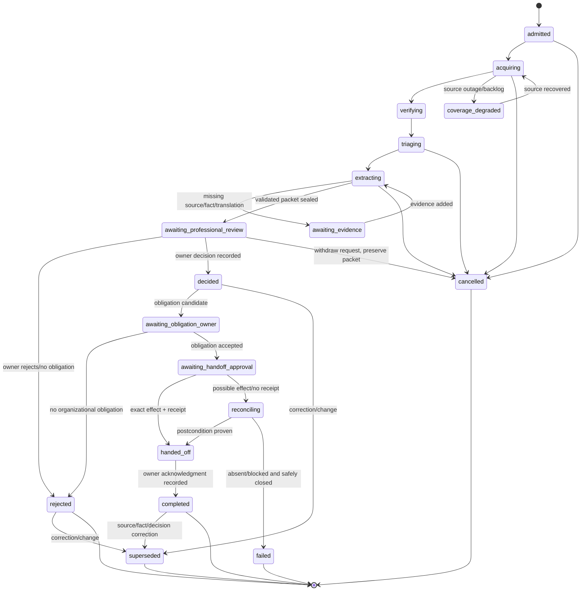
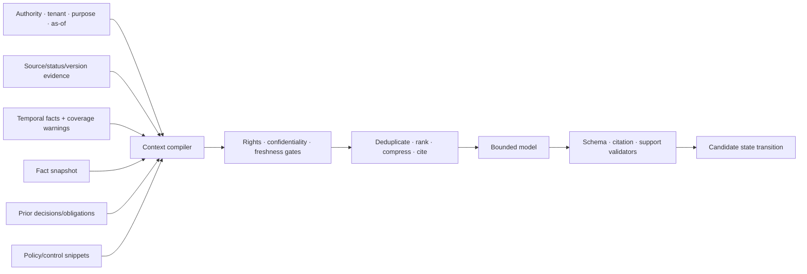

# State, Events, Context, Memory, and Orchestration

## Production decision

Use an application-owned case state machine, append-only domain events, immutable evidence, and structured continuity snapshots. Conversation history is neither the legal ledger nor the workflow database. The model receives a compiled decision packet and can propose only enumerated next steps.

## Separate the records

| Record | Purpose | Source of truth? |
|---|---|---|
| Command | Actor, tenant, purpose, scope, as-of times, and deduplication identity | Accepted input |
| Case state | Current workflow phase, owner, state version, deadlines, policy, pending effects | Yes |
| Domain event | Accepted business transition | Yes |
| Source artifact/status | Acquired evidence and source-scoped classification | Yes for what was acquired/asserted |
| Extraction/hypothesis | Derived candidate and its behavior release | Yes for candidate history; not legal truth |
| Professional decision | Named owner decision over exact evidence | Yes for organizational decision |
| Obligation/mapping | Accepted obligation and proposed/accepted internal relations | Yes within each owner's scope |
| Effect intent/receipt | Exact external handoff and observed outcome | Yes for effect lifecycle |
| Continuity snapshot | Lossy context rendering that references authoritative records | No; rebuildable |
| Trace/log/metric | Operational diagnosis and evaluation | No; sampled telemetry is not the ledger |

Use stable tenant, jurisdiction cell, subscription, instrument, artifact, provision, case, run, attempt, step, decision, obligation, operation/effect, event, and release identifiers.

## Authoritative case state machine



`cancelled` stops future work; it does not erase evidence, decisions, or already committed effects. A source correction can reopen a terminal case by creating a new superseding case/version rather than mutating the terminal outcome.

## Case state contract

```json
{
  "case_id": "case_01K...",
  "tenant_id": "tenant_acme",
  "jurisdiction_cell": "eu-west-regintel",
  "subscription_id": "sub_payments_eu",
  "case_type": "verified_source_change",
  "state": "awaiting_professional_review",
  "state_version": 19,
  "risk_class": "owner_set_high",
  "authority_ceiling": "R1",
  "source_artifact_ids": ["art_01K..."],
  "comparison_base_ids": ["art_prior_7"],
  "evidence_snapshot_id": "evsnap_91",
  "fact_snapshot_id": "factsnap_91",
  "hypothesis_ids": ["hyp_01K..."],
  "interpretation_issue_ids": ["issue_44"],
  "active_decision_ids": [],
  "pending_effect_ids": [],
  "source_catalog_release": "eu-sources-17",
  "rights_policy_release": "content-rights-9",
  "behavior_bundle_id": "regintel-release-2026-08-31.1",
  "review_packet_digest": "sha256:...",
  "owner_role": "qualified_legal_reviewer",
  "next_deadline": "2026-09-02T12:00:00Z",
  "coverage_watermark": "2026-08-31T07:30:00Z",
  "updated_at": "2026-08-31T08:22:41Z"
}
```

Transitions use compare-and-swap on `state_version`. A transactional outbox commits the domain event or effect intent in the same transaction. Queue messages carry expected version and attempt fencing token.

## Event envelope

Use a CloudEvents-compatible shape when it fits the platform, with a domain payload controlled by this application:

```json
{
  "specversion": "1.0",
  "id": "evt_01K...",
  "source": "regintel/case-service",
  "type": "com.example.regintel.professional_review.requested.v1",
  "subject": "tenants/tenant_acme/cases/case_01K",
  "time": "2026-08-31T08:22:41Z",
  "datacontenttype": "application/json",
  "data": {
    "tenant_id": "tenant_acme",
    "jurisdiction_cell": "eu-west-regintel",
    "case_id": "case_01K...",
    "state_version": 19,
    "review_packet_digest": "sha256:...",
    "evidence_snapshot_id": "evsnap_91",
    "fact_snapshot_id": "factsnap_91",
    "required_reviewer_role": "qualified_legal_reviewer",
    "policy_release": "legal-review-policy-12"
  }
}
```

Events are at-least-once unless the infrastructure proves otherwise. Handlers deduplicate both event ID and semantic operation identity. Event schemas are versioned; incompatible events are quarantined, not coerced by a model.

## Domain events and effects

| Event | Emitted after | External effect? |
|---|---|---|
| `source.artifact_acquired` | Raw artifact and acquisition evidence committed | No |
| `source.status_verified` | Status assertion committed | No |
| `source.coverage_degraded` | Watermark/outage state committed | Optional internal alert through separate effect |
| `change.case_opened` | Deterministic change identity committed | No |
| `provision.candidates_validated` | Schema/span validation committed | No |
| `applicability.hypothesis_ready` | Candidate and fact snapshot committed | No |
| `professional_review.requested` | Exact packet sealed | Review task/notification may be R2 |
| `owner.decision_recorded` | Identity/role/digest/decision committed | No |
| `obligation.accepted` | Obligation owner accepts exact version | No |
| `handoff.intent_created` | Approval and operation intent committed | R3 pending |
| `handoff.outcome_unknown` | Dispatch ambiguity committed | No new retry; reconciliation starts |
| `handoff.reconciled` | Destination postcondition established | No or bounded repair |
| `case.superseded` | Correction/changed fact traversal committed | Notification/update may be R2/R3 |

## Context compiler

The context compiler performs a deterministic, rights-aware query over pinned records.



### Typed context lanes

1. **Authority and invariants:** tenant, jurisdiction cell, purpose, authority ceiling, allowed transitions/tools, source precedence policy, professional-decision rule.
2. **Task identity:** case/run/state version, requested decision, scope, as-of times, deadlines, budgets.
3. **Verified source state:** exact versions, official-status assertions, language/authenticity, rights, coverage watermark, correction/unincorporated warnings.
4. **Provision evidence:** bounded pinpoint spans, definitions, exceptions, cross-references, deterministic diff, extraction quality.
5. **Organization facts:** one fact snapshot with owners, valid/recorded times, units, freshness, and unknowns.
6. **Prior owner records:** active/superseded decisions, obligations, mappings, and pending effects relevant to the scope.
7. **Untrusted/derived material:** translations, commentary, model candidates, and working notes clearly labeled.

### Context budget priority

Retain, in order:

1. authority, tenant/jurisdiction, as-of times, state/effect identity, and stop conditions;
2. source/status/version/language/rights facts and coverage warnings;
3. exact provisions, definitions, exceptions, dates, transitions, and contradicting evidence;
4. fact snapshot predicates, unknowns, and owner metadata;
5. professional decisions, approvals, pending effects, and invalidation triggers;
6. deterministic diff and compact source-aligned extraction;
7. prior reasoning prose and optional commentary.

Large source artifacts remain outside the prompt with stable references. The model can request an admitted bounded slice. Context order and prefix are stable where possible, but prompt caching is never treated as memory or evidence.

## Lossy compaction and continuity

Compaction is allowed to lose duplicated prose and low-value reasoning. It must not lose authority, provenance, temporal, uncertainty, review, or effect state.

```yaml
receipt_kind: compaction_receipt
receipt_version: 3
receipt_id: checkpoint_01K...
previous_receipt: {id: checkpoint_01J..., hash: "sha256:..."}
case_id: case_01K...
state: awaiting_professional_review
state_version: 19
event_frontier:
  after_sequence: 1871
  through_sequence: 1922
  event_set_digest: "sha256:..."
source_high_watermarks:
  eu-oj-daily:
    capture: 2026-08-31/OJ-L-219
    verified: 2026-08-31/OJ-L-219
    analysis: 2026-08-31/OJ-L-217
    owner_decision: 2026-08-30/OJ-L-216
    cursor_release: eu-oj-cursor/8
scope:
  tenant_id: tenant_acme
  jurisdiction_cell: eu-west-regintel
  entity_ids: [entity_acme_eu]
  product_ids: [payments_api]
as_of:
  legal_time: 2026-07-01
  known_at: 2026-08-31T08:00:00Z
authority_ceiling: R1
source:
  artifact_ids: [art_01K...]
  status_assertion_ids: [status_220]
  language_status: authentic
  rights_policy_id: rights_eu_17
  coverage_warnings: []
evidence:
  snapshot_id: evsnap_91
  provision_candidate_ids: [pc_01K...]
  contradiction_refs: [issue_44]
facts:
  snapshot_id: factsnap_91
  unknown_predicates: [product_classification]
decisions:
  active: []
  superseded: [decision_71]
obligations:
  active: []
approvals:
  active: []
  pending: [review_request_91]
  invalidated_or_expired: [approval_72]
effects:
  confirmed: []
  pending: []
  unknown: [effect_81]
  next_reconciliation_at: 2026-08-31T08:15:00Z
next_safe_action: await_qualified_legal_review
required_review:
  role: qualified_legal_reviewer
  packet_digest: "sha256:..."
  due_at: 2026-09-02T12:00:00Z
behavior_bundle_id: regintel-release-2026-08-31.1
context_compiler_release: regintel-context/4
compactor_release: regintel-compactor/2
explicit_omissions:
  - {class: full_source_text, reason: reload_by_artifact_and_span_under_current_rights}
  - {class: superseded_reasoning_prose, reason: non_authoritative}
unresolved_failures: [handoff_provider_timeout]
retention_policy_refs: [records://regintel-case/6, rights://eu-public/17]
invariants:
  authority_and_rights_unchanged: true
  bitemporal_state_reconstructable: true
  evidence_refs_resolve: true
  no_pending_or_unknown_effect_lost: true
  next_action_is_legal_from_state: true
invariants_hash: "sha256:..."
receipt_hash: "sha256:..."
```

### Preservation checks

Before accepting a compaction snapshot, deterministic validation compares it with authoritative state:

- all active source/status/provision/fact/decision/obligation/effect IDs are present;
- legal and knowledge times, units, language status, rights, warnings, conditions, unknowns, and deadlines match;
- authority ceiling and required reviewer role did not change;
- every cited record resolves and is accessible under current rights;
- no pending or unknown effect disappeared;
- no source correction or state version arrived during compilation.

If validation fails, retry from a current snapshot or hand off/reset with a larger deterministic rendering. Do not ask the model to “repair” missing authoritative state from memory.

On restart, authenticate the actor/workload, load authoritative state through the event frontier, verify the receipt and invariants hashes, compare every source watermark with the current source ledger, re-evaluate rights and retention, invalidate stale approvals, reconcile unknown effects, rebuild the context from current permitted artifacts, and only then execute `next_safe_action`. If an event arrives while the receipt is being committed, optimistic state/version checks reject the receipt or the resumer applies the missing suffix before continuing.

Continuity tests compact the same long case repeatedly; crash before and after receipt commit; correct a source date during compaction; revoke a licence; expire a review; and leave a handoff outcome unknown. Compare legal commands, bitemporal answers, source/analysis coverage, active/superseded records, rights, review/approval state, effect frontier, deadlines, explicit omissions, and next safe action with an uncompacted oracle. Prose similarity is not the test.

## Memory policy

The word “memory” is avoided for authoritative legal/source state. Each class has an explicit include-or-disable decision.

| Class | Decision | Regulatory-intelligence use | Why/controls |
|---|---|---|---|
| Turn/scratch memory | Enabled, non-authoritative | Temporary parsing, reasoning, and model provider context | Discard after step; never source for decisions; provider retention governed |
| Working/run memory | Enabled | Current plan, bounded tool results, evidence refs, validation errors | Typed/checkpointed for recovery; deleted/archived with case policy |
| Session memory | Enabled only for authenticated review continuity, not chat recall | Review conversation references, open questions, deadlines, approvals | Rebuilt from structured state and immutable events; transcript is supporting artifact only |
| Durable workflow/task memory | Required | Case lifecycle, snapshots, decisions, obligations, effects, retries, cancellation | Relational ledger is authoritative; bitemporal and versioned |
| Domain knowledge memory | Enabled as governed corpus | Source artifacts, instrument/provision graph, approved source policies, organization facts | Versioned systems of record, access/rights/temporal filters; not model-written free text |
| Long-term/preference memory | Disabled by default | No unconstrained vector recall of legal questions, counsel notes, preferences, or licensed text | High poisoning, rights, privilege, staleness, deletion, and cross-tenant risk; enable only for a proven narrow class |
| Episodic/outcome memory | Enabled only as curated cases | Verified corrections, owner dispositions, incident outcomes, reviewer overrides, resolved failures | Provenance, reviewer, taxonomy, retention, tenant/jurisdiction, and eval gates; not copied into new decisions as precedent |

User preferences may control formatting or notification channel, but never source hierarchy, legal interpretation, applicability, deadline calculation, approver role, or authority.

### Memory admission, rejection, and retention tests

Exactly these seven lifetimes are recognized. A store or provider feature that cannot be assigned to one of them is disabled until classified:

| Lifetime | Use test | Reject test | Retention and deletion proof |
|---|---|---|---|
| Turn/scratch | Needed only to complete one model/tool step and reproducible from admitted inputs | Contains an approval, legal conclusion, source text needed as evidence, or any only copy | Destroy after the step/provider retention window; prove no prompt cache or support log becomes durable memory |
| Working/run | Needed across bounded steps in one run, typed, and checkpointable | Free-form transcript is required to recover authority or effect state | Delete/archive at run terminal state under case policy; restart from checkpoint without provider session |
| Session | Needed for one authenticated review session and rebuilt from case/events | Implicit user recall, cross-case chat history, or reviewer text would change law/policy/authority | Expire at logout/inactivity and case policy; revoke session/role and prove no later retrieval |
| Durable workflow/task | Required to reconstruct legal state, reviews, timers, decisions, obligations, effects, and reconciliation | Record has no schema, owner, version, purpose, or legal/knowledge time | Apply records/legal-hold/deletion policy with tombstones and backup proof; restore exact as-of state |
| Domain knowledge | Governed source, fact, policy, glossary, or runbook with owner/version/rights/time | Model-written prose, stale consolidation, commentary, or licensed text lacks provenance/entitlement | Revoke/supersede by owner policy; propagate correction, rights expiry, retention and derivative deletion |
| Long-term/preference | A narrowly approved non-legal presentation/routing preference measurably helps and cannot affect authority | Legal position, source precedence, deadline, applicability, counsel note, reviewer habit, or cross-tenant semantic recall | Default disabled; if enabled, expose/edit/delete, expiry and poisoning tests must pass |
| Episodic/outcome | Reviewed failure/correction/outcome is useful for evaluation or retrieval as a labeled example | Raw professional decision is treated as precedent, label is unverified, or scope/rights are incompatible | Curated, tenant/jurisdiction scoped and expiring; deletion invalidates derived evals/indexes and prevents re-ingestion |

Run negative tests for cross-tenant retrieval, wrong jurisdiction, wrong legal/knowledge time, superseded evidence, expired entitlement, poisoned episode, deleted subject/content, and a preference attempting to change a legal or approval decision. Any retrieved item must expose lifetime, owner, purpose, source/version, rights, temporal scope, review state, retention policy, and retrieval reason.

### Episodic write contract

```json
{
  "episode_id": "episode_01K...",
  "tenant_id": "tenant_acme",
  "jurisdiction": "EU",
  "case_id": "case_882",
  "episode_type": "correction_changed_effective_date",
  "verified_outcome": "prior_decision_superseded",
  "source_refs": ["art_old", "art_correction"],
  "decision_refs": ["dec_old", "dec_new"],
  "approved_by": "regintel_quality_owner",
  "recorded_at": "2026-09-03T10:00:00Z",
  "usable_for": ["evaluation", "retrieval_as_failure_example"],
  "not_usable_for": ["automatic_legal_interpretation", "cross_tenant_retrieval"],
  "retention_policy_id": "ret_regintel_episode_4",
  "expires_at": "2028-09-03T00:00:00Z"
}
```

## Planning policy

The macro-plan is fixed; model-directed micro-planning is bounded.

| Step | Controller owns | Model may choose | Stop/replan trigger |
|---|---|---|---|
| Acquire/verify | Source/version/channel, rights, limits, cursor | Nothing outside admitted source | Missing/failed authenticity, rights, outage |
| Diff/triage | Comparison base, deterministic diff, priority floor | Candidate materiality explanation | No structural evidence or conflicting versions |
| Extract | Allowed provision/cross-reference reads | Which admitted refs/spans to inspect next | Two no-progress reads, budget, unsupported field |
| Applicability | Fact snapshot and predicate schema | Explain matches/unknowns; request a named fact | Stale/missing facts, ambiguity requiring professional judgment |
| Review | Reviewer role, packet digest, expiry | Draft questions and options | Packet/version change, rejection, timeout |
| Obligation/map | Accepted decision and target catalogs | Draft candidate obligation/mappings | Decision inactive, target missing/stale |
| Handoff | Exact destination/operation/approval | Draft payload before sealing | Approval invalid, outcome unknown, cancellation |

Stop on completion, rejection, awaiting evidence/professional review, cancellation, newer state version, source correction, tool/token/time/cost budget, repeated no-progress calls, schema/citation failure, or authority request beyond ceiling.

## Orchestration choices

- **Single run owner:** one controller owns state transitions for a case attempt.
- **Parallel reads:** independent source/rendition acquisition and provision extraction can run with bounded fan-out and deterministic merge.
- **No parallel decisions:** applicability/interpretation/obligation acceptance remains a named human workflow, not a race.
- **No default subagents:** a terminology, translation, or jurisdiction specialist is a tool/service or human role unless separate agent state and measurable evaluation justify delegation.
- **Durable workflow trigger:** add a workflow engine when approval waits, future-effective timers, outage backoff, or reconciliation repeatedly exceed one process/deploy and a DB worker becomes unsafe.
- **Child-work policy:** each child partition inherits tenant, jurisdiction, rights, authority, deadline, budget, behavior release, and cancellation; parent completion waits for declared required children.

## Idempotency and reconciliation

| Boundary | Semantic identity | Reconciliation |
|---|---|---|
| Source acquisition | source + publisher item/version + rendition + digest | Compare publisher history, local acquisition, and object digest |
| Change case | subscription + new artifact + comparison base + detector release | Read active/superseded cases |
| Review request | case + packet digest + reviewer role | Read review task state |
| Decision | case + decision type + packet digest + reviewer principal | Decisions are append-only; changed packet requires new decision |
| Obligation acceptance | decision + obligation candidate/version + scope | Read active obligation and supersession graph |
| Handoff | obligation version + destination + payload digest + operation kind | Query destination by correlation key and compare target postcondition |
| Correction propagation | correction artifact + dependent record/version | Traverse explicit dependency edges and compare state version |

See [idempotency and side effects](../../reliability/idempotency-and-side-effects.md) for the general lifecycle.

## Recovery and replay

- Resume from case state, events, immutable artifacts, decisions, and effect ledger—not provider conversation state.
- Re-run extraction or model analysis with the original behavior release for reproduction; use a new attempt/release for a changed output.
- Fence stale attempts after cancellation, takeover, state-version change, source correction, or expired review.
- Replay read-only transformations freely under rights; never replay professional decisions or side effects.
- Reconcile `outcome_unknown` before retrying; quarantine when the destination cannot prove state.
- Restore source/decision ledger, object bytes, encryption keys, rights policies, and behavior-bundle manifests together.
- Keep dead-letter records owned, diagnosable, replay-bounded, and retention-controlled.

## Continuity and recovery tests

- [ ] Crash after artifact bytes but before acquisition commit leaves no falsely complete watermark.
- [ ] Crash after state transition/outbox commit produces one event/effect intent.
- [ ] Duplicate/reordered events produce one valid state transition.
- [ ] Approval wait survives restart and invalidates on source/fact/packet change.
- [ ] Compaction preserves every authority, temporal, rights, uncertainty, decision, and effect field.
- [ ] A stale worker cannot emit a candidate or handoff after correction/cancellation.
- [ ] `outcome_unknown` blocks duplicate handoff until reconciliation.
- [ ] Restore reproduces as-known and currently-known bitemporal queries.
- [ ] Episodic retrieval cannot cross tenant/jurisdiction or become an automatic interpretation.
- [ ] Provider-side session loss does not lose authoritative progress.

## Related guides

- [Compaction and continuity](../../context-memory/compaction-and-continuity.md)
- [Memory architecture](../../context-memory/memory-architecture.md)
- [Run controls](../../runtime/run-controls.md)
- [Durable execution](../../runtime/durable-execution.md)
