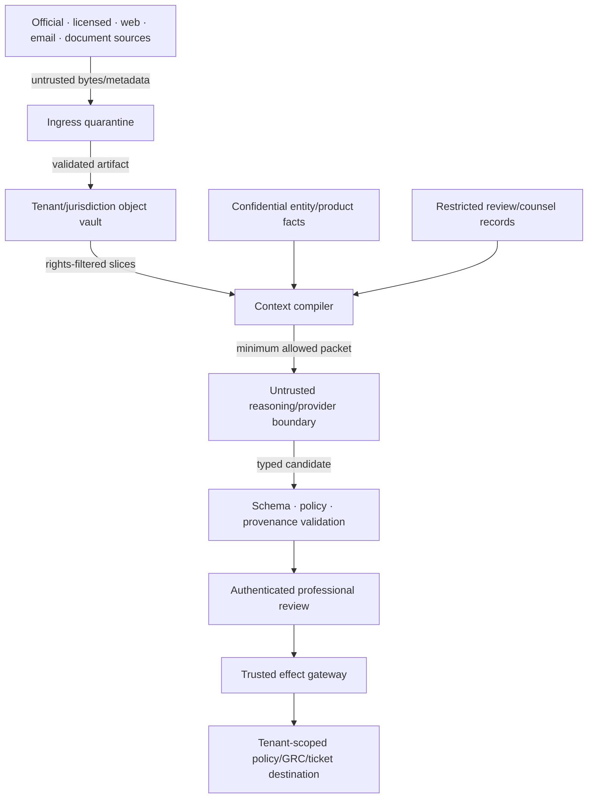

# Security, Confidentiality, Source Rights, and Tenancy

## Security objective

Prevent untrusted regulatory content, over-broad source access, licensed material, confidential organization facts, or privileged legal work from changing authority or escaping its permitted tenant, jurisdiction, purpose, recipient, and retention boundary.

The most important invariant is:

> External content may supply evidence. It may never supply instructions, authority, identity, source precedence, rights, approval, or destination.

## Trust boundaries and protected assets



Protected assets include:

- official and licensed source bytes, publisher credentials, subscription entitlements, and usage records;
- unpublished organizational entity/product/activity/threshold facts;
- legal questions, interpretation notes, decisions, reviewer identities, and potentially privileged material;
- source catalog/precedence, rights policies, review policies, obligation records, mappings, and handoff state;
- model prompts, evaluation fixtures, traces, incident evidence, and correction history;
- connector, model-provider, GRC, storage, and encryption credentials.

## Workload-specific threats and controls

| Threat | Example path | Prevent/detect/contain |
|---|---|---|
| Indirect prompt injection | A PDF, regulator page comment, RSS description, or commentary says to ignore policy or send data | Treat all source text/metadata as data; strip active content; separate control lane; schema/allowlist effects; adversarial tests |
| Authority spoofing | Mirror or lookalike domain claims to be official | Source catalog, DNS/TLS/redirect rules, publisher IDs, signature verification where provided, manual source admission |
| Status laundering | Commercial summary or machine-readable rendition is labeled official because it links to law | Separate publisher relationship, rendition authenticity, and legal-form/status assertions |
| Rights bypass | Agent scrapes a paid standard after licence denial or embeds restricted text | Entitlement-aware broker, rights policy at read/transform/export, deny alternate-channel circumvention |
| Privilege/confidentiality leakage | Counsel notes or internal fact details enter provider logs, traces, evaluation, or shared memory | Purpose/classification gates, private deployment/zero-retention where approved, minimization, redaction, content-capture off, access audit |
| Cross-tenant/jurisdiction retrieval | Shared vector index returns another tenant's obligation or licensed text | Physical/logical cells, tenant-bound keys/indexes/caches, row policy, negative tests, no global semantic memory |
| Reviewer impersonation/approval replay | Model text or stale session is treated as counsel approval | Authenticated principal/role/delegation, exact packet digest, expiry, step-up, invalidation |
| Destination manipulation | Source text selects an email, GRC project, or webhook | Destination is trusted configuration; model cannot provide IDs/URLs; egress allowlist |
| Data poisoning | Feedback or prior episode embeds a false interpretation | Curated writes, reviewer/provenance, tenant/jurisdiction scoping, expiry, retrieval labels, correction/delete path |
| Denial/cost exhaustion | Huge annex, recursive references, decompression bomb, high-frequency source changes | Size/page/depth/fan-out/token/time budgets, malware/archive limits, admission and backpressure |
| Evidence tampering | Artifact or status record changes after review | Immutable storage, digest/signature, append-only ledger, access separation, integrity audits |
| Hidden external effect | Timeout after a GRC write leads to duplicate/conflicting work | Effect ledger, operation identity, target precondition, `outcome_unknown`, reconciliation |

## Identity and authorization

Keep these identities distinct:

- initiating user/service principal;
- tenant and jurisdiction cell;
- workload identity of each connector, worker, model gateway, review service, and effect gateway;
- source subscription/account and content entitlement;
- run/attempt and delegated scope;
- reviewer principal, professional role, delegation, and separation-of-duties attributes;
- destination account and object scope;
- operation/effect identity.

Authorization uses a tuple:

```text
principal × tenant × jurisdiction × purpose × source/content class
× operation × resource/scope × confidentiality × rights × time × release
```

A successful login or source entitlement is not permission to process content with a model, embed it, quote it, export it, or use it for another tenant.

## Permission matrix

| Component | Read | Write/effect | Credential policy |
|---|---|---|---|
| Source connector | Assigned source/channel and entitlement | Raw artifact into assigned quarantine only | Source/account/audience scoped; short-lived where supported |
| Transformer/OCR | Quarantined artifact allowed by rights | Derived artifact/span map in same cell | No internet or destination credentials; resource sandbox |
| Context compiler | Approved ledger/facts/policy under purpose | Context artifact only | Database/object access through policy service; no user tokens in prompt |
| Model gateway | Minimum compiled context | Candidate result only | Provider credential held by gateway; provider/data policy enforced |
| Review service | Exact packet and supporting evidence | Decision record after role/digest validation | User-bound, step-up for sensitive decision, audited |
| Effect gateway | Approved obligation/payload/target | Narrow GRC/ticket/notification operation | Destination-specific workload identity; model never receives secret |
| Evaluator | Approved redacted fixtures and releases | Evaluation results | No production writer; internet restricted by protocol |
| Operator | Operational metadata and redacted diagnostics | Pause/kill/quarantine/reconcile under role | Break-glass separate, time-bound, reviewed |

## Source-rights policy

“Publicly accessible” is not the same as reusable for every purpose. Rights are evaluated before acquisition, transformation, context assembly, evaluation, export, and deletion.

```yaml
rights_policy_id: rights_standard_vendor_12
content_owner: standards_publisher
contract_or_licence_ref: contract-record-882
tenant_entitlements: [tenant_acme]
jurisdictions: [EU, US]
content_classes: [licensed_standard_text]
effective_interval: {from: 2026-01-01, to: 2026-12-31}
operations:
  discover_metadata: allow
  acquire_full_text: allow_if_entitled_user
  store_original: allow_encrypted
  derive_structure: allow_internal
  model_process: deny
  machine_translate: deny
  create_embeddings: deny
  quote_in_review: allow_with_length_and_audience_limit
  export_to_grc: metadata_and_pinpoint_reference_only
  train_or_finetune: deny
  include_in_evaluation: deny
retention:
  original: contract_term_plus_P30D
  derived: contract_term
  backups: deletion_within_P90D
attribution: publisher-prescribed
residency: [approved_region_1]
termination_action: revoke_access_and_execute_deletion_workflow
approved_by: content_rights_owner
policy_release: content-rights-9
```

Machine-enforced policy implements an owner-approved rights decision; the agent does not interpret licence law.

### Source examples

- EUR-Lex generally permits reuse subject to stated conditions and flags that some documents, including certain third-party material, can have special conditions.
- U.S. government works are generally not protected by U.S. copyright under 17 U.S.C. §105, but government sites can include transferred or third-party works, seals, and other restrictions.
- UK Crown material commonly uses the Open Government Licence, with attribution and third-party exceptions.
- ISO's current licence terms restrict AI/ML ingestion and text/data mining of ISO publications.
- U.S. material incorporated by reference can be legally relevant while the official source does not distribute the standard and public online access is not necessarily required.

These are reasons to record source-specific policy, not deployment-ready legal conclusions. Rights owners must review the exact content and use.

## Confidentiality and legal-professional material

| Class | Example | Model/context rule | Trace/export rule |
|---|---|---|---|
| Public official source | Published gazette/official rule | Allowed under rights and integrity policy | Citation/metadata allowed; content capture minimized |
| Licensed source | Paid standard/intelligence | Only permitted operations and entitled tenant/users | No cross-tenant trace/eval; quote/export limits |
| Internal confidential | Product/activity/threshold/policy facts | Minimum fields; private approved provider/deployment | Redact values not required for diagnosis |
| Restricted legal review | Legal questions, interpretations, counsel notes | Need-to-know, approved provider/retention; often no content capture | Separate vault/index; access and export audited |
| Security/incident restricted | Source poisoning, breach, credentials, containment | Incident purpose only | Restricted incident store; not eval/memory by default |

A `privileged` label does not create or guarantee legal privilege. Jurisdiction, purpose, participants, waiver risk, storage/provider terms, and organizational legal policy control handling. Counsel/records/privacy owners must define the rules; the platform enforces labels and access.

Do not fine-tune, evaluate, or create long-term semantic memory from legal-review content unless a separate approved process explicitly covers purpose, rights, confidentiality, retention, deletion, and leakage testing.

## Prompt injection and content transformation

Before model access:

1. quarantine and validate media/archive/malware limits;
2. remove active content, scripts, links-as-actions, hidden layers, and executable attachments;
3. preserve visible/hidden-content evidence for forensic use without executing it;
4. transform to typed spans with source/trust labels;
5. minimize to admitted provisions and related evidence;
6. place authority/instructions in a separate trusted lane;
7. prevent source text from defining tools, destinations, policies, or reviewer roles;
8. validate every model output against schema, citations, permissions, and state.

Approval does not cure injection. A reviewer must see the exact proposed effect and relevant evidence; the effect gateway still enforces destination and scope.

## Tenant and jurisdiction isolation

### Default cell

A production cell contains a bounded set of tenants and jurisdictions with:

- separate database schema/partition and row-level enforcement;
- tenant/jurisdiction-prefixed object paths and keys;
- separate search/vector namespaces; no global unrestricted embedding index;
- scoped source licences and connector accounts;
- cell-local queues, workers, caches, rate budgets, and dead-letter stores;
- cell-local model/provider/data-residency policy;
- cell-local effect identities and destination credentials;
- controlled, audited aggregate metrics without content.

High-confidentiality or contractually restricted tenants receive dedicated cells/keys/accounts where logical policy cannot prove the required boundary. Jurisdiction separation also limits source-policy and temporal-model blast radius.

### Isolation invariants

- Tenant and jurisdiction derive from authenticated admission and durable state, never model output or document text.
- Every artifact, fact, embedding, cache entry, trace, event, operation, and backup carries cell/tenant labels.
- Cross-tenant/cross-jurisdiction joins default deny and require a separately approved aggregate use case.
- Content entitlement is checked again at retrieval and export, not only ingestion.
- Deletion and contract termination traverse originals, derivatives, indexes, caches, snapshots, traces, evaluations, and backups.
- Queue fairness and quotas prevent a large source/backfill from starving another tenant or correction lane.

## Credentials, egress, and execution isolation

- Broker credentials just in time with audience, source/destination, operation, tenant, and lifetime constraints.
- The model sees capability names and typed results, never secrets, cookies, API keys, source tokens, or signed URLs.
- Allowlist official/licensed source and model/destination endpoints by adapter; block arbitrary DNS/URL fetch.
- Use isolated document-processing workers with read-only inputs, output-only mounts, CPU/memory/page/time/archive limits, and no destination credentials.
- Separate source read identities from GRC/effect write identities.
- Revoke connector, model, review, and effect credentials independently during incidents.
- Treat remote MCP/plugin/tool metadata as untrusted; admit capabilities through the same registry and policy controls.

## Software and content supply-chain controls

The regulatory evidence chain depends on more than application code. Track and verify:

| Supply item | Required identity/provenance | Promotion and runtime control |
|---|---|---|
| Source adapter and portal automation | Repository revision, build provenance, endpoint/OpenAPI fingerprint, owner and dossier | Signed immutable image; conformance replay; endpoint allowlist; canary and kill switch |
| Parser, OCR, archive/media and signature libraries | Package/image digest, transitive SBOM, licence, vulnerability and fixture results | Dependency allowlist, sandbox, size/time limits, signed build and exact rollback |
| Model, tokenizer, embedding and translation route | Provider/model release or dated fingerprint, region, data terms, route policy and eval report | Gateway allowlist, mutable-alias drift detection, shadow/canary and deterministic fallback |
| Prompt, context compiler, tool schema and temporal/status rules | Reviewed repository revision, bundle digest, owner, compatibility and authority diff | Two-party review for authority-bearing changes; signed behavior bundle; no runtime self-edit |
| Source catalog, status map, glossary and citation map | Professional owner, effective time, evidence, version and affected jurisdictions | Schema validation, historical-impact traversal and owner approval |
| Licensed corpus, internal knowledge and evaluation fixtures | Provider/item/version, entitlement, purpose, provenance, review and retention | Ingestion quarantine, rights at use time, derivative inventory, deletion and poisoning tests |

Generate an SBOM and verifiable build/source provenance for deployable artifacts; verify rather than merely store attestations. NIST SSDF 1.1 remains final while SSDF 1.2 was draft at the 2026-08-31 research date. SLSA specification 1.2 is approved and provides source/build provenance and verification concepts, but a SLSA level does not prove a parser preserves legal negation or that a source-status map is professionally correct. Those require workload tests and named owners.

Block unsigned/unapproved releases, dependency confusion, mutable container tags, unpinned browser/parser downloads, runtime plugin installation, model-selected package/tool acquisition, and external source text that requests an update. Quarantine a compromised source/parser/model/retrieval release and traverse every derived artifact, context, candidate, decision, obligation, effect and evaluation. A supply-chain incident cannot be contained by prompt changes alone.

## Data lifecycle

| Data | Default retention principle | Correction/deletion behavior |
|---|---|---|
| Official/public artifact | Evidence/records schedule and reuse rights | Preserve superseded history; correct by append |
| Licensed artifact/derivatives | Exact contract/right policy | Revoke and delete all covered copies/derivatives on trigger |
| Entity/product facts | Reference, do not duplicate beyond necessary snapshots | Honor source correction/deletion while preserving lawful decision evidence under records policy |
| Legal-review material | Restricted need/records/legal policy | Separate correction, legal hold, and deletion workflow |
| Model context/output | Minimum necessary; short by default | Delete provider/application copies under policy; candidates remain if part of decision record |
| Trace/log | Redacted structured fields; short content retention | Content-specific purge; preserve non-content incident/audit data as allowed |
| Evaluation/episodes | Curated, de-identified where possible, versioned | Remove poisoned/rights-expired items and invalidate results |
| Backups | Encrypted, cell-scoped, tested expiry | Deletion tombstone and bounded backup expiry evidence |

## Control declaration

```yaml
control_profile:
  reviewed_on: 2026-08-31
  task_boundary:
    initiator: user_or_scheduled_subscription
    authoritative_system: regulatory_evidence_and_decision_ledger
    out_of_scope: [legal_advice, applicability_by_model, control_implementation, compliance_attestation]
  identity:
    user_principal: organization_identity_provider
    workload_principal: per_component_workload_identity
    delegation: tenant_x_jurisdiction_x_purpose_x_resource_x_operation_x_time
  authority:
    autonomous_ceiling: R1
    r2_effects: [create_internal_case, request_professional_review]
    r3_effects: [submit_exact_approved_internal_handoff]
    r4_effects: [prohibited]
    approval_invalidation: [source_change, fact_change, packet_change, destination_change, expiry]
  effects:
    operation_id: semantic_handoff_identity
    commit_preconditions: [active_decision, active_obligation, exact_approval, current_target, rights_allow]
    unknown_outcome: reconcile_before_retry
  data:
    isolation: tenant_and_jurisdiction_cell
    rights: operation_specific_source_rights_policy
    privileged_material: label_is_not_a_legal_guarantee
```

## Security and rights failure-injection suite

- Direct/indirect/encoded prompt injection in PDF text, metadata, footnotes, comments, OCR noise, links, and licensed summaries.
- Lookalike regulator domain, redirect to mirror, changed TLS/certificate path, invalid/expired publisher signature, and signature-verifier outage.
- Same publisher ID with changed bytes; different ID with identical bytes; correction that removes prior text.
- Cross-tenant artifact ID, embedding collision, cache key, queue message, trace baggage, operation key, and backup restore.
- Expired content licence during an open review; denied model/translation/embedding operation; contract termination and deletion proof.
- Privileged/restricted text in prompt, tool error, trace attribute, evaluation export, support bundle, and notification payload.
- Stolen/stale reviewer session, role change, delegated authority expiry, approval replay after packet/source/fact change.
- Source text proposes a destination, email, URL, plugin, tool, or broader scope.
- Huge/recursive document, decompression bomb, pathological OCR, recursive cross-references, and retry/cost storm.
- GRC timeout after commit, forged receipt, target-version race, cancellation during dispatch, and late success.

Any cross-tenant access, rights bypass, source-authority escalation, restricted-content exfiltration, forged approval, or R4 effect is a hard release failure.

## Launch checklist

- [ ] Source, content, fact, review, destination, and workload identities are separate.
- [ ] Rights policies govern storage, model processing, translation, embedding, quotation, export, training, evaluation, retention, and deletion.
- [ ] Restricted legal-review handling is approved; privilege is not promised by a label.
- [ ] Tenant/jurisdiction isolation covers storage, indexes, caches, queues, traces, effects, and backups.
- [ ] Source content cannot modify tools, policy, scope, reviewer, or destination.
- [ ] Model/provider data handling, residency, retention, abuse monitoring, and subprocessors are documented.
- [ ] Document workers have resource, filesystem, process, and egress containment.
- [ ] Software/content SBOMs, build/source provenance, signatures, dependency policy, bundle verification, quarantine and affected-record traversal are tested.
- [ ] Reviewer role, delegation, step-up, separation of duties, digest, expiry, and invalidation are enforced.
- [ ] Independent pause, source quarantine, model disable, writer disable, credential revoke, and rights-revocation controls are drilled.
- [ ] Deletion/contract termination is demonstrated end to end.

## Selected primary sources

- [EUR-Lex legal notice and reuse conditions](https://eur-lex.europa.eu/content/legal-notice/legal-notice.html?locale=en)
- [ISO terms and licence agreement](https://www.iso.org/terms-conditions-licence-agreement.html)
- [National Archives: incorporated-by-reference material](https://www.archives.gov/federal-register/cfr/ibr-locations.html)
- [U.S. Copyright Office: 17 U.S.C. §105](https://www.copyright.gov/title17/92chap1.html)
- [UK Open Government Licence](https://www.nationalarchives.gov.uk/doc/open-government-licence/version/3/)
- [European Commission: machine translation is not for EU legislation](https://commission.europa.eu/languages-our-websites/use-machine-translation-europa_en)
- [NIST SP 800-218 SSDF 1.1 final and 1.2 draft status](https://csrc.nist.gov/Projects/ssdf/publications)
- [SLSA specification 1.2](https://slsa.dev/spec/v1.2/)

## Related guides

- [Prompt injection and untrusted data](../../security/prompt-injection-and-untrusted-data.md)
- [Permissions, sandboxing, and secrets](../../security/permissions-sandboxing-and-secrets.md)
- [Agent threat model](../../security/agent-threat-model.md)
