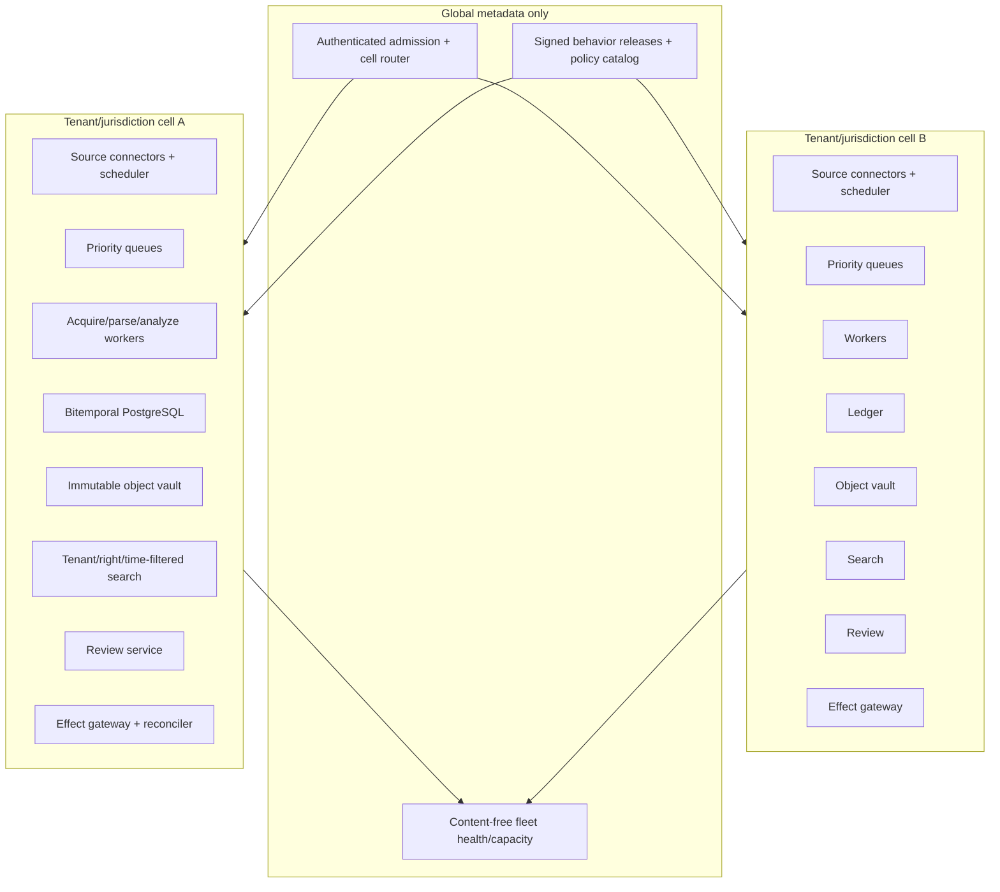
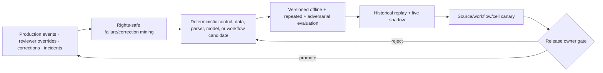

# Deployment, Scale, Resilience, Cost, and Evolution

## Production position

Start with one workload, one jurisdiction source catalog, one tenant/entity-product scope, and one internal handoff. Scale through isolated cells and partitioned source work, not a global corpus or broader model authority. Maintain the deterministic subscription/rule workflow as a fallback at every stage.

## Deployment shapes

| Stage | Shape | State | Key limit |
|---|---|---|---|
| Local/research | Offline fixtures, read-only scripts/notebook-equivalent review artifacts | Versioned fixture/output files | No production source credentials or writes |
| MVP | One service, PostgreSQL, object storage, bounded workers, model gateway, review UI | One tenant/jurisdiction case ledger | One source family/workflow; manual operations |
| Reliable v1 | Queue/outbox, connector partitions, durable waits if needed, separate effect gateway | Bitemporal ledger, immutable artifacts, receipts | Small source/tenant set; explicit on-call |
| Production | Separate environments/identities, cell-local queues/search, observability, backups, runbooks | Governed migrations and behavior-bundle manifests | Authority unchanged; canary by source/workflow |
| Scale | Tenant/jurisdiction/residency cells, quotas, fair scheduling, DR, source fallback | Cell-local data with controlled aggregates | No global unrestricted index or writer |

## Reference production deployment



Cells need not be separate clusters initially. They are enforceable failure, data, rights, quota, and deployment boundaries. Dedicated cells are justified by confidentiality, licensing, residency, customer isolation, source credentials, or blast radius—not by fashion.

## Workload classes and queues

Do not put all work in one FIFO queue.

| Class | Examples | Scheduling/deadline behavior |
|---|---|---|
| Source capture | Incremental poll, official artifact fetch, publisher correction | Reserved capacity; preserve source even when analysis is paused |
| Reconciliation/backfill | Full source inventory, restored outage window | Low/controlled background share; preemptible |
| Critical change analysis | Correction, withdrawal, effective-date change, owner-set high-risk final item | Deadline-aware; bounded dedicated concurrency |
| Ordinary change analysis | Final rule/guidance/update within selected scope | Fair tenant/source scheduling |
| Proposal/consultation monitoring | Drafts, consultations, horizon scanning | Shed/defer before current-law/correction work |
| Review waits | Professional/policy/control owner queues | Durable state, not worker occupancy |
| Handoff/reconciliation | Approved write, unknown outcome, correction update | Reserved, serialized by semantic target where needed |
| Reprocessing/evaluation | New parser/model/corpus/rule replay | Isolated capacity; never starves production |

Priority is approved policy based on source class, correction/status, stated dates, owner scope, case age, and business risk. The model may not increase its own priority.

## Admission and backpressure

Admission occurs before expensive fetch/OCR/model work. Check:

- tenant/jurisdiction/source subscription and rights;
- source/cell/workflow concurrency and daily budgets;
- artifact size/page/media/archive/reference-depth limits;
- current watermark/backlog and deadline feasibility;
- fact/reviewer/destination availability;
- model/OCR/provider quota and confidentiality route;
- duplicate/open case and already-acquired version;
- downstream review and handoff capacity.

### Backpressure ladder

1. coalesce duplicate polls/events and reuse identical artifacts/extractions;
2. apply deterministic subscription/rule filters before full content/model work;
3. prioritize corrections, withdrawals, date/status changes, and owner-set high-risk items;
4. defer proposals, commentary enrichment, embeddings, and reanalysis;
5. reduce model route or context only when evaluation proves invariant preservation;
6. pause low-priority tenants/sources under explicit fairness policy;
7. switch to intake-only mode and expose coverage-versus-analysis watermarks;
8. reject new discretionary work with retry guidance; never claim caught up.

Do not drop source artifacts silently. Distinguish `source_capture_watermark`, `verification_watermark`, `analysis_watermark`, and `owner_decision_watermark`.

## Capacity model

Model each stage separately:

```text
arrival rate λ = source items + corrections + backfills + user cases
service demand Dstage = average active seconds or resource units per item at stage
required parallelism ≈ λ × Dstage / target utilization
```

Use percentiles and class slices because a 500-page scanned annex is unlike a small HTML notice. Binding constraints may be:

- publisher/provider rate quotas and overlap/reconciliation volume;
- network bytes, object-store writes, signature validation, OCR CPU/memory;
- parser/embedding/model tokens and concurrent requests;
- database transaction/temporal-query/search throughput;
- professional reviewer capacity and policy/control-owner queue;
- GRC/ticket destination limits and reconciliation latency.

Reviewer capacity is often the actual bottleneck. Increasing model throughput without controlling candidate precision can worsen the system.

## Recovery-load engineering

Recovery is a separate traffic class. Before releasing a backlog, enumerate exact source partitions/items, verification gaps, analysis cases, reviews, timers, handoff reconciliations and outcome checks from authoritative state. Classify each as still deadline-relevant, evidence-only replay, superseded, expired, blocked on rights/facts, or unsafe until source/destination reconciliation.

Reserve capacity for live corrections/withdrawals, source capture, control commands, unknown-effect reconciliation, professional review and incident work. Admit recovery by legal/business deadline, source/status risk, tenant fairness, document/OCR/model cost, provider quota and reviewer/destination capacity. Default expired change cases to evidence reconstruction without ordinary alerts or new handoffs.

Measure:

```text
recovery amplification = recovery fetch + parse + analysis + review + effect work
                         / missed logical source items
projected drain time = queued service demand / recovery capacity available after live reserves
```

Amplification above one can be legitimate because one correction reopens many dependants, but unexpected growth indicates duplicate identity, unbounded cross-reference fan-out, retries or correction propagation defects. Load-test a week-long source outage plus schema drift, a large annex, one noisy tenant, provider throttling and a destination outage. Recovery passes only when live work is not starved, full reconciliation closes coverage, reviewers are not flooded, effects are not replayed blindly, rights remain enforced and drain time is bounded.

## Safe degradation

| Dependency failure | Continue | Pause/disable |
|---|---|---|
| Model/provider | Raw official-source capture, fingerprint, deterministic rules, human workflow | New model-derived candidates |
| OCR/parser | Capture raw artifact, metadata triage, manual exception queue | Semantic analysis of unreadable content |
| Search/index | Direct ID/version retrieval and deterministic source work | Broad discovery/semantic candidate expansion |
| Fact source | Source capture and extraction | Applicability hypothesis/decision packet requiring stale facts |
| Review service/identity | Capture/analysis candidates | Decisions and handoffs |
| GRC/destination | Decisions/obligations in local ledger | New handoffs; reconcile existing unknowns |
| Telemetry backend | Correct workflow with bounded audit buffer | Nonessential content diagnostics; never authorization |
| Primary official source | Approved fallback/discovery and existing evidence | Confirmation/completeness claims for affected watermark |
| Licensed source/entitlement | Official sources and locally permitted history | Any denied licensed operation or bypass |

## Behavior-bundle release manifest

The deployed behavior is more than application code:

```yaml
behavior_bundle_id: regintel-release-2026-08-31.1
application_image_digest: sha256:...
software_sbom: artifact://release/regintel/SBOM.cdx.json
build_and_source_provenance: artifact://release/regintel/provenance.intoto.jsonl
database_schema: regintel-ledger-14
case_state_machine: case-flow-9
source_catalog_releases: {EU: eu-sources-17, US: us-sources-11}
source_status_policies: {EU: eu-oj-status-4, US: us-fr-status-7}
rights_policy_release: content-rights-9
temporal_rule_release: temporal-normalization-8
entity_fact_schema: applicability-facts-6
parsers: {html: html-12, xml: xml-9, pdf: pdf-18, ocr: ocr-profile-7}
retrieval_release: provision-retrieval-10
embedding_release: optional-embedding-5
model_routes:
  extraction: model-route-extract-12
  analysis: model-route-analysis-8
prompts:
  provision: provision-extraction-7
  applicability: applicability-hypothesis-8
context_compiler: regintel-context-11
tool_registry: regintel-tools-13
review_policy: legal-review-policy-12
adapter_dossiers:
  eu_official: artifact://adapter-dossiers/eurlex-cellar/7.2
  us_official: artifact://adapter-dossiers/govinfo-fr/5.2
  licensed_research: artifact://adapter-dossiers/licensed-provider/4.1
  internal_knowledge: artifact://adapter-dossiers/knowledge/3.4
  grc_workflow: artifact://adapter-dossiers/grc/6.0
handoff_adapters: {grc_alias: grc-adapter-6}
evaluation_suite: regintel-eval-15
capacity_profile: regintel-capacity-2026-08-28
runbook_bundle: regintel-runbooks-12
rollback_bundle: regintel-release-2026-08-14.3
```

The bundle is the complete unit of behavior, authority, compatibility, operations and rollback. Use immutable provider model versions where available. If a provider exposes only a mutable alias or continuously delivered API, pin a dated fingerprint and conformance report, detect change and continuously canary; do not claim exact reproducibility.

## Release progression and rollback

1. Contract/schema/migration and source-adapter replay tests.
2. Offline component and end-to-end evaluation, including rights/tenant/temporal hard gates.
3. Historical-window replay against pinned artifacts without changing decisions/effects.
4. Shadow on current source changes beside the existing workflow.
5. Canary one source/workflow/tenant cell with all professional decisions intact.
6. Ramp by source/jurisdiction/workflow—not global percentage only.
7. Roll back model/prompt/parser/context/tool behavior while continuing to capture new raw artifacts.

Long-running cases pin a release. At a breaking change, finish on the pinned release, explicitly migrate with compatibility evidence, or quarantine for professional re-review. Never silently resume an old approval under changed source/status/temporal semantics.

Rollback stops new admissions for the cohort, fences old/new source and effect workers, preserves capture of raw official artifacts when safe, reconciles pending/unknown effects, and resumes only cases compatible with the older bundle. It never rewrites an extraction, professional decision, obligation or historical as-of answer under older semantics.

## Disaster recovery and source resilience

Set asset-specific objectives; values below are illustrative placeholders for owner approval:

| Asset | Example RPO | Example RTO | Recovery proof |
|---|---:|---:|---|
| Source/rights/status/behavior catalogs | 15 minutes | 1 hour | Exact signed active/effective versions, credentials and status assertions restored |
| Bitemporal case/decision/approval/obligation/effect ledger | Near-zero in-region; 5 minutes cross-region | 30 minutes critical cell | Legal/knowledge-time queries, event frontier and effect state reproduce |
| Raw artifacts and authenticity/acquisition evidence | 1 hour | 4 hours critical sources | Digest/signature/fixity and ledger references verify; missing-object inventory is explicit |
| Audit records | Records-policy RPO; no silent scoped loss | 4 hours query availability | Completeness frontier and tamper evidence verify |
| Queues/timers/index/cache | No independent durability assumed | 30 minutes reconstruction | Rebuilt from ledger/outbox without duplicate source/effect operations |
| Metrics, diagnostic logs and sampled traces | Risk/class-specific | 1 hour minimum operational visibility | Gaps are visible and never used to reconstruct authority |

### Recovery priorities

1. Identity, authorization, source/rights/review policies, and encryption keys.
2. Bitemporal ledger, decisions, approvals, obligations, effect intents/receipts, and outbox.
3. Immutable raw artifacts and authenticity/acquisition evidence.
4. Derived extractions, indexes, contexts, and evaluations, which can be rebuilt under rights.
5. Operational telemetry according to incident/records needs.

### Recovery tests

- restore a cell to a declared recovery point and reproduce legal-time/known-time queries;
- prove no committed decision, obligation, or effect is lost or duplicated;
- verify object digests/signatures and ledger-to-object referential integrity;
- rebuild search/embeddings from permitted artifacts without cross-tenant leakage;
- reconcile all pending/unknown handoffs with destinations;
- resume source connectors from a conservative overlap and full reconciliation;
- honor deletion/rights tombstones during restore;
- preserve source capture during model/application rollback where possible.

Multi-region active-active writes are not a default. Single-writer cell ownership plus tested failover is simpler and avoids conflicting decisions/effects.

Failover requires an independently verifiable fencing lease or equivalent proof that only one cell can advance a source partition or execute effects. Rehearse region/cell loss, corrupted backup, key unavailability, object-store loss, rights-policy rollback, source outage during restore and destination uncertainty. Measure recovery amplification, drain time, live-work starvation and reviewer/destination saturation—not merely database start time.

## Cost model

```text
monthly_cost = source/licence subscriptions
             + connector/network/authentication
             + object/index/database storage and backups
             + parsing/OCR/translation compute
             + embedding and model input/output tokens
             + workflow/queue/observability infrastructure
             + professional review and policy/control-owner effort
             + evaluation/replay/incident/recovery overhead
```

Track unit costs by source, jurisdiction, document format/language, workflow, tenant, and terminal outcome:

- cost per source item acquired and verified;
- cost per page and per successfully aligned provision;
- cost per review-ready change and accepted obligation;
- professional minutes per candidate/decision;
- cost per correction/reopened case and per reconciled handoff;
- storage/rights cost per retained artifact;
- model cost per accepted candidate versus rejected/unsupported candidate.

Optimization order:

1. remove out-of-scope sources/items with deterministic subscriptions;
2. reuse immutable acquisitions/extractions and compare only changed structures;
3. retrieve bounded relevant provisions instead of full instruments;
4. use deterministic parsers/calculators before models;
5. route routine extraction to a smaller evaluated model and escalate ambiguity;
6. batch only when tenant, rights, latency, and failure isolation allow;
7. eliminate duplicate review through exact source/fact/version identities;
8. reduce false positives before increasing source volume.

Do not optimize by dropping citations, temporal/status evidence, unknowns, professional review, rights checks, or effect reconciliation.

## Model, tool, corpus, and rule changes

| Change | Primary risks | Minimum qualification |
|---|---|---|
| Model/provider/version/route | Different extraction, abstention, tool use, confidentiality/retention, latency/cost | Critical/repeated/adversarial suites; shadow; provider data review; canary |
| Prompt/context compiler/compaction | Lost exception, date, authority, unknown, or pending effect | Continuity/property tests; long-case replay; citation and authority gates |
| Parser/OCR/translation | Span drift, negation/table/footnote loss, language modality change | Exact source-alignment corpus; multi-format/language failure cases |
| Retrieval/embedding/index | Wrong version/status/tenant/right/time, stale or missing cross-reference | Eligibility-filter and recall suites; index rebuild/rollback |
| Source adapter/API/feed | Missed/duplicate/reordered items, status semantics, auth/rate changes | Sandbox/recorded replay, overlap/full reconciliation, source-owner acceptance |
| Source catalog/precedence/status policy | Changed coverage or authority classification | Legal/regulatory owner approval; historical impact traversal |
| Temporal normalization/calendar | Wrong date/interval/as-of answer | Expert temporal fixtures and bitemporal replay |
| Applicability facts/schema | Broken predicate mapping or stale facts | Fact-owner schema contract; snapshot migration; affected-decision re-review |
| Review/approval policy | Wrong professional role, scope, expiry, separation | Identity/policy tests; owner approval; stale approval invalidation |
| GRC/tool schema | Wrong target/effect/idempotency/postcondition | Contract tests, sandbox effect/reconciliation, target-owner acceptance |
| Licensed corpus/rights | Unauthorized use/retention/export or lost source | Rights approval, deletion/export test, affected eval/index invalidation |

Every row is a behavior release even if application code is unchanged.

## Continuous evolution loop



Model fine-tuning is not the default fix. Many failures belong in source identity, rules, parser structure, context selection, schema validation, professional review, or effect policy.

### Controlled failure mining

Mine only closed, reviewed records with an allowed purpose. Candidate inputs are missed or late changes, wrong source/status/version/date selection, unsupported extraction, reviewer correction, false alert, source or rights incident, failed continuity check, and duplicate or unknown effect. The mining job emits a typed candidate containing failure class, affected source/jurisdiction/workflow, behavior bundle, exact evidence and state references, terminal outcome, reviewer/adjudication state, rights/retention decision, and proposed evaluation slices. It does not emit a reusable legal interpretation.

Quarantine raw privileged material, licensed content without evaluation rights, unresolved professional disagreement, unverified labels, cross-tenant examples, and records under deletion or legal-hold uncertainty. Redact only through an approved deterministic transform and retain the transformation receipt. A quality owner admits the candidate into a versioned failure registry; a separate release owner decides whether it becomes a regression test, fault injection, rule/parser change, prompt/context change, training example, operational control, or no action. Deletion, correction, rights expiry, or adjudication change invalidates every derived fixture, index, metric baseline, and training export through lineage.

Measure recurrence and downstream harm by failure class, not just candidate volume. Sampling includes quiet sources and no-alert windows so mining does not learn only from visible incidents or reviewer-selected cases. Promotion still requires an untouched holdout, repeated-run distribution, rights-safe historical replay, shadow, canary, rollback evidence, and proof that the change did not broaden authority.

## Operational cadence

| Cadence | Work |
|---|---|
| Continuous | Coverage/watermarks, queue age, rights/auth failures, unknown effects, integrity/isolation alerts |
| Daily/on-call | Source outages/schema changes, high-risk corrections, overdue reviews, handoff reconciliation, capacity |
| Weekly | Reconciliation results, reviewer overrides, false positives/misses, cost and backlog by source/workflow |
| Per release | Full manifest, migrations, evals, historical replay, shadow/canary, rollback/compatibility evidence |
| Monthly/quarterly | Source catalog/rights/licence review, professional-boundary audit, tenant isolation test, DR sample, failure mining |
| Event-driven | Publisher/legal-status change, source contract/API change, incident, disputed interpretation, missed correction |

## Acceptance checklist

- [ ] MVP can run as one simple service and database/object store without weakening evidence boundaries.
- [ ] Production cells isolate tenant, jurisdiction, rights, queues, search, credentials, effects, and backups.
- [ ] Source capture, verification, analysis, review, and handoff watermarks are distinct.
- [ ] Backpressure preserves corrections/high-risk work and exposes lag without false completeness.
- [ ] Reviewer and destination capacity are part of admission/capacity planning.
- [ ] Recovery-load classification, live reserves, amplification, drain time, reviewer load and provider throttling are rehearsed.
- [ ] The full behavior bundle is immutable, evaluated, shadowed, canaried, and rollback-capable.
- [ ] DR restores bitemporal evidence/decisions/effects and reconciles sources/destinations.
- [ ] Costs include licences, professional review, corrections, evaluation, and incidents—not model tokens alone.
- [ ] Model/tool/corpus/source/rule/policy changes trigger proportionate requalification.
- [ ] Continuous evolution cannot broaden legal/applicability/control authority.

## Related guides

- [Queues, scheduling, and backpressure](../../operations/queues-scheduling-and-backpressure.md)
- [Scaling, capacity, and SLOs](../../operations/scaling-capacity-and-slos.md)
- [Model routing, cost, and latency](../../operations/model-routing-cost-and-latency.md)
- [Deployment, release, and incident response](../../operations/deployment-release-and-incident-response.md)
- [Adapter qualification and provider playbooks](11-adapter-qualification-and-provider-playbooks.md)
