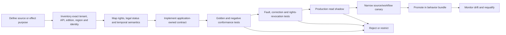

# Adapter Qualification and Provider Playbooks

**Research/access date:** 2026-08-31  
**Scope:** official publication, regulator/docket, licensed research, internal knowledge, policy/control, case/workflow, and notification adapters

## Production decision

Treat every adapter as an evidentiary and authority boundary. A successful HTTP call proves only that one request received one response. Production qualification must establish exact deployment identity, source/legal status, rights, temporal semantics, coverage, correction and deletion behavior, pagination, consistency, cost, effect finality, and reconciliation under faults.

No provider is “the regulatory truth” in the abstract. The source catalog says what each channel and rendition proves in one jurisdiction and workload. An official discovery API can point to a controlling PDF; a licensed research platform can improve retrieval without becoming the controlling source; an internal policy system can own policy state without deciding what law requires.

## Qualification lifecycle



Promotion is per operation. A provider can be approved for metadata discovery but not legal-status claims, approved for citation links but not full-text storage, or approved for internal case creation but not regulator communication.

## Adapter dossier

```yaml
adapter_release: govinfo-fr/5.2
owner: team:us-regulatory-sources
qualified_at: 2026-08-31T10:00:00Z
refresh_due: 2026-11-29
deployment:
  provider: US_GPO_GovInfo
  api_or_protocol: public-api-observed-2026-08-31
  collection: FR
  client: regintel-source-gateway/8.1.0
  endpoint_region_or_tenant: public
authentication:
  workload_principal: service:regintel-us-prod
  method: api_data_gov_key
  permitted: [list_collection_updates, read_package_summary, download_rendition, read_premis_mods]
  prohibited: [comment_submission, external_filing]
source_status:
  assertion_policy: us-federal-register-status/7
  discovery_surface: FederalRegister.gov_API_v1_unofficial
  official_rendition: GovInfo_PDF
  conflict_rule: qualified_owner_policy
identity:
  publisher_item: package_id_and_granule_id
  rendition: package_or_granule_id_format_digest
  acquisition: adapter_release_request_id_observed_at_digest
temporal:
  cursor: collection_last_modified_plus_stable_tiebreaker
  overlap: PT24H
  source_dates: [publication_date, last_modified, ingest_date]
  legal_dates: extracted_separately_with_source_spans
coverage:
  incremental: supported
  full_reconciliation: required_daily
  deletions_or_replacements: explicit_inventory_diff_and_history_check
  pagination: provider_cursor_or_offset_with_duplicate_boundary
rights:
  policy_ref: rights://us-public-regulatory/4
  allowed_operations: [store, parse, quote_with_policy, internal_model_processing]
limits:
  rate_and_payload: measured://adapter/govinfo/5.2
  maximum_pages_bytes_time: policy://source-fetch/us-fr/6
recovery:
  retry_classes: [connect_before_response, provider_5xx, throttle_with_retry_after]
  no_cursor_advance_on: [empty_unexpected, schema_unknown, partial_page, integrity_failure]
  reconcile_by: [package_id, granule_id, publisher_history, digest]
conformance_report: artifact://adapter-tests/govinfo-fr/5.2
known_limitations:
  - provider metadata and machine renditions do not decide organizational applicability
  - API availability and quotas are not legal-publication guarantees
rollback: govinfo-fr/5.1
approvals: [source-owner://us-fr/19, rights://review/88, security://review/310]
```

For continuously delivered SaaS or public APIs without immutable releases, pin the endpoint/OpenAPI digest when available, exact observation date, client release, tenant configuration, contract-test corpus, and observed behavior fingerprint. Never write `latest` where a digest, tag, API version, or dated fingerprint is possible.

## Common acquisition contract

```yaml
acquisition_request:
  request_id: fetch_01K...
  tenant_id: tenant_acme
  jurisdiction_cell: us-federal
  purpose: selected_final_rule_monitoring
  adapter_release: govinfo-fr/5.2
  source_catalog_release: us-sources/11
  source_policy_release: us-fr-status/7
  cursor_or_item_ref: FR-2026-08-28/granule-2026-19001
  rights_decision_id: rights_decision_71
  budgets: {pages: 600, bytes: 100000000, calls: 20, wall_time: PT90S}
  deadline: 2026-08-31T10:02:00Z
```

```yaml
acquisition_receipt:
  request_id: fetch_01K...
  provider_request_ids: [provider_551]
  state: complete       # complete | partial | failed | cancelled | unknown
  publisher_item_id: FR-2026-08-28/granule-2026-19001
  rendition:
    media_type: application/pdf
    official_status_assertion: official_electronic_edition_under_source_policy
    language: en
    bytes_digest: sha256:...
    signature_or_fixity_evidence: artifact://acquisition/fetch_01K/premis
  pagination: {pages_consumed: 3, next_cursor: null, provider_complete: true}
  source_times:
    publisher_publication: 2026-08-28
    provider_last_modified: 2026-08-28T13:04:00Z
    observed_at: 2026-08-31T10:00:03Z
  coverage:
    previous_cursor: cursor_991
    candidate_cursor: cursor_994
    safe_to_advance: true
  artifacts: [artifact://raw/fetch_01K, artifact://metadata/fetch_01K]
  warnings: []
  completed_at: 2026-08-31T10:00:07Z
```

`HTTP 200`, an RSS item, a search hit, or a “current” label is not `complete`. Completion requires expected pages/items/renditions, schema and media validation, stable identity, allowed rights, integrity evidence, and a safe cursor decision. Publisher availability time, provider update time, acquisition time, knowledge time, and legal dates remain separate.

## Official gazette and legislation qualification matrix

These examples establish different mechanics, not a universal authority ranking:

| Representative surface observed on 2026-08-31 | Qualification value | Hard limitation and required test |
|---|---|---|
| EUR-Lex and Cellar REST/SPARQL/RSS/Formex | Official EU metadata/content relationships, CELEX/ELI-style identity, multilingual renditions and change notifications | RSS can be extremely high-volume; consolidated texts have documentary status rather than legal effect; compare Official Journal rendition/status and test correction/multilingual relationships |
| FederalRegister.gov API v1 | Keyless structured discovery, agency/document metadata and links | The site explicitly says it is not the official legal edition; verify controlling GovInfo PDF and never promote API XML/HTML status by domain name |
| GovInfo API, bulk data and permanent package/granule URLs | Official GPO content, package/granule IDs, PDF/XML/HTML plus MODS/PREMIS/fixity metadata | Collection/package/granule and historical-search behavior differ; test updates/replacements, pagination, format parity and full collection reconciliation |
| eCFR API v1 and point-in-time/change pages | Current codification and point-in-time retrieval support | eCFR is an editorial compilation; qualify currency/corrections and link changes back to Federal Register/legal authority rather than treating API output as self-proving |
| Australian Federal Register of Legislation API v1 | Authorized whole-of-government register, OAS 3.0.1, JSON/documents, lifecycle relationships, no API key | Official page says the API is live but may change and availability can degrade under load; pin OpenAPI digest and run schema/load/fallback tests |
| Canada Gazette RSS and publication pages | Separate Part I/II/III discovery feeds and current publication indexes | Official version is bilingual PDF while HTML is unofficial but more up to date; retrieve/compare both, preserve language/rendition status, and reconcile extra editions |

For every official-source adapter test:

- duplicate, missing, reordered and late items at page/cursor boundaries;
- correction, replacement, withdrawal, extra issue, redated item and same-ID changed bytes;
- content/rendition links returning different versions or media than metadata;
- PDF/XML/HTML text, footnote, annex, table, formula, signature and language divergence;
- empty-success response, schema enum drift, redirect/mirror, certificate/signature failure, throttle and outage;
- incremental cursor plus periodic full inventory, overlap and permanent coverage gap;
- “currently known” and historical “as known then” reconstruction after correction.

## Regulator, consultation and docket feeds

Regulator websites mix binding rules, guidance, consultations, FAQs, speeches, enforcement releases, technical standards and notices. The adapter preserves the publisher's exact class/status and an internal normalized class; imperative wording never supplies legal status.

Regulations.gov API v4 is a useful technical example. It exposes documents, comments and dockets, requires an API key, has strict pagination patterns, makes attachments opt-in, permits agency-configurable public comment fields to change, and exposes a POST comment capability with separate activation and terms. This blueprint qualifies GET discovery only. Posting a comment is an external legal/regulatory communication and remains R4/prohibited regardless of API availability.

The qualification corpus includes draft-to-final chains, docket/document ID relations, withdrawn items, missing attachments, 2,500/5,000-plus pagination boundaries, same-timestamp tie handling, configurable fields disappearing, agency-specific document types, and a final rule discovered before its official publication rendition is verified.

## Licensed legal research and intelligence providers

Commercial providers often expose capabilities and terms only to contracted tenants. Do not invent a public API contract. Require the vendor and local account team to complete this matrix with tenant evidence:

| Dimension | Evidence required | Reject or restrict when |
|---|---|---|
| Coverage | Jurisdiction/publisher/document-type/date matrix and explicit exclusions | “Global” or “comprehensive” has no measurable denominator |
| Identity/history | Stable source/item/version IDs, correction/withdrawal history and export | Latest summary overwrites history or ID changes cannot be reconciled |
| Source linkage | Pinpoint link to publisher/controlling rendition and status statement | Provider analysis is presented as controlling text |
| Currency | Measured publisher-to-provider latency by source class and tail behavior | No currentness evidence or corrections are not propagated |
| Rights | Storage, quotation, model, embedding, translation, export, evaluation, retention, deletion and derived-data terms | Required operation is absent, ambiguous or forbidden |
| Entitlement | Tenant/user/matter/content access at query and export time | Results can cross subscriber, tenant, matter or region boundaries |
| Search/retrieval | Query semantics, filters, pagination, truncation, ranking, version/date controls and result caps | Historical/as-of/version-complete retrieval cannot be proven |
| Availability/recovery | Quotas, throttles, outage status, backfill, audit, termination export | Provider outage silently becomes “no relevant change” |
| AI features | Model/provider, data use/retention, citations, feature enablement and human-review boundary | Mutable generated answers are stored as legal evidence or hidden model use violates policy |

Run paired coverage against official sources. A provider may reduce discovery latency or normalize metadata while missing a source class; report those as separate results. On termination, prove export of permitted history and deletion/quarantine of originals, excerpts, embeddings, contexts, eval fixtures, caches and backups.

## Internal legal-research and knowledge systems

SharePoint/OneDrive, Confluence, document-management systems, legal matter systems and enterprise search can hold policies, counsel-approved interpretations, memos and glossaries. They are domain knowledge or professional records, never official law by proximity to lawyers.

Representative current mechanics:

- Microsoft Graph v1.0 drive delta returns paged changes ending in a delta link, can return the same item more than once, exposes latest state rather than every intermediate change, and requires ID-based tracking because path/parent details can be incomplete after renames.
- Confluence Cloud REST API v2 pages expose page ID, status, space, owner/author and version number, with cursor pagination; tenant permissions, page restrictions, deletion/trash, body formats and audit history require local tests.

Normalize `knowledge_item_id`, `system_version`, `valid_from/to`, `recorded_from/to`, `owner`, `review/expiry`, `matter/purpose`, `confidentiality`, `privilege_handling_policy`, `rights`, `source citations`, `supersession`, and `content_digest`. Test permission inheritance changes, renamed/moved items, deleted/restored pages, delta-token expiration/resync, duplicate delta entries, history gaps, export limits, legal hold and a counsel note that conflicts with current official text. The conflict is surfaced to a qualified reviewer, not resolved by freshness or vector score.

## Policy, control and GRC adapters

Keep five identities separate: accepted obligation, internal policy statement, mapped control, implementation/evidence record, and assessment/compliance conclusion. An adapter may propose a mapping or create work; it cannot convert one record into another.

OSCAL is a representative neutral exchange model, not proof of compliance. At research time NIST's reference site labels `v1.2.3` as latest, while the official GitHub releases page showed `v1.2.2` as its latest released asset on 2026-04-30. Treat this as a live publication inconsistency: pin a verified schema/release asset and digest, record the contradiction, and do not claim `1.2.3` production support until the chosen authoritative release process is reconciled. OSCAL model version and document version are different fields.

For vendor GRC systems qualify object type/schema, external ID, revision/concurrency, required fields, status workflow, assignment, attachments/links, field-level permissions, audit history, soft/hard delete, export, rate limits, batch partial success, lookup consistency and sandbox parity. Map only exact approved fields. A remote `created` response proves a work record exists; it does not prove policy adoption, control implementation, effectiveness or compliance.

## Case, issue and workflow adapters

Jira Cloud REST API v3 illustrates mutable destination schemas: create fields depend on project/issue type and permissions, older create-metadata surfaces are deprecated, bulk create can partially succeed, and changelog retrieval is paginated. Discover fields under the production service identity immediately before an effect; never test only as an administrator.

A durable workflow engine must expose definition digest, business key, run ID, state, timer/signal identity, human-task identity, retries and terminal history. Test duplicate start, signal-before-start, timer rebuild, worker crash, cancellation/late success, definition change during a wait, rollback compatibility and a human task reassigned after role revocation. Provider workflow state is a projection; the regulatory ledger remains authoritative for source, decision, obligation, approval and effect identity.

## Notification and handoff effects

Record an intent before any remote write:

```yaml
effect_intent:
  effect_id: effect_01K...
  operation_key: tenant_acme/obligation_17/v3/policy-handoff/controls-emea
  case_id: case_01K...
  state_version: 27
  obligation_version: obligation_17/3
  effect_type: create_internal_review_work
  adapter_release: jira-cloud-v3/6.4
  destination_ref: route://controls-emea/9
  payload_digest: sha256:...
  decision_ref: decision_301
  approval_ref: approval_901
  rights_and_policy_refs: [rights_decision_71, policy_decision_88]
  deadline: 2026-09-02T12:00:00Z
```

Normalize the response as `CONFIRMED`, `DEFINITIVE_FAILURE`, or `UNKNOWN_OUTCOME`. Timeout after upload, asynchronous acceptance without durable remote identity, broken connection after commit, cancellation race, or ambiguous bulk response is `UNKNOWN_OUTCOME`. Reconciliation returns `found_one`, `found_multiple`, `not_found_after_consistency_window`, `still_indeterminate`, or `lookup_unsupported`. Only proven absence under current approval permits a bounded retry. `found_multiple` is an incident.

Representative delivery cautions:

| Provider family | Useful mechanic | Do not overclaim |
|---|---|---|
| Jira/ITSM/GRC | Remote object ID/history and possibly searchable external marker | `201` or task closure is not obligation acceptance or control implementation |
| Slack/chat | Successful post returns channel/message timestamp; membership and rate limits apply | No deduplication, authenticated acknowledgement or durable retention is assumed |
| Microsoft Graph email | `sendMail` returns asynchronous `202 Accepted` | Accepted is not delivered, read, reviewed or acted upon |
| Pager/incident | Dedup keys and incident workflow can route truly urgent operational response | Regulatory importance alone does not justify paging; page only with named immediate action |

Filing, consultation comment submission, regulator contact, public disclosure, legal position, policy approval, control-state mutation, audit finding and attestation remain outside this blueprint even if an adapter exposes the endpoint.

## End-to-end example: final rule and later correction

1. FederalRegister.gov API v1 discovers a selected final-rule item. The adapter stores its unofficial discovery status and stable item metadata; it does not call the web rendition controlling law.
2. GovInfo reconciliation retrieves the official PDF, package/granule metadata and preservation evidence. Full inventory confirms the source partition; the capture and verification watermarks advance independently.
3. Deterministic structure/digest comparison opens one change case. The controller pins source catalog, status policy, parser, temporal, fact and behavior-bundle versions.
4. A bounded model extracts cited actor/action/condition/exception/date candidates. Validators reject uncited fields. A qualified reviewer decides interpretation/applicability against a versioned product/entity fact snapshot.
5. The accepted obligation is handed to a policy-owner Jira project. The ledger commits intent first. A simulated lost response produces `UNKNOWN_OUTCOME`; lookup by operation marker finds exactly one issue before state becomes confirmed.
6. A later official correction changes the source date. It appends a new artifact/temporal fact, reopens dependent decisions, invalidates the old approval, and issues a versioned update only after review. As-known history remains queryable.
7. An internal Confluence memo is marked stale and linked for review; it does not override the official correction. A curated incident episode enters evaluation only after rights and professional review.

## Conformance and failure matrix

| Test | Required evidence | Promotion blocker |
|---|---|---|
| Service-principal rights | Positive/negative source, field, tenant, matter and destination tests | Only admin credentials were tested |
| Source/legal status | Publisher statement, rendition relation and conflict policy | Official-domain URL is used as a Boolean authority claim |
| Incremental plus full reconciliation | Boundary duplicates, overlap, deletion/replacement and complete inventory | Cursor can advance on empty/partial/unknown response |
| Identity/version | Edit, move, copy, correction, same-ID changed bytes and different-ID same bytes | History collapses or identities collide across cell |
| Temporal correctness | All source/legal/knowledge dates and bitemporal as-of fixtures | Request/update time is substituted for legal effect |
| Rights and deletion | Operation matrix, expiry, legal hold, derivative/index/eval/backup traversal | Provider terms or tenant enforcement cannot prove required operation |
| Parsing and evidence | Multi-format/language span parity, negation/table/footnote/annex cases | Derived claim lacks pinpoint source and transformation chain |
| Effect ambiguity | Commit-then-timeout, lookup window, duplicate/conflict and cancellation race | Material effect lacks semantic key or reconciliation path |
| Drift/upgrade/rollback | API/schema/OpenAPI diff, old/new replay, in-flight case/effect fencing | Candidate release reinterprets history or duplicates effects |
| Load/outage | Throttle, backfill, recovery storm, fairness and coverage-watermark behavior | “No results” is emitted while coverage is degraded |

## Qualification exercises and exit evidence

### Exercise 1 — Discovery is not authority

Ingest the same U.S. final-rule item from FederalRegister.gov and GovInfo. Deliberately modify the discovery XML and delay the official PDF.

**Exit evidence:** distinct source/rendition/status identities, no premature official claim, immutable bytes/digests, coverage warning and successful later reconciliation.

### Exercise 2 — Bitemporal correction

Inject a later correction that changes an effective-date expression after a professional decision.

**Exit evidence:** before/after legal-time and knowledge-time queries, appended correction, dependency traversal, invalidated approval, reopened review and preserved historical answer.

### Exercise 3 — Rights expiry

Expire a licensed-provider entitlement while content is present in retrieval, model context, an evaluation fixture and backup.

**Exit evidence:** denied new retrieval, quarantined open work, derivative inventory, deletion/tombstone proof, invalidated evaluation and documented lawful retention/legal-hold exception if any.

### Exercise 4 — Unknown workflow effect

Drop the response after a remote issue is created, then cancel the local case while the provider is slow.

**Exit evidence:** one intent, one remote object, `UNKNOWN_OUTCOME`, fenced cancellation, lookup/reconciliation receipt, no blind retry and owner-visible late outcome.

### Exercise 5 — Recovery load and provider drift

Hold two source partitions for a week, change one provider schema, throttle the destination and release the backlog beside live corrections.

**Exit evidence:** live critical work and reconciliation retain reserved capacity, fairness holds, unsafe cursor remains pinned, expired cases do not flood reviewers, projected drain time stays bounded and the drifted adapter is suspended/rolled back.

## Promotion, demotion and refresh

The release owner approves a dossier only with source/legal owner, content-rights, security/privacy/records, platform/on-call, professional-review and destination-owner evidence applicable to the operation. Machine-enforce every restriction.

Demote or suspend on changed legal-status notice, identifier/version semantics, official rendition, API/OpenAPI/schema, authentication/permissions, licence/terms, model/data processing, pagination, correction behavior, consistency, quota, delivery finality, deletion/export, plan, tenant configuration or region. Requalify after a production incident, missed change, wrong status/date, rights escape, unknown-effect breach or provider contradiction.

Current product/API statements above were accessed on 2026-08-31. Public documentation does not prove availability, completeness, latency, rights, data residency, audit, reconciliation or deletion for a live tenant. Keep the access date, exact source URL or specification digest, observed limitation and refresh owner in the adapter dossier.

## Primary references and recorded contradictions

- [FederalRegister.gov API v1](https://www.federalregister.gov/developers/documentation/api/v1) — structured keyless discovery and explicit unofficial legal-status notice.
- [GovInfo Developer Hub](https://www.govinfo.gov/developers), [API overview](https://www.govinfo.gov/features/api), and [permanent URL structure](https://www.govinfo.gov/help/url-structure) — packages, granules, formats, metadata/fixity and permanent-link mechanics.
- [eCFR API v1](https://www.ecfr.gov/developers/documentation/api/v1) — current API surface; legal/currency status still follows OFR policy and source-specific qualification.
- [EUR-Lex reuse and Cellar access](https://eur-lex.europa.eu/content/help/data-reuse/reuse-contents-eurlex-details.html?locale=en) — REST, SPARQL, RSS and Formex access with source-specific legal-status rules.
- [Australian Register API](https://www.legislation.gov.au/help-and-resources/using-the-legislation-register/data-share-and-reuse) and [v1 Swagger](https://api.prod.legislation.gov.au/swagger/index.html) — authorized register, OAS 3.0.1 and explicit API-change/load caveat.
- [Canada Gazette RSS](https://gazette.gc.ca/rss/sc-rb-eng.html) and [publication-status explanation](https://gazette.gc.ca/cg-gc/lm-sp-eng.html) — part-specific feeds and official bilingual PDF versus unofficial current HTML.
- [Regulations.gov API v4](https://open.gsa.gov/api/regulationsgov/) — document/docket/comment mechanics, data limitations, pagination and external comment capability that this blueprint prohibits.
- [Microsoft Graph drive delta v1.0](https://learn.microsoft.com/en-us/graph/api/driveitem-delta?view=graph-rest-1.0) — paged delta identity and documented duplicate/latest-state limitations.
- [Confluence Cloud REST API v2 pages](https://developer.atlassian.com/cloud/confluence/rest/v2/api-group-page/) and [Jira Cloud REST API v3 issues](https://developer.atlassian.com/cloud/jira/platform/rest/v3/api-group-issues/) — versioned knowledge pages and mutable rights/schema-aware issue effects.
- [Slack `chat.postMessage`](https://api.slack.com/methods/chat.postMessage), [Microsoft Graph `sendMail`](https://learn.microsoft.com/en-us/graph/api/user-sendmail?view=graph-rest-1.0), and [PagerDuty event management](https://support.pagerduty.com/main/docs/event-management) — representative notification acceptance/routing mechanics; none proves human review or regulatory completion.
- [NIST OSCAL reference](https://pages.nist.gov/OSCAL-Reference/models/) and [official releases](https://github.com/usnistgov/OSCAL/releases) — the `1.2.3` reference-versus-`1.2.2` released-asset inconsistency recorded above requires verification before deployment.
- [ABA Formal Opinion 512](https://www.americanbar.org/content/dam/aba/administrative/professional_responsibility/ethics-opinions/aba-formal-opinion-512.pdf) — U.S. professional-responsibility guidance; it is not universal law and local rules/owners control.
