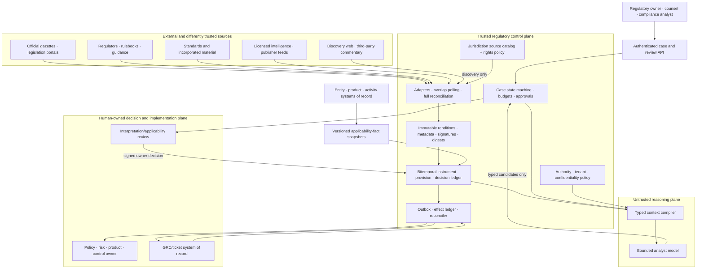

# Regulatory Intelligence Agent Blueprint

> **Status:** Research-backed Pass-1 production blueprint  
> **Last researched:** 2026-08-31  
> **Scope:** Official-source change monitoring; jurisdiction, entity, product, and activity applicability evidence; version and effective-date tracking; provision extraction; obligation candidates; interpretation review; impact analysis; and policy/control-owner handoff  
> **Research packet:** [Regulatory intelligence agent research packet](../../research/packets/regulatory-intelligence-agent-blueprint.md)

## Production position

Build this system as an **evidence-bound regulatory analyst inside a deterministic source, decision, and handoff control plane**. The model may discover candidate changes, extract provision candidates, compare versions, assemble an applicability hypothesis, identify ambiguity, draft an impact analysis, and prepare a handoff. It does not decide what law applies, provide legal advice, approve an interpretation, create organizational policy, implement a control, attest compliance, or communicate a legal position externally.

Legal and compliance professionals retain interpretation, applicability, policy, disclosure, and implementation decisions. Product, entity, data, risk, and control owners retain the facts and actions in their systems of record.

The default architecture is deliberately modest:

- source adapters and a deterministic change detector acquire and fingerprint official or licensed material;
- immutable object storage preserves acquired renditions, signatures, metadata, and source-rights evidence;
- a relational, bitemporal ledger owns instruments, versions, provisions, hypotheses, decisions, obligation candidates, mappings, and handoffs;
- one bounded analyst loop works over typed evidence packets and can only propose records;
- a review service seals decisions by named professional role and version;
- an outbox and narrow adapters hand accepted records to policy, GRC, ticketing, or notification systems with receipts and reconciliation;
- a durable workflow runtime is added only when long review waits, scheduled effective dates, source outages, or reconciliation exceed a normal database-worker lifecycle.

No vector index, graph database, multi-agent team, or universal rule ontology is required for the first production version.

## Category boundary

| This blueprint owns | It consumes but does not own | It must hand off |
|---|---|---|
| Source subscriptions, cursors, acquisitions, fingerprints, and authenticity evidence | Authoritative corporate entities, products, activities, locations, licences, and customer facts | Disputed or missing entity/product facts to their data owners |
| Source-scoped official status, version relationships, effective dates, transitional periods, and corrections | Legal interpretation, risk appetite, policy, controls, implementation evidence, and attestations | Interpretation and applicability questions to qualified legal/compliance owners |
| Extracted provision and obligation candidates with pinpoint provenance | Licensed-content rights and legal-professional confidentiality decisions | Accepted obligations and impact packages to policy/control owners |
| Applicability hypotheses with matched, unmatched, and unknown predicates | Audit testing of implemented controls | Implemented-control assessment to the [compliance audit agent](../compliance-audit-agent/README.md) |
| Impact-analysis cases, review state, correction propagation, and handoff receipts | Legal matters, litigation, investigations, contracts, and negotiated commitments | Matters and negotiated obligations to legal operations |

The system must never turn model confidence into a declaration of applicability. “Likely applicable” is still a hypothesis until an authorized professional decides it against verified organization facts and exact source versions.

## Definition of done

A regulatory change case reaches a terminal state only when one of these durable outcomes exists:

1. **Not relevant for review:** a deterministic subscription or scope rule excluded the item, with rule version and source identity recorded.
2. **Awaiting evidence:** missing source text, official status, effective-date evidence, entity/product facts, translation, or licensed material is named; no applicability result is implied.
3. **Awaiting professional decision:** exact source/provision versions, hypotheses, conflicts, and open interpretation issues are sealed for a named reviewer.
4. **Decided and handed off:** a professional decision created, rejected, or conditioned an organizational obligation; the exact handoff was acknowledged by the policy/control owner.
5. **Superseded or corrected:** a newer official artifact, correction, withdrawal, or owner decision replaced the prior record without erasing its historical basis.
6. **Indeterminate:** source authenticity, temporal state, or external handoff outcome cannot be proven; the case is quarantined for reconciliation.

A fluent summary, a high retrieval score, an extracted “shall,” a current-looking consolidation, or a successful GRC API response is not completion.

## When not to build an agent

Use a deterministic subscription and rule database when the workload is:

```text
known source set
+ stable metadata/feed
+ reviewed keyword, classification, and jurisdiction rules
+ human triage and interpretation
+ ordinary ticket routing
```

That design is easier to audit and should remain the fallback. Add a model-directed loop only when repeated work requires bounded synthesis across heterogeneous formats, amendments, cross-references, multilingual text, applicability facts, and ambiguous mapping—not merely because a chat interface is convenient.

Do not build this agent to replace counsel, sell legal conclusions, auto-approve control mappings, generate compliance attestations, or monitor an undefined “all regulations everywhere” corpus.

## Reference architecture and trust boundaries



At small scale, the API, state machine, ledger, review service, and outbox can be one application with PostgreSQL and an object store. The logical boundaries matter before the service boundaries do.

## Non-negotiable invariants

1. Preserve source text, official-status assertion, extracted provision, applicability hypothesis, interpretation, owner decision, obligation, control mapping, and external effect as separate record types.
2. Every derived claim resolves to immutable source bytes, pinpoint location, source identifier, rendition, acquisition time, digest, parser release, and transformation chain.
3. “Official” is source- and jurisdiction-specific. An official gazette, official consolidation, unofficial editorial consolidation, regulator web page, draft, final rule, and nonbinding guidance never collapse into one status.
4. Publication, adoption, entry into force, applicability, transposition, compliance deadline, transition, amendment, repeal, correction, and organizational awareness are independent temporal facts.
5. Legal valid time and system knowledge time are both queryable. Corrections append and supersede; they do not rewrite history.
6. Applicability is a reviewed decision over versioned organization facts. Model scores can prioritize review but cannot supply missing predicates or authority.
7. Machine translation is an aid to discovery and comprehension unless the publisher explicitly marks that language rendition authentic. It never silently replaces the source-language record.
8. Licensed or incorporated material is ingested, transformed, embedded, exported, and retained only under a machine-enforced rights profile approved by the content-rights owner.
9. An accepted obligation is not an implemented control; a mapped control is not compliance evidence; a handoff receipt is not an attestation.
10. Source outages, unincorporated amendments, unresolved contradictions, unknown dates, and uncertain effects remain visible as `unknown`, never converted to a pass.
11. Every external ticket, notification, or GRC handoff has semantic identity, exact payload digest, authorization, receipt, and an `outcome_unknown` reconciliation path.
12. Untrusted source content cannot alter instructions, source precedence, scope, authority, approval requirements, or tool destinations.

## Representative workflows and authority

| Workflow | Model role | Deterministic/application role | Human accountability |
|---|---|---|---|
| Monitor an official gazette or regulator feed | Classify and summarize a verified delta | Acquire, fingerprint, validate source, deduplicate, and maintain cursor | Regulatory owner approves source catalog and coverage |
| Reconcile a correction or consolidation | Propose affected provisions/cases | Preserve both versions, link supersession, reopen dependants | Legal/regulatory owner decides consequence |
| Extract provision candidates | Identify actor/action/condition/date/exceptions with citations | Validate schema, pinpoint spans, dates, and provenance | Qualified reviewer accepts meaning |
| Assess product/entity applicability | Explain matched, unmatched, and unknown predicates | Load versioned facts and prevent missing-field inference | Legal/compliance professional decides applicability |
| Compare conflicting guidance and rule text | Surface the conflict and request review | Preserve status and source hierarchy configured for that jurisdiction | Qualified owner resolves interpretation |
| Create obligation candidate and map policies | Draft obligation and candidate mappings | Require accepted decision and version bindings | Obligation owner accepts; policy/control owner maps and implements |
| Notify or create GRC work item | Draft exact payload | Commit through outbox, idempotency, approval, and reconciliation | Destination owner accepts work; no compliance status is inferred |
| Answer an as-of question | Retrieve and explain source-scoped evidence | Execute bitemporal query against pinned knowledge time | User receives evidence, not legal advice |

## Architecture and technology decision map

| Decision | Default | Change the default when |
|---|---|---|
| Agent loop | One bounded analyst loop inside a fixed case workflow | Independent review roles improve a measured task and have separate state/authority; do not add conversational agent teams by default |
| Runtime | Existing organization-supported typed service runtime; Python is practical for document/NLP integration | TypeScript fits a web/event platform better, or JVM/.NET is the supported transactional integration standard |
| Persistence | Relational bitemporal ledger plus immutable object storage | Existing records platform proves equivalent temporal, transactional, tenancy, and evidence guarantees |
| Search | Metadata/lexical search plus provision-aware retrieval; optional embeddings as a secondary index | A measured corpus proves graph or vector retrieval adds recall without violating rights or temporal filters |
| Durability | Database worker and outbox first | Reviews, future-effective timers, outage waits, and reconciliation regularly outlive processes or deployments |
| Source acquisition | Official feed/API/bulk path where offered; portal/web adapter with reconciliation otherwise | Licensed provider is contractually permitted and demonstrably improves coverage; it remains a discovery/normalization source unless authoritative |
| Legal representation | Small workload schema aligned where useful with ELI, Akoma Ntoso, LegalRuleML, and provenance concepts | A jurisdiction publishes a stronger native schema; preserve it behind the normalized adapter |
| GRC exchange | Versioned neutral handoff package; optional adapter to existing GRC | OSCAL or a vendor-native object is already governed; export remains a proposal, not an implementation or assessment result |
| Translation | Authentic publisher rendition first; otherwise labeled machine/human aid | Jurisdiction requires qualified translation review or the licence forbids the selected translation process |
| Model routing | Deterministic extraction/diff first; small structured model for routine candidates; capable model for bounded ambiguity | Evaluation shows one route is safer/cheaper or confidentiality forbids an external provider |
| Deployment | One tenant/jurisdiction cell for MVP; partitioned cells for production scale | Volume and data-residency evidence justify regional or jurisdiction-specific deployments earlier |

## Language/runtime selection

| Runtime | Strong fit | Regulatory-specific caution |
|---|---|---|
| Python | PDF/OCR, NLP, data transformation, evaluation notebooks, and legal-research tooling | Keep parsing CPU work bounded; use strict runtime schemas and isolate unmaintained document libraries |
| TypeScript/Node.js | Web adapters, review UI/backend, event integration, and shared API types | Move OCR and CPU-heavy parsing out of the event loop; verify library parity for signed PDFs and office formats |
| JVM or .NET | Enterprise connectors, transactional services, mature identity, and long-lived operations | Legal-NLP examples may be thinner; avoid a second language only for fashionable agent SDKs |

Choose the runtime the operating team can patch, observe, and support. Keep source, state, event, and handoff contracts language-neutral. See the repository’s [runtime-language selection guide](../../languages/choosing-an-agent-runtime-language.md).

## Guide map

| Guide | Decision it owns |
|---|---|
| [Mission, boundaries, authority, and workload fit](01-mission-boundaries-authority-and-workload-fit.md) | Outcome, non-goals, actors, risk, autonomy, and escalation |
| [Reference architecture, sources, tools, and integrations](02-reference-architecture-sources-tools-and-integrations.md) | Custom/framework/hybrid choice; source, document, translation, policy, GRC, and third-party adapters |
| [Source identity, provenance, and change monitoring](03-source-identity-provenance-and-change-monitoring.md) | Source catalog, acquisitions, authenticity, correction/consolidation detection, and source outages |
| [Temporal, version, and applicability semantics](04-temporal-version-and-applicability-semantics.md) | Bitemporal records, effective dates, transitions, facts, hypotheses, and as-of queries |
| [Provision extraction, obligations, impact, and handoff](05-provision-obligation-impact-and-handoff.md) | Evidence ladder, implementable schemas, mapping graph, professional review, and external effects |
| [State, events, context, memory, and orchestration](06-state-events-context-memory-and-orchestration.md) | Lifecycle, continuity, lossy compaction, memory decisions, planning, and idempotency |
| [Security, confidentiality, source rights, and tenancy](07-security-confidentiality-source-rights-and-tenancy.md) | Threats, privileges, licences, isolation, secrets, prompt injection, and retention |
| [Reliability, observability, evaluation, and incidents](08-reliability-observability-evaluation-and-incidents.md) | SLOs, traces, adversarial/fault suites, benchmark leakage, and runbooks |
| [Deployment, scale, resilience, cost, and evolution](09-deployment-scale-cost-and-evolution.md) | Cells, queues, backpressure, recovery load, DR, economics, behavior-bundle releases, and change qualification |
| [Zero-to-production stages and exit gates](10-zero-to-production-stages-and-exit-gates.md) | Stages 0–6 with architecture, authority, I/O, state, effects, approvals, recovery, evaluation, and gates |
| [Adapter qualification and provider playbooks](11-adapter-qualification-and-provider-playbooks.md) | Official publications, regulator/docket feeds, licensed research, knowledge, policy/GRC, workflow, notification, rights, finality, and reconciliation qualification |

## Top stop and escalation conditions

Stop analysis or handoff when:

- the authoritative rendition, source status, source rights, jurisdiction, language authenticity, or version identity is missing;
- a correction, withdrawal, delayed effective date, unincorporated amendment, or contradictory guidance cannot be resolved;
- the requested as-of answer lacks either legal valid time or system knowledge time;
- entity, product, activity, licence, location, threshold, or customer facts are stale or disputed;
- the model would need to infer a legal interpretation, applicability predicate, exception, or deadline not supported by pinpoint text;
- a professional decision has expired, its underlying source/facts changed, or the requested handoff differs from the approved digest;
- content rights do not permit storage, model processing, embedding, quotation, export, or the intended retention;
- an external effect might have committed without a receipt;
- source coverage watermark is behind its objective, tenant/jurisdiction isolation is uncertain, or the evidence ledger cannot be queried;
- a request asks the system to provide legal advice, implement controls, attest compliance, manage litigation/contracts, or replace counsel.

## Stage summary

| Stage | Deliverable | Maximum authority |
|---:|---|---|
| 0 | Deterministic source subscription/rule database and agent-fit proof | Offline/read-only triage |
| 1 | Bounded loop over frozen, licensed fixtures with typed evidence | Candidate extraction only |
| 2 | One jurisdiction, one product/entity scope, one advisory workflow | Draft case and professional-review packet |
| 3 | Durable v1 with corrections, bitemporal state, compaction, and reconciled handoff | Approved internal handoff; no legal decision by model |
| 4 | Production service with identity, tenancy, SLOs, runbooks, release gates, and incident controls | Same human-owned decisions and bounded effects |
| 5 | Isolated cells, admission control, backpressure, DR, and source-resilience | No authority increase |
| 6 | Correction/failure mining and governed model/tool/corpus/rule evolution | Propose system changes; owners approve releases |

The complete stage contract is in [Zero-to-production stages and exit gates](10-zero-to-production-stages-and-exit-gates.md).

## Refresh triggers and limitations

Refresh this area when a monitored portal changes official/legal-status statements, authentication, identifiers, feeds/APIs, consolidation practices, licensing, language policy, or update cadence; when a jurisdiction source catalog or applicability model changes; when ELI, Akoma Ntoso, LegalRuleML, OSCAL, provenance, or telemetry schemas change; and after any missed change, incorrect date/status, source-rights breach, cross-tenant fault, disputed interpretation, or evaluation escape.

This blueprint gives engineering patterns, not legal advice. Cross-jurisdiction examples demonstrate architecture only. Exact source precedence, legal effect, applicability, retention, privilege, licensing, professional qualifications, and review requirements must be established for each deployment by the responsible legal, regulatory, records, privacy, security, and content-rights owners. No source adapter or model can guarantee comprehensive regulatory coverage.

## Canonical repository links

- [Agent state and event contracts](../../runtime/agent-state-and-event-contracts.md)
- [Execution boundaries](../../runtime/execution-boundaries.md)
- [Durable execution](../../runtime/durable-execution.md)
- [Run controls](../../runtime/run-controls.md)
- [Tool contracts](../../tools/tool-contracts.md)
- [Tool results, artifacts, and provenance](../../tools/tool-results-artifacts-and-provenance.md)
- [Context engineering](../../context-memory/context-engineering.md)
- [Memory architecture](../../context-memory/memory-architecture.md)
- [Compaction and continuity](../../context-memory/compaction-and-continuity.md)
- [Agent threat model](../../security/agent-threat-model.md)
- [Prompt injection and untrusted data](../../security/prompt-injection-and-untrusted-data.md)
- [Permissions, sandboxing, and secrets](../../security/permissions-sandboxing-and-secrets.md)
- [Idempotency and side effects](../../reliability/idempotency-and-side-effects.md)
- [Evaluation-driven development](../../evaluation/evaluation-driven-development.md)
- [Trajectory and reliability evaluation](../../evaluation/trajectory-and-reliability-evaluation.md)
- [Observability and tracing](../../evaluation/observability-and-tracing.md)
- [Queues, scheduling, and backpressure](../../operations/queues-scheduling-and-backpressure.md)
- [Scaling, capacity, and SLOs](../../operations/scaling-capacity-and-slos.md)
- [Deployment, release, and incident response](../../operations/deployment-release-and-incident-response.md)
