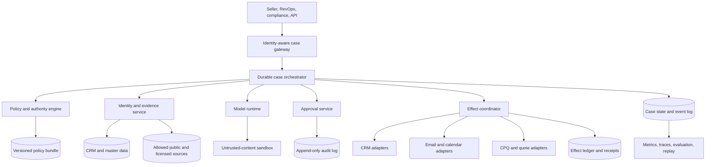
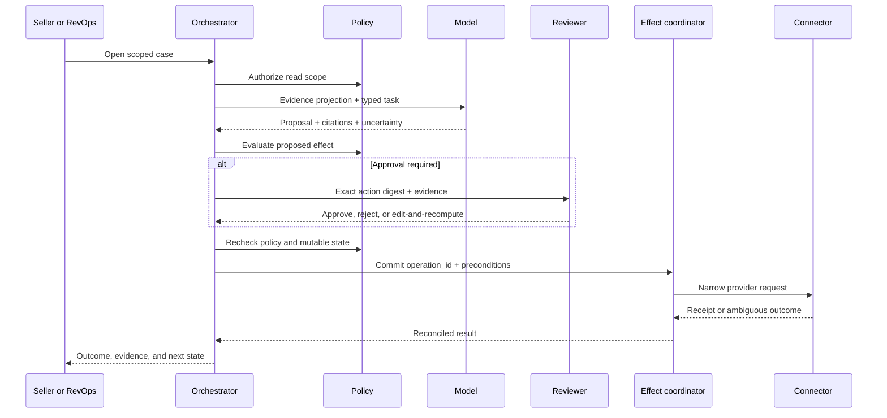

# Operating Model and Architecture

## Production position

The safest useful architecture is not a free-running sales agent. It is a **deterministic revenue workflow with model-assisted research and judgment**. The workflow determines who may act, which records are in scope, which policy applies, when approval is required, and whether an effect is still valid. The model returns typed evidence, uncertainty, and proposals.

This separation prevents a persuasive prompt, stale CRM summary, or injected web page from becoming authorization.

## Choose the operating model deliberately

| Model | What it does | Best fit | Primary limitation |
|---|---|---|---|
| Deterministic RevOps automation | Executes fixed validation, routing, deduplication, scoring, and sync rules | Stable inputs and explainable policy | Cannot synthesize ambiguous research well |
| Advisory copilot | Reads approved context, researches, summarizes, drafts, and recommends | First production release; regulated or high-value sales | Human still executes every material action |
| Supervised agent | Plans multi-step work and pauses at effect-specific approvals | Complex research and individualized preparation | Approval fatigue and stale approvals if poorly designed |
| Constrained hybrid workflow | Durable deterministic outer loop; model autonomy only inside bounded steps | Recommended mature architecture | Requires explicit state and adapter engineering |
| Unconstrained autonomous prospector | Chooses targets, sources, timing, content, and sends | No recommended production use | Couples uncertain identity, law, reputation, and irreversible effects |

Use deterministic automation when a normal rules engine solves the problem. Add a model only where semantic synthesis, natural-language generation, or ambiguity classification creates measurable value.

## Smallest bounded loop

The first useful loop should have no write or communication tools:

1. Accept one authenticated seller, tenant, canonical account/opportunity, purpose, and deadline.
2. Read a purpose- and visibility-filtered CRM projection.
3. Retrieve a capped set of qualified first-party/public evidence.
4. Ask one model call for typed claims, conflicts, missing facts, and a proposed next step with citations.
5. Validate schema, citation reachability, freshness, tenant/record visibility, unsupported assertions, and budget.
6. Return a brief to the seller and store only the case/evidence lineage needed for evaluation.
7. Stop. A follow-up request opens another bounded step; it does not silently unlock CRM writes or outreach.

Baseline this against a deterministic CRM report plus search checklist. Ship the model only if blind review shows better supported decisions or lower handling effort at acceptable latency, cost, privacy, and abstention. A plausible narrative is not enough.

## Define the work as cases, not conversations

The durable unit is an `EngagementCase`, such as “research account A and prepare a first-party product follow-up for contact C under campaign P.” A chat is only one interface into that case.

Each case is scoped by:

- tenant and business unit;
- requesting actor and delegated principal;
- canonical account/contact candidates;
- purpose, campaign, jurisdiction, and channel;
- territory owner and commercial owner;
- policy and connector versions;
- evidence, approval, and effect history;
- stop conditions and expiration.

One case must not silently expand to a new account, recipient, channel, sender, or commercial purpose. Expansion creates a new case or an explicit revised plan.

## Reference architecture



### Plane responsibilities

| Plane | Owns | Must not delegate to the model |
|---|---|---|
| Identity | Canonical IDs, aliases, candidate links, source provenance | Record merging or tenant association from name similarity alone |
| Policy | Jurisdiction/channel eligibility, suppression, field permissions, authority | Interpreting a prompt as legal consent or approval |
| Orchestration | State transitions, deadlines, waits, retries, cancellation | Remembering long-running state only in context |
| Model | Synthesis, extraction, classification, drafting, uncertainty | Credentials, raw side effects, or final commercial authority |
| Effects | Idempotency, preconditions, connector calls, receipts, reconciliation | Treating text such as “sent” as evidence of success |
| Evaluation | Datasets, graders, trace checks, release gates | Using self-reported confidence as the only quality signal |

## Authority levels

Authority is a property of the authenticated principal, policy, tool, arguments, and current state—not of the model or its reasoning.

| Level | Examples | Default control |
|---:|---|---|
| A0 — observe | Search approved sources, read CRM fields | Tenant filter, purpose check, source allowlist |
| A1 — derive | Summaries, match candidates, forecast features, draft copy | Schema validation, provenance, no source-of-truth mutation |
| A2 — reversible internal write | Add note/task, update an allowlisted field | Policy, optimistic concurrency, previous value, receipt |
| A3 — external or ownership effect | Send message, create invite, assign owner, publish forecast | Specific approval or narrow preauthorization; commit-time revalidation |
| A4 — commercial/destructive | Merge/delete records, change price/discount, accept quote, bulk send | Human-owned dedicated workflow with separation of duties |

An approval for A3 or A4 binds this canonical digest:

```yaml
approval_subject:
  tenant_id: ten_42
  actor_id: usr_7
  case_id: case_91
  operation_id: op_018f
  action: email.send
  sender_identity: rep@example.com
  recipients: [person_123]
  content_sha256: 4de1...
  purpose: customer_follow_up
  policy_version: outreach-2026-08-15
  consent_snapshot: cs_844
  suppression_snapshot: ss_219
  crm_revisions:
    contact: "W/\"18273\""
  expires_at: 2026-09-01T09:00:00Z
```

Any material change invalidates the approval. A reviewer never approves an editable draft pointer or a vague statement such as “contact qualified leads.”

## Request lifecycle



## Planning contract

Plans are finite typed objects. They include permitted steps, expected evidence, risk, estimated cost, stop conditions, and the next checkpoint. They cannot invent a tool or widen scope.

```json
{
  "goal": "prepare_account_handoff",
  "case_id": "case_91",
  "steps": [
    {"kind": "read_crm", "risk": "A0", "required": true},
    {"kind": "resolve_entity", "risk": "A1", "on_ambiguity": "review"},
    {"kind": "research_claims", "risk": "A1", "source_policy": "public-business-v3"},
    {"kind": "draft_brief", "risk": "A1"}
  ],
  "stop_if": ["tenant_mismatch", "identity_ambiguous", "policy_denied"],
  "max_model_calls": 4,
  "max_external_queries": 20
}
```

The orchestrator validates the object against a server-owned schema and policy. It should reject extra fields and unknown tool names.

## Provider and runtime selection

Prefer provider-neutral control and a small connector surface. A managed model API may supply structured outputs, typed tools, stored conversation state, or background processing, but provider state is not the authoritative case log. Pin a model snapshot when supported, retain your own request/response metadata, and release model changes only through evaluation.

A durable workflow engine becomes warranted when a case survives process restarts, waits hours or days for approval or replies, and invokes external systems. Temporal, DBOS, and Restate have different programming models; all still require application-level idempotency for external APIs. A database-backed state machine can be simpler for modest scale. Choose by failure semantics and operational competence, not by an “agent framework” feature list.

See [durable execution](../../runtime/durable-execution.md) and [execution boundaries](../../runtime/execution-boundaries.md).

## Architecture decision tests

Before adding any autonomous capability, answer:

- Can deterministic automation solve it with less risk and cost?
- What exact source of truth owns each input and output?
- What happens if the model is wrong but syntactically valid?
- What mutable fact can change between plan, approval, and commit?
- Can the external effect be deduplicated or reconciled?
- Who can stop the workflow, revoke authority, and investigate it?
- Which invariant is proven by a test rather than a prompt?
- Is the incremental business value large enough to justify the new effect class?

## Domain handoff contract

When work crosses category boundaries, send a typed request and wait for a typed receipt. Do not lend the sales agent's credentials or reinterpret another domain's decision.

```yaml
handoff:
  id: handoff_44
  from: sales_revenue_operations
  to: customer_support
  tenant_id: ten_42
  subject_refs: [account:acct_781, contact:person_123]
  requested_capability: resolve_authenticated_billing_case
  purpose: customer_requested_support
  evidence_refs: [mail:msg_82]
  forbidden_effects: [sales_outreach, opportunity_stage_change]
  expires_at: 2026-09-01T12:00:00Z
```

Marketing lead handoff, customer-support case referral, executive approval, analytics request, and back-office exception each need separate schemas and ownership. A handoff receipt can be `accepted`, `rejected`, `duplicate`, `out_of_scope`, or `completed` with authoritative references; silence is not acceptance.

## Sources

- [OpenAI Responses API: structured outputs, tools, state, and background options](https://developers.openai.com/api/reference/cli/resources/responses/methods/create)
- [OpenAI model guidance: evaluation, snapshots, tools, and compaction](https://developers.openai.com/api/docs/guides/latest-model?model=gpt-5.5)
- [Temporal durable execution](https://docs.temporal.io/)
- [DBOS durable workflow tutorial](https://docs.dbos.dev/typescript/tutorials/workflow-tutorial)
- [Restate service and workflow semantics](https://docs.restate.dev/foundations/services)
- [NIST AI Risk Management Framework](https://www.nist.gov/itl/ai-risk-management-framework)
