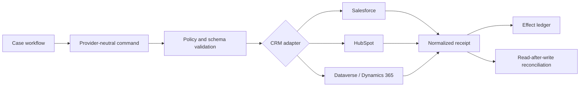
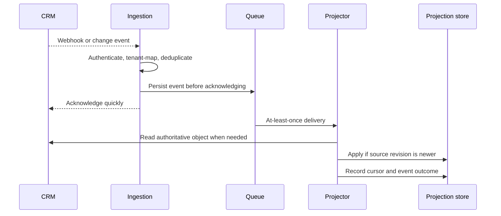
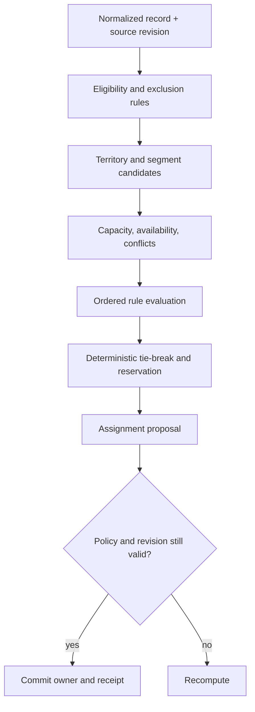
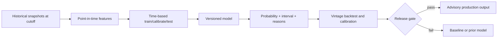

# CRM, Pipeline, Routing, Forecasting, and Quotes

## Treat the CRM as a governed system of record

The agent is a client of the CRM, not a replacement for its validation, sharing, assignment, forecast, and commercial rules. A normalized internal model is useful, but every adapter must preserve provider-native IDs, revisions, associations, permissions, and error details.

Do not build one vague `update_crm` tool. Separate reads from narrowly scoped effects such as:

- `crm.contact.read_projection`;
- `crm.note.create`;
- `crm.contact.patch_allowlisted_fields`;
- `crm.owner_assignment.propose`;
- `crm.owner_assignment.commit`;
- `crm.forecast_assistance.publish`;
- `cpq.quote.create_draft`.

Each effect has its own policy, preconditions, idempotency behavior, and approval class.

## Connector boundary



Normalize business intent, not away provider semantics. For example, Salesforce conditional requests have resource-specific constraints; Microsoft Dataverse supports `If-Match` and alternate keys; HubSpot has dated API versions and provider-specific associations and pipeline stage IDs. Capability-test each connector and fail closed when a required precondition is unavailable.

Treat source authority as a field-level contract:

| Fact | Authoritative source | Derived evidence that must stay separate |
|---|---|---|
| Current account/contact/opportunity identity and associations | Configured CRM/master-data record plus current revision | Enrichment or model match candidate |
| Opportunity stage, amount and close date | Current CRM record and accepted user/system audit | Transcript inference or warehouse feature |
| Seller/manager forecast judgment | CRM forecast category/override record | Stage probability or model probability |
| Contactability | Consent/suppression policy decision at commit | CRM “marketable” flag or vendor enrichment |
| Price, product, discount and term | CPQ/catalog/pricing system at current revision | Draft line item or language-model suggestion |
| Message/calendar outcome | Mail/calendar provider receipt and reconciliation read | Model narration or local timeout status |
| Historical forecast features | Versioned point-in-time warehouse snapshot/query receipt | Current mutable CRM row |

If sources conflict, preserve both observations and route the conflict to the owning rule or person. “Newest timestamp wins” is unsafe when systems use different clocks, meanings, or authority.

## Change ingestion and convergence

Webhooks and change feeds are invalidation hints. They may be retried, delayed, delivered out of order, or retained for a limited period. They do not replace authoritative reads.



Salesforce stores platform and change-data-capture events for 72 hours and warns that replay IDs are opaque and not guaranteed beyond retention. HubSpot documents webhook retries for failed delivery. Therefore:

- persist ingestion before acknowledgment;
- deduplicate by tenant, subscription, object/event identity, and revision where available;
- handle tombstones and out-of-order changes;
- detect cursor gaps and run a bounded reconciliation scan;
- maintain provider rate budgets and backpressure;
- periodically compare projections with authoritative CRM data.

## Safe CRM writes

Every patch records:

```yaml
crm_patch:
  operation_id: op_018f
  tenant_id: ten_42
  provider: salesforce
  object: Contact
  provider_record_id: 003xx000...
  expected_revision: "2026-08-31T10:21:55.000Z"
  changes:
    - field: LeadSourceDetail__c
      previous: null
      proposed: Conference booth scan
      evidence_claim_ids: [clm_811]
  field_policy_version: crm-contact-writes-12
  actor_id: usr_7
```

Use a field allowlist and omit unchanged fields. Re-read before commit when the provider cannot enforce the expected revision. A conflict returns `precondition_failed`; it does not let the model choose which user's data wins. Field-level merge rules may safely combine additive tags or notes, but ownership, consent, stage, amount, and close date normally require current-state review.

For bulk operations, store per-record results. Never report a batch as successful because the transport request succeeded. Salesforce Composite can couple subrequests and optionally roll them back; use its dependency semantics deliberately. For large Salesforce sets, evaluate Bulk API 2.0 rather than pushing thousands of synchronous calls, and re-check current limits for the target org.

## Pipeline model

Represent provider stages as configured identifiers with historical versions. Labels such as “Proposal” are display text, not stable semantics. Keep separate fields for:

- pipeline and stage ID;
- stage entered time and age;
- amount, currency, and amount provenance;
- expected and contract close dates;
- seller-owned forecast category;
- manager override and timestamp;
- model-derived win probability and version;
- next step, last meaningful activity, risks, and evidence;
- data-quality flags.

Record every stage transition with previous/new configured stage IDs, pipeline ID and version, source revision, effective/observed times, actor or automation, reason/evidence, and ingestion time. A stage label is presentation. A transcript phrase, model score, or warehouse row can propose a transition but cannot manufacture the accepted CRM transition event.

HubSpot requires a deal-stage probability value in its pipeline configuration; Dynamics opportunity scoring is trained from historical won/lost outcomes; Salesforce forecast categories can be configured by the organization. Do not treat any of these as a universal probability definition.

## Lead and account routing

Routing is a deterministic allocation problem. The model may normalize free-text industry, region, or product interest into reviewable features, but the rule engine decides ownership.



The routing decision record should include input facts, source revisions, rule-set version, candidates considered, exclusions, tie-breaker, capacity snapshot, reservation expiry, result, and override reason. Evaluate ordered rules once, use an explicit catch-all, and make repeated evaluation idempotent. Both Salesforce and Dynamics describe ordered assignment rules where the first matching rule wins; the local implementation must reflect the configured system rather than infer it.

Concurrency matters. Reserve capacity and assignment atomically or use a serialized partition by territory/account. Re-read ownership before commit. A duplicate or late event must not transfer an account back to a previous owner.

## Forecast assistance, not forecast authority

Keep three concepts separate:

1. **Stage probability:** administrator-configured mapping for a stage.
2. **Calibrated model probability:** prediction from a versioned dataset and model.
3. **Human forecast judgment:** seller category and manager override.

The agent can explain discrepancies, highlight stale evidence, and propose an assistance value. It must not overwrite seller or manager judgment silently.

### Leakage-safe training and backtesting

- Reconstruct opportunity features as they were known at the forecast cutoff.
- Split by time and account; avoid letting later snapshots of the same opportunity enter training.
- Exclude post-outcome fields, retrospective notes, and automation artifacts caused by the target.
- Evaluate by forecast vintage, segment, region, product, deal size, and sales motion.
- Compare with simple baselines: stage probability, historical cohort rate, and seller category.
- Measure Brier score, calibration error/plots, discrimination, forecast bias, and aggregate amount error.
- Monitor population drift and missingness, not only win/loss accuracy.



Do not optimize only for opportunity-level accuracy. Revenue planning needs calibrated aggregate estimates; sales management needs understandable changes; affected sellers need a correction and override path.

The forecast artifact should include `opportunity_id`, forecast vintage/cutoff, point-in-time feature-set/query receipt, model and calibration version, probability and interval, baseline values, explanation codes, missingness, cohort, expiry, and publication operation ID. Publish it to a distinct advisory field or derived table. Never backfill an earlier forecast vintage from a later corrected CRM row, and never let a reverse-ETL job overwrite seller stage or manager judgment.

## Quote and discount preparation

The agent may turn approved deal context into a **draft quote request**. Product, price, currency, tax, discount eligibility, term, billing frequency, and contract template come from CPQ/catalog systems.

Safe lifecycle:

1. Resolve customer and opportunity IDs.
2. Read active catalog, price list, entitlement, and commercial rules.
3. Produce typed line items and cite deal evidence.
4. Create a draft with an operation ID.
5. Reprice and revalidate immediately before approval/finalization.
6. Route discounts, nonstandard terms, and margin exceptions to named approvers.
7. Finalize through the commercial system; store its receipt and immutable snapshot.

Stripe quotes illustrate the useful state distinction: draft, open/finalized, and accepted/canceled have different editability. Stripe prices also preserve price history by creating a new price rather than mutating the unit amount. Dynamics similarly calculates quote lines from product and price-list configuration. The production design should preserve equivalent commercial provenance even when using another CPQ.

The model cannot invent a SKU, change a unit amount, waive a term, or represent that a customer accepted. If pricing changed since approval, invalidate the approval and show the delta.

## Operational checks

- API version and deprecation monitor per connector.
- Schema/capability probe in continuous integration and production health checks.
- Read and write rate-budget dashboards by tenant and endpoint.
- Dead-letter queue with replay authorization, not a blind retry button.
- Projection lag, cursor age, reconciliation drift, and conflict metrics.
- Owner churn and route override analysis.
- Forecast calibration and bias by cohort.
- Quote stale-price and approval-invalidation rates.

See [integration qualification, conversations, and warehouse projections](10-integration-qualification-conversations-and-warehouse-projections.md) for provider-by-provider admission and point-in-time query contracts.

## Sources

- [Salesforce REST API Developer Guide](https://resources.docs.salesforce.com/latest/latest/en-us/sfdc/pdf/api_rest.pdf)
- [Salesforce Composite requests](https://developer.salesforce.com/docs/atlas.en-us.api_rest.meta/api_rest/resources_composite_composite_post.htm)
- [Salesforce event-message durability](https://developer.salesforce.com/docs/platform/pub-sub-api/guide/event-message-durability.html)
- [Salesforce API limits and monitoring](https://developer.salesforce.com/blogs/2024/11/api-limits-and-monitoring-your-api-usage)
- [Salesforce assignment rules](https://help.salesforce.com/s/articleView?id=sf.creating_assignment_rules.htm&language=en_US&type=5)
- [Salesforce forecast report semantics](https://help.salesforce.com/s/articleView?id=forecasts3_reports_crt_understand.htm&language=en_US&type=0)
- [HubSpot latest API reference and versioning](https://developers.hubspot.com/docs/reference/api/overview?Tag=Reports)
- [HubSpot CRM object model](https://developers.hubspot.com/docs/api-reference/latest/crm/understanding-the-crm)
- [HubSpot pipeline API guide](https://developers.hubspot.com/docs/api-reference/latest/crm/pipelines/guide)
- [HubSpot API usage guidance](https://developers.hubspot.com/docs/developer-tooling/platform/usage-guidelines)
- [Microsoft Dataverse optimistic concurrency](https://learn.microsoft.com/en-us/power-apps/developer/data-platform/webapi/compose-http-requests-handle-errors)
- [Dynamics 365 assignment rules](https://learn.microsoft.com/en-us/dynamics365/sales/wa-create-and-activate-assignment-rule)
- [Dynamics 365 predictive opportunity scoring](https://learn.microsoft.com/en-us/dynamics365/sales/configure-predictive-opportunity-scoring)
- [Dynamics 365 price calculation](https://learn.microsoft.com/en-us/dynamics365/sales/price-calculation-opportunity-quote-order-invoice-records)
- [Stripe Quotes lifecycle](https://docs.stripe.com/quotes)
- [Stripe products and prices](https://docs.stripe.com/products-prices/how-products-and-prices-work?locale=en-GB)
