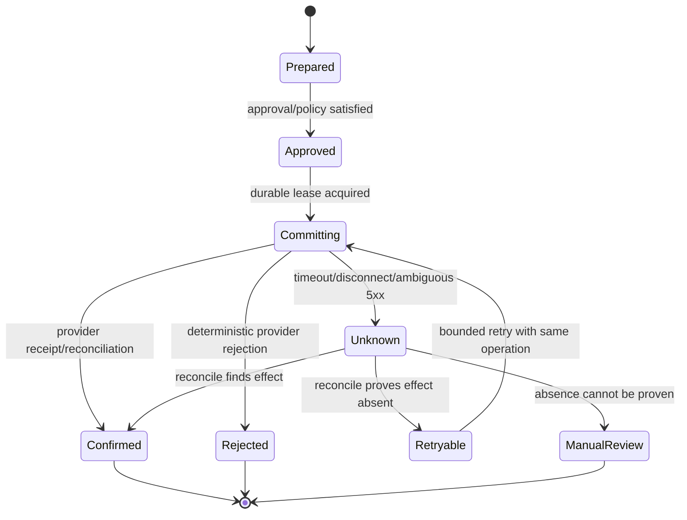

# Tool, Effect, Approval, and Reconciliation Contracts

## Tools are authority boundaries

A tool schema is not only a convenience for the model. It is an authorization and recovery contract. The server derives tenant, principal, allowed fields, provider connection, and policy from authenticated case state. The model supplies only task-relevant arguments.

Split tools by effect class:

| Class | Examples | Retry semantics | Approval default |
|---|---|---|---|
| Pure/derived | Normalize address, score candidate, render draft | Safe with version-pinned inputs | None |
| Read | CRM projection, evidence lookup, catalog read | Usually retryable with bounded backoff | None after scope authorization |
| Reversible internal write | Note, task, allowlisted field patch | Idempotency + revision precondition | Policy or lightweight approval |
| External effect | Message send, invite creation, ownership transfer | Explicit operation ID + reconciliation | Specific approval/preauthorization |
| High impact | Merge/delete, bulk activation, discount exception, quote acceptance | Dedicated workflow; often non-retryable automatically | Separation of duties |

Do not expose provider-generic HTTP, arbitrary SQL, browser automation, or a mailbox-wide search-and-send primitive to the model.

Read tools also require contracts. A `transcript.read` result carries recording-consent reference, participants/speaker confidence, time-coded utterances, source revision and retention expiry; a `warehouse.forecast_features.read` result carries named-query version, tenant/territory policy, as-of cutoff, source watermarks, job ID, row/byte count and expiry. Neither result may widen the case or become source-of-truth CRM state merely because it is read-only.

Every tool version declares input/output schema, effect class, server-derived fields, authorization predicate, source role, timeout and budgets, retry/ambiguity behavior, sensitivity, audit fields, and compatible adapter capabilities. Reject tool calls when the installed adapter declaration is missing, stale, or weaker than the tool contract. See [integration qualification](10-integration-qualification-conversations-and-warehouse-projections.md).

## Effect envelope

Every state-changing adapter accepts a server-created envelope:

```json
{
  "operation_id": "op_018f",
  "case_id": "case_91",
  "tenant_id": "ten_42",
  "principal_id": "usr_7",
  "action": "crm.contact.patch",
  "resource": {"provider": "salesforce", "id": "003xx"},
  "arguments": {"fields": {"LeadSourceDetail__c": "Conference booth scan"}},
  "preconditions": {
    "source_revision": "2026-08-31T10:21:55.000Z",
    "policy_version": "crm-contact-writes-12",
    "approval_digest": "sha256:4de1...",
    "approval_expires_at": "2026-09-01T09:00:00Z"
  },
  "reason": {"claim_ids": ["clm_811"], "plan_step_id": "step_4"},
  "requested_at": "2026-08-31T12:00:00Z"
}
```

The adapter rejects unknown fields and actions, resolves credentials internally, verifies scope and preconditions, and returns a normalized receipt. Never let the model choose `tenant_id`, OAuth token, callback URL, or policy version.

## Effect ledger

Persist intent before invoking the provider. A useful lifecycle is:



Minimum columns include `tenant_id`, `operation_id`, action, canonical request digest, resource, provider idempotency key, approval reference, attempt count, lease owner/expiry, state, provider identifiers, raw response reference, reconciliation result, created/updated timestamps, and trace ID. Enforce a unique constraint on `(tenant_id, operation_id)` and reject reuse with different arguments.

Exactly-once external effects are rarely available end to end. The practical target is **effectively once** through stable intent, provider idempotency where available, optimistic concurrency, read-after-ambiguous reconciliation, and visible manual resolution.

## Commit algorithm

```text
prepare(operation):
  validate schema and server-derived scope
  persist operation_id + canonical digest if absent
  reject operation_id reuse with a different digest

commit(operation_id):
  acquire a short durable lease
  re-read approval, policy, suppression, source revision, and expiry
  if any precondition changed: mark rejected and return structured conflict
  invoke narrow provider adapter using the same idempotency identity
  persist receipt before advancing the case
  if outcome is ambiguous: mark unknown and reconcile before any retry
```

Do not hold a database transaction open across the network call. The ledger and provider effect cannot generally be one atomic transaction; reconciliation closes that gap.

## Idempotency patterns by effect

### CRM create or update

- Prefer a provider-supported external ID or idempotency key for creates.
- Use conditional mutation when the exact resource supports it.
- If preconditions are not supported, read immediately before and after the patch and compare provider revisions.
- Patch fields, not whole records; record previous values.
- For additive notes/tasks, embed or associate the operation ID so reconciliation can search for it.

Salesforce external-ID upsert can be useful but nonunique matches can return multiple choices; conditional behavior varies by resource. Dataverse supports `If-Match` and alternate keys with documented constraints. Capability-test rather than generalize.

### Email send

Many mail APIs do not guarantee application-level idempotency for send. A robust pattern is:

1. Create a provider draft from immutable approved content.
2. Store the provider draft ID, message digest, intended recipients, and operation ID.
3. Send that exact draft once.
4. Store provider message/thread IDs and submission receipt.
5. On timeout, query the provider or sent mailbox using provider IDs and bounded time/recipient/digest evidence.
6. Retry only if absence is established. Otherwise require manual resolution.

An RFC `Message-ID` is useful for correlation but is not universal server-side deduplication. Never send a newly regenerated draft after an ambiguous outcome.

### Calendar event

Use a client-selected event ID or provider transaction identifier where supported. Store organizer, calendar, attendees, time range, and provider ID. On ambiguity, query the exact calendar and identifier before retrying. Google Calendar supports client-chosen event IDs for duplicate prevention; Microsoft Graph provides `transactionId` for retry reduction.

### Quote draft

Use a stable external/reference ID, catalog revision, and line-item digest. Reconcile by reference ID. Finalization is a distinct high-impact operation and must not share the draft's approval.

## Optimistic concurrency and stale approval

Use provider revisions such as ETags or modified timestamps only where the endpoint documents their semantics. If a contact changes between approval and commit, return a structured conflict:

```json
{
  "type": "https://errors.example.test/precondition-failed",
  "title": "CRM record changed after approval",
  "status": 409,
  "operation_id": "op_018f",
  "changed": ["email", "owner_id"],
  "expected_revision": "W/\"18\"",
  "actual_revision": "W/\"21\"",
  "next_action": "replan_and_reapprove"
}
```

RFC 9457 problem details are a useful base for machine-readable errors. Do not return a prose blob that the model must guess how to recover from.

## Retry policy

Classify outcomes, not just status codes:

| Outcome | Example | Response |
|---|---|---|
| Invalid | Schema, unknown field, policy denial | Do not retry; return reason |
| Conflict | Source revision or approval changed | Re-read, replan, and possibly reapprove |
| Rate limited | Provider 429 with retry hint | Queue with jitter and provider/tenant budget |
| Transient and effect proven absent | Connection refused before request was accepted | Bounded retry with same operation identity |
| Ambiguous | Timeout after request body or provider 5xx | Reconcile first |
| Permanent provider rejection | Permission, mailbox disabled, invalid recipient | Stop; alert/correct input |
| Security signal | Tenant mismatch, scope escalation, forged webhook | Deny, preserve evidence, page security |

RFC 9110 defines which HTTP methods are idempotent and cautions against automatically retrying non-idempotent requests unless the client knows repetition is safe. A POST endpoint does not become safe merely because the client library retries it.

Honor provider `Retry-After` semantics and distinguish seconds from milliseconds. Apply exponential backoff with jitter, a total deadline, attempt limit, circuit breaker, and per-tenant fairness. A dead-letter item keeps its original operation identity and approval state.

## Approval UX

Show the reviewer:

- effect and impact class;
- exact sender, recipients, resource, fields, or line items;
- previous and proposed values;
- rendered content and attachments;
- evidence citations and uncertainty;
- consent/suppression/policy summary;
- relevant differences from the previous approved version;
- expiry and what changes will invalidate approval.

“Edit and send” should create a new canonical digest and approval record. Prevent self-approval for high-impact operations. Escalation should name a role and deadline, not route to a generic inbox indefinitely.

## Webhook authenticity and deduplication

Verify signatures against the raw request bytes, timestamp/nonce windows, subscription and tenant mapping, and current/rotating secrets. Persist a delivery identity before acknowledgment. Do not let event payload fields choose the tenant or connector. Process at least once and make state transitions idempotent.

The inbox record should distinguish delivery ID, business event ID, object revision, and provider cursor. One business change can legitimately produce several delivery attempts or event types.

## Reconciliation jobs

Run three layers:

- **Immediate:** after a successful or ambiguous commit, confirm provider state.
- **Periodic:** compare recent ledger effects and source projections with provider state.
- **Gap recovery:** after cursor expiry, connector outage, or data incident, perform scoped authoritative scans.

Reconciliation may confirm, prove absent, find a conflicting effect, or remain unknown. It must never manufacture a successful receipt to clear a queue.

For each action, write the authoritative reconciliation query before enabling the effect. Examples are provider message/draft lookup with bounded correlation, event lookup by stable client ID, CRM read by resource plus expected field/revision, quote lookup by external reference and line digest, and warehouse statement/query history by request or job ID. If the provider cannot prove presence or absence safely, cap authority at draft/proposal or require manual execution.

## Sources

- [RFC 9110: HTTP semantics and idempotent methods](https://datatracker.ietf.org/doc/html/rfc9110)
- [RFC 9457: problem details for HTTP APIs](https://datatracker.ietf.org/doc/html/rfc9457)
- [Stripe API idempotent requests](https://docs.stripe.com/api/idempotent_requests)
- [DBOS external-step retry semantics](https://docs.dbos.dev/golang/tutorials/step-tutorial)
- [Salesforce REST API conditional requests](https://resources.docs.salesforce.com/latest/latest/en-us/sfdc/pdf/api_rest.pdf)
- [Microsoft Dataverse HTTP requests and concurrency](https://learn.microsoft.com/en-us/power-apps/developer/data-platform/webapi/compose-http-requests-handle-errors)
- [HubSpot error and webhook-retry behavior](https://developers.hubspot.com/docs/api-reference/error-handling)
- [Google Calendar event creation](https://developers.google.com/workspace/calendar/api/guides/create-events)
- [Microsoft Graph create event](https://learn.microsoft.com/en-us/graph/api/user-post-events?view=graph-rest-1.0)
