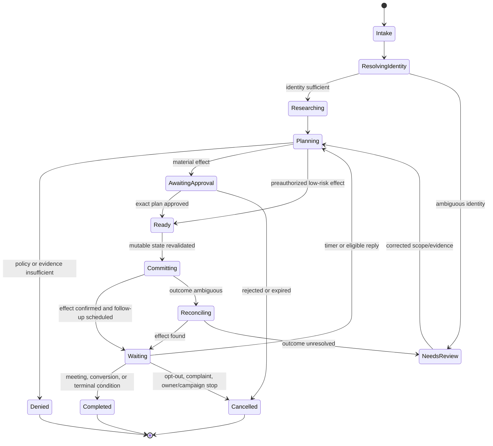
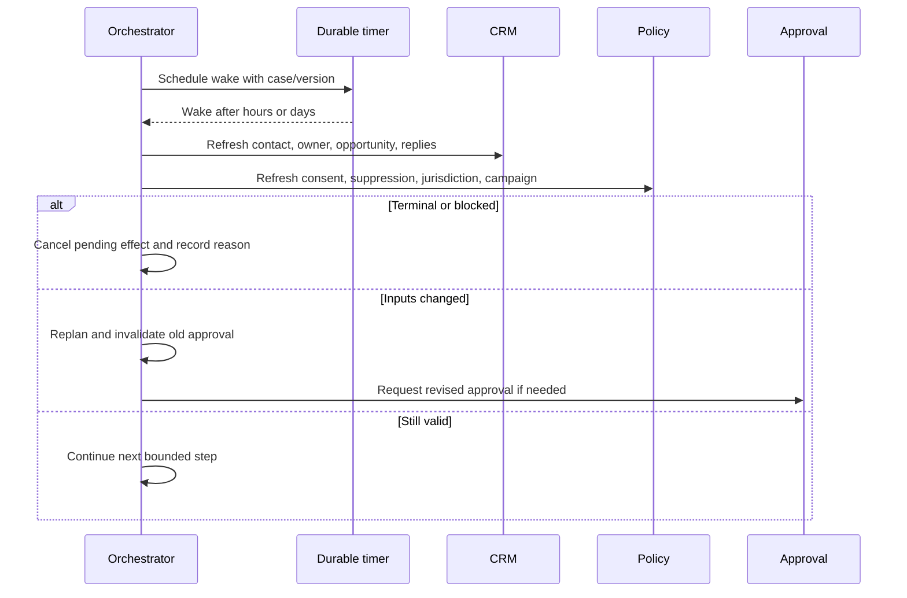

# State, Context, Planning, and Durable Work

## State is not model memory

Revenue work lasts longer than a model call. Approvals wait overnight, contacts reply days later, ownership changes, opportunity stages advance, and consent can be withdrawn at any moment. Persist authoritative case state in a database or durable workflow runtime. Reconstruct a minimal context projection for each model call.

Provider conversation state or model compaction can reduce token usage, but it does not replace business state, audit history, or policy checks.

## Case state model

```yaml
engagement_case:
  case_id: case_91
  tenant_id: ten_42
  business_unit: enterprise_eu
  purpose: customer_follow_up
  status: awaiting_approval
  subject:
    account_id: acct_781
    contact_id: person_123
    opportunity_id: opp_92
  ownership:
    crm_owner_id: usr_7
    territory_rule_version: routing-31
  campaign_id: cmp_55
  policy_version: outreach-2026-08-15
  source_revisions:
    contact: "W/\"18273\""
    opportunity: "W/\"811\""
  evidence_set_id: evs_18
  consent_snapshot_id: cs_844
  suppression_snapshot_id: ss_219
  current_plan_version: 6
  pending_operation_id: op_018f
  next_wake_at: null
  expires_at: 2026-09-30T00:00:00Z
```

Do not embed whole source documents, mailbox bodies, or credentials in this record. Reference access-controlled evidence objects.

## State machine



Every transition records previous/new state, event ID, actor, reason, policy/plan versions, trace ID, and timestamp. Enforce transitions with compare-and-swap or serialized execution per case.

## Event contract

Events should be immutable facts, not commands disguised as facts:

```json
{
  "specversion": "1.0",
  "type": "com.example.revops.outreach.opted_out.v1",
  "source": "gmail-connector/tenant-42",
  "id": "evt_018f",
  "time": "2026-08-31T12:04:13Z",
  "subject": "person/person_123",
  "datacontenttype": "application/json",
  "data": {
    "case_id": "case_91",
    "channel": "email",
    "destination_hash": "hmac:v2:...",
    "provider_message_id": "msg_82",
    "reason": "recipient_reply"
  }
}
```

CloudEvents provides a useful envelope, but version the domain event type and schema yourself. Separate provider-delivery metadata from the domain fact. Sensitive bodies remain in a controlled evidence store.

See [agent state and event contracts](../../runtime/agent-state-and-event-contracts.md).

## Context projection

For each model call, build a purpose-specific projection with:

- task and allowed output schema;
- tenant and case identifiers as non-editable metadata;
- current plan step and remaining budgets;
- only the CRM fields needed for this step;
- selected claims with citations, freshness, and sensitivity labels;
- policy decisions and constraints as data, not editable instructions;
- prior decisions and corrections relevant to the task;
- explicit unknowns, conflicts, and prohibited assumptions.

Do not retrieve broad “similar sales conversations” across tenants. Retrieval filters are enforced before ranking. A summarized claim retains provenance, observation date, and expiry.

Compile a context manifest before each call and keep it with the trace. This makes omission and overexposure testable:

```yaml
context_manifest:
  case_id: case_91
  task: draft_meeting_handoff
  plan_version: 6
  projection_schema: meeting-handoff-context-v4
  source_revisions:
    account: "W/\"72\""
    opportunity: "W/\"811\""
  included:
    claim_ids: [clm_8, clm_11]
    receipt_ids: [rcpt_17]
    policy_decision_ids: [pd_24]
  excluded_classes: [credential, unrelated_mail, raw_recording, other_tenant]
  unresolved: [budget_owner]
  budgets:
    remaining_tool_calls: 3
    remaining_tokens: 9000
  compiled_at: 2026-08-31T12:00:00Z
```

The compiler applies tenant, territory, record-visibility, field, purpose, sensitivity, freshness, and token-budget filters before ranking. The model may ask for a named missing field; it cannot widen those filters.

## Memory classes

| Memory class | Authority and allowed contents | Write/promotion rule | Invalidation and retention |
|---|---|---|---|
| Turn/scratch memory | Non-authoritative compiled task, constraints, selected claims and receipts | Rebuilt by the context compiler; never written back as fact | Destroy after the call except redacted trace references |
| Working/run memory | Typed open questions, candidate matches, completed plan steps, budgets | Workflow writes schema-valid items; model output remains a proposal | Case expiry, replan, source revision, or correction |
| Session memory | Convenience summary across adjacent user/model turns | Derived from case events with a compaction receipt | Short TTL; invalidate on actor, purpose, or scope change |
| Durable workflow/case memory | Authoritative status, plan version, timers, approvals, operations and reconciliation state | Only state-machine transitions and effect receipts | Case/audit policy; never replaced by a summary |
| Business-source projection | Cached CRM, consent, CPQ, mail/calendar or warehouse facts with native IDs/revisions | Connector/projector only | Provider revision, webhook/change event, TTL, rights request |
| Evidence memory | Attributed claims, utterances and artifacts with provenance, rights, sensitivity and expiry | Qualified acquisition/extraction path; acceptance does not make it CRM truth | Claim expiry, source correction, license/rights change, deletion |
| Domain knowledge memory | Versioned territory rules, catalogs, playbooks, schemas and policy references | Named domain owner through normal change control | Superseded version remains auditable; active projection refreshes |
| Long-term/preference memory | Narrow user/team presentation preference, never authority or personal profiling | Explicit user/admin setting or reviewed correction | Change, role/tenant move, inactivity TTL, deletion request |
| Episodic/outcome memory | Reviewed failure/success pattern represented as an eval fixture or runbook case | Offline curator promotes minimized evidence; never automatic trace ingestion | Dataset governance, consent/rights, expiry, incident correction |
| Generated long-term memory | Disabled by default | Enable only for a named store, schema, promotion review, measured benefit and deletion path | TTL, source invalidation and rollback must be proven before use |
| Provider hidden/context state | Non-authoritative continuity aid | Provider-managed under configured storage/retention | Provider/session policy; never required to recover the case |

Never store a model inference as a CRM fact without a visible field type, provenance, and write policy. Corrections should update the authoritative claim or record and invalidate dependent projections. Long-term and episodic stores must carry tenant, subject, purpose, source, sensitivity, consent/rights status, promoter, created/expiry time, and deletion lineage. Similarity alone never authorizes retrieval.

Compaction must emit a versioned receipt containing its source event/evidence range, retained case/plan/operation IDs, unresolved identity conflicts, consent and suppression constraints, pending approvals/effects, omissions, model/prompt version, and digest. Repeated-compaction tests must show that recipients, purpose, jurisdiction, opt-outs, commercial constraints, and ambiguous outcomes cannot disappear. Durable records and raw authorized evidence remain separately recoverable; a compacted summary is never a new CRM fact.

Treat a compaction receipt as a dependency manifest:

```yaml
compaction_receipt:
  case_id: case_91
  input_event_range: [evt_101, evt_188]
  input_context_digest: sha256:...
  retained:
    identity_conflicts: [match_14]
    suppression_snapshot: ss_219
    pending_approval: appr_44
    unknown_effect: op_018f
    open_questions: [budget_owner]
  omitted:
    - class: raw_call_transcript
      recoverable_ref: evidence/call_77
  compiler_version: revenue-context-v8
  summary_digest: sha256:...
  created_at: 2026-08-31T12:02:00Z
```

On rehydration, refresh every mutable business-source projection rather than trusting the retained wording. If any referenced approval, suppression snapshot, identity match, quote price, stage, owner, or operation is missing or stale, stop at review/replanning.

## Finite planning and budgets

The orchestrator, not the model, enforces:

- maximum model/tool calls;
- external query and licensed-enrichment budgets;
- per-source and provider rate budgets;
- deadline and maximum workflow age;
- maximum outreach sequence length;
- permitted tool and effect classes;
- approval and escalation checkpoints;
- terminal and cancellation conditions.

Plans can branch only on enumerated outcomes. Replanning increments `plan_version`, explains the trigger, preserves completed evidence/effects, and cannot reuse an approval if its digest changed.

## Timers and follow-up

Store an absolute wake time, timezone, schedule policy, original intent, and invalidation set. A timer firing means “re-evaluate,” not “send.”



Cancel timers or make their handlers no-op after terminal state. A late wake event must not reopen a suppressed or completed case.

## Concurrency

The same account can be affected by a seller action, webhook, scheduled follow-up, routing job, and sync process concurrently. Use:

- a serialized workflow or row-level compare-and-swap per case;
- version checks for shared CRM resources;
- unique operation IDs for effects;
- an inbox table for event deduplication;
- explicit conflict outcomes instead of last-writer-wins;
- short leases with fencing tokens for workers;
- reservations for capacity or ownership allocation.

Do not use a distributed lock as the only correctness mechanism. Workers can pause, locks can expire, and provider state can change outside the system.

## Recovery semantics

| Crash point | Durable evidence | Recovery |
|---|---|---|
| Before plan persisted | Intake event only | Recreate plan |
| After plan, before approval | Plan version and digest | Resume approval wait |
| After approval, before provider call | Approval and prepared effect | Revalidate, then commit |
| During provider call | `committing` effect record | Reconcile; do not blind retry |
| After provider effect, before receipt persisted | Operation ID/provider correlation | Reconcile authoritative provider |
| After receipt, before next state | Confirmed ledger receipt | Apply idempotent transition |
| While waiting for reply | Timer, cursor, case version | Rehydrate and refresh mutable state |

Durable workflow products can replay code or steps; keep model calls and provider effects in activities/steps with recorded results. Version workflow definitions so old cases can finish safely after deployments.

## Data minimization and deletion

Retention differs by object: effect/audit records may need long retention, while web extracts and model transcripts may not. Store references and redacted summaries where possible. Propagate access, correction, deletion, and legal-hold decisions across CRM projections, evidence objects, caches, evaluation datasets, and provider-stored model state. Suppression records may require a narrowly retained blocker so deletion does not cause future re-contact; legal owners must define the form and basis.

## Sources

- [CloudEvents specification](https://github.com/cloudevents/spec)
- [W3C Trace Context](https://www.w3.org/TR/trace-context/)
- [Temporal documentation](https://docs.temporal.io/)
- [DBOS workflow semantics](https://docs.dbos.dev/typescript/tutorials/workflow-tutorial)
- [Restate services and durable workflows](https://docs.restate.dev/foundations/services)
- [OpenAI Responses API state and background options](https://developers.openai.com/api/reference/cli/resources/responses/methods/create)
- [Salesforce event-message durability](https://developer.salesforce.com/docs/platform/pub-sub-api/guide/event-message-durability.html)
