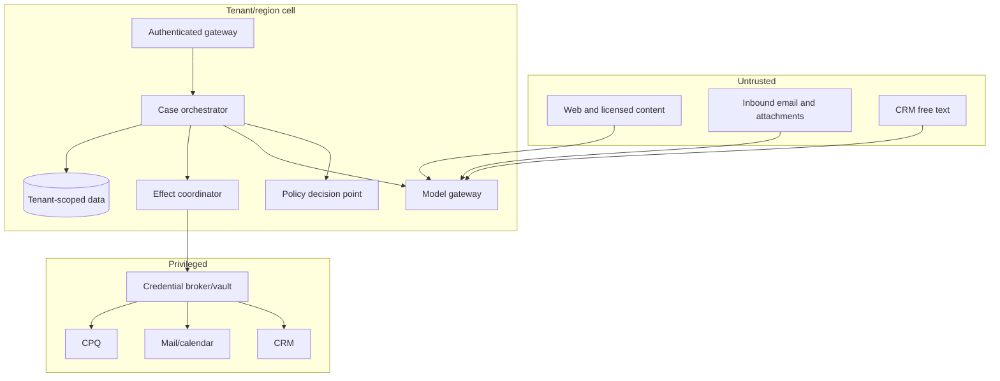

# Security, Privacy, Tenancy, and Governance

## Threat model

The agent handles commercially sensitive pipeline data, personal data, mailbox and calendar content, licensed enrichment, and credentials capable of external communication. Its inputs include attacker-controlled web pages, emails, attachments, meeting descriptions, and CRM notes. Its mistakes can become durable CRM mutations or public communication.

Assume an attacker may try to:

- place instructions in a source that cause data exfiltration or tool use;
- exploit overbroad OAuth grants or a shared service account;
- cross tenant, business-unit, or territory boundaries through retrieval/cache mistakes;
- poison entity links, consent evidence, summaries, or long-term memory;
- replay an approval against different content or recipients;
- forge or replay webhooks;
- induce duplicate sends through timeouts;
- infer sensitive personal traits or expose them in personalization;
- abuse bulk export, merge, delete, quote, or discount capabilities;
- hide activity in unredacted prompts, logs, traces, or evaluation datasets.

The control plane must remain secure even when model output is adversarial but schema-valid.

## Trust boundaries

Untrusted-content workers have read-only source access and no effect credentials. The model gateway cannot reach the vault. The effect coordinator accepts only server-validated envelopes and obtains short-lived credentials for a named tenant, connection, principal, resource, and action.

## Identity and authorization

Keep these identities distinct:

- authenticated user requesting the work;
- delegated seller/mailbox/calendar principal;
- application/service workload;
- tenant and business unit;
- CRM owner and record-sharing context;
- reviewer/approver;
- model and worker instance.

Authorize at case creation, every read, plan approval, and effect commit. A successful OAuth exchange proves a grant, not that every returned CRM record or mail operation is appropriate for the current purpose.

Follow OAuth 2.0 Security Best Current Practice: exact redirect matching, PKCE for authorization-code flows, issuer validation in multi-issuer deployments, secure refresh-token handling, and asymmetric client authentication where feasible. Prefer short-lived, audience/resource-bound tokens and the narrowest provider scopes. Store refresh tokens in a managed secret store, rotate connector credentials, and revoke them on tenant disconnect or incident.

Never put access or refresh tokens, cookies, API keys, client secrets, or signed URLs into prompts, tool arguments visible to the model, traces, or approval screens.

Choose delegation deliberately:

| Mode | Appropriate use | Primary risk and required control |
|---|---|---|
| Per-user delegated OAuth | Seller-facing reads and actions that should inherit user visibility | Token theft and stale grants; bind subject/tenant/connection, use narrow scopes, revoke on role change |
| Tenant workload identity | Background sync, reconciliation, policy or narrowly bounded system tasks | Often sees more than a seller; enforce application row/field/purpose policy and prohibit user-impersonating effects |
| Just-in-time delegated effect token | High-impact commit after exact approval | Broker must bind token audience, action, resource, actor, expiry and operation ID |
| Shared admin/service credential | Only when the provider offers no safer mode | Maximum blast radius; isolate by tenant/capability, vault, monitor, rotate and plan replacement |

Provider authorization and application authorization are both required. In Salesforce, Dataverse, and other CRMs, object permission does not imply access to every record or field; automation may run in another security context. Test the effective principal against negative records and fields in every target tenant. Never retrieve broadly with an admin connector and rely on the model to hide unauthorized rows.

## Tenant and territory isolation

Enforce tenant scope before retrieval, joins, vector search, cache lookup, and adapter invocation. Every durable row, object key, queue message, trace, and effect identity includes tenant context. Defense in depth includes:

- database row-level or physical partitioning appropriate to risk;
- per-tenant encryption context and object-store prefixes;
- connector IDs that map server-side to one tenant;
- scoped cache keys and negative tests for cross-tenant collisions;
- tenant-aware queue partitions and worker assertions;
- export and bulk-operation controls;
- region/data-residency routing;
- no use of model-generated tenant identifiers.

Territory and business-unit restrictions are separate from tenant isolation. A seller in the same tenant may still be unable to see or contact another region's accounts. Apply source-system record sharing and application policy; do not replicate broad admin visibility into the agent.

## Prompt injection and tool abuse

Treat all retrieved text as quoted data. Defenses are layered:

1. Isolate acquisition/extraction from privileged effects.
2. Label origin, sensitivity, and trust; preserve those labels through summaries.
3. Use allowlisted typed tools whose authorization is independent of text.
4. Apply server-side egress, tenant, field, and action policy.
5. Require effect-specific approval and commit-time validation.
6. Detect unusual requests and tool sequences, but do not rely on detection alone.
7. Red-team direct, indirect, multilingual, encoded, and multimodal injections.

An instruction found in a webpage or email cannot change the system prompt, authorize a new source, widen a query, reveal another record, or approve an effect. Escaping or delimiting content helps the model interpret it but is not a security boundary.

## Data classification and minimization

Classify at least:

| Class | Examples | Default handling |
|---|---|---|
| Public business | Published company facts | Source rights, provenance, freshness |
| Internal commercial | Pipeline, pricing, account plans | Tenant/territory controls; no external disclosure |
| Personal contact | Name, work email, interaction history | Purpose limitation, retention, rights handling |
| Sensitive personal | Health, protected traits, private messages | Exclude unless an approved use case strictly requires it |
| Credential/secret | OAuth token, cookie, API key | Vault only; never model-visible |
| Legal/contractual | Quotes, terms, DPA constraints | Need-to-know, immutable versions, approval |

Do not infer protected or sensitive traits for prospecting. Avoid importing personal social content simply because it is public. A field's availability in an enrichment product does not establish necessity, accuracy, or a lawful/contractual right to use it.

### Recorded conversations and employee data

Call/meeting audio, video, transcripts, speaker identities, sentiment, coaching signals, and action-item summaries need a separate data-flow and purpose review. Outreach permission does not establish permission to record, transcribe, analyze, retain, or reuse a conversation. Preserve participant/location evidence and the applicable notice or consent record before acquisition; support refusal and deletion; and keep employee-performance or coaching data outside prospecting and employment decisions unless an independently approved policy permits the exact use.

Treat transcript text as untrusted evidence. Keep raw media out of standard prompts and traces, expose only necessary time-coded utterances, label speaker/diarization uncertainty, and never promote an extracted promise, objection, sensitive fact, or next step into CRM truth without the owning validation. Provider retention, storage, customer-managed-key/lockbox support, licensing, and regional behavior can differ from the main CRM and must be qualified separately.

## Privacy engineering

Map every data flow to purpose, data categories, source, controller/processor role, legal basis where applicable, notice, recipients, retention, residency, and rights workflow. GDPR principles such as minimization, accuracy, storage limitation, transparency for indirectly collected data, and the right to object to direct marketing have direct system consequences.

Build rights operations that locate and act on:

- canonical records and aliases;
- source records and evidence objects;
- CRM projections and connector copies;
- model transcripts/provider-stored state;
- search/vector indexes and caches;
- evaluation datasets and analyst exports;
- suppression and consent ledgers;
- audit data under retention or legal hold.

Deletion is not an instruction to remove the suppression blocker and then reacquire the address. Legal/compliance owners must define how to retain the minimum blocker and explain it in the data inventory.

NIST Privacy Framework 1.0 is the current final baseline at this research date; version 1.1 was still under development. Do not label draft guidance as a final standard.

## Webhook, connector, and supply-chain controls

- Verify webhook signatures over raw bytes, timestamp tolerance, nonce/delivery ID, endpoint audience, and tenant/subscription mapping.
- Use outbound allowlists and TLS; reject provider callback URLs from model output.
- Pin and scan dependencies; inventory model, connector, enrichment, and workflow vendors.
- Test connector permission downgrades and tenant revocation.
- Validate uploaded file type by content, scan malware, cap decompression and parsing resources, and render risky formats in isolation.
- Record API and model version, adapter build, policy bundle, and schema in every trace.
- Review vendors for training/retention defaults, subprocessors, data residency, incident terms, and deletion support.

## Audit without creating a second data leak

An audit trail needs actor, case, decision, policy, evidence references, tool/effect digest, approval, source revisions, provider receipt, result, and timestamps. It usually does not need full message bodies or documents in every log line.

Use structured redaction at ingestion, tokenization/HMAC for searchable destinations, encrypted controlled evidence storage, access logging, integrity controls, and retention tiers. OpenTelemetry's GenAI conventions are evolving and warn that several prompt/output attributes may contain sensitive data; opt in deliberately rather than exporting content by default.

## Governance roles

| Role | Owns |
|---|---|
| Revenue operations | CRM semantics, routing, data-quality rules, process outcomes |
| Sales leadership | Acceptable sales motion, ownership, forecast use, override process |
| Legal/privacy/compliance | Jurisdiction policy, basis/notice, consent, suppression, retention |
| Security | Threat model, connector identity, isolation, incident response |
| Deliverability/marketing operations | Sender domains, authentication, reputation, campaign budgets |
| Commercial/finance | Catalog, pricing, discount, quote and term authority |
| Model/system engineering | Runtime, tools, evaluations, observability, release |
| Independent reviewer/audit | Control evidence and high-impact approval sampling |

No single role should author policy, approve a high-impact exception, deploy it, and attest that it worked.

## Security release gates

- Cross-tenant and cross-territory access tests have zero unauthorized disclosures.
- Direct and indirect prompt injection cannot cross the typed tool and policy boundary.
- Tokens and secrets are absent from model-visible context and telemetry samples.
- Webhook forgery/replay tests are rejected and audited.
- Approval replay with changed content, recipients, price, or resource fails.
- Bulk export/send/merge/delete paths require separately authorized workflows.
- Data-subject access/deletion/correction and suppression preservation are exercised end to end.
- Connector revocation stops new work and quarantines queued effects.
- An outbound kill switch works without deploying code.
- A broad service principal cannot expose a record or field the requesting seller and purpose are not allowed to use.
- Recording/transcript tests cover notice/consent, refusal, speaker error, deletion, retention expiry, purpose restriction, and prompt injection.

## Sources

- [RFC 9700: OAuth 2.0 Security Best Current Practice](https://datatracker.ietf.org/doc/html/rfc9700)
- [RFC 9449: Demonstrating Proof of Possession](https://datatracker.ietf.org/doc/html/rfc9449)
- [OWASP AI Agent Security Cheat Sheet](https://cheatsheetseries.owasp.org/cheatsheets/AI_Agent_Security_Cheat_Sheet.html)
- [OWASP LLM Prompt Injection Prevention Cheat Sheet](https://cheatsheetseries.owasp.org/cheatsheets/LLM_Prompt_Injection_Prevention_Cheat_Sheet.html)
- [NIST AI RMF Generative AI Profile](https://nvlpubs.nist.gov/nistpubs/ai/NIST.AI.600-1.pdf)
- [NIST Privacy Framework](https://www.nist.gov/privacy-framework)
- [NIST Privacy Framework 1.1 project status](https://www.nist.gov/privacy-framework/new-projects/privacy-framework-version-11)
- [EUR-Lex: General Data Protection Regulation](https://eur-lex.europa.eu/eli/reg/2016/679/oj/eng/)
- [ICO guidance for users of data brokers](https://ico.org.uk/for-organisations/direct-marketing-and-privacy-and-electronic-communications/organisations-using-marketing-services-of-data-brokers/)
- [OpenTelemetry GenAI attribute registry](https://opentelemetry.io/docs/specs/semconv/registry/attributes/gen-ai/)
