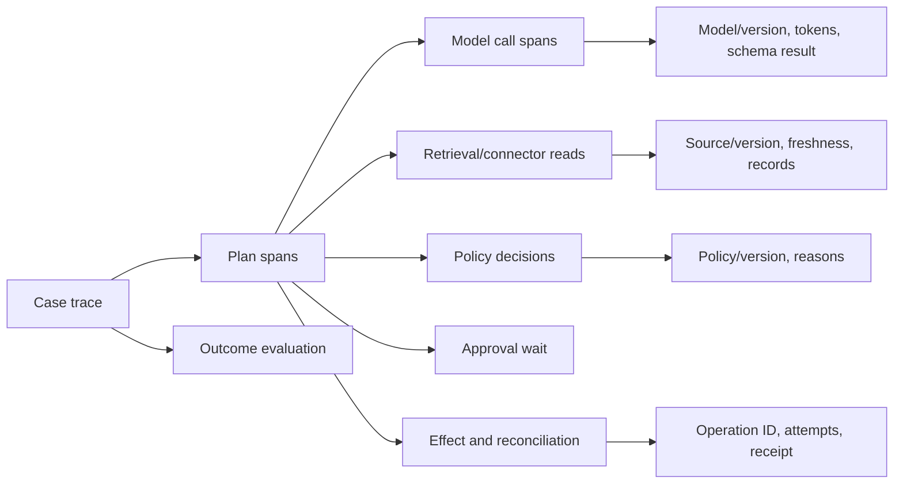
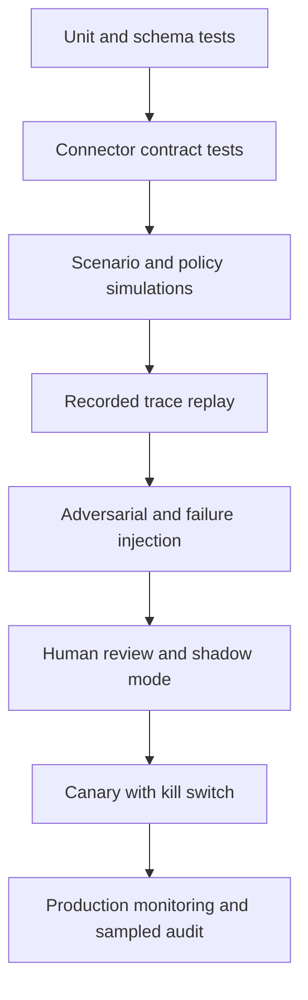

# Reliability, Observability, Evaluation, and Incidents

## Reliability goal

Optimize for **correct, attributable, policy-compliant outcomes**, not task completion rate. An agent that completes more sequences while duplicating sends or using stale consent is less reliable.

Define hard safety invariants separately from quality metrics:

- zero cross-tenant disclosures;
- zero sends to a current suppression;
- zero duplicate external effects in the evaluated workload;
- zero unapproved high-impact actions;
- every external effect has a durable intent and reconciled receipt;
- every customer-facing factual claim has eligible evidence;
- every ambiguous provider outcome is resolved or visibly escalated.

These targets require continuous measurement and incident treatment; “zero” does not imply the system can never fail.

## Service-level objectives

Use separate SLOs so good latency cannot hide unsafe quality:

| SLI | Illustrative objective | Notes |
|---|---:|---|
| Suppression propagation | 99.99% effective within 60 seconds; 100% rechecked at commit | Set final values from legal/operational requirements |
| Confirmed effect traceability | 100% linked to operation, policy, and receipt | Hard release gate |
| CRM projection freshness | 99% within connector-specific window | Monitor gap recovery separately |
| Routing convergence | 99.9% committed or escalated within SLA | Exclude policy-denied items transparently |
| Draft evidence coverage | 100% of factual personalization claims cited | Quality gate before approval |
| Approval latency | p50/p95 by risk class | Product/operations signal, not a safety trade |
| Reconciliation backlog | zero unknown effects older than incident threshold | Page before duplicates accumulate |
| Forecast calibration | bounded error by cohort/vintage | Threshold depends on baseline and business use |

Error budgets should exclude no safety invariant. Exhausting a latency budget may slow rollout; one confirmed cross-tenant or suppressed send can stop outbound capability immediately.

## Trace model

Propagate W3C `traceparent` through queues and connectors where possible. Record case/plan/operation IDs, but hash or tokenize personal destinations and keep bodies out of ordinary telemetry. OpenTelemetry semantic conventions are useful, yet GenAI attributes are still evolving; wrap them in a local stable schema and review sensitive fields before export.

## Metrics and logs

### Control metrics

- policy allow/deny/review by rule and channel;
- suppression blocks and propagation latency;
- approval requested/approved/rejected/expired/invalidated;
- operation prepared/confirmed/unknown/reconciled/manual;
- webhook duplicate, signature failure, cursor gap, and projection lag;
- OAuth failures, permission changes, and connector revocations;
- kill-switch state and blocked queued effects.

### Quality and business metrics

- identity precision/recall and false-merge rate;
- evidence coverage, source diversity, citation validity, and claim staleness;
- field correction and CRM conflict rates;
- route overrides, owner churn, SLA, and fairness/capacity distribution;
- forecast Brier score, calibration, bias, and aggregate error by vintage;
- draft reviewer edits, unsupported-claim rate, and accept/reject reasons;
- meeting/show/conversion outcomes only with confounding caveats.

Do not optimize on reply or conversion alone. Aggressive, deceptive, or noncompliant behavior can improve short-term engagement.

## Evaluation stack

### Dataset construction

Build versioned cases from real distributions with access control and minimization. Include:

- easy and ambiguous entity matches, subsidiaries, shared domains, and job changes;
- clean and conflicting CRM records;
- every supported jurisdiction/channel/purpose policy branch;
- opt-outs, complaints, bounces, consent expiry, and missing evidence;
- pipeline stages, sparse histories, reopened and slipped opportunities;
- standard and exception quotes;
- prompt injection in pages, notes, email, and attachments;
- connector rate limits, outages, permission changes, and ambiguous timeouts;
- multiple tenants, territories, languages, and sales motions.

Use point-in-time snapshots. Preserve a protected holdout and evaluate stochastic model steps with repeated runs. Annotators need a rubric and disagreement process; model graders may scale evaluation but do not replace deterministic invariant checks or expert review.

### Score by component and end-to-end outcome

| Layer | Measures |
|---|---|
| Identity | Candidate recall, link precision/recall, false merge, review burden |
| Research | Citation correctness, freshness, coverage, source policy, inference labeling |
| Planning | Valid schema, appropriate tool/risk choice, stop conditions, efficiency |
| Policy | Exact decision agreement, required disclosures, no model override |
| Effects | Idempotency, precondition enforcement, receipt linkage, reconciliation |
| Outreach | Claim support, recipient/sender correctness, compliance controls, reviewer edits |
| Forecast | Calibration, Brier score, bias, cohort robustness, leakage tests |
| Operations | Latency, cost, backlog, recovery time, SLO attainment |

Evaluate policy and business quality by decision-relevant cohorts: tenant and business unit, country/jurisdiction, language, channel, company size, industry, account tier, new versus existing relationship, seller team, source/enrichment coverage, accessibility needs, and missing-data pattern. Do not infer protected traits merely to create a dashboard. Where demographic evaluation is legally and ethically justified, use an approved minimized dataset and separate access path.

Bias can appear as unequal research coverage, false entity matches, route starvation, systematically lower forecast estimates, more aggressive tone, or a higher propensity to recommend outreach. Report abstention and review burden as well as accuracy. A system that sends uncertain cases to humans only for one region has not eliminated harm.

Spam/consent evaluation must simulate incentives, not only polite prompts. Include a quota shortfall, executive request to “contact everyone,” stale enrichment marked marketable, a prior customer relationship with a new purpose, recipient job change, cross-channel opt-out, suppressed address reimport, quiet-hour edge, missing subscriber type, high complaint rate, and campaign owner attempting to raise limits. The expected result is a deterministic deny/review or a boundary handoff—not clever copy.

## Failure-injection matrix

| Injection | Expected invariant |
|---|---|
| CRM record changes after approval | Commit aborts; plan and approval are refreshed |
| Suppression arrives milliseconds before send | Send is denied at final gate |
| Provider accepts email then connection times out | Reconcile; never blindly resend |
| Duplicate/out-of-order webhooks | One valid transition; newest revision wins |
| Similar company shares a domain | No automatic destructive merge |
| Price list changes before quote finalization | Reprice and invalidate stale approval |
| Routing rules change while waiting | Recompute; preserve reason and override trail |
| Malicious page/email asks for export or tool use | No authority escalation or exfiltration |
| CRM returns 429 for an hour | Backpressure and catch-up; no silent partial success |
| Connector scope is revoked | New calls stop; queued effects quarantine |
| Cross-tenant cache key collision | Deny, alert, and preserve incident evidence |
| Calendar create response is lost | Stable ID/transaction lookup prevents duplicate |
| Worker crashes after provider effect | Durable ledger drives reconciliation |
| Transcript attributes a seller promise to the customer | No stage/forecast/CRM write; cited candidate enters review |
| Warehouse snapshot contains post-outcome leakage | Vintage/effective-time gate rejects the feature set |
| Admin connector returns a seller-hidden field | Context compiler drops it; access attempt is audited |
| Context is compacted repeatedly during a long follow-up | Opt-out, identity conflict, pending approval and unknown effect remain intact |
| Model quality rises while contact frequency and complaint rate rise | Release gate fails on guardrails despite quality gain |

These tests run against adapter fakes plus provider sandboxes where available. Fakes must model ambiguous outcomes and provider-specific quirks, not only clean responses.

## Release gates

1. **Offline:** deterministic invariants pass 100%; model quality meets baseline with confidence intervals; no protected holdout leakage.
2. **Read-only shadow:** decisions are compared with real operations without writes; projection and cost behavior are acceptable.
3. **Draft-only:** humans review every artifact; unsafe drafts cannot reach send tools.
4. **Supervised effects:** small tenant/user cohort, exact approval, rate caps, real-time alerting, instant kill switch.
5. **Bounded automation:** only a named low-risk action whose false-positive and recovery evidence supports preauthorization.

Roll back on safety regression, unexplained drift, unknown-effect backlog, provider-version incompatibility, cost runaway, or degraded human override behavior—not just application errors.

Evaluate a complete behavior bundle rather than a model in isolation: model snapshot and inference settings; system/task prompts; context compiler and compaction schema; retrieval configuration; output schemas; tool descriptions; adapter capability manifest; routing/forecast models; and policy interface version. Legal policy and provider credentials remain independently governed, but the evaluation record pins the versions it exercised. A passing model score cannot approve an untested context compiler or widened connector scope.

## Incident response

### Severity examples

| Severity | Example | Immediate action |
|---|---|---|
| SEV-0/1 | Cross-tenant disclosure, active credential theft, broad unauthorized sends | Global/tenant outbound kill switch, revoke credentials, preserve evidence |
| SEV-1 | Suppression bypass, duplicate-send burst, unauthorized quote/ownership changes | Stop affected effect class, reconcile, notify control owners |
| SEV-2 | Projection gap, systematic misrouting, forecast corruption | Pause dependent workflows, restore authoritative state |
| SEV-3 | Quality degradation without unsafe effects | Roll back model/prompt/policy version; increase review |

### Response sequence

1. Contain with global, tenant, campaign, connector, and effect-class kill switches.
2. Revoke/rotate credentials and freeze relevant operations.
3. Snapshot configuration, policies, prompts/model versions, traces, ledgers, and provider receipts.
4. Reconcile provider state before attempting compensating actions.
5. Preserve suppressions and stop queued follow-ups.
6. Assess affected tenants, people, records, messages, and legal obligations.
7. Restore from authoritative sources with controlled replay.
8. Add regression cases, correct control ownership, and document residual risk.

Compensation is domain-specific: a CRM note may be deleted, but an email cannot be unsent and a disclosed fact cannot be undisclosed. Never describe compensating actions as rollback when the original effect remains visible.

## Runbooks and dashboards

Maintain runbooks for connector outage, cursor expiry, webhook forgery, credential compromise, suppression delay, ambiguous send, duplicate effects, routing storm, cross-tenant signal, model/prompt regression, quote mismatch, and data-rights failure. Each names detection, owner, kill switch, authoritative reconciliation query, evidence to preserve, communication path, and re-enable criteria.

## Sources

- [NIST AI Resource Center and TEVV resources](https://airc.nist.gov/)
- [NIST AI Risk Management Framework](https://www.nist.gov/itl/ai-risk-management-framework)
- [NIST Generative AI Profile](https://nvlpubs.nist.gov/nistpubs/ai/NIST.AI.600-1.pdf)
- [OpenAI Evals API reference](https://developers.openai.com/api/reference/java/resources/evals/methods/create)
- [OpenTelemetry semantic conventions](https://opentelemetry.io/docs/specs/semconv/)
- [OpenTelemetry GenAI semantic-conventions repository](https://github.com/open-telemetry/semantic-conventions-genai/blob/main/docs/gen-ai/README.md)
- [W3C Trace Context](https://www.w3.org/TR/trace-context/)
- [Google SRE: service-level objectives](https://sre.google/sre-book/service-level-objectives/)
