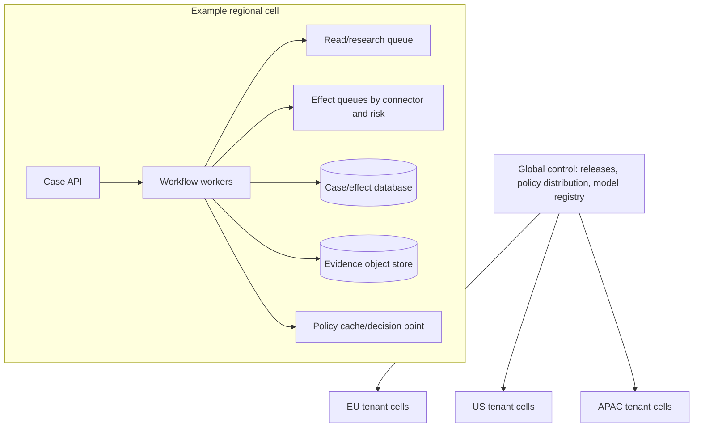

# Deployment, Scaling, Cost, and Roadmap

## Deploy capabilities, not a monolith

Separate read/research, policy, approval, and effect paths so an outbound pause does not disable safe research or incident investigation. Start with one service/process if that is operationally simpler, but keep the logical contracts explicit in data and permissions.

Recommended production components:

- authenticated case API and user interface;
- durable orchestrator and timer service;
- identity/evidence store and source acquisition workers;
- model gateway with schema validation and budgets;
- deterministic policy decision point;
- approval service;
- effect ledger and narrow CRM/mail/calendar/CPQ adapters;
- event ingestion, reconciliation, telemetry, and evaluation pipelines.

Do not introduce a separate microservice for every bullet until scale, isolation, ownership, or release cadence justifies it.

## Deployment topology



Use cells when tenant isolation, residency, blast radius, or scale warrants it. Keep policy signing and distribution global only if regional enforcement can continue safely during control-plane loss. A cell should fail closed for new external effects if its policy/suppression dependencies are stale.

## Queue and concurrency design

Partition work by connector tenant and resource where ordering matters. Separate queues for:

- source acquisition and model research;
- CRM reads and writes;
- mail/calendar effects;
- quote/CPQ effects;
- reconciliation and gap recovery;
- low-priority analytics/evaluation.

This prevents a slow enrichment vendor from starving suppression updates or a bulk CRM job from delaying sends already awaiting reconciliation. Apply weighted fairness so one tenant cannot consume the global provider allowance.

Use backpressure at intake, workflow, and adapter layers. Admission control checks tenant budgets, connector health, policy freshness, reviewer capacity, and campaign limits before expensive planning.

## Capacity model

Estimate peak load from cases, not only users:

```text
peak_connector_rps = active_cases
                   × steps_per_case_for_connector
                   × retry_amplification
                   ÷ completion_window_seconds

reviewer_load_hours = approval_required_cases
                    × median_review_seconds
                    ÷ 3600
```

Include webhook bursts, polling/reconciliation, provider retries, campaign launches, model concurrency, and business-hour/timezone concentration. Provider quotas are configuration by account and API version; refresh them rather than baking numbers from documentation into code.

## Cost model and budgets

Track cost per case, successful outcome, tenant, campaign, and capability:

| Cost driver | Control |
|---|---|
| Model input/output/reasoning | Purpose-specific projections, smaller models where evaluated, call/token budgets, caching of safe stable artifacts |
| Web/search and licensed enrichment | Source plan, query caps, cache with provenance/expiry, stop when evidence suffices |
| CRM/API calls | Webhook invalidation, batch reads, field projection, quota-aware reconciliation |
| Email/calendar | Provider plan, sender infrastructure, bounce/complaint handling |
| Workflow/state | Compact events, tiered retention, avoid polling loops |
| Evidence/audit storage | Content-addressed objects, redaction, lifecycle policies |
| Human review | Risk-based approval, high-quality diffs, measured review time |
| Incidents/compliance | Treat as expected operating cost; fund kill switches, drills, and audit |

Cache only when tenant, access scope, source rights, sensitivity, and freshness can be preserved. Never use a shared semantic cache that can return one tenant's personalized context to another.

Set hard budgets and return `budget_exhausted` with partial evidence. The model must not bypass a budget by changing tools or splitting requests.

## Availability and disaster recovery

Prioritize control functions:

1. suppression ingestion and outbound kill switches;
2. effect ledger and ambiguous-outcome reconciliation;
3. authoritative case and approval state;
4. CRM change ingestion and routing;
5. research/drafting and analytics.

During degraded operation, stop new external effects before losing audit or suppression guarantees. Back up case/effect databases and policy artifacts, test point-in-time restore, and retain connector cursors with recovery playbooks. Restore does not justify replaying effects: reconcile restored intent against providers first.

Define RPO/RTO separately for state, evidence, telemetry, and derived caches. A cache can be rebuilt; an effect receipt or opt-out event may not be recoverable from the provider indefinitely.

## Release engineering

Pin and record:

- model snapshot and inference settings;
- prompt/template and output-schema version;
- policy bundle and legal-approval metadata;
- connector API version and adapter build;
- workflow definition version;
- entity-resolution/routing/forecast model version;
- source and normalizer versions.

Promote the same signed artifacts through test, shadow, canary, and production. Use feature flags by tenant, role, capability, connector, and effect class. A global and per-tenant outbound kill switch must not depend on the model or a code deployment.

Schema and workflow changes need compatibility plans for in-flight cases. Use expand/migrate/contract for durable data and workflow versioning/patching for replay-based runtimes.

## Build-versus-buy decisions

| Decision | Prefer managed/vendor | Prefer internal |
|---|---|---|
| CRM, CPQ, mail, calendar | These remain systems of record/effect | Build narrow adapters and governance |
| Durable workflow | Team needs proven timers/retries/visibility | Simple database state machine is sufficient and understood |
| Entity resolution | High-volume mature labeled problem fits product | Identity consequences and source semantics are specialized |
| Consent/suppression | Vendor has validated jurisdiction/channel support | Policy requires bespoke integration/decision evidence |
| Model gateway/evals | Provider features meet governance and portability needs | Multi-provider policy, custom redaction, or offline controls require it |
| Enrichment | Licensed source quality and rights are suitable | First-party/public authoritative sources cover the need |

Do not buy a tool because it claims “autonomous sales.” Evaluate its identity, consent, authorization, effect, audit, deletion, retention, and reconciliation controls with the same standards.

## Staged implementation roadmap

### Stage 0 — controls and data readiness

- Inventory systems, purposes, fields, connectors, jurisdictions, senders, and owners.
- Establish canonical IDs, source provenance, consent/suppression ledger, data classification, and policies.
- Build evaluation datasets and connector sandboxes.
- Implement case/effect IDs, audit, kill switches, and reconciliation before any send.

**Gate:** identity and policy test suites pass; tenant boundaries and suppression are proven.

### Stage 1 — read-only research copilot

- Read scoped CRM data and allowed sources.
- Produce cited account briefs, data-quality findings, and match candidates.
- No CRM writes or external communication.

**Gate:** evidence and identity metrics beat manual/current baseline with acceptable cost; injection tests cannot escalate authority.

### Stage 2 — drafts and internal proposals

- Draft notes, tasks, handoffs, emails, and quote requests.
- Suggest field corrections, routing, and forecast assistance.
- Humans execute or accept changes in the source system.

**Gate:** reviewer edit/error rates meet thresholds; every factual claim has eligible evidence.

### Stage 3 — bounded internal writes

- Create notes/tasks and patch allowlisted fields.
- Commit versioned deterministic routing assignments with conflict handling.
- Use exact approvals where policy requires.

**Gate:** no silent lost updates; reconciliation and rollback/compensation drills pass.

### Stage 4 — supervised external effects

- Create immutable drafts, supervised sends, and calendar events.
- Create CPQ quote drafts; keep finalization and commercial exceptions human-owned.
- Enforce suppression at commit and monitor in real time.

**Gate:** failure injection demonstrates no duplicate or suppressed sends; incident drill and kill switches pass.

### Stage 5 — narrow preauthorized automation

- Consider only well-measured low-risk actions, such as a noncustomer-facing CRM maintenance update or a tightly defined first-party follow-up.
- Keep bulk sends, new-purpose prospecting, record merges/deletes, quote acceptance, price/discount changes, and contractual commitments human-owned.

**Gate:** explicit risk acceptance, cohort canary, stable drift/cost metrics, and rapid revocation.

### Stage 6 — continuous evolution and governed learning

- Convert reviewed identity mistakes, consent failures, ambiguous effects, forecast errors, user corrections, incidents, and connector drift into candidate evaluation cases.
- Replay old and proposed model/prompt/context/tool/policy bundles, shadow real read-only traffic, and canary changes by tenant, jurisdiction, channel, and effect class.
- Version and migrate case projections, compaction receipts, connector capabilities, schemas, prompts, policies, and model routes independently.
- Keep long-term generated memory disabled unless a specific, reviewable, deletable store beats the source systems and curated eval/runbook path in controlled testing.

**Gate:** every behavioral release is reproducible, improves held-out outcome and safety metrics without widening authority, preserves consent/suppression and tenant invariants, has an accountable owner, and can roll back without losing case/effect reconciliation.

Build a signed behavior bundle manifest for each release:

```yaml
behavior_bundle:
  id: revenue-behavior-2026-08-31.3
  model_route: sales-drafting-v7
  prompts: {planner: sha256:..., drafter: sha256:...}
  context_compiler: revenue-context-v8
  compaction_schema: revenue-compaction-v4
  retrieval_policy: account-evidence-v6
  output_schemas: {plan: 6, outreach_draft: 9}
  tool_catalog: revenue-tools-v12
  adapter_compatibility: sales-connectors-2026-08-31
  policy_interface: revenue-policy-input-v5
  eval_suite: revenue-evals-42
  rollback_to: revenue-behavior-2026-08-12.2
```

The manifest does not bundle mutable legal rules or secrets. It identifies the policy interface and adapter capabilities against which the behavior was tested. Promotion must reject an unreviewed tool addition, wider field projection, changed compaction omission, or connector scope even when prompts and model are unchanged.

Use controlled failure mining:

1. Collect a minimized candidate from reviewer correction, abstention, complaint, consent block, identity conflict, unknown effect, incident, drift alert, or expensive/stuck trace.
2. Verify the underlying facts against authoritative systems; do not treat user feedback or model narration as ground truth automatically.
3. Classify the owner: data, policy, identity, context, prompt/model, tool schema, adapter, workflow, approval UX, or operations.
4. Redact and obtain the required privacy/rights approval; prevent cross-tenant and purpose reuse.
5. Turn the case into a deterministic assertion, labeled scenario, fault injection, or runbook—not automatic long-term memory.
6. Reproduce the failure on the old bundle and demonstrate the fix on the candidate bundle without regressing protected holdouts or guardrails.
7. Shadow, canary, monitor, and keep the previous bundle deployable until in-flight cases and reconciliation are safe.

Rollback behavior independently from durable state. New planning/model calls can return to the previous bundle immediately, while already prepared effects retain their original operation, approval, policy and content digests. Never regenerate an approved message or quote under a rollback and send it under the old approval. Quarantine incompatible in-flight work and replan/reapprove it.

Drift review should include source/schema and connector changes, identity-match distribution, retrieval coverage, context size/omissions, compaction frequency, tool-call paths, denial and abstention rates, reviewer edits, forecast calibration, consent/suppression blocks, complaint/bounce rates, unknown-effect age, latency, cost, and subgroup behavior. Business-seasonality or a successful campaign is not proof that the agent improved.

## Production readiness checklist

### Product and policy

- [ ] Each capability has a named owner, purpose, authority level, and stop condition.
- [ ] Jurisdiction/channel policies are dated, reviewed, and independently deployable.
- [ ] Human overrides and corrections are captured without hiding model error.

### Data and connectors

- [ ] Canonical identity, aliases, claims, consent, and suppression have durable contracts.
- [ ] Connector versions, scopes, limits, retries, and reconciliation are capability-tested.
- [ ] Provider change feeds have cursor-gap recovery.

### Effects and operations

- [ ] Every write/send has a stable operation ID, exact approval where needed, and receipt.
- [ ] Ambiguous outcomes never trigger blind retry.
- [ ] Global, tenant, campaign, connector, and effect-class kill switches are exercised.
- [ ] Restore and replay procedures reconcile before effects.

### Security and privacy

- [ ] Tenant and territory filters run before retrieval and cache access.
- [ ] Untrusted-content workers cannot access effect credentials.
- [ ] Rights, deletion, retention, legal hold, and suppression preservation are tested.

### Evaluation and economics

- [ ] Safety invariants pass in offline, shadow, and canary stages.
- [ ] Forecast, identity, research, and outreach quality are measured separately.
- [ ] Cost and reviewer capacity budgets have alerts and hard limits.
- [ ] Every behavior bundle is reproducible, eval-linked, scope-diffed, canaried, and has a tested rollback target.
- [ ] Production failures enter a privacy-reviewed curation queue; no trace becomes long-term memory or training data automatically.

## Sources

- [Salesforce API limits and monitoring](https://developer.salesforce.com/blogs/2024/11/api-limits-and-monitoring-your-api-usage)
- [HubSpot API usage guidance](https://developers.hubspot.com/docs/developer-tooling/platform/usage-guidelines)
- [Companies House API rate-limit guidance](https://developer.company-information.service.gov.uk/developer-guidelines)
- [Temporal documentation](https://docs.temporal.io/)
- [DBOS documentation](https://docs.dbos.dev/typescript/tutorials/workflow-tutorial)
- [Restate documentation](https://docs.restate.dev/foundations/services)
- [NIST AI Risk Management Framework](https://www.nist.gov/itl/ai-risk-management-framework)
- [Gmail sender requirements](https://support.google.com/mail/answer/81126?hl=en)
