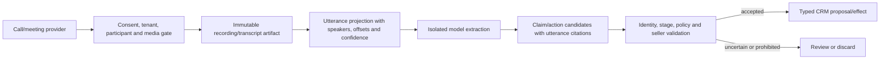
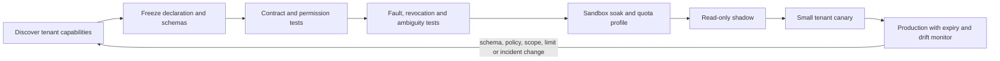

# Integration Qualification, Conversations, and Warehouse Projections

## Production position

An integration is not qualified because an OAuth flow succeeded or a demo returned records. It is qualified only when the team has proven its identity model, authorization boundary, source-of-truth role, revision semantics, limits, failure behavior, retention, reconciliation path, and operational ownership in the target tenant.

The model never receives a generic CRM client, arbitrary SQL, a recording URL, or provider credentials. The application exposes narrow business capabilities such as `opportunity.read_projection`, `call.evidence.read`, `forecast.snapshot.query`, or `quote.draft.prepare`. Server-side adapters derive tenant, connection, principal, and resource scope from authenticated case state.

## Start with an integration inventory

Before implementing tools, create one inventory row per provider, tenant class, environment, and capability. “Salesforce connector” is too broad because reads, contact patches, Bulk API jobs, CDC, ownership changes, and quote operations have different semantics.

| Required field | Question it must answer |
|---|---|
| Business capability and owner | Which sales outcome needs this integration, and who can stop it? |
| Source-of-truth role | Is it authoritative, a cache/projection, attributed evidence, or an effect provider? |
| Principal and delegation mode | Which user/workload acts, and whose record visibility applies? |
| Object/field scope | Which accounts, contacts, opportunities, activities, quotes, mailboxes, calendars, tables, rows, and columns are reachable? |
| Read/write split | Which credential and adapter handles each effect class? |
| Version/capability | Which dated API, endpoint, schema, edition, license, and tenant feature is required? |
| Revision and event model | Which ETag, modified time, cursor, webhook, CDC, or query watermark detects change? |
| Idempotency and reconciliation | How are duplicate intent and ambiguous results resolved? |
| Limits and backpressure | Which quota, batch, concurrency, payload, retention, or export limit applies? |
| Privacy and rights | Which purpose, notice, recording consent, residency, retention, deletion, and subprocessors apply? |
| Evidence and telemetry | Which provider IDs, request digests, receipts, revisions, and redacted signals are retained? |
| Degraded behavior | What becomes read-only, queued, denied, or manually routed on outage or revocation? |

Reject the integration if a required high-impact capability cannot expose current state or a defensible reconciliation query. Browser automation may bridge a rare supervised gap, but it is not a substitute for a stable write/reconciliation contract.

## Adapter declaration

Keep provider differences explicit in a machine-validated declaration. The declaration is configuration plus tested evidence, not marketing metadata.

```yaml
adapter_capability:
  id: hubspot.call-evidence.read.v1
  provider_api_track: 2026-03
  source_role: attributed_evidence
  actions: [call.read, transcript.read]
  principal_mode: delegated_user
  object_scope: [calls, contacts, companies, deals]
  field_projection: [call_id, associations, participants, started_at, utterances]
  required_entitlements: [conversation_intelligence]
  revision_signal: provider_modified_time
  event_signal: polling_with_watermark
  effect_class: read
  retention_policy: sales-call-evidence-4
  sensitivity: restricted_communications
  supports:
    conditional_read: false
    idempotent_write: not_applicable
    authoritative_reconciliation: true
  tested_at: 2026-08-31T00:00:00Z
  expires_at: 2026-11-29T00:00:00Z
```

The policy engine consumes only capabilities whose evidence is current. A declaration expiring does not erase historical receipts; it prevents new work until the connector passes requalification.

## Source and effect authority matrix

| Integration | Safe model-facing use | Authoritative owner | Default write posture |
|---|---|---|---|
| Salesforce, HubSpot, Dataverse/Dynamics | Purpose-filtered account, contact, opportunity, stage, activity, and owner projection | Current provider record plus organization configuration | Narrow allowlisted fields; revision-bound; no generic update |
| Mail and calendar | Thread/event evidence, draft rendering, reply and attendee state | Provider mailbox/calendar and delegated principal | Immutable supervised draft/send/create; reconcile provider IDs |
| Enrichment and public sources | Attributed claims with method, rights, observation time, confidence, and expiry | Never authoritative for consent, ownership, stage, or legal identity unless the source is authoritative for that exact claim | No direct CRM overwrite; propose a sourced field change |
| CPQ/catalog/pricing | Current SKU, price list, eligibility, tax/term inputs, quote status | Commercial system and named commercial authority | Draft only by default; reprice and reapprove before finalization |
| Call/meeting recording and transcript | Time-coded attributed utterances, action-item candidates, objections, and uncertainty | Recording/transcript provider for captured artifact; CRM for accepted business updates | No fact promotion or follow-up authorization without validation |
| Forecast service or feature store | Point-in-time features, model/version, probability, interval, explanation | Versioned forecast artifact; seller/manager remains owner of judgment | Publish advisory value to a distinct field/artifact only |
| Warehouse/lakehouse | Authorized, purpose-built point-in-time projection | Warehouse table/view only for the defined analytical facts | Read-only by default; no arbitrary SQL or reverse write to CRM |

Do not let “last updated” choose truth across systems. Authority is field- and purpose-specific. CRM owns current opportunity stage; CPQ owns active price; the consent ledger owns contactability; the mail provider owns whether a message was submitted; and a versioned warehouse snapshot may own the historical features used for a forecast vintage.

## CRM provider qualification

### Salesforce

Qualify each target org. Confirm objects, custom fields, record types, sharing rules, field-level security, automation side effects, API limits, composite/bulk behavior, event entitlements, and resources that actually support conditional requests. Starting with Spring ’26, Salesforce restricts creation of new connected apps and recommends external client apps for new integrations; treat authentication architecture as a release-sensitive decision rather than copying an old connected-app tutorial.

Test at least:

- a delegated user who can see one account but not another;
- field-level denial despite object access;
- a workflow/trigger changing a record after the adapter writes;
- nonunique external-ID results;
- partial composite/bulk outcomes;
- CDC cursor loss beyond retention and an authoritative gap scan;
- org limit exhaustion and fair backpressure;
- credential revocation while effects are queued.

### HubSpot

Pin the dated API track and qualify object type IDs, custom schemas, associations in both directions, pipeline/stage IDs, app scopes, account subscription, batch/search limitations, webhook retry behavior, and tenant-specific quotas. A call, email, meeting, or communication is an associated CRM activity, not proof that the related account/contact/opportunity link is correct.

The 2026-03 calling-extension documentation illustrates why entitlement and media behavior belong in capability discovery: recording/transcription flows require specific call objects and associations, authenticated recording retrieval, and compatible media/channel behavior. Do not assume every portal can provide the same transcript surface.

### Dataverse and Dynamics 365 Sales

Discover table metadata, alternate keys, ETags/concurrency, security roles, business units, field security, plugins/flows, change tracking, assignment configuration, pricing configuration, licensing, and environment location. Verify the actual caller's row and field visibility. A service principal with broad Dataverse access must not silently replace a seller's narrower view.

Dynamics conversation-intelligence features have licensing, storage, processing, privacy, consent, retention, and security-feature differences. Treat those as separately approved capabilities. A transcript-derived action item is a candidate until a seller or deterministic rule accepts it into CRM state.

## Mail, calendar, enrichment, and CPQ qualification

For mail and calendar, verify delegated mailbox ownership, sender aliases, scopes, draft/send separation, event identifiers, update notification behavior, sent-state queries, thread semantics, webhook/delta gaps, attachment handling, and revocation. Run ambiguous-timeout drills against provider sandboxes. A successful draft creation is not a send receipt.

For enrichment, procurement and privacy review must cover allowed purpose, source provenance, geographic and entity coverage, field definitions, update cadence, accuracy evidence, redistribution, model training, retention, deletion, subprocessors, rate limits, and termination export/deletion. Seed contract tests with known subsidiaries, shared domains, job changes, role mailboxes, and deliberately incorrect vendor records.

For CPQ and pricing, verify catalog and price-list revisions, currencies, units, bundles, entitlements, tax boundary, discount/term authority, draft/final states, recalculation behavior, document generation, acceptance evidence, and void/cancel paths. Never test only the happy-path standard quote; include expired prices, incompatible bundles, approval expiry, and partial downstream failure.

## Call and transcript evidence

Recordings and transcripts are unusually sensitive evidence. They may contain personal data, confidential commercial information, regulated statements, authentication details spoken aloud, and attacker-controlled instructions. Recording legality and notice depend on participant locations, channel, organizational role, and applicable law. **Outreach consent is not recording consent**, and a CRM association is not proof of either.



Store provider call/meeting ID, association evidence, participant identities/candidates, recording-notice/consent reference, start/end time, timezone, language, channel layout, transcript/diarization version, utterance offsets, speaker confidence, corrections, retention policy, and artifact digest. Keep audio/video outside ordinary model context and telemetry.

Important failure modes include:

- wrong contact or opportunity association;
- mono/mixed channels causing incorrect speaker assignment;
- crosstalk, accent, domain vocabulary, translation, or redaction errors;
- a seller's statement attributed to the customer;
- negation or conditional language lost in summarization;
- transcript lag causing a follow-up to omit a later objection;
- deleted/expired recording referenced by a durable summary;
- prompt injection spoken or displayed during the meeting;
- employee-monitoring or coaching data reused for sales decisions outside approved purpose.

A statement such as “we can sign next week” does not directly change stage, amount, close date, consent, or forecast category. The extractor creates a cited candidate with speaker and uncertainty; the owning rule or seller validates the proposed business update.

## Warehouse and forecasting projections

The model should query named, parameterized sales projections rather than arbitrary warehouse SQL. Each query contract fixes dataset/view, allowed fields, tenant/territory filter, time semantics, maximum scanned bytes/rows, timeout, and output schema. Server-side parameters—not model-generated predicates—bind account, opportunity, tenant, date range, and forecast vintage.

```yaml
warehouse_query_receipt:
  query_contract: opportunity-vintage-features-v5
  tenant_id: ten_42
  principal_id: usr_7
  purpose: forecast_assistance
  parameters_digest: sha256:...
  authorized_view: revops.opportunity_features_safe
  as_of: 2026-08-31T00:00:00Z
  source_watermarks:
    crm_opportunity: "cdc:991813"
    activity_fact: "2026-08-30"
  policy_version: warehouse-sales-9
  query_job_id: job_782
  rows: 1
  bytes_scanned: 84211
  completed_at: 2026-08-31T00:00:01Z
```

BigQuery authorized views plus row- and column-level controls, and Snowflake views plus row-access/masking policies, can help enforce projection boundaries. They still require application tenant assertions and tests. Platform controls have feature and performance limitations, and administrative roles may be broader than end-user roles.

For historical forecasting, require point-in-time correctness: event time, ingestion time, correction time, source watermark, feature code version, and label-availability cutoff. A current warehouse row must not leak a later close result into an earlier vintage. Query receipts make the evaluated and production feature set reproducible.

Warehouse writes are a separate effect class. If the system publishes a forecast artifact, use a dedicated derived table or provider field with model/version, vintage, expiry, and operation ID. Do not allow reverse ETL to overwrite seller stage, amount, consent, or ownership. Snowflake's SQL API supports a request ID and retry flag to reduce duplicate execution on retry, but application intent and reconciliation remain necessary for state-changing statements.

## Qualification pipeline



Minimum evidence for promotion:

1. **Permission proof:** positive and negative tenant, territory, record, field, mailbox, calendar, table, row, and column tests.
2. **Schema proof:** unknown fields fail closed; provider additions do not enter model context automatically.
3. **Revision proof:** stale writes conflict or are re-read; out-of-order events do not regress state.
4. **Effect proof:** operation identity, approval, provider receipt, ambiguous result, and reconciliation work end to end.
5. **Failure proof:** 401/403, 409/412, 429, 5xx, timeout-after-accept, malformed payload, revoked scope, cursor gap, and partial batch behavior are exercised.
6. **Privacy proof:** purpose, minimization, transcript/recording consent, retention, deletion, legal hold, export, residency, and vendor termination are tested.
7. **Operations proof:** owner, SLO, quotas, dashboards, runbook, kill switch, refresh date, and re-enable gate exist.

Requalify after an API-track or seasonal release, scope/permission change, new object or effect, edition/license change, source-system automation change, security incident, deletion failure, unexplained reconciliation drift, or expired evidence. Canary reads can run continuously; canary writes use a dedicated safe record and never a real recipient.

## Adapter acceptance checklist

- [ ] The provider and application agree on tenant, principal, resource, purpose, and authority.
- [ ] Reads preserve source IDs, revisions, field semantics, visibility, provenance, and timestamps.
- [ ] Writes use narrow schemas, current preconditions, stable operation IDs, and a documented reconciliation query.
- [ ] Webhooks/change feeds are authenticated invalidation hints with gap recovery.
- [ ] Transcript and recording access has independent consent, retention, deletion, and employee-monitoring review.
- [ ] Warehouse queries are named, parameterized, point-in-time correct, budgeted, and visibility constrained.
- [ ] Enrichment cannot become consent, identity, stage, ownership, or pricing truth by convenience.
- [ ] Connector credentials are absent from prompts, traces, approval screens, and model-visible tool arguments.
- [ ] Quota exhaustion produces fair backpressure and a partial/queued outcome, not silent omission.
- [ ] Capability evidence expires and forces requalification rather than optimistic continued use.

## Sources

- [Salesforce external client apps and connected apps](https://developer.salesforce.com/docs/platform/mobile-sdk/guide/connected-apps.html)
- [Salesforce REST API Developer Guide](https://resources.docs.salesforce.com/latest/latest/en-us/sfdc/pdf/api_rest.pdf)
- [Salesforce event-message durability](https://developer.salesforce.com/docs/platform/pub-sub-api/guide/event-message-durability.html)
- [HubSpot CRM object model](https://developers.hubspot.com/docs/api-reference/latest/crm/understanding-the-crm)
- [HubSpot call recordings and transcripts](https://developers.hubspot.com/docs/api-reference/latest/crm/extensions/calling-extensions/recordings-and-transcriptions)
- [Microsoft Dataverse Web API concurrency guidance](https://learn.microsoft.com/en-us/power-apps/developer/data-platform/webapi/compose-http-requests-handle-errors)
- [Dynamics 365 conversation-intelligence retention and privacy](https://learn.microsoft.com/en-us/dynamics365/sales/data-retention-deletion-policy-sales-app)
- [Dynamics 365 Sales privacy and security FAQ](https://learn.microsoft.com/en-us/dynamics365/sales/sales-privacy-faqs)
- [BigQuery authorized views](https://cloud.google.com/bigquery/docs/authorized-views)
- [BigQuery row-level security](https://cloud.google.com/bigquery/docs/row-level-security-intro)
- [Snowflake row-access policy behavior and limitations](https://docs.snowflake.com/en/user-guide/security-row-intro)
- [Snowflake SQL API request and retry semantics](https://docs.snowflake.com/en/developer-guide/sql-api/submitting-requests)

