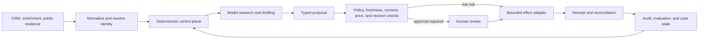

# Sales and Revenue Operations Agent

> **Status:** Production blueprint  
> **Last researched:** 2026-08-31  
> **Scope:** Account research, identity and enrichment, CRM hygiene, pipeline inspection, routing, forecast assistance, quote preparation, compliant outreach, meeting handoff, and follow-up  
> **Evidence packet:** [Research packet](../../research/packets/sales-revenue-operations-agent-blueprint.md)

A production sales and revenue-operations agent should be a **policy-constrained workflow that produces evidence, drafts, and bounded actions**. It should not be an unconstrained autonomous prospector. Deterministic services own legal identity, consent and suppression, routing rules, pricing, authorization, and side-effect commits. The model is useful for research synthesis, ambiguity detection, drafting, and proposing the next step.

The default recommended operating model is a **constrained hybrid**: a durable deterministic workflow surrounds model calls; low-risk reads and derived artifacts may run automatically; internal writes require policy checks; external communication, ownership changes, forecast commitments, and commercial terms require an approval appropriate to their impact.

## Category contract

This blueprint owns **account/contact/opportunity and revenue-stage work** after a lead or account is inside an authorized sales motion. It does not become a generic business agent because the same CRM contains marketing, support, or administrative records.

| Work | Owner | Sales/RevOps interaction |
|---|---|---|
| Account/contact identity, opportunity state, seller ownership, pipeline inspection, forecast assistance, quote preparation, authorized one-to-one account engagement | This blueprint | Owns the governed case and its CRM/effect receipts |
| Campaign population, ad targeting, bulk activation, creative publication, campaign spend, attribution design | [Marketing operations](../marketing-operations-agent/README.md) | Accept a deduplicated lead handoff; return only agreed downstream fields or aggregates |
| Authenticated customer issue, support entitlement, refund/cancellation resolution, SLA and case closure | [Customer support](../customer-support-agent/README.md) | Link an opportunity or account when useful; never convert a support case into outreach |
| Personal inbox, calendar, travel, and delegated executive work | [Executive operations](../executive-operations-agent/README.md) | Receive an exact approval or briefing request; never inherit personal delegation |
| Generic document/case processing, financial operations, supplier workflow, and departmental approvals | [Back-office workflow](../back-office-workflow-agent/README.md) | Exchange typed handoffs; do not absorb a generic case lifecycle |
| Metric definition, broad analytical investigation, and causal analysis | [Analytics](../analytics-agent/README.md) | Request a versioned analytical artifact; keep only sales-owned forecast consumption and action |

Boundary tests are operational controls. A request to “email everyone in this segment” is marketing work; “resolve this customer's refund” is support work; “book my personal trip” is executive operations; and “approve this supplier invoice” is back-office work. The sales agent must reject or hand off these requests even if its connector could technically perform them.

## When not to build an agent

Use deterministic CRM automation, a workflow rule, a scheduled report, or a human checklist when inputs and decisions are already structured. Common examples are exact duplicate rules, required-field validation, fixed lead assignment, stage-age alerts, static forecast rollups, approved-template reminders, and catalog pricing. Add a model-directed loop only when semantic account evidence, ambiguous entity resolution, individualized explanation, or bounded multi-step preparation produces a measured benefit over that baseline.

The first agentic slice should be read-only: one seller asks for a sourced account/opportunity brief, and the system returns claims, conflicts, missing facts, and a proposed next step without writing the CRM or contacting anyone. This proves identity, visibility, context, citation, latency, and cost before effect authority exists.

## Why this boundary matters

A single plausible-looking mistake can contact a suppressed person, expose one tenant's data to another, assign an account to the wrong territory, overwrite a seller's forecast, or send a duplicate quote. These failures cannot be made safe by a better prompt. They require source revisions, policy decisions, approval binding, idempotency, and reconciliation outside the model.

## Non-negotiable invariants

- A domain, email address, or similar company name is not proof of legal-entity identity.
- Enrichment is evidence with provenance and expiry, not authoritative CRM truth.
- Consent, suppression, jurisdiction, sender policy, and deliverability are evaluated by deterministic policy immediately before every send.
- An opt-out, legal hold, tenancy boundary, or security restriction always overrides a campaign plan.
- Approval authorizes a canonical action digest, not a general intent; changed recipients, content, price, CRM revisions, or policy inputs invalidate it.
- A timeout after an external write or send is `unknown`, not `failed`; the system reconciles before retrying.
- The model never receives connector secrets and never chooses its own authorization scope.
- Seller judgment and manager overrides remain distinguishable from model-derived forecast assistance.
- Price, discount, tax, payment, and contract terms come from governed commercial systems.
- Untrusted web pages, emails, attachments, and CRM free text cannot grant authority or change policy.

## Guide map

| Guide | Production question answered |
|---|---|
| [01. Operating model and architecture](01-operating-model-and-architecture.md) | Which operating model is appropriate, and where must deterministic control begin? |
| [02. Identity, entity research, and enrichment](02-identity-entity-research-and-enrichment.md) | How are accounts, contacts, claims, provenance, and ambiguous matches represented safely? |
| [03. CRM, pipeline, routing, forecasting, and quotes](03-crm-pipeline-routing-forecasting-and-quotes.md) | How does the agent assist revenue operations without corrupting system-of-record state? |
| [04. Outreach, consent, handoff, and follow-up](04-outreach-consent-handoff-and-follow-up.md) | How are communications prepared and sent without bypassing consent, suppression, or deliverability controls? |
| [05. Tool, effect, approval, and reconciliation contracts](05-tool-effect-approval-and-reconciliation-contracts.md) | How are writes, sends, retries, approvals, and ambiguous outcomes made safe? |
| [06. State, context, planning, and durable work](06-state-context-planning-and-durable-work.md) | What persists across waits, replies, approval delays, connector outages, and restarts? |
| [07. Security, privacy, tenancy, and governance](07-security-privacy-tenancy-and-governance.md) | How are credentials, personal data, tenant boundaries, and prompt injection contained? |
| [08. Reliability, observability, evaluation, and incidents](08-reliability-observability-evaluation-and-incidents.md) | What evidence proves safe behavior before and after launch? |
| [09. Deployment, scaling, cost, and roadmap](09-deployment-scaling-cost-and-roadmap.md) | How should the capability be staged, operated, and economically governed? |
| [10. Integration qualification, conversations, and warehouse projections](10-integration-qualification-conversations-and-warehouse-projections.md) | How are CRM, mail, calendar, enrichment, CPQ, call/transcript, forecasting, and warehouse adapters qualified without weakening source authority? |

## Capability and authority matrix

| Capability | Default mode | Maximum routine authority | Required control |
|---|---|---:|---|
| Public account research | Automatic | Read | Source allowlist, provenance, freshness, terms-of-use policy |
| Entity resolution | Propose | Derived artifact | Deterministic exact keys; review ambiguous merge candidates |
| CRM field cleanup | Suggest, then bounded write | Reversible internal write | Field allowlist, source revision, previous value, audit |
| Lead or account routing | Deterministic decision | Internal ownership write | Versioned rules, capacity snapshot, reservation, catch-all |
| Forecast assistance | Advisory | Derived artifact | Vintage backtest, calibration, explanation, no silent overwrite |
| Quote preparation | Draft | Draft record | Governed catalog, reprice-on-commit, commercial approval |
| Email or message | Draft by default | External effect | Communication policy, suppression recheck, approval, receipt |
| Calendar invite | Draft or supervised create | External effect | Attendee and timezone validation, stable operation identifier |
| Follow-up | Durable scheduled proposal | External effect | Re-read reply, consent, owner, CRM, and campaign state |
| Merge, delete, bulk send, discount exception | Human-owned | High impact | Dedicated workflow; never inferred from conversational approval |

## Recommended production shape

Use one orchestrated case per account-contact-purpose combination. The case may call specialized workers, but workers are not autonomous principals:

1. **Intake** validates tenant, actor, campaign, requested outcome, and policy version.
2. **Identity** maps source records to canonical account/contact candidates.
3. **Evidence** acquires allowed sources and records claims with timestamps and provenance.
4. **Planning** produces a typed proposal, not executable prose.
5. **Policy** calculates permitted channels and actions from deterministic inputs.
6. **Approval** binds a reviewer to an exact proposed effect when required.
7. **Commit** revalidates mutable preconditions and invokes a narrow adapter.
8. **Reconciliation** resolves the provider outcome and advances durable state.
9. **Evaluation** scores the trace, outcome, compliance, and data-quality effects.

Start with a read-only copilot. Add draft creation, bounded internal writes, and supervised communication only after the preceding stage passes acceptance tests. Do not use production revenue as evidence that the system is safe: a campaign can convert while still violating suppression, misrouting records, or leaking data.

A case is done only when every proposed fact is either cited or labeled as inference, every CRM mutation is visible in the authoritative record, every external effect is reconciled to a provider receipt or an owned `unknown` state, all follow-up timers have a valid stop condition, and no stale approval or compacted summary can silently authorize the next action.

## Version and policy baseline

This blueprint was researched on **2026-08-31**. CRM endpoints, API limits, email-sender requirements, privacy guidance, telemarketing rules, and provider model behavior are volatile. Pin dated API versions where the provider supports them, keep connector capability tests, and give legal/compliance owners a separately versioned policy bundle. Refresh the evidence packet on provider deprecation notices, jurisdictional changes, mail-provider enforcement changes, or any new effect class.

## Related repository guidance

- [Production agent control plane](../../architectures/production-agent-control-plane.md)
- [Durable execution](../../runtime/durable-execution.md)
- [Agent state and event contracts](../../runtime/agent-state-and-event-contracts.md)
- [Tool contracts](../../tools/tool-contracts.md)
- [Idempotency and side effects](../../reliability/idempotency-and-side-effects.md)
- [Prompt injection and untrusted data](../../security/prompt-injection-and-untrusted-data.md)
- [Evaluation-driven development](../../evaluation/evaluation-driven-development.md)
