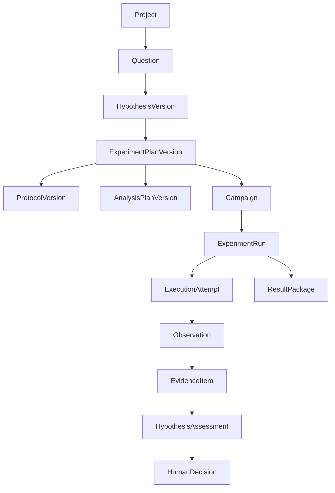

# Mission, Boundary, Requirements, and Authority

This guide turns “automate research” into a bounded product contract. The useful product is not an autonomous scientist. It is a provenance-preserving research operations service whose model is one fallible component.

## 1. Product mission

Help an authorized research team execute approved, non-clinical research more consistently by coordinating digital work and narrowly bounded laboratory operations while preserving scientific uncertainty, sample and artifact lineage, and human accountability.

The system should reduce coordination errors and time spent on:

- assembling approved inputs and checking readiness;
- compiling protocols and analysis plans into typed work graphs;
- scheduling simulations, analyses, and eligible instrument runs;
- collecting raw outputs and reconciling external system state;
- validating identities, units, manifests, checksums, controls, and expected files;
- documenting deviations and preparing reproducibility packages; and
- routing evidence and unresolved questions to the right investigator.

It should not optimize for the number of experiments performed. It should optimize for valid, interpretable, recoverable research work per unit of scarce material, instrument time, staff attention, and risk.

## 2. Inclusion and exclusion boundary

| Workload | In this blueprint? | Boundary |
|---|---:|---|
| Non-clinical computational experiment | Yes | Pinned data, code, environment, budget, and analysis plan |
| Low-risk measurement on an integrated instrument | Conditionally | Pre-approved method and parameter envelope; local controller retains safety |
| Sample tracking and result reconciliation | Yes | LIMS remains authoritative; no inferred identity |
| Protocol drafting and change proposal | Yes | Proposal only until investigator and required safety review approve |
| Literature retrieval supporting an experiment | Supporting capability | Use cited sources, but literature synthesis alone belongs to the Deep Research blueprint |
| Human-subject or clinical-trial operations | No | Requires a distinct regulated workflow and consent/safety architecture |
| Unrestricted wet-lab planning or execution | No | Open-ended material transformation is outside the authority model |
| Dual-use or high-consequence biological work | No autonomous execution | Hard stop and institutional review; current rules are jurisdiction- and program-specific |
| Scientific interpretation and claim approval | Human-owned | Agent may present calibrated, cited alternatives |
| Authorship, signature, repository release, or publication | Human-owned | Never inferred from prior approval to run an experiment |

## 3. Research object hierarchy

The control plane needs explicit objects. A chat transcript is not research state.



Each edge is stored with stable identifiers, version identifiers, timestamps, actor identity, and provenance. Deleting or renaming a label cannot erase lineage.

## 4. Authority model

### 4.1 Roles

| Role | Accountability |
|---|---|
| Principal investigator or study lead | Research objective, protocol, analysis plan, interpretation, external claims |
| Laboratory manager or instrument owner | Instrument eligibility, training, maintenance, local operating envelope |
| Safety officer, EHS, biosafety committee, or equivalent | Risk classification and required controls under local policy |
| Data steward | Classification, retention, access, sharing, repository selection |
| Platform owner | Control-plane correctness, isolation, recoverability, model/tool releases |
| Operator | Physical setup, identity confirmation, intervention, emergency response |
| Agent | Proposal, orchestration, validation, reconciliation, documentation within delegated policy |

One person may hold several roles, but the record must preserve which authority they exercised. Configure separation of duties for risk-bearing work; do not assume an organization chart supplies it automatically.

### 4.2 Authority levels

| Level | Maximum agent authority | Typical use |
|---|---|---|
| A0 — advise | Read and propose | Retrospective analysis, protocol review |
| A1 — draft | Create drafts in approved systems | ELN draft, run manifest, analysis notebook |
| A2 — digital execute | Submit reversible or reconcilable digital work | Sandboxed compute, simulation, metadata validation |
| A3 — supervised physical | Prepare and request a pre-authorized low-risk run; local gateway commits after fresh approval | Routine measurement in a fixed envelope |
| A4 — bounded campaign | Repeat only pre-approved run templates with reservations, quotas, and continuous reconciliation | Mature high-throughput facility cell |

There is no general “full autonomy” level. A4 does not permit protocol changes, new hazards, safety overrides, interpretation, or publication. An organization may stop permanently at A1 or A2.

### 4.3 Authority is intersectional

An action is permitted only when all applicable dimensions allow it:

```text
effective authority =
  actor entitlement
  ∩ project and tenant scope
  ∩ protocol version and parameter envelope
  ∩ sample and material status
  ∩ instrument capability and readiness
  ∩ facility and safety policy
  ∩ data-use and egress policy
  ∩ current approval
  ∩ time and budget limits
```

The model cannot widen any term. Missing, stale, conflicting, or unresolvable data produces a hold, not a guess.

## 5. Scientific record classes

### 5.1 Observation

An observation is a source-attributed record of what was read or emitted. It carries no automatic scientific meaning.

Required fields include source, source version, acquisition time, ingest time, subject identity, method or command reference, raw artifact reference, unit when applicable, quality flags, and integrity status.

Examples:

- an instrument reported temperature `T` at controller time `t`;
- a scheduler reported job state `COMPLETED` and exit code zero;
- a barcode reader returned a container identifier;
- a repository API returned an accession identifier.

### 5.2 Evidence item

An evidence item is a reproducible validation or transformation of observations. It must identify its inputs, method, code or rule version, output, uncertainty or limitations, and validator outcome.

A scheduler completion is not evidence of the scientific claim. A domain validator may later create an evidence item stating that all required files were present, checksums matched, controls passed, and a specified estimate with uncertainty was computed.

### 5.3 Hypothesis

A hypothesis version contains:

- the falsifiable claim;
- predicted observations under specified conditions;
- alternatives and confounders;
- evidence that would count for, against, or as inconclusive;
- intended scope of inference;
- provenance and author; and
- status: `DRAFT`, `ACTIVE`, `SUPPORTED`, `NOT_SUPPORTED`, `INCONCLUSIVE`, `SUPERSEDED`, or `WITHDRAWN`.

`SUPPORTED` means supported under the recorded design and analysis. It never means proven universally.

### 5.4 Decision

A decision records an authority's choice, the alternatives considered, cited evidence, uncertainty, conflicts, time, scope, and any effect authorization. The system preserves agent proposals separately from human decisions.

### 5.5 Effect

An effect is an attempted external state change. It has an intent, policy decision, authorization, dispatch record, receipt, observed outcome, and reconciliation state. Digital and physical effects use separate risk and retry policies.

## 6. Protocol contract

An executable protocol version is more than prose. The system must compile or attach a typed contract containing:

| Dimension | Required representation |
|---|---|
| Identity | Stable protocol ID, immutable version, content hash, authoritative source |
| Scope | Applicable projects, sample types, instruments, facilities, and research purpose |
| Inputs | Materials, sample states, quantities, quality criteria, and data inputs |
| Parameters | Types, units, bounds, precision, allowed combinations, and defaults |
| Preconditions | Training, calibration, maintenance, environment, approvals, inventory, controls |
| Steps | Ordered or DAG nodes, command class, expected observation, timeout, checkpoint |
| Safety | Hazard classification reference, containment, interlocks, stop conditions, response owner |
| Analysis | Pinned analysis-plan version, exclusions, controls, thresholds, multiple-testing treatment where relevant |
| Deviations | Which deviations may be recorded, which require approval, and which force abort |
| Outputs | Required raw, derived, metadata, and provenance artifacts |
| Closure | Reconciliation, material disposition, cleanup, record finalization, review |

The typed contract supplements the human-readable protocol; it does not silently replace it. Any compiler ambiguity is surfaced for human resolution and stored as a mapping decision.

## 7. Risk classification

Risk classification is a facility-owned policy input, not a model prediction. A practical implementation can use locally defined tiers such as:

| Tier | Examples | Agent ceiling |
|---|---|---|
| R0 — digital/read-only | Search internal metadata, validate manifests | A2 after normal access checks |
| R1 — reversible digital | Draft ELN entry, reserve compute | A2 with reconciliation |
| R2 — low-risk physical template | Read-only measurement or routine run inside a fixed envelope | A3/A4 only after production gates |
| R3 — consequential physical | Consumes scarce sample, transforms material, expensive or long-duration run | Prepare only; fresh human commit |
| R4 — hazardous, high-consequence, novel, or uncertain | New hazard, containment change, safety control change, high-risk life-science concerns | Hard stop; no agent execution |

The labels are implementation examples, not universal hazard categories. The facility maps its actual chemical, biological, radiological, physical, environmental, and information hazards to policy.

## 8. Functional requirements

### 8.1 Before execution

- Resolve exact protocol, analysis plan, sample, material lot, instrument, adapter, and environment versions.
- Verify authority, approval freshness, training or operator requirements, data-use restrictions, budget, and resource reservations.
- Validate units, parameter bounds and combinations, required controls, sample quantities, and expected artifacts deterministically.
- Record a pre-execution manifest and immutable readiness report.
- Make the remaining human decisions explicit; do not hide them in generated prose.

### 8.2 During execution

- Persist state transitions before and after effects.
- Capture both controller time and ingest time and flag clock uncertainty.
- Stream or checkpoint observations without treating partial data as final.
- Monitor protocol-defined stop conditions through deterministic services.
- Accept cancellation as a request whose actual physical result must be reconciled.
- Preserve local operator control and independent safety systems.

### 8.3 After execution

- Reconcile every intended effect with authoritative external state.
- Verify raw artifact integrity and expected outputs before analysis.
- Record deviations, exclusions, missingness, failed controls, and material disposition.
- Generate derived evidence only through pinned transformations.
- Assemble a result package that another authorized environment can inspect or rerun.
- Route interpretation and release to the named human authority.

## 9. Quality attributes

| Attribute | Requirement |
|---|---|
| Safety | No command path bypasses local interlocks or human emergency response |
| Integrity | Raw observations and authoritative references are immutable and hash-verified where feasible |
| Recoverability | Every wait and effect boundary has durable state; unknown outcomes have a reconciliation path |
| Reproducibility | Package code, data references, environment, protocol, analysis, units, seeds, deviations, and versions |
| Isolation | Authorization and caches are scoped by tenant, project, facility, and data classification |
| Explainability | Each conclusion-like statement links to evidence and preserves alternatives and uncertainty |
| Operability | Queue, resource, tool, model, artifact, approval, and safety signals are observable |
| Cost control | Budgets include material, instrument, staff, compute, storage, and model costs |
| Evolvability | Long-running work stays pinned while new versions are shadowed, canaried, and rollbackable |

## 10. Product success and anti-metrics

Useful success measures include lineage completeness, protocol-conformance rate, valid-result-package lead time, reconciliation latency, repeatability within defined criteria, reduction in avoidable reruns, operator attention per valid run, and fraction of decisions with complete evidence links.

Do not optimize directly for:

- number of model-generated hypotheses;
- number or speed of physical experiments;
- percentage of “successful” hypotheses;
- amount of context or memory retained;
- scheduler completion rate without result validation;
- autonomy level; or
- benchmark score alone.

These incentives can suppress negative results, encourage unsafe throughput, or reward fluent unsupported conclusions.

## 11. Minimum launch invariants

Before any non-read-only deployment:

- authoritative owners and human approvers are named;
- the protocol compiler fails closed on ambiguity;
- effect intent and receipt are durable and separately identifiable;
- physical effects cannot be retried through generic retry middleware;
- raw data cannot be overwritten by agent output;
- sample identity never comes from free-text similarity;
- safety and authorization decisions run outside the model;
- `INDETERMINATE` and `SAFETY_HOLD` are tested states;
- prompt-borne instructions cannot select tools or widen permissions; and
- every generated scientific assessment cites versioned evidence and labels uncertainty.

## 12. Decision checklist

- What real research bottleneck is being reduced?
- Could the same value be delivered at A0–A2 without physical authority?
- Which system owns each identity, record, and effect?
- Which changes are irreversible, material-consuming, or safety-relevant?
- What makes a protocol or approval stale?
- Which observations establish effect completion?
- How will an unknown physical outcome be contained?
- Which result can the system report, and which interpretation remains human?
- What domain and jurisdiction-specific review is still required?

## Sources and navigation

The evidence and version notes behind this contract are in the [research packet](../../research/packets/scientific-research-agent-blueprint.md). Continue with [02 — Reference architecture, integrations, and runtime](02-reference-architecture-integrations-and-runtime.md), or return to the [blueprint overview](README.md).

