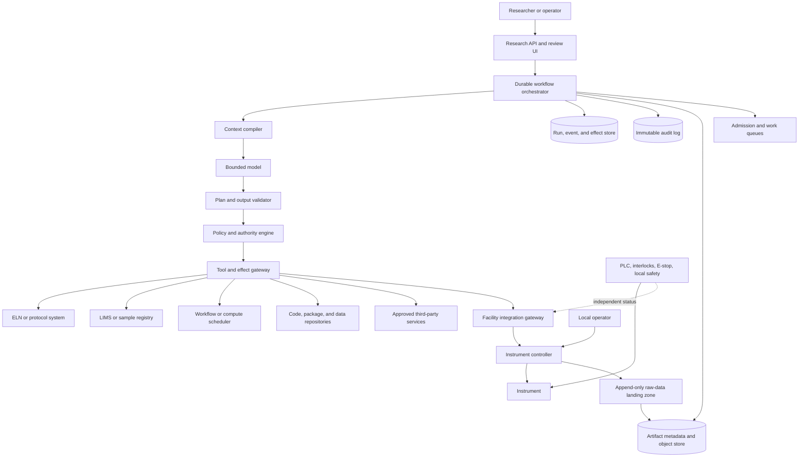
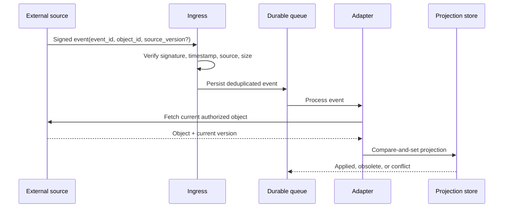
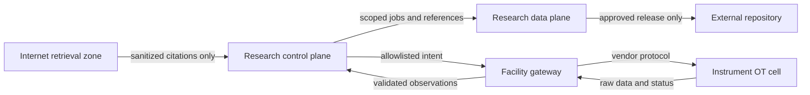

# Reference Architecture, Integrations, and Runtime

The reference architecture treats the language model as a bounded planner and analyst, not as an integration bus, scheduler, database, instrument controller, or safety system.

## 1. Architecture principles

1. Keep protocol, authorization, scheduling, effect, and safety decisions deterministic.
2. Preserve each external system's authority; project only the fields needed for coordination.
3. Separate internet-facing retrieval, the research control plane, the data plane, and the instrument operational-technology cell.
4. Put every external action behind a typed adapter with explicit effect semantics.
5. Persist before waits and effects, then reconcile from authoritative state.
6. Store large or sensitive artifacts outside prompts and pass scoped references.
7. Start as a modular service; split components only for isolation, scaling, or ownership reasons.

## 2. Logical architecture



The model never connects directly to the instrument network. `SI` remains operational if the model, workflow, gateway, network, or cloud is unavailable.

## 3. Component responsibilities

| Component | Owns | Must not own |
|---|---|---|
| Research API/review UI | User intent, review displays, approval capture | Hidden protocol or effect state |
| Durable orchestrator | Run lifecycle, waits, retries allowed by policy, compensation workflow | Scientific interpretation or physical safety |
| Context compiler | Least-context prompt assembly and provenance | Canonical raw data or long-term truth |
| Model | Bounded proposals, classifications, explanations | Authorization, numeric enforcement, state transitions |
| Plan/output validator | Schema, references, units, graph, evidence-citation checks | Facility risk judgment |
| Policy/authority engine | Entitlements, protocol envelope, approval freshness, budgets | Natural-language inference of permission |
| Tool/effect gateway | Capability routing, idempotency keys, receipts, reconciliation | Directly trusting model-generated endpoints or credentials |
| Facility gateway | Site-local command translation and instrument observation | Disabling or replacing local safety systems |
| Event/effect store | Durable semantic run state and external action ledger | Raw scientific artifact bytes |
| Artifact plane | Immutable raw bytes, derived versions, hashes, retention | Deciding scientific significance |
| External systems | Their domain records | Agent run orchestration |

This follows the repository's [execution boundaries](../../runtime/execution-boundaries.md) and [agent state/event contract](../../runtime/agent-state-and-event-contracts.md).

## 4. Sources of truth and projections

### 4.1 ELN and protocol system

Use the supported API, event stream, or signed export. Store the authoritative record ID, immutable version or revision, fetch time, source ETag/version if available, content hash, access policy, and signature status where the system exposes them.

The agent may create a **draft** or append a governed result link when configured. It must not silently edit a signed entry, replace an approved protocol, or infer that an editable record is approved.

### 4.2 LIMS or sample registry

The LIMS owns sample identity, container/aliquot relationships, status, location, custody, reservation, and disposition. The control plane consumes a versioned snapshot and writes only explicit events supported by a validated workflow.

Never use names, embeddings, positions, or timestamps as identity substitutes. A missing or conflicting barcode is a hold.

### 4.3 Instrument controller

The controller owns live device state and accepted commands. The agent gateway owns semantic intent and reconciliation. A command receipt is not proof that material changed as expected; the relevant controller state, raw artifact, sensor observation, and operator confirmation determine the observed outcome.

### 4.4 Scheduler and workflow engine

Use the site's existing Slurm, Kubernetes Job, CWL-compatible runner, or domain workflow engine. The agent submits an immutable, validated job manifest. Scheduler state describes resource execution, not scientific validity. A separate validator checks output manifests, hashes, domain controls, and expected results.

### 4.5 Code, package, container, and data repositories

The repository owns content and version history. The agent resolves immutable commit digests, package locks, container image digests, dataset versions, and licenses. Mutable branches, tags, or `latest` identifiers may be accepted at proposal time but must resolve to immutable identifiers before execution.

### 4.6 External data or model service

Put approved external services behind a data-egress broker. The broker enforces project policy, data classification, request budget, response size, retention restrictions, and provider version. External response content remains untrusted data.

## 5. Integration decision matrix

| Integration | Preferred interface | Event semantics | Agent writes | Mandatory local validation |
|---|---|---|---|---|
| ELN/protocol | Official API plus signed/versioned export | Hint to refetch; may be late or out of order | Draft, comment, result link if permitted | Version, approval/signature state, record immutability |
| LIMS | Official transactional API | Refetch entity and lineage | Reservation or explicit lifecycle event | Barcode, sample state, quantity, custody, optimistic concurrency |
| Instrument | Site gateway using vendor API or supported SiLA/LADS profile | Telemetry is observation | Prepare/arm/start only for allowlisted capability | Device identity, firmware, method, calibration, envelope, interlock status |
| Scheduler | Version-pinned REST/CLI library through adapter | Poll or event, then reconcile | Submit/cancel/query job | Manifest digest, exact API version, output validator |
| Simulation/workflow | CWL or existing engine where it fits; otherwise typed job manifest | Workflow node events | Submit/cancel/query | Inputs, code, environment, seeds, resource limits, output hashes |
| Source/package registry | Read API; CI writes | Refetch commit/artifact | Normally none | Commit/image digest, dependency lock, license and vulnerability policy |
| Artifact repository | Multipart/atomic publish API | Verify finalized object | Stage immutable object; release needs approval | Hash, length, media type, encryption, metadata completeness |
| Public repository | Domain-preferred deposit API | Deposit can be asynchronous | Draft deposit only by default | Access terms, embargo, PID, version, license, sensitive-data review |
| Third-party analysis | Approved API behind broker | Response is untrusted | Request with minimal data | Schema, provider/model version, egress policy, reproducibility limits |

This matrix is an architecture inventory, not production certification. Admit each exact operation through the dated capability declaration, negative permission tests, provider/version evidence, ambiguity tests, recovery proof, and worked exercises in [11 — Integration qualification and worked research flows](11-integration-qualification-and-worked-flows.md). Authentication success proves connectivity, not source authority, effect permission, scientific validity, or safe failure behavior.

### Standards are profiles, not magic interoperability

- [SiLA 2](https://sila-standard.com/standards/) provides service/feature concepts for laboratory automation, but deployments still need exact feature and version profiles.
- [OPC UA LADS](https://reference.opcfoundation.org/specs/OPC-30500-1) supplies a device-agnostic laboratory/analyse-device information model. Its initial release does not make all sample, consumable, or domain semantics universal.
- [Allotrope](https://docs.allotrope.org/) and [AnIML](https://animl.org/) address analytical data representation with different maturity, access, and ecosystem characteristics. Support must be tested against the exact technique and vendor export.
- A proprietary, read-only vendor export can be safer than a nominal standard that loses method or raw-data semantics. Preserve the native raw artifact alongside any normalized form.

Choose the narrowest interface that is actually supported, qualified, and lossless for the local instrument. Do not force a universal canonical model over every technique.

## 6. Adapter contract

Every adapter is a versioned capability provider. Its manifest should declare:

```yaml
adapter_id: facility-a.lc-controller
adapter_version: 3.2.1
protocol_version: vendor-api-7.4
capabilities:
  - name: run.read_state
    effect: none
  - name: run.prepare
    effect: reversible_digital
  - name: run.start
    effect: physical
    retry: reconcile_only
identity:
  device_binding: asset-registry-id
schemas:
  input: sha256:...
  output: sha256:...
limits:
  payload_bytes: 65536
  timeout_seconds: 20
reconciliation:
  keys: [effect_id, controller_run_id]
  terminal_states: [completed, failed, aborted]
```

The manifest is illustrative, not a standard API. A production contract also specifies authentication, authorization claims, concurrency rules, rate limits, clock semantics, error taxonomy, pagination, partial-result behavior, schema migration, data classification, and observability fields.

Tool inputs are parsed structures, not model-composed shell commands, SQL, file paths, URLs, or device protocol frames. Apply the repository's [tool contracts](../../tools/tool-contracts.md) and [tool-result contracts](../../tools/tool-results-artifacts-and-provenance.md).

## 7. Webhooks and event ingestion

An external event does not necessarily represent the latest object. For example, official Benchling guidance warns that events may be late or out of order and recommends fetching the current object. Use this pattern for every evented source unless its contract proves stronger semantics:



Required controls:

- authenticate the source and verify signatures before parsing rich content;
- persist the source event ID and delivery metadata for deduplication;
- treat payload text as untrusted;
- refetch through the user's or service's scoped authorization;
- compare source versions or ETags where available;
- tolerate deletion, redaction, and access revocation;
- record that an event was obsolete rather than rewriting history; and
- alert on replay storms, schema drift, and sustained lag.

## 8. Runtime and durable workflow

Use a durable workflow when a run crosses any of these boundaries:

- human approval or operator wait;
- scheduled instrument or compute reservation;
- process lasting longer than a request timeout;
- external asynchronous job;
- material-consuming or physical effect;
- multi-artifact upload or deposit;
- cancellation or reconciliation; or
- recovery after process/node failure.

A minimal execution cycle is:

1. load durable state and current authoritative references;
2. compile least context;
3. ask the model for a typed proposal if judgment is needed;
4. validate schema, references, protocol constraints, units, and plan graph;
5. request policy decision and approval where required;
6. persist the next state and effect intent;
7. dispatch one capability through the gateway;
8. persist the raw receipt and observations;
9. reconcile the external effect;
10. evaluate stop, continue, review, or recovery conditions.

The outer loop is deterministic. Model recursion is bounded by steps, elapsed time, tokens, external cost, instrument time, material budget, and repeated-state detection.

## 9. Data-plane architecture

Separate at least four stores logically:

| Store | Contents | Key property |
|---|---|---|
| Control store | Runs, states, approvals, projections, effect ledger | Transactional and durable |
| Event/audit store | Append-only state and policy events | Tamper-evident and queryable |
| Artifact store | Native raw files, normalized data, reports, manifests | Immutable versions, hashes, retention |
| Search/index plane | Authorized metadata and derived embeddings | Rebuildable, deletable, never canonical |

Do not put raw images, spectra, sequences, large tables, or logs in the run-state row or prompt transcript. Store artifact references carrying tenant/project scope, hash, size, type, classification, producer, and retention.

## 10. Network and credential boundaries



- The model receives no reusable instrument, repository, or database credentials.
- A credential broker issues short-lived, audience-bound credentials after policy evaluation.
- Public-web content never reaches the OT cell as commands or executable configuration.
- The facility gateway defaults to deny and knows only allowlisted device capabilities.
- Repository release, broad egress, and cross-project data movement require separate authority.
- Logs and traces redact secrets and sensitive scientific content while preserving identifiers needed for incident response.

## 11. Deployment shape by maturity

Start with a modular control-plane service, a relational database, immutable object storage, a durable queue/workflow engine when needed, and a small number of explicit adapters. Add separate services only when one of these is true:

- the instrument gateway must run in a segregated facility zone;
- artifact processing needs independent compute and scaling;
- policy ownership or regulated validation requires an independent boundary;
- tenant or data-residency isolation requires a separate cell; or
- failure containment materially improves.

A “microservice per agent” does not improve scientific integrity.

## 12. Integration readiness checklist

- Is the exact source, API, schema, firmware, and adapter version pinned?
- Does the source expose immutable version or audit semantics, and what are their limits?
- Can the adapter refetch and reconcile after a lost response?
- Which operations are physical, irreversible, or non-idempotent?
- Does native export preserve more meaning than normalized export?
- Are unit, time, identifier, missing-value, and precision semantics tested?
- Is access rechecked on every fetch rather than copied from event payloads?
- Can the integration be disabled without corrupting run state?
- Are sandbox, replay fixtures, contract tests, and schema-drift alarms available?
- Is there an operator runbook for unknown outcomes?
- Does every enabled operation have an expiring capability declaration and qualification evidence for the target account, facility, API/schema/firmware combination, and effective principal?

## Sources and navigation

Primary standards and vendor notes are evaluated in the [research packet](../../research/packets/scientific-research-agent-blueprint.md). Continue with [03 — Hypothesis, protocol, experiment state, and planning](03-hypothesis-protocol-experiment-state-and-planning.md), return to [01 — Mission and authority](01-mission-boundary-requirements-and-authority.md), or return to the [overview](README.md).
